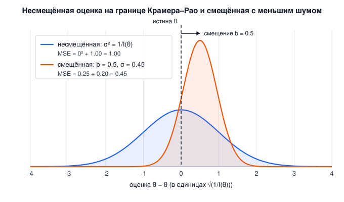

# 0. Что мы строим и по какой мерке

**PhysRealFlow** — песочница-симулятор физики: один SDK на C++17 и одно окно, в котором живут твёрдые тела, жидкость, ткань, газ, огонь и плазма, а со временем — свет по уравнениям общей теории относительности. Он нужен трём разным людям:

| Кому | Что ему важно | Что это значит для кода |
|---|---|---|
| **Учёному** для расчётов | правильные уравнения в СИ, воспроизводимость, известная ошибка | каждая модель — со ссылкой на статью; каждый метод — с тестом, у которого есть аналитический ответ |
| **Художнику** визуальных эффектов в кино | правдоподобие на экране: пламя, вода, дым, плазма | рендер считает физику света (чёрное тело, Френель, Бир–Ламберт), а не подбирает цвета |
| **Разработчику игр** | стабильность в реальном времени, никаких взрывов | решатели с гарантиями: сон островов, распространение удара, CCD, ограничение скорости частиц |

Правила, которых мы держимся:

- **SDK не зависит ни от чего.** `src/` собирается любым компилятором C++17 и подключает только стандартную библиотеку. Qt живёт в `app/`, и сборка это проверяет ([CMakeLists.txt:91](../CMakeLists.txt#L91)).
- **Каждое утверждение доказано тестом.** Не «выглядит правильно», а число против числа: период маятника, путь торможения, скорость Альфвена, глубина проникновения.
- **Код читается как формула.** Имя класса — имя файла, без шаблонной магии, формула в комментарии над строкой, которая её считает.
- **Мировой уровень — это конкретные работы.** Jolt и Bullet для контактов, FleX для частиц, Bridson для сетки, Nguyen–Fedkiw–Jensen для огня, Evans–Hawley и Tanaka для МГД. Если наш результат хуже, мы это записываем, а не прячем.

---

## Мерка: граница Крамера–Рао и «честный обман»

Симуляция — это оценка. У реального явления есть истинная величина $\theta$: сила на крыле, положение фронта пламени, путь ящика по полу. Решатель по шумным, дискретным данным выдаёт оценку $\hat\theta$. Насколько хорошей она может быть?

**Неравенство Крамера–Рао** отвечает для несмещённых оценок: дисперсия любой из них не меньше обратной информации Фишера,

$$
\operatorname{Var}(\hat\theta) \;\ge\; \frac{1}{I(\theta)}, \qquad
I(\theta) = \mathbb E\!\left[\left(\frac{\partial}{\partial\theta}\ln p(x\mid\theta)\right)^{2}\right].
$$

Это предел точности, который нельзя обойти, оставаясь честным: сколько бы итераций и какая бы сетка ни были, шум оценки не опустится ниже $1/I(\theta)$. У решателя это выглядит как дрожание стопки, рябь на поверхности воды, мерцание давления на грани.

Но полная ошибка складывается из двух частей:

$$
\operatorname{MSE}(\hat\theta) = \underbrace{b(\theta)^2}_{\text{смещение}^2} + \underbrace{\operatorname{Var}(\hat\theta)}_{\text{шум}}, \qquad b(\theta) = \mathbb E[\hat\theta] - \theta .
$$

Граница ограничивает только второе слагаемое и только при $b = 0$. **Смещённая оценка может быть точнее несмещённой**: если немного солгать (сдвинуть ответ в известную сторону), шум падает сильнее, чем растёт смещение, и итоговая ошибка меньше. Классический пример — оценка Джеймса–Стайна, которая при трёх и более измерениях всегда бьёт «честное» среднее.

Это и есть наш принцип. **Мы делаем решение настолько честным, насколько это возможно, и там, где честность упирается в границу, добавляем управляемое смещение, которое уменьшает шум.** Обман допустим при трёх условиях: он **известен** (записан в комментарии и в документации), он **мал** (его величина оценена или измерена тестом) и он **выключается** (параметр со значением 0 возвращает честный расчёт).

### Где SDK уже так делает

| Обман | Что он смещает | Что он глушит | Где |
|---|---|---|---|
| Регуляризация $\varepsilon$ в множителе Лагранжа PBF | плотность сходится не к $\rho_0$, а чуть ниже | деление на ноль у одиноких частиц, взрывы | [DensitySolver.cpp:118](../src/particles/DensitySolver.cpp#L118) |
| CFM в блочном LCP контакта | 4 копланарные точки держат чуть мягче | вырожденная матрица, дрожание стопки | [ContactSolver.cpp:567](../src/rigid/ContactSolver.cpp#L567) |
| SAT предпочитает грань ребру (5 %) | глубина завышена до 5 % | скачки нормали между гранью и ребром, ящик на столе не качается | [NarrowPhase.cpp:343](../src/rigid/NarrowPhase.cpp#L343) |
| Распространение удара: нижнее тело «бесконечно тяжёлое» | импульс идёт только вверх | стопка из 100 кубиков не расползается «лесенкой» | [ShockPropagation.cpp:164](../src/rigid/ShockPropagation.cpp#L164) |
| Ограничитель MacCormack | второй порядок падает до первого у экстремумов | новые максимумы дыма из ниоткуда | [Advection.cpp:107](../src/gas/Advection.cpp#L107) |
| Диссипация ЭДС $\max(f\lvert u\rvert\Delta x,\ \lvert u\rvert^2 h)$ | поле диффундирует быстрее физической $\eta$ | неустойчивость центрального переноса $\mathbf B$ | [MagneticField.cpp:164](../src/plasma/MagneticField.cpp#L164) |
| Коррекция Бориса | скорость Альфвена ограничена сверху | шаги по времени в микросекунды у полюсов магнита | [MagneticField.cpp:293](../src/plasma/MagneticField.cpp#L293) |
| Фильтр узкого диапазона для поверхности воды | глубина сглажена в пределах частицы | «шарики» на поверхности | [FluidSurfaceRenderer.cpp:65](https://github.com/werasaimon/phys_realflow_editor/blob/main/src/FluidSurfaceRenderer.cpp#L65) |
| Split impulse — псевдоимпульс, правящий проникновение отдельной «скоростью позиции» | тела выталкиваются из перекрытия, не получая настоящей скорости | подскок стопки после каждого проникновения | [RigidWorld.h:124](../src/rigid/RigidWorld.h#L124) |
| Якобиево обновление PBF: все поправки $\Delta\mathbf p$ считаются по старым положениям и применяются разом | за итерацию плотность сходится медленнее, чем при Гаусса–Зейделе | зависимость результата от порядка частиц и потоков | [DensitySolver.cpp:125](../src/particles/DensitySolver.cpp#L125) |

У каждой строки есть тест, который измеряет, сколько мы потеряли: например, глубина SAT не отклоняется от перебора 15 осей больше чем на 5 % ([tests/HardContactTests.h](../tests/HardContactTests.h)), а путь торможения ящика отличается от закона Кулона на 1 % ([02-rigid-bodies.md](02-rigid-bodies.md#распространение-удара-shock-propagation)).

### Чего мы не делаем

- Не подгоняем константы под картинку. Если пламя слишком холодное, мы ищем ошибку в излучении, а не поднимаем множитель.
- Не прячем смещение в «магическом числе» без имени. Параметр называется тем, что он делает, и у него есть единицы.
- Не заявляем точность без теста. Таблица «Проверка» в конце каждой главы — единственный источник наших цифр.
- Сравниваем с мировыми эталонами, а не только с собственной аналитикой: число Струхаля цилиндра при Re = 100 — St = 0.157 при 0.164 по Williamson (глава 4); дам-брейк Мартина–Мойса — фронт в пределах 12 % (глава 3; поймал раздувание жидкости на 80 %); инварианты Нётер для твёрдых тел (глава 2; поймали неупругие удары и отсутствие гироскопического члена); сходимость по сетке — порядок 2.1 и 1.8 (глава 4). Дальше — $C_d(Re)$ сферы, каверна Гиа, Орсаг–Танг.
- Не полагаемся на невоспроизводимое: тест `determinism` проверяет, что два прогона сцены совпадают побитово во всех решателях (гонок в пуле потоков нет); между сборками воспроизводимость даёт `RF_STRICT_FP`.

### Границы применимости

PhysRealFlow — исследовательская и визуальная песочница, **не сертифицированный расчётный инструмент**. Там, где от расчёта зависят жизни (авиация, космос), решения принимают по кодам с формальной верификацией и валидацией (ASME V&V 20; для авиационного ПО — DO-178C) и с независимой проверкой; наш путь к этому уровню описан в плане верификации, но мы на нём не в конце. Отдельно о космосе: **доза радиации и защита экипажа — задача транспорта частиц** (галактические космические лучи, солнечные протоны, радиационные пояса; ядерная фрагментация в экране, вторичные нейтроны), которую решают методом Монте-Карло по базам сечений — Geant4, FLUKA, PHITS, HZETRN. Ни МГД, ни полные уравнения Максвелла дозу не дают; наша плазменная модель — для космической погоды (солнечный ветер, магнитосфера) и для движения пробных частиц в полях (обрезание Штёрмера, магнитные экраны), см. главу 6.

---

## Карта пути

| Область | Сделано | Делаем | Впереди |
|---|---|---|---|
| Твёрдые тела ([гл. 2](02-rigid-bodies.md)) | GJK/EPA, SAT, блочный LCP, CCD, сочленения, декомпозиция, сложные контакты (балки, Дженга) | — | мягкие контакты с частицами через одно многообразие |
| Частицы ([гл. 3](03-particles.md)) | PBF, стенки в плотности, XPBD-ткань, разрыв, горение | — | пена и брызги, анизотропные ядра поверхности |
| Газ ([гл. 4](04-gas-navier-stokes.md)) | MAC-сетка, MacCormack, PCG с многосеточным предобуславливателем (MGPCG), движущиеся тела, пристенное трение | — | давление на GPU на тех же уровнях |
| Огонь ([гл. 5](05-fire.md)) | кислородный предел, излучение, теплопроводность, пиролиз по Аррениусу | ионизированное пламя: закон Гаусса, дрейф ионов, ионный ветер | сажа и её излучение по спектру |
| Плазма ([гл. 6](06-mhd-plasma.md)) | резистивная МГД, constrained transport, Борис, магнитосфера | **токамак**: тороидальное поле $\propto 1/R$, ток плазмы, профиль $q$, кинк при $q < 1$ | ионосферная граница у планеты |
| Свет ([редактор](https://github.com/werasaimon/phys_realflow_editor/blob/main/docs/rendering.md)) | чёрное тело, Френель, Бир–Ламберт, экранная вода, GL 3.0 без видеокарты | — | **ОТО в шейдере**: геодезические Шварцшильда и Керра, линзирование, красное смещение |

Свет по ОТО — отдельная строка не случайно. Уравнение геодезической

$$
\frac{d^2x^\mu}{d\lambda^2} + \Gamma^\mu_{\alpha\beta}\,\frac{dx^\alpha}{d\lambda}\frac{dx^\beta}{d\lambda} = 0
$$

интегрируется в шейдере тем же ray marching, которым мы уже рисуем дым и пламя, а у метрики Шварцшильда есть точный ответ для угла отклонения $\delta = 4GM/(c^2 b)$ — то есть у этой главы с первого дня будет тест против аналитики, как у всех остальных.

## Учебник: код, который понимает каждый

Цель пользователя: этот репозиторий — не только движок, но и учебное пособие на GitHub, «чтобы все люди стали учёными». Отсюда правила, которые проверяются, а не декларируются:

- **Код читается как рецепт.** Функция верхнего уровня — список шагов словами; ни одной функции длиннее 60 строк (`tools/readability.py` считает и падает); каждая формула — фраза человеческим языком и ссылка на источник; имена — слова.
- **Каждая сцена — урок.** У сцены есть «что увидеть» и «какое число проверить»; панель показаний редактора показывает это число, а тест в `rf_tests` печатает его против эталона (глава 9, табло).
- **Каждая глава — формула → код → тест.** Ни одной цифры без теста, ни одного метода без статьи.

Сцены уровня «вау», которых ещё нет (в порядке появления): эффект Джанибекова (гайка кувыркается в невесомости — тест уже есть), колыбель Ньютона (импульс и энергия на глазах), стена и ядро (разрушение Вороного вживую), тень чёрной дыры (кадр CPU-трассировщика в редакторе, искривлённое небо), оползень (рельеф, сотни тел и вода), башня Галилея (массы падают одинаково; включаем воздух — перестают), прецессия гироскопа. Токамак, магнитосфера и дам-брейк против эксперимента уже есть — им нужна подпись «что проверить».
