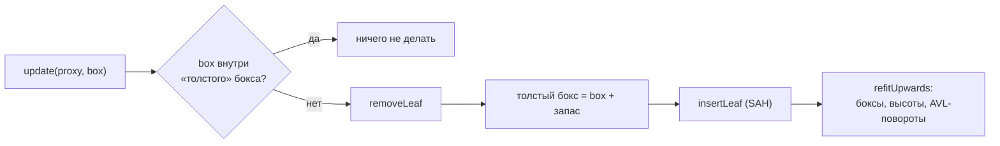
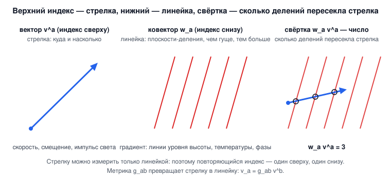

# 1. Математика и пространственные структуры

[← Оглавление](README.md) · [Твёрдые тела →](02-rigid-bodies.md)

**Что это и зачем.** `src/math/` — небольшая библиотека линейной алгебры без шаблонов: `float`-векторы и матрицы для горячих циклов физики, `double`-матрица произвольного размера для точных решений. `src/spatial/` — две иерархии ограничивающих объёмов: статическая BVH (строится один раз, для мешей) и динамическое AABB-дерево (обновляется по мере движения тел).

Всё подключается одним заголовком [src/math/Math.h](../src/math/Math.h).

| Файл | Типы и функции |
|---|---|
| [Scalar.h](../src/math/Scalar.h) | `kPi`, `kInf`, `clampv`, `sqr`, `lerp`, `degToRad` |
| [Vector2.h](../src/math/Vector2.h), [Vector3.h](../src/math/Vector3.h), [Vector4.h](../src/math/Vector4.h) | векторы, `dot`, `cross`, `normalize`, `anyPerpendicular` |
| [Quaternion.h](../src/math/Quaternion.h) | `Quaternion`, `slerp`, `extractRotation` |
| [Matrix3x3.h](../src/math/Matrix3x3.h) | `Matrix3x3`, `symmetricEigen` (Якоби 3×3) |
| [Matrix4x4.h](../src/math/Matrix4x4.h) | аффинные преобразования, `perspective`, `lookAt`, `inverse` |
| [MatrixNxN.h](../src/math/MatrixNxN.h) | `MatrixNxN` (LU, Холецкий, Якоби, QR, SVD, `expm`, `outer`, `kronecker`), `solveSmall` (n ≤ 4) |
| [Tensor.h](../src/math/Tensor.h) | `Tensor` любого ранга, `einstein` (правило Эйнштейна), `raise`, `lower`, `outer`, `permute`, `trace` — раздел 1.9 |
| [AABB.h](../src/math/AABB.h) | ограничивающий параллелепипед, slab-тест луча |

---

## 1.1 Векторы

`Vector3` — три `float` без выравнивания и SIMD-магии. Все операции `constexpr` или `inline`. Полезные нестандартные функции:

- `anyPerpendicular(a)` — какой-нибудь единичный вектор, перпендикулярный `a`. Используется для построения касательного базиса контакта. Выбирается по величине `a.x`, чтобы не делить на почти ноль:

[src/math/Vector3.h:49](../src/math/Vector3.h#L49)
```cpp
inline Vector3 anyPerpendicular(const Vector3& a) {
    return normalize(std::fabs(a.x) > 0.57f ? Vector3(a.y, -a.x, 0) : Vector3(0, a.z, -a.y));
}
```

Порог $0.57 \approx 1/\sqrt 3$: хотя бы одна компонента единичного вектора не меньше этого значения, поэтому длина результата всегда отделена от нуля.

`normalize` возвращает нулевой вектор для вырожденного входа (длина < 1e-20) — вызывающий код не получает NaN.

---

## 1.2 Кватернионы

Ориентация хранится единичным кватернионом

$$
q = (w, x, y, z) = \left(\cos\tfrac{\theta}{2},\ \mathbf n \sin\tfrac{\theta}{2}\right),
$$

где $\mathbf n$ — ось поворота, $\theta$ — угол. Поворот вектора: $\mathbf v' = q\,\mathbf v\,q^{-1}$; в коде — через матрицу `toMatrix3x3()`.

### Интегрирование угловой скорости (экспоненциальное отображение)

За шаг $\Delta t$ тело с угловой скоростью $\boldsymbol\omega$ поворачивается точно на угол $|\boldsymbol\omega|\Delta t$:

$$
q(t+\Delta t) = \exp\!\left(\tfrac12 \boldsymbol\omega \Delta t\right) q(t), \qquad
\exp(\mathbf r) = \left(\cos|\mathbf r|,\ \frac{\sin|\mathbf r|}{|\mathbf r|}\,\mathbf r\right).
$$

При малом угле отношение $\sin\theta/\theta$ даёт $0/0$. Код переходит на ряды Тейлора при $\theta < 10^{-2}$:

[src/math/Quaternion.h:97](../src/math/Quaternion.h#L97)
```cpp
Quaternion integrated(const Vector3& omega, float dt) const {
    const float th = 0.5f * dt * std::sqrt(omega.x * omega.x + omega.y * omega.y + omega.z * omega.z);
    float c, sinc; // cos(th), sin(th)/th
    if (th < 1e-2f) {
        const float t2 = th * th;
        c = 1.0f - t2 * (0.5f - t2 / 24.0f);           // 1 - th^2/2 + th^4/24
        sinc = 1.0f - t2 * (1.0f / 6.0f - t2 / 120.0f); // 1 - th^2/6 + th^4/120
    } else {
        c = rf::cos(th);
        sinc = rf::sin(th) / th;
    }
    const float k = 0.5f * dt * sinc; // vector part = omega/|omega| * sin(th) = omega * dt/2 * sinc
    Quaternion e{c, omega.x * k, omega.y * k, omega.z * k};
    return (e * (*this)).normalized();
}
```

Обратная операция — **логарифм** `log()` ([Quaternion.h:81](../src/math/Quaternion.h#L81)): вектор поворота $\mathbf r = \theta\,\mathbf n$ по кратчайшей дуге (при $w < 0$ кватернион сначала меняет знак). Логарифм нужен везде, где ошибку ориентации надо превратить в вектор: сочленения, блокировка вращения контактов, CCD.

### Сферическая интерполяция (slerp)

$$
\operatorname{slerp}(a, b, t) = \frac{\sin((1-t)\Omega)}{\sin\Omega}\,a + \frac{\sin(t\Omega)}{\sin\Omega}\,b, \qquad \cos\Omega = a\cdot b.
$$

[src/math/Quaternion.h:117](../src/math/Quaternion.h#L117)
```cpp
inline Quaternion slerp(const Quaternion& a, Quaternion b, float t) {
    float c = dot(a, b);
    if (c < 0) { b = Quaternion{-b.w, -b.x, -b.y, -b.z}; c = -c; } // same rotation, shorter way round
    if (c > 0.9995f) { // nearly parallel: linear interpolation is exact enough and stable
        Quaternion r{a.w + (b.w - a.w) * t, a.x + (b.x - a.x) * t, a.y + (b.y - a.y) * t, a.z + (b.z - a.z) * t};
        return r.normalized();
    }
    float theta = rf::acos(c);
    float wa = rf::sin((1 - t) * theta) / rf::sin(theta), wb = rf::sin(t * theta) / rf::sin(theta);
    return Quaternion{a.w * wa + b.w * wb, a.x * wa + b.x * wb, a.y * wa + b.y * wb, a.z * wa + b.z * wb}.normalized();
}
```

Две детали: $q$ и $-q$ — один и тот же поворот, поэтому при $a\cdot b < 0$ берётся $-b$ (короткий путь); при почти совпадающих кватернионах $\sin\Omega \to 0$ и используется нормированная линейная интерполяция.

### Вращательная часть матрицы: `extractRotation` (Müller et al. 2016)

Задача: дана матрица деформации $\mathbf A$ (например, $\sum_i (\mathbf p_i - \mathbf c)\,\mathbf q_i^{\mathsf T}$ в shape matching, гл. 3). Нужна ближайшая к ней матрица поворота $\mathbf R$ из полярного разложения $\mathbf A = \mathbf R\mathbf S$.

Классический путь — SVD или $\mathbf R = \mathbf A(\mathbf A^{\mathsf T}\mathbf A)^{-1/2}$ — ломается на вырожденных и вывернутых $\mathbf A$. Метод Müller, Bender, Chentanez, Macklin (2016) итерационный и устойчивый. На каждом шаге столбцы $\mathbf r_c$ текущего $\mathbf R$ поворачиваются к столбцам $\mathbf a_c$ матрицы $\mathbf A$ — как рамка, к которой приложен «момент»:

$$
\boldsymbol\omega = \frac{\sum_{c=1}^{3} \mathbf r_c \times \mathbf a_c}{\left|\sum_{c=1}^{3} \mathbf r_c\cdot \mathbf a_c\right| + \varepsilon}, \qquad
q \leftarrow \exp(\boldsymbol\omega)\, q .
$$

[src/math/Quaternion.h:133](../src/math/Quaternion.h#L133)
```cpp
inline Quaternion extractRotation(const Matrix3x3& A, Quaternion q, int iterations = 20) {
    for (int it = 0; it < iterations; ++it) {
        const Matrix3x3 R = q.toMatrix3x3();
        Vector3 torque(0.0f);
        float align = 0;
        for (int c = 0; c < 3; ++c) {
            torque += cross(R.col(c), A.col(c));
            align += dot(R.col(c), A.col(c));
        }
        const Vector3 omega = torque / (std::fabs(align) + 1e-9f);
        const float w = length(omega);
        if (w < 1e-9f) break;
        q = (Quaternion::fromAxisAngle(omega / w, w) * q).normalized();
    }
    return q;
}
```

> **Совет:** передавайте в `q` поворот прошлого кадра (тёплый старт). Тогда хватает нескольких итераций — `solveShapeMatching` делает 10.

---

## 1.3 Матрица 3×3 и собственные векторы (метод Якоби)

`Matrix3x3` хранится построчно (`m[row][col]`). Используется для тензоров инерции, эффективных масс контактов и поворотов. Обращение — через присоединённую матрицу; при $|\det| \le$ `singularDet` возвращается нулевая матрица (например, для двух статичных тел).

`symmetricEigen(A, eig, V)` раскладывает симметричную матрицу $\mathbf A = \mathbf V\,\operatorname{diag}(\lambda)\,\mathbf V^{\mathsf T}$ **циклическим методом Якоби** в `double`. Каждый поворот $\mathbf J_{pq}$ в плоскости $(p, q)$ обнуляет внедиагональный элемент $a_{pq}$:

$$
\theta = \frac{a_{qq} - a_{pp}}{2a_{pq}},\quad
t = \frac{\operatorname{sign}\theta}{|\theta| + \sqrt{\theta^2+1}},\quad
c = \frac{1}{\sqrt{t^2+1}},\ s = t\,c,
\qquad \mathbf A \leftarrow \mathbf J^{\mathsf T}\mathbf A\,\mathbf J,\ \ \mathbf V \leftarrow \mathbf V\mathbf J .
$$

[src/math/Matrix3x3.h:123](../src/math/Matrix3x3.h#L123)
```cpp
for (auto& pq : pairs) {
    int p = pq[0], q = pq[1];
    if (a[p][q] * a[p][q] <= 1e-30 * scale) continue;
    double theta = (a[q][q] - a[p][p]) / (2.0 * a[p][q]);
    double t = (theta >= 0 ? 1.0 : -1.0) / (std::fabs(theta) + std::sqrt(theta * theta + 1.0));
    double c = 1.0 / std::sqrt(t * t + 1.0), s = t * c;
    // a <- J^T a J,  V <- V J  with J = rotation in the (p, q) plane
```

Где применяется: `ConvexHullShape` поворачивает вершины в **главные оси инерции** ([Shapes.h:107](../src/rigid/Shapes.h#L107)). Тогда тензор инерции в локальной системе тела диагонален, и хватает трёх чисел `invInertiaLocal`.

---

## 1.4 Матрица 4×4

`Matrix4x4` — аффинные преобразования и проекции. Точки — столбцы: $\mathbf p' = \mathbf M(\mathbf p, 1)$.

| Функция | Что делает |
|---|---|
| `trs(t, q, s)` | $\mathbf T\,\mathbf R\,\mathbf S$: масштаб, потом поворот, потом сдвиг ([Matrix4x4.h:33](../src/math/Matrix4x4.h#L33)) |
| `perspective(fovY, aspect, n, f)` | проекция OpenGL, камера смотрит вдоль $-z$, глубина в $[-1, 1]$ ([Matrix4x4.h:43](../src/math/Matrix4x4.h#L43)) |
| `lookAt(eye, target, up)` | матрица вида ([Matrix4x4.h:54](../src/math/Matrix4x4.h#L54)) |
| `inverse()` | общий обратный через 2×2-миноры (разложение Лапласа) ([Matrix4x4.h:96](../src/math/Matrix4x4.h#L96)) |
| `transformPoint` / `transformDirection` | с делением на $w$ / без сдвига |

---

## 1.5 Матрица N×N: LU, Холецкий, Якоби

`MatrixNxN` (в `double`) нужна для точных решений и тестов.

**LU с частичным выбором ведущего элемента.** $\mathbf P\mathbf A = \mathbf L\mathbf U$: в каждом столбце строка с наибольшим по модулю элементом становится ведущей. Множители хранятся на месте $\mathbf L$:

[src/math/MatrixNxN.cpp:74](../src/math/MatrixNxN.cpp#L74)
```cpp
for (int c = 0; c < n; ++c) {
    int piv = c; // largest entry in the column below the diagonal
    for (int i = c + 1; i < n; ++i)
        if (std::fabs(lu(i, c)) > std::fabs(lu(piv, c))) piv = i;
    if (std::fabs(lu(piv, c)) <= tiny) return false;
    if (piv != c) {
        for (int j = 0; j < n; ++j) std::swap(lu(c, j), lu(piv, j));
        std::swap(perm[c], perm[piv]);
        sign = -sign;
    }
    for (int i = c + 1; i < n; ++i) {
        lu(i, c) /= lu(c, c); // multiplier, stored in L
        for (int j = c + 1; j < n; ++j) lu(i, j) -= lu(i, c) * lu(c, j);
    }
}
```

Порог вырожденности относительный: `tiny = 1e-14 · max|a_ij|`. Затем прямой ход $\mathbf L\mathbf y = \mathbf P\mathbf b$ и обратный $\mathbf U\mathbf x = \mathbf y$ (`solveLU`, [строка 89](../src/math/MatrixNxN.cpp#L89)). На этой же базе — `determinant()` и `inverse()`.

**Холецкий** для симметричной положительно определённой матрицы ($\mathbf A = \mathbf L\mathbf L^{\mathsf T}$, [строка 136](../src/math/MatrixNxN.cpp#L136)):

$$
L_{jj} = \sqrt{a_{jj} - \sum_{k<j} L_{jk}^2}, \qquad
L_{ij} = \frac{a_{ij} - \sum_{k<j} L_{ik}L_{jk}}{L_{jj}}\ \ (i > j).
$$

Если подкоренное выражение $\le 0$, матрица не положительно определена, функция возвращает `false`.

**`solveSmall(n, M, r, x)`** ([строка 209](../src/math/MatrixNxN.cpp#L209)) — то же исключение Гаусса для $n \le 4$ во `float` и без выделения памяти. Это рабочая лошадь блочного контактного решателя (гл. 2): он решает систему до 4×4 для каждого многоточечного контакта на каждой итерации.

---

## 1.6 AABB

`AABB` — пара `lo`, `hi`. Пустой бокс имеет `lo = +∞`, `hi = −∞`, поэтому первое `expand` делает его точкой. `surfaceArea()` нужна эвристике SAH, `rayHit` — slab-тест луча:

[src/math/AABB.h:35](../src/math/AABB.h#L35)
```cpp
float rayHit(const Vector3& o, const Vector3& invDir, float tmax) const {
    float t0 = 0, t1 = tmax;
    for (int a = 0; a < 3; ++a) {
        float tn = (lo[a] - o[a]) * invDir[a];
        float tf = (hi[a] - o[a]) * invDir[a];
        if (tn > tf) std::swap(tn, tf);
        t0 = tn > t0 ? tn : t0;
        t1 = tf < t1 ? tf : t1;
        if (t0 > t1) return kInf;
    }
    return t0;
}
```

Для каждой оси луч входит в «слой» между двумя плоскостями при $t_n$ и выходит при $t_f$. Пересечение слоёв всех трёх осей — интервал $[t_0, t_1]$; если он пуст, промах.

---

## 1.7 BVH: статическая иерархия с бинированной SAH

[src/spatial/BVH.h](../src/spatial/BVH.h) — дерево, которое строится **один раз сверху вниз**. Используется для треугольных мешей (луч, ближайшая точка, знаковое расстояние), для широкой фазы CCD и в `BvhBroadPhase`.

### Эвристика площади поверхности (SAH)

Вероятность того, что случайный луч попадёт в дочерний бокс, пропорциональна его площади. Поэтому стоимость разбиения узла на левую ($L$) и правую ($R$) части

$$
C = N_L\,S(L) + N_R\,S(R),
$$

где $N$ — число примитивов, $S$ — площадь поверхности бокса. Перебирать все возможные разрезы дорого, поэтому центроиды раскладываются по **12 корзинам** вдоль каждой оси, и оцениваются 11 разрезов между корзинами за один проход вперёд и один назад:

[src/spatial/BVH.cpp:69](../src/spatial/BVH.cpp#L69)
```cpp
for (int b = 0; b < kBins - 1; ++b) {
    acc.expand(binBox[b]);
    n += binCount[b];
    leftArea[b] = acc.valid() ? acc.surfaceArea() : 0.0f;
    leftCount[b] = n;
}
acc = AABB();
n = 0;
for (int b = kBins - 1; b > 0; --b) {
    acc.expand(binBox[b]);
    n += binCount[b];
    float cost = leftCount[b - 1] * leftArea[b - 1] + n * (acc.valid() ? acc.surfaceArea() : 0.0f);
    if (leftCount[b - 1] > 0 && n > 0 && cost < bestCost) {
```

Узел становится листом, если примитивов ≤ `maxLeafSize` или если разрез не дешевле листа ($C \ge N\,S$) при $N \le 16$.

### Знаковое расстояние до меша: псевдонормали с угловыми весами

`MeshBVH::closestPoint` находит ближайшую точку на меше обходом дерева (ближний потомок первым, отсечение по `distance2` до бокса). Сложнее определить **знак**: внутри точка или снаружи. Нормаль ближайшего треугольника врёт, если ближайшая точка лежит на ребре или вершине.

Решение — псевдонормали (Bærentzen & Aanæs 2005). У каждого элемента своя нормаль:

- грань — её нормаль;
- ребро — сумма нормалей двух смежных граней;
- вершина — сумма нормалей смежных граней, **взвешенная углом** грани при этой вершине.

С такими нормалями знак $\operatorname{sign}\big((\mathbf p - \mathbf p_{closest})\cdot\mathbf n_{pseudo}\big)$ точен для замкнутого меша. Функция `closestPtTri` (Ericson, *Real-Time Collision Detection*, §5.1.5) возвращает, какой элемент ближайший: грань, одна из вершин или одно из рёбер.

[src/spatial/BVH.cpp:286](../src/spatial/BVH.cpp#L286)
```cpp
Vector3 N;
const auto& tri = tris_[bestTri];
switch (bestRegion) {
case 0: N = faceN_[bestTri]; break;
case 1: case 2: case 3: N = vertexN_[tri[bestRegion - 1]]; break;
default: N = edgeN_[size_t(bestTri) * 3 + (bestRegion - 4)]; break;
}
```

---

## 1.8 Динамическое AABB-дерево

[src/spatial/AABBTree.h](../src/spatial/AABBTree.h) — иерархия, которая **обновляется по ходу движения** (как `b2DynamicTree` в Box2D и `btDbvt` в Bullet; E. Catto, *Dynamic Bounding Volume Hierarchies*, GDC 2019).



### Толстые боксы

Лист хранит бокс объекта, расширенный на `fatten × размер` с каждой стороны ([AABBTree.cpp:18](../src/spatial/AABBTree.cpp#L18)). Пока объект дрожит на месте (стопка, куча), его настоящий бокс остаётся внутри толстого, и дерево не меняется вовсе. В тесте «jiggling in place» из 672 объектов перевставлено только 7.

### Вставка: спуск по SAH

Новый лист `L` нужно сделать братом какого-то узла `S` (под ними появится новый родитель). Спускаемся от корня и в каждом узле сравниваем:

- **создать родителя здесь**: стоимость $2\,S(N \cup L)$;
- **спуститься в ребёнка $C$**: каждый предок и так вырастет на $\Delta = 2\,(S(N\cup L) - S(N))$ («унаследованная» стоимость), плюс рост самого ребёнка.

[src/spatial/AABBTree.cpp:104](../src/spatial/AABBTree.cpp#L104)
```cpp
while (!nodes_[index].isLeaf()) {
    const Node& n = nodes_[index];
    const float area = n.box.surfaceArea();
    const float combined = unite(n.box, box).surfaceArea();
    // Making a new parent for this node and the leaf here costs:
    const float costHere = 2.0f * combined;
    // Going further down, every node on the way grows by this much:
    const float inherited = 2.0f * (combined - area);
    auto costDown = [&](int child) {
        const Node& c = nodes_[child];
        float grown = unite(box, c.box).surfaceArea();
        return (c.isLeaf() ? grown : grown - c.box.surfaceArea()) + inherited;
    };
    const float costLeft = costDown(n.left), costRight = costDown(n.right);
    if (costHere < costLeft && costHere < costRight) break;
    index = costLeft < costRight ? n.left : n.right;
}
```

Удаление проще: место родителя удаляемого листа занимает его брат ([AABBTree.cpp:140](../src/spatial/AABBTree.cpp#L140)).

### Балансировка поворотами (как в AVL-дереве)

После каждой вставки или удаления путь до корня «переподгоняется» (`refitUpwards`), и в каждом узле вызывается `balance`. Если один ребёнок выше другого больше чем на 1 уровень, он поворачивается вверх:

```
          A                    C
        /   \                /   \
       B     C      ->      A     F     (если G выше F — наоборот)
            / \            / \
           F   G          B   G
```

[src/spatial/AABBTree.cpp:179](../src/spatial/AABBTree.cpp#L179) — код поворота. Высокий ребёнок `U` занимает место `A`; `A` оставляет себе второго ребёнка и забирает у `U` его **низкого** внука. Так высота дерева остаётся $O(\log n)$. В тесте 672 объекта дают высоту 11 при $\log_2 n = 9.4$.

### Запросы

`query(box, fn)` и `raycast(o, d, maxT, fn)` — обход стеком с отсечением по боксу. `findPairs` собирает все пары с пересекающимися толстыми боксами.

---

## 1.9 Тензоры и правило Эйнштейна

Язык природы — математика, и у этого языка есть грамматика: правило, по которому числа можно складывать и перемножать так, чтобы ответ не зависел от того, как мы нарисовали оси координат. Эта грамматика — тензоры. Каждое понятие ниже идёт в одном порядке: идея простыми словами, картинка, формула, код, тест, какую физику оно открывает.

### Тензор: машина, которая берёт направления и возвращает число

**Идея.** Тензор — это машина с несколькими входами. В каждый вход вставляют направление, на выходе одно число, и машина линейна по каждому входу: вдвое длиннее стрелка — вдвое больше ответ. Входы бывают двух сортов. **Верхний индекс — стрелка**: скорость, смещение, импульс света («куда и насколько»). **Нижний индекс — линейка**: стопка параллельных плоскостей-делений, как линии уровня на карте высот («насколько быстро меняется»). Стрелку измеряют линейкой: сколько делений она пересекла, такое и число.

**Картинка.**



**Формула.** У тензора $T^{a}{}_{bc}$ один вход-стрелка и два входа-линейки; в $n$ измерениях у него $n^3$ чисел-компонент. Скорость — $v^a$, градиент температуры — $\partial_a T$, метрика — $g_{ab}$ (два нижних: она берёт две стрелки и возвращает их скалярное произведение), символы Кристоффеля — $\Gamma^{l}{}_{mn}$, кривизна — $R^{r}{}_{smn}$.

**Код.** Класс `Tensor` хранит размерность, строку вариантности (по символу на индекс: `^` сверху, `_` снизу, `"^__"` для $\Gamma^{l}{}_{mn}$) и компоненты подряд: [src/math/Tensor.h](../src/math/Tensor.h). Ранг и размерность задаются при выполнении, без шаблонов.

**Тест.** `RF_TEST="math: tensors"`.

**Физика.** Тензор одинаково правдив в любых координатах: если он равен нулю в одних, он равен нулю во всех. Поэтому законы природы пишут тензорами. На этом стоит общая теория относительности (гл. 8), механика сплошной среды (напряжения $\sigma_{ij}$, гл. 3) и электродинамика ($F_{\mu\nu}$).

### Правило Эйнштейна: повторённая буква — суммирование

**Идея.** Эйнштейну надоело писать знак суммы, и он договорился: если буква встречается в произведении дважды, один раз сверху и один раз снизу, по ней суммируют. «Один сверху, один снизу» — не прихоть, а смысл: стрелку можно измерить только линейкой. Две стрелки без линейки не дают числа, которое не зависит от координат.

**Картинка.** Та же: $w_a v^a$ — сколько делений линейки $w$ пересекла стрелка $v$.

**Формула.**

$$
w_a v^a \equiv \sum_{a=0}^{n-1} w_a v^a, \qquad
C^{a} = A^{a}{}_{bc}\,B^{bc} \equiv \sum_{b}\sum_{c} A^{a}{}_{bc}\,B^{bc}.
$$

Свободные буквы (встречаются один раз) остаются в ответе, повторённые исчезают. Буква дважды сверху — ошибка: сначала опустите один индекс метрикой.

**Код.** Функция `einstein(формула, тензоры…)` принимает формулу текстом, как её пишут на доске: `"^a_bc ^bc -> ^a"`. Маркер `^` или `_` действует на буквы после него, пробел разделяет тензоры, после `->` идут индексы ответа. Проверка правила — [Tensor.cpp:219](../src/math/Tensor.cpp#L219). Если индекс дважды сверху, `einstein` отказывается с сообщением «индекс b дважды сверху: свёртка по Эйнштейну требует одного верхнего и одного нижнего; опустите индекс метрикой». Сама сумма — обход всех значений всех букв, как одометр:

[src/math/Tensor.cpp:309](../src/math/Tensor.cpp#L309)
```cpp
do { // every value of every letter: the sum over the repeated ones happens by adding up
    double product = 1.0;
    for (size_t i = 0; i < inputs.size(); ++i) product *= inputs[i]->data()[offsetOf(access[i], value)];
    result.data()[offsetOf(outAccess, value)] += product;
} while (nextIndex(value, dim));
```

**Тест.** `RF_TEST="math: tensors"`: $A^{a}{}_{bc}B^{bc}$ через `einstein` и через явные циклы совпадают до $5.6\cdot10^{-17}$; след $T^{a}{}_{a}$ тремя способами одинаков; четыре неправильные формулы отвергнуты: индекс дважды сверху, пропущенный свободный индекс, неверная вариантность, индекс, сменивший положение.

**Физика.** Уравнения гл. 8 записаны в коде так же, как в учебнике. Например, символы Кристоффеля:

[src/relativity/Curvature.cpp:96](../src/relativity/Curvature.cpp#L96)
```cpp
return einstein("^ls _smn -> ^l_mn", ginv, B) * 0.5;
```

### Метрика: переводчик между стрелками и линейками

**Идея.** Метрика $g_{ab}$ — линейка, встроенная в само пространство: она говорит, какой длины стрелка. Она же превращает стрелку в линейку (опускает индекс), а обратная метрика $g^{ab}$ превращает линейку в стрелку (поднимает).

**Картинка.** Нижняя строка рисунка выше: $v_a = g_{ab}\,v^b$.

**Формула.**

$$
ds^2 = g_{ab}\,dx^a dx^b, \qquad v_a = g_{ab}\,v^b, \qquad w^a = g^{ab}\,w_b, \qquad g^{ab}g_{bc} = \delta^a{}_c .
$$

**Код.** `raise(t, слот, g^{ab})` и `lower(t, слот, g_{ab})` — [Tensor.cpp:123](../src/math/Tensor.cpp#L123) и [Tensor.cpp:129](../src/math/Tensor.cpp#L129); сами они написаны через `einstein`. Там же `outer` (тензорное произведение, [строка 94](../src/math/Tensor.cpp#L94)), `permute` (перестановка индексов, [строка 135](../src/math/Tensor.cpp#L135)), `symmetrize` и `antisymmetrize`, `trace` (свёртка верхнего индекса с нижним, [строка 166](../src/math/Tensor.cpp#L166)).

**Тест.** `RF_TEST="math: tensors"`: поднять после опускания — исходный тензор до $1.1\cdot10^{-16}$; симметричная плюс антисимметричная часть — исходный тензор.

**Физика.** Метрика и есть гравитация в ОТО: кривизна, приливы и орбиты выводятся из $g_{ab}$ (гл. 8, «Кривизна из метрики»). В плоском пространстве в декартовых осях $g_{ab} = \mathrm{diag}(-1, 1, 1, 1)$, и верхние компоненты отличаются от нижних только знаком времени.

### Матрицы: разложения и экспонента

**Идея.** Матрица — тензор с одним верхним и одним нижним индексом: она берёт стрелку и возвращает стрелку. Всякую матрицу можно разобрать на понятные части. **QR**: повернуть так, чтобы матрица стала треугольной. **SVD**: любая матрица — это поворот, растяжение вдоль осей и ещё поворот. **Экспонента** $e^{\mathbf A}$ решает уравнение $\dot{\mathbf x} = \mathbf A\mathbf x$ за один раз, а экспонента кососимметричной матрицы — это поворот.

**Картинка.** «Поворот, растяжение, поворот» — формула SVD ниже читается справа налево: $\mathbf V^{\mathsf T}$ поворачивает, $\boldsymbol\Sigma$ растягивает вдоль осей, $\mathbf U$ поворачивает снова.

**Формула.**

$$
\mathbf A = \mathbf U\,\boldsymbol\Sigma\,\mathbf V^{\mathsf T},\qquad
\mathbf A = \mathbf Q\mathbf R,\qquad
e^{\mathbf A} = \sum_{k\ge0}\frac{\mathbf A^k}{k!},\qquad
e^{[\boldsymbol\omega]_\times} = \mathbf I + \sin\theta\,[\mathbf n]_\times + (1-\cos\theta)[\mathbf n]_\times^2 .
$$

Последнее равенство — формула Родрига: $\theta = |\boldsymbol\omega|$, $\mathbf n = \boldsymbol\omega/\theta$. Экспонента считается масштабированием и возведением в квадрат с аппроксимацией Паде порядка 13 (Higham 2005): $e^{\mathbf A} = \big(e^{\mathbf A/2^s}\big)^{2^s}$.

**Код.** [src/math/MatrixFunctions.cpp](../src/math/MatrixFunctions.cpp): `outer` и `kronecker` ([строка 23](../src/math/MatrixFunctions.cpp#L23)), QR отражениями Хаусхолдера ([строка 66](../src/math/MatrixFunctions.cpp#L66)), SVD односторонним методом Якоби ([строка 132](../src/math/MatrixFunctions.cpp#L132)), `expm` ([строка 164](../src/math/MatrixFunctions.cpp#L164)).

**Тест.** `RF_TEST="math: outer"`: $|\mathbf Q\mathbf R - \mathbf A| = 4.4\cdot10^{-16}$, $|\mathbf U\boldsymbol\Sigma\mathbf V^{\mathsf T} - \mathbf A| = 4.4\cdot10^{-16}$; экспонента кососимметричной матрицы совпадает с формулой Родрига до $1.1\cdot10^{-16}$ и с поворотом нашим кватернионом до $1.1\cdot10^{-7}$ (кватернион хранится во `float`); $e^{\mathrm{diag}(10,-4,2)}$ — до $8.7\cdot10^{-15}$ относительно.

**Физика.** Экспонента — точный шаг для линейных систем (колебания, затухание) и отображение «угловая скорость → поворот» твёрдого тела. На ней строятся вариационные интеграторы вращения, которые убирают дрейф момента импульса (открытый изъян гл. 2 и 11). SVD даёт ранг и число обусловленности: сколько цифр ответа можно потерять при решении системы.

### Границы

Слой тензоров — инструмент анализа и обучения, а не горячий цикл решателя: он выделяет память и сообщает об ошибке исключением `std::invalid_argument`. Решатели твёрдых тел, частиц и газа его не используют. Обход всех значений всех букв стоит $n^k$ шагов ($k$ — число разных букв): $4^8 = 65\,536$ для инварианта Кречмана в четырёх измерениях, это миллисекунды.

---

## Проверка

| Тест (`RF_TEST=...`) | Что проверяет |
|---|---|
| `math` | $\mathbf A\mathbf A^{-1} = \mathbf I$, восстановление $\mathbf V\Lambda\mathbf V^{\mathsf T}$ с ошибкой < 1e-5; $\exp(\log q) = q$; slerp на полпути даёт половину угла; LU и Холецкий на матрице типа Гильберта 6×6 с ошибкой < 1e-12; невязка собственных векторов N×N < 1e-10; `solveSmall` 4×4 |
| `mass properties` | объём и инерция бокса как многогранника; Якоби диагонализует повёрнутый тензор |
| `bvh` | 2000 случайных точек: ближайшая точка совпадает с перебором, знак расстояния совпадает с уравнением эллипсоида (0 ошибок); луч по сфере, $t = 4$ |
| `dynamic AABB tree` | инварианты дерева (`validate()`), запросы = перебор, высота ≤ $2\log_2 n + 2$, дрожащие объекты не трогают дерево |
| `broad phase` | BVH, SAP и AABB-дерево дают **ровно те же пары**, что перебор, 200 кадров подряд |
| `math: tensors` | правило Эйнштейна против явных циклов ($5.6\cdot10^{-17}$), след тремя способами, поднять и опустить индекс, симметричная и антисимметричная части; отказ на неправильных формулах |
| `math: outer` | внешнее и кронекерово произведения, QR, SVD, экспонента матрицы против формулы Родрига и кватерниона |

## Литература

- M. Müller, J. Bender, N. Chentanez, M. Macklin. *A Robust Method to Extract the Rotational Part of Deformations.* MIG 2016.
- C. G. J. Jacobi (1846); G. H. Golub, C. F. Van Loan. *Matrix Computations*, 4th ed., 2013 (§8.5 — метод Якоби).
- I. Wald. *On fast Construction of SAH-based Bounding Volume Hierarchies.* IEEE RT 2007 (бинированная SAH).
- J. A. Bærentzen, H. Aanæs. *Signed Distance Computation Using the Angle Weighted Pseudonormal.* IEEE TVCG 11(3), 2005.
- C. Ericson. *Real-Time Collision Detection.* Morgan Kaufmann, 2005.
- E. Catto. *Dynamic Bounding Volume Hierarchies.* GDC 2019.
- A. Einstein. *Die Grundlage der allgemeinen Relativitätstheorie.* Annalen der Physik 49 (1916) 769, §5 — соглашение о суммировании.
- C. W. Misner, K. S. Thorne, J. A. Wheeler. *Gravitation.* Freeman, 1973, гл. 2–3 (векторы как стрелки, 1-формы как стопки плоскостей).
- N. J. Higham. *The Scaling and Squaring Method for the Matrix Exponential Revisited.* SIAM J. Matrix Anal. Appl. 26(4), 2005, 1179.
- M. R. Hestenes. *Inversion of Matrices by Biorthogonalization.* J. SIAM 6 (1958) 51; J. Demmel, K. Veselić. *Jacobi's Method Is More Accurate than QR.* SIAM J. Matrix Anal. Appl. 13 (1992) 1204.
