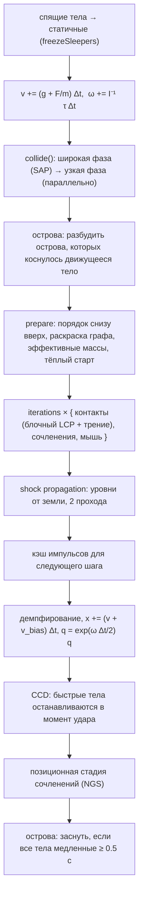
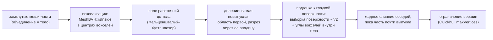

# 2. Твёрдые тела

[← Математика](01-math.md) · [Оглавление](README.md) · [Частицы →](03-particles.md)

**Что это и зачем.** `src/rigid/` — полный конвейер динамики твёрдых тел: выпуклые формы и составные невыпуклые тела, широкая и узкая фаза столкновений, контактный решатель, непрерывные столкновения (CCD), сочленения и выпуклая декомпозиция. Цель — устойчивые высокие стопки (100 кубиков стоят), точное трение и отсутствие туннелирования быстрых тел.

Точка входа — класс `RigidWorld` ([src/rigid/RigidWorld.h](../src/rigid/RigidWorld.h)). Минимальный пример:

```cpp
rf::RigidWorld world;
world.setDomain(rf::AABB({-5, 0, -5}, {5, 10, 5}));   // стенки-плоскости мира
int box  = world.addBox({0, 1, 0}, rf::Vector3(0.25f), rf::Quaternion(), 500.0f /*кг/м³*/, rf::Vector3(1));
int ball = world.addSphere({0.2f, 3, 0}, 0.1f, 1000.0f, rf::Vector3(1));
for (int k = 0; k < world.params.substeps; ++k) world.step(1.0f / 60 / world.params.substeps);
```

---

## Откуда уравнения

Коротко, по шести частям. Вывод целиком в главах [11.2](11-action.md#112-твёрдое-тело) и [11.3](11-action.md#113-сочленения-и-контакты).

### Действие

Тело есть точка группы $SE(3)$: центр масс $\mathbf x$ и поворот $R$, угловая скорость в осях тела $\boldsymbol\Omega$. Суставы и контакты входят связями $C(q) = 0$ и $C(q) \ge 0$ с множителями Лагранжа:

$$
S = \int \Big(\sum_{\text{тела}}\big(\tfrac12 m|\dot{\mathbf x}|^2 + \tfrac12\boldsymbol\Omega\cdot\mathbf I\boldsymbol\Omega - m g y\big) - \sum_{\text{связи}}\boldsymbol\lambda\cdot C(q)\Big)\,dt .
$$

### Уравнения

Вариация даёт $m\ddot{\mathbf x} = m\mathbf g + \dots$ и уравнение Эйлера $\mathbf I\dot{\boldsymbol\Omega} + \boldsymbol\Omega\times\mathbf I\boldsymbol\Omega = \boldsymbol\tau$. Нётер: энергия, импульс и вектор момента импульса. Реакции связей работы не совершают. Контакт подчиняется условиям дополнительности, трение Кулона есть функция Рэлея $R = \mu N|\mathbf v_t|$, и потеря энергии равна $\mu N$ на пройденный путь.

### Дискретизация

Поступательный шаг есть симплектический Эйлер, вариационная схема. Свободный поворот — симметричное расщепление на точные повороты вокруг главных осей (раздел 2.7, «Свободный поворот»): симплектическая схема второго порядка, вектор $\mathbf L$ сохраняется до округления. Импульсы контакта есть минимум квадратичной формы при $\Lambda \ge 0$, последовательные импульсы решают его проективным Гауссом–Зейделем. Коррекция проникновения и отскок из действия не следуют.

### Код

Свободный поворот: [FreeRotation.cpp](../src/rigid/FreeRotation.cpp). Положение и поворот: [RigidWorld.cpp:491](../src/rigid/RigidWorld.cpp#L491). Одно многообразие контакта: [ContactSolver.cpp:670](../src/rigid/ContactSolver.cpp#L670). Суставы: [Joints.cpp:102](../src/rigid/Joints.cpp#L102).

### Графики

Брусок скользит до остановки: потерянная энергия и работа трения совпадают.


Свободное вращение вокруг средней оси: дрейф энергии и вектора $\mathbf L$.


### Границы

| Что | Число |
|---|---|
| баланс трения | 0.16 % |
| баланс маятника с затуханием, уход точки сустава | 0.35 %, $3.2\cdot10^{-5}$ м |
| вектор $\mathbf L$ свободного вращения, 20 с при $1/600$ с | $6.9\cdot10^{-6}$, округление `float` (было $2.8\cdot10^{-3}$) |
| энергия свободного вращения, 20 с | $1.3\cdot10^{-5}$, второй порядок по шагу, без ступенек на переворотах (было $3.0\cdot10^{-3}$) |

---

## 2.1 Один шаг мира

`RigidWorld::step` ([RigidWorld.cpp:319](../src/rigid/RigidWorld.cpp#L319)) по умолчанию использует решатель **последовательных импульсов** (`RigidSolver::SequentialImpulse`):



Шаг вызывается `substeps` раз за кадр (по умолчанию 10). Много маленьких шагов с немногими итерациями устойчивее, чем один большой шаг с многими итерациями — так делают PhysX (TGS) и Jolt.

Интегрирование — полунеявный Эйлер: сначала скорость, потом положение по **новой** скорости. Поворот — точной экспонентой кватерниона (гл. 1.2).

---

## 2.2 Формы и массовые свойства

Каждая выпуклая форма описывается **опорным отображением**

$$
s_A(\mathbf d) = \arg\max_{\mathbf x\in A}\ \mathbf x\cdot\mathbf d .
$$

Больше GJK и EPA ничего не нужно знать о форме. Центр масс формы — в начале её локальной системы, оси — главные оси инерции.

| Класс ([Shapes.h](../src/rigid/Shapes.h)) | Опорная функция | Особенности |
|---|---|---|
| `SphereShape` | $r\,\mathbf d/\lVert\mathbf d\rVert$ | аналитические контакты со сферой и боксом |
| `BoxShape` | $(\pm h_x, \pm h_y, \pm h_z)$ по знакам $\mathbf d$ | SAT с другими боксами |
| `ConvexHullShape` | перебор вершин | вход — уже выпуклый меш; центр масс и главные оси вычисляются в конструкторе |
| `TriangleShape` | лучшая из 3 вершин | треугольник статического меша (только для GJK/EPA) |
| `CompoundShape` | лучшая из частей | невыпуклое тело из выпуклых частей |
| `CapsuleShape` | $(0, \pm h, 0) + r\,\mathbf d/\lVert\mathbf d\rVert$ (знак по $d_y$) | ядро-отрезок плюс радиус; лёжа касается опоры двумя точками |

**Массовые свойства** многогранника считаются точно (D. Eberly, *Polyhedral Mass Properties*): интегралы $\int 1,\ \int x,\ \int x^2,\ \int xy$ по объёму сводятся по теореме Гаусса к сумме по треугольникам ([Shapes.cpp:307](../src/rigid/Shapes.cpp#L307)). Затем `symmetricEigen` поворачивает вершины в главные оси ([Shapes.cpp:353](../src/rigid/Shapes.cpp#L353)), и тензор инерции становится диагональным:

$$
\mathbf I_{world}^{-1} = \mathbf R\,\operatorname{diag}(I_1^{-1}, I_2^{-1}, I_3^{-1})\,\mathbf R^{\mathsf T}.
$$

`RigidBody::updateInertia()` кэширует $\mathbf I_{world}^{-1}$ один раз за шаг — решатель применяет её тысячи раз.

**Составное тело** (`CompoundShape`, [Shapes.cpp:169](../src/rigid/Shapes.cpp#L169)) суммирует тензоры частей по теореме Штейнера и снова диагонализует сумму:

$$
\mathbf I = \sum_c \Big(\mathbf R_c \mathbf I_c \mathbf R_c^{\mathsf T} + m_c\big(|\mathbf d_c|^2\,\mathbb 1 - \mathbf d_c\mathbf d_c^{\mathsf T}\big)\Big), \qquad \mathbf d_c = \mathbf c_c - \mathbf c .
$$

### Капсула

Капсула — все точки на расстоянии не больше $r$ от отрезка $(0, -h, 0)\ldots(0, h, 0)$: цилиндр высотой $H = 2h$ с двумя полусферами. Это обычный коллайдер персонажей и длинных предметов (`b2Capsule` в Box2D, `PxCapsuleGeometry` в PhysX, `btCapsuleShape` в Bullet): она катится вбок, но не переваливается с торца на торец и лежит на двух контактах. Объём $V = \pi r^2 H + \tfrac43\pi r^3$; момент инерции на единицу массы — цилиндр (доля массы $m_c$) плюс две полусферы (доля $m_s$), перенесённые к центру по теореме Штейнера через их центр масс в $3r/8$ от плоской грани:

$$
I_{ось} = m_c\,\tfrac{r^2}{2} + m_s\,\tfrac{2r^2}{5}, \qquad
I_{бок} = m_c\Big(\tfrac{H^2}{12} + \tfrac{r^2}{4}\Big) + m_s\Big(\tfrac{2r^2}{5} + \tfrac{H^2}{4} + \tfrac{3Hr}{8}\Big).
$$

[src/rigid/Shapes.cpp:432](../src/rigid/Shapes.cpp#L432)
```cpp
Vector3 CapsuleShape::unitInertia() const {
    const float H = 2.0f * h_, r2 = r_ * r_;
    const float vc = kPi * r2 * H, vs = 4.0f / 3.0f * kPi * r2 * r_, v = vc + vs;
    const float mc = vc / v, ms = vs / v; // mass shares of the cylinder and the two caps
    const float axial = mc * r2 * 0.5f + ms * 0.4f * r2;
    const float side = mc * (H * H / 12.0f + r2 * 0.25f) + ms * (0.4f * r2 + H * H * 0.25f + 3.0f * H * r_ / 8.0f);
    return Vector3(side, axial, side);
```

Контакты капсулы строятся от её **ядра-отрезка**, как контакты сферы от её центра: сфера — капсула и капсула — капсула аналитически (ближайшие точки отрезков; для почти параллельных осей — оба конца каждой оси против другой), капсула — бокс, выпуклая оболочка, треугольник — GJK/EPA между отрезком и телом, а радиус прибавляется к результату. Лёжа на грани (ось поперёк нормали с точностью ~10°), капсула касается её двумя концами оси, обрезанными по грани: одна точка дала бы ей качаться. Стенки области дают капсуле две сферы на концах оси.

---

## 2.3 GJK: расстояние между выпуклыми телами

Два выпуклых тела пересекаются тогда и только тогда, когда их **разность Минковского** $A - B = \lbrace \mathbf a - \mathbf b\rbrace$ содержит начало координат. Расстояние между телами равно расстоянию от начала координат до $A - B$. Опорная функция разности:

$$
s_{A-B}(\mathbf d) = s_A(\mathbf d) - s_B(-\mathbf d).
$$

[src/rigid/GjkEpa.cpp:20](../src/rigid/GjkEpa.cpp#L20)
```cpp
SV supportAB(const PosedShape& A, const PosedShape& B, const Vector3& d) {
    Vector3 a = A.support(d), b = B.support(-d);
    return {a - b, a, b};
}
```

**Алгоритм Гилберта–Джонсона–Кирти.** Держим симплекс (1–4 точки разности) и точку $\mathbf v$ симплекса, ближайшую к началу координат:

1. Новая опорная точка $\mathbf w = s_{A-B}(-\mathbf v)$.
2. Если $|\mathbf v|^2 - \mathbf v\cdot\mathbf w \le \varepsilon|\mathbf v|^2$ — продвижения нет, $\mathbf v$ и есть ближайшая точка.
3. Добавить $\mathbf w$ в симплекс, найти ближайшую к нулю точку нового симплекса и **сократить** симплекс до той грани/ребра/вершины, где она лежит (`solveSimplex`).
4. Если тетраэдр содержит начало координат — тела пересекаются, симплекс передаётся EPA.

**Ранний выход.** Плоскость $\mathbf v\cdot\mathbf x = \mathbf v\cdot\mathbf w$ отделяет разность от нуля, поэтому $\operatorname{dist} \ge \mathbf v\cdot\mathbf w/|\mathbf v|$. Если эта оценка уже больше `maxDistance` (контактный зазор), GJK останавливается — так делает Jolt:

[src/rigid/GjkEpa.cpp:192](../src/rigid/GjkEpa.cpp#L192)
```cpp
SV w = supportAB(A, B, -v);
// Early out: the whole Minkowski difference lies beyond the plane dot(v, x) = dot(v, w).
const float vw = dot(v, w.w);
if (vw > 0 && vw * vw > maxDistance * maxDistance * dist2) {
    r.intersect = false;
    r.distance = vw / std::sqrt(dist2);
    r.simplexSize = 0;
    return r;
}
// No further progress towards the origin: v is (numerically) the closest point.
if (dist2 - dot(v, w.w) <= 1e-6f * dist2 + 1e-10f) break;
```

> **Важно (устойчивость).** Для тонких длинных тел тетраэдр разности почти плоский, и во `float` знак «с какой стороны грани начало координат» переворачивается от округления — GJK ошибочно сообщает пересечение. Поэтому тест сторон тетраэдра выполняется в `double` с относительным допуском ([GjkEpa.cpp:110](../src/rigid/GjkEpa.cpp#L110)). Тест `GJK robustness on thin boxes`: 300 случайных поз тонких брусков, **0 ошибок** против точного расстояния.

Ближайшие точки на телах восстанавливаются барицентрическими весами $\lambda_i$ симплекса: $\mathbf p_A = \sum\lambda_i \mathbf a_i$, $\mathbf p_B = \sum\lambda_i\mathbf b_i$.

---

## 2.4 EPA: глубина проникновения

Когда тела пересекаются, нужны **нормаль и глубина** — кратчайший вектор, выталкивающий $A$ из $B$. Это ближайшая к началу координат точка **границы** разности. EPA (Expanding Polytope Algorithm, van den Bergen 2001) раздувает многогранник внутри разности:

1. Симплекс GJK достраивается до невырожденного тетраэдра (опорные точки по осям и перпендикулярам).
2. Берётся грань, ближайшая к началу координат, с нормалью $\mathbf n$ и расстоянием $d$.
3. Опорная точка $\mathbf w = s_{A-B}(\mathbf n)$. Если $\mathbf w\cdot\mathbf n - d < 10^{-5}$ — граница достигнута.
4. Иначе удаляются все грани, «видимые» из $\mathbf w$; их **горизонт** (рёбра, принадлежащие ровно одной удалённой грани) соединяется с $\mathbf w$ новыми гранями.

[src/rigid/GjkEpa.cpp:331](../src/rigid/GjkEpa.cpp#L331)
```cpp
// Remove the faces seen from w and collect the horizon (edges used by exactly one of them).
std::vector<std::pair<int, int>>& horizon = S.horizon;
std::vector<EpaFace>& kept = S.kept;
horizon.clear();
kept.clear();
for (const EpaFace& fc : faces) {
    if (fc.d != kInf && dot(fc.n, w.w - V[fc.a].w) > 1e-7f) {
        const int e[3][2] = {{fc.a, fc.b}, {fc.b, fc.c}, {fc.c, fc.a}};
        for (auto& ed : e) {
            auto it = std::find(horizon.begin(), horizon.end(), std::make_pair(ed[1], ed[0]));
            if (it != horizon.end()) horizon.erase(it);
            else horizon.emplace_back(ed[0], ed[1]);
        }
    } else {
        kept.push_back(fc);
```

Результат: нормаль $-\mathbf n$ (от $B$ к $A$), глубина $d$, глубочайшие точки обоих тел через барицентрические координаты проекции нуля на итоговую грань.

---

## 2.5 Узкая фаза: многоточечные контакты

Одна точка контакта не удерживает ящик на столе — он раскачивается. Нужен **многообразие контакта** (manifold) до 4 точек. `NarrowPhase` выбирает алгоритм по таблице двойной диспетчеризации ([NarrowPhase.cpp:192](../src/rigid/NarrowPhase.cpp#L192)):

| Пара | Алгоритм |
|---|---|
| сфера–сфера, сфера–бокс | аналитически |
| сфера–выпуклое | GJK от центра сферы (точки) + EPA, если центр внутри |
| бокс–бокс | SAT по 15 осям + отсечение Сазерленда–Ходжмана или контакт рёбер |
| выпуклое–выпуклое (оболочки, треугольники) | GJK/EPA → отсечение опорных граней (как в Jolt) → запасной метод возмущений (как в Bullet) |
| составное–что угодно | каждая пара частей с пересекающимися AABB — свой контакт; контакты с нормалями в пределах 5° — одно пятно, каждое пятно — своё многообразие ([ContactSolver.cpp:141](../src/rigid/ContactSolver.cpp#L141)) |

### Составные тела: пятна по парам частей

Контакт двух составных тел собирается по парам частей, как в Bullet (`btCompoundCompoundCollisionAlgorithm`, многообразие на пару дочерних форм) и в Jolt (пары sub-shape). Пары, нормали которых расходятся меньше чем на 5°, сливаются в одно **пятно**: это порог manifold reduction в Jolt и кластеризации в Box3D. Каждое пятно — отдельное многообразие до 4 точек. В кэше тёплого старта оно лежит под ключом (тело, тело, первая пара частей пятна) ([ContactSolver.cpp:141](../src/rigid/ContactSolver.cpp#L141)).

Раньше все точки всех пар частей шли в одно многообразие и сокращались до 4 точек. Звено цепи касается соседа с двух сторон трубки. Нормали таких точек противоположны, а у многообразия одна нормаль, одно трение в среднем положении точек и одна блокировка вращения. Цепь из 8 колец получала толчки до 18 Дж, хотя при падении ей было доступно меньше 2 Дж (тест `non-convex: a chain of rings hangs interlocked`).

### Статичный меш: пятна по нормали

Точки контакта тела с треугольниками статичного меша (рельеф) делятся на пятна тем же правилом 5°, и у каждого пятна своё многообразие ([ContactSolver.cpp:209](../src/rigid/ContactSolver.cpp#L209)). Раньше все точки шли в одно многообразие. Кролик, стоящий лапами на двух склонах, получал одну нормаль, одно трение и одну блокировку вращения на все лапы и дрожал без конца: через 24 с из 45 моделей (кролики, чайники, кольца) на рельефе не спала 21. Теперь все 45 спят к 12 с. Меш неподвижен, поэтому пятно лежит в кэше тёплого старта под направлением своей нормали (32 шага по полярному углу × 64 по азимуту). Треугольники под телом, пока оно оседает, меняются, а нормали почти нет.

### Стены: опорная грань

У стены мира бокс касается углами, а оболочка — вершинами своей грани, повёрнутой к стене. У составного тела берётся такая грань каждой части ([ContactSolver.cpp:73](../src/rigid/ContactSolver.cpp#L73)), как `GetSupportingFace` в Jolt. Раньше брались все вершины в пределах зазора. У кривой оболочки (кольцо, диск, камень) туда попадали и следующие ряды вершин: они шире и чуть выше самого нижнего. Сокращение до 4 точек выбирало их за площадь, они становились опорой, и тело проседало, пока они не касались пола. Кольцо с трубкой 24 мм уходило в пол на 9 мм; теперь проседание 0.00 мм как у одной оболочки и 0.16 мм как у частей (тест `non-convex: a ring lying on the floor does not sink`).

### Спекулятивные контакты

Контакты создаются заранее, пока тела ещё на расстоянии до `contactMargin` (1 см). У таких точек **отрицательная глубина** — зазор. Решатель разрешает закрыть зазор за шаг, но не больше (раздел 2.7). Так контакт существует непрерывно, тёплый старт работает, а тело не «пропускает» касание между шагами.

### Бокс–бокс: теорема о разделяющей оси (SAT)

Два выпуклых многогранника не пересекаются, если существует ось, на проекции на которую их интервалы не перекрываются. Для двух боксов достаточно проверить 15 осей: 3 нормали граней $A$, 3 нормали $B$ и 9 векторных произведений рёбер $\mathbf a_i\times\mathbf b_j$. Радиус проекции бокса на ось $\mathbf L$:

$$
r_A = \sum_{k} h_k^A\,|\mathbf a_k\cdot\mathbf L|, \qquad
\text{sep} = |\mathbf T\cdot\mathbf L| - (r_A + r_B).
$$

Ось с наибольшим `sep` (наименьшим проникновением) — ось контакта. Оси граней **предпочитаются**: ось ребра выигрывает, только если она лучше на 5 % плюс допуск. Иначе при лежании ящика плашмя ось контакта скакала бы между гранью и ребром, а многообразие — между 4 и 1 точкой. Запас **прибавляется** к лучшему `sep`: $\text{sep} > \text{sep}_{best} + 0.05\,|\text{sep}_{best}| + \varepsilon$, как допуск в `b2CollidePolygons` у Box2D (Gregorius, GDC 2013). Прежняя запись $0.95\,\text{sep}_{best} + \varepsilon$ верна только при проникновении ($\text{sep} < 0$). На упреждающем зазоре ($\text{sep} > 0$) она опускала планку ниже лучшего значения. Тогда у двух параллельных ящиков ось «ребро × ребро», совпадающая с вертикалью и дающая тот же зазор, обгоняла грань. Вместо четырёх углов получалась одна точка на конце ребра, в метре от падающего куба. Её импульс закручивал куб ещё до касания, и куб, брошенный плашмя с 1 м на плиту редактора, ложился повёрнутым на 90° и сдвинутым на 99.6 мм (тест `cube dropped flat`).

Для оси грани: инцидентная грань второго бокса (наиболее антипараллельная) отсекается четырьмя боковыми плоскостями опорной грани алгоритмом Сазерленда–Ходжмана; остаются точки не выше плоскости опорной грани (+ зазор). Для оси рёбер — одна точка, середина между ближайшими точками двух рёбер ([NarrowPhase.cpp:381](../src/rigid/NarrowPhase.cpp#L381)).

**Почему хватает 15 осей.** Два выпуклых многогранника пересекаются тогда и только тогда, когда их разность Минковского $A \ominus B = \{\mathbf a - \mathbf b\}$ содержит начало координат. Глубина проникновения — расстояние от начала координат до границы этой разности, а направление — **минимальный вектор выталкивания** (MTV). Разность — тоже выпуклый многогранник, и каждая его грань параллельна одному из трёх объектов: грани $A$, грани $B$ или паре рёбер $(\mathbf a_i, \mathbf b_j)$. Поэтому минимум перекрытия по **всем** направлениям достигается на одной из нормалей этих граней:

$$
\text{overlap}(\mathbf L) = r_A(\mathbf L) + r_B(\mathbf L) - \big|(\mathbf p_A - \mathbf p_B)\cdot\mathbf L\big|,
\qquad
d_{\min} = \min_{\mathbf L \,\in\, \{\mathbf a_i,\ \mathbf b_j,\ \widehat{\mathbf a_i\times\mathbf b_j}\}} \text{overlap}(\mathbf L).
$$

У двух боксов это 3 + 3 + 9 = 15 направлений; параллельные рёбра ($\mathbf a_i\times\mathbf b_j \approx 0$) новых граней не дают и пропускаются. Тест считает эталон этим перебором, независимо от движка:

[tests/HardContactTests.h:142](../tests/HardContactTests.h#L142)
```cpp
inline float satReference(const Vector3& ha, const Matrix3x3& Ra, const Vector3& pa, const Vector3& hb, const Matrix3x3& Rb,
                          const Vector3& pb, Vector3& normal, float& secondBest) {
    std::vector<Vector3> axes;
    for (int i = 0; i < 3; ++i) {
        axes.push_back(Ra.col(i));
        axes.push_back(Rb.col(i));
    }
    for (int i = 0; i < 3; ++i)
        for (int j = 0; j < 3; ++j) {
            const Vector3 c = cross(Ra.col(i), Rb.col(j));
            if (length(c) > 1e-4f) axes.push_back(normalize(c));
        }
    float best = 1e9f;
    secondBest = 1e9f;
    for (const Vector3& L : axes) {
        const float ra = ha.x * std::fabs(dot(Ra.col(0), L)) + ha.y * std::fabs(dot(Ra.col(1), L)) + ha.z * std::fabs(dot(Ra.col(2), L));
        const float rb = hb.x * std::fabs(dot(Rb.col(0), L)) + hb.y * std::fabs(dot(Rb.col(1), L)) + hb.z * std::fabs(dot(Rb.col(2), L));
        const float d = dot(pa - pb, L);
        const float overlap = ra + rb - std::fabs(d);
```

`secondBest` — наименьшее перекрытие на **другой** оси. Если оно почти равно `best`, MTV неоднозначен, и такие позы тест не сравнивает. На 216 случайных глубоко вложенных парах путь GJK/EPA совпал с эталоном без единой ошибки (глубина до 3·10⁻⁷ м). SAT узкой фазы намеренно отдаёт предпочтение граням: его глубина может превышать минимум не больше чем на 5 %.

### Выпуклое–выпуклое: опорные грани

GJK/EPA даёт нормаль и глубину, но только одну точку. Многообразие строится **отсечением опорных граней** обоих тел вдоль нормали (Jolt, `ManifoldBetweenTwoFaces`):

[src/rigid/NarrowPhase.cpp:469](../src/rigid/NarrowPhase.cpp#L469)
```cpp
bool NarrowPhase::faceManifold(const PosedShape& A, const PosedShape& B, const Vector3& n, float depthLow, float depthHigh,
    NarrowScratch& S = scratch(); // the worker's scratch: no allocation per pair
    std::vector<Vector3>&fa = S.fa, &fb = S.fb, &inc = S.inc, &clipped = S.cut;
    fa.clear();
```

Опорная грань (`supportFeature`) — грань, нормаль которой ближе всего к направлению. Опорной выбирается та из двух граней, что лучше совмещена с нормалью контакта (не хуже 25°, `cosMax = 0.9`); другая — инцидентная — отсекается её боковыми плоскостями.

Глубина каждой точки — насколько она лежит **за плоскостью опорной грани**, вдоль нормали контакта $\mathbf n$ (так Jolt в `ManifoldBetweenTwoFaces` проецирует отсечённые точки на плоскость грани вдоль оси проникновения):

$$
d_i = \frac{\mathbf n_r\cdot\mathbf r_0 - \mathbf n_r\cdot\mathbf x_i}{\lvert\mathbf n_r\cdot\mathbf n\rvert},
$$

где $\mathbf n_r$ — нормаль опорной грани (к другому телу), $\mathbf r_0$ — её вершина, $\mathbf x_i$ — точка инцидентной грани; знаменатель не меньше `cosMax`. Плоскость — это грань только рядом с гранью, поэтому для глубоких контактов два правила:

1. точка за плоскостью, но явно вне опорного тела (дальше зазора `margin`: прошла насквозь или мимо его бока), ничего не касается и выбрасывается; у треугольника статичного меша нет «внутри», его точки остаются;
2. самая глубокая точка остаётся в вилке, которую EPA знает о глубине пары вдоль $\mathbf n$: от расстояния до грани многогранника (он лежит внутри разности Минковского) до опорной точки разности вдоль $\mathbf n$ (`PenetrationResult::depthMax`). Остальные сдвигаются вместе с ней. При касании, которое EPA не различает, вилки нет, и решает одна плоскость.

Одна плоскость грани без этих правил тест глубокого проникновения (раздел «Сложные случаи контактов») не проходит: у граней, отклонённых от $\mathbf n$ на 5–25°, глубина по плоскости не равна минимальному выталкиванию (69 ошибок из 216); с правилами — 0.

Прежде глубина мерилась от **опорной плоскости другого тела вдоль** $\mathbf n$: $d_i = \max_{\mathbf y\in B}\mathbf n\cdot\mathbf y - \mathbf n\cdot\mathbf x_i$. Это верно, только пока $\mathbf n$ точно перпендикулярна грани. Нормаль GJK/EPA точна примерно до миллирадиана, а опорная точка длинного тела вдоль чуть наклонённой $\mathbf n$ — его дальний угол: пол 3.6 м при наклоне $10^{-3}$ уводит «плоскость» на 1.8 мм под лежащей на нём бочкой. Глубина лежащей бочки прыгала от шага к шагу между зазором и проникновением (наклон EPA менял знак), и куча из 50 бочек не засыпала — пользователь увидел, что «некоторые бочки дёргаются» (тест `rigid: a pile of 50 barrels`, раздел «Проверка»).

**Нормаль при касании.** У разделённых тел нормаль — направление между ближайшими точками, $\mathbf v/\lvert\mathbf v\rvert$. Но $\mathbf v$ — разность опорных точек, каждая округлена до $\varepsilon\lvert\mathbf a\rvert$ ($\varepsilon = 1.2\cdot10^{-7}$), и направление ошибается на $\varepsilon\lvert\mathbf a\rvert/\lvert\mathbf v\rvert$. При касании на микрометры это больше радиана: бочке в 1.7 мкм над полом досталась нормаль, смотрящая в пол; дальняя сторона пола, на 32 см ниже, оказалась «ближайшей», и бочку протолкнуло сквозь пол. Поэтому ближе тысячи округлений,

$$
\lvert\mathbf v\rvert \le 1000\,\varepsilon \max_i\bigl(\lvert\mathbf a_i\rvert, \lvert\mathbf b_i\rvert\bigr)
$$

(0.3 мм для бочки на полу 3.6 м), нормаль даёт EPA: грани её многогранника построены из длинных рёбер самих тел, их нормали точны. Глубина остаётся от GJK, $-\lvert\mathbf v\rvert$.

[src/rigid/NarrowPhase.cpp:113](../src/rigid/NarrowPhase.cpp#L113)
```cpp
float touchTolerance(const GjkResult& g) {
    float size = 0;
    for (int i = 0; i < g.simplexSize; ++i) size = std::max({size, length(g.a[i]), length(g.b[i])});
    return 1000.0f * std::numeric_limits<float>::epsilon() * size;
}
```

**Почему не скругление и не нечётное число граней.** Jolt и Bullet скругляют рёбра выпуклых тел (convex radius 0.05 и 0.04 м; van den Bergen 2003): GJK меряет расстояние между «ядрами», уменьшенными на радиус, и у лежащего тела оно — сантиметры, а не микрометры, так что нормаль точна. Замер на той же куче, радиус $\min(r,\ 5\,\%$ наименьшего размера$)$: одно скругление без двух исправлений усыпляет кучу к 2.8–3.4 с, но без сна бочки ползут со скоростью 1.6–5 см/с (глубины от опорной плоскости всё ещё ошибаются на 0.1 мм); вместе с исправлениями оно почти ничего не добавляет (0.3–0.7 мм/с против 0.8 мм/с без него), а края тел скругляет. Box3D делает цилиндры 15-гранными, «чтобы избежать вырождений многообразия» (у чётного числа граней противоположные грани параллельны); бочки с 23 и 25 гранями без исправлений дёргались так же, как с 24 (спят 18–19 из 50, 87–92 перевёрнутых или сбитых нормали на 1000 касаний), а с исправлениями засыпают при любом числе граней.

Если граней нет (вершина в грань, сфероподобные оболочки), срабатывает **метод возмущений** (Bullet): меньшее тело 4 раза поворачивается на малый угол вокруг осей, перпендикулярных нормали, EPA даёт новые точки, близкие точки сливаются ([NarrowPhase.cpp:577](../src/rigid/NarrowPhase.cpp#L577)).

### Сокращение до 4 точек

`reduceManifold` ([NarrowPhase.cpp:122](../src/rigid/NarrowPhase.cpp#L122)), как `PruneContactPoints` в Jolt и `sortCachedPoints` в Bullet:

1. самая глубокая точка; если глубины равны (плоский контакт) — самая дальняя от центра области, то есть угол;
2. самая дальняя от первой;
3. самая дальняя от прямой через первые две — по одну сторону;
4. самая дальняя — по другую сторону (знаковая площадь относительно нормали).

Четырёхугольник всегда охватывает опору, в каком бы порядке ни пришли точки. Прежний жадный выбор зависел от порядка: у куба, повёрнутого на 10°, он давал опору 0.658 м² вместо 0.852 м², и тело могло раскачиваться.

**Формулы.** Пусть $\mathbf x_i$ — точки, $d_i$ — их глубины, $\mathbf c$ — центр, $\mathbf n$ — нормаль контакта. Сначала выбираются две точки, образующие диагональ:

$$
i_0 = \arg\max_{i:\; d_i \,\ge\, d_{\max} - \tau} \lVert \mathbf x_i - \mathbf c\rVert^2, \qquad
\tau = 10^{-4}\,|d_{\max}| + 10^{-6}, \qquad
i_1 = \arg\max_i \lVert \mathbf x_i - \mathbf x_{i_0}\rVert^2 .
$$

Допуск $\tau$ нужен, потому что «равные» глубины плоского контакта различаются на ошибку округления. Затем для диагонали $\mathbf a = \mathbf x_{i_0}$, $\mathbf b = \mathbf x_{i_1}$ считается удвоенная знаковая площадь треугольника $(\mathbf a, \mathbf b, \mathbf x_i)$:

$$
s_i = \big((\mathbf b - \mathbf a)\times(\mathbf x_i - \mathbf a)\big)\cdot \mathbf n,
\qquad
i_L = \arg\max_{s_i > 0} s_i, \qquad i_R = \arg\min_{s_i < 0} s_i .
$$

Площадь четырёхугольника $\mathbf a, \mathbf x_{i_L}, \mathbf b, \mathbf x_{i_R}$ равна $\tfrac12\,(s_{i_L} - s_{i_R})$. Слагаемые независимы, поэтому лучшая точка слева и лучшая справа вместе дают **наибольшую площадь при заданной диагонали**. Диагональ $i_0 i_1$ соединяет самые далёкие друг от друга точки, и в тестах результат совпал с перебором всех четвёрок (рисунок ниже).

[src/rigid/NarrowPhase.cpp:136](../src/rigid/NarrowPhase.cpp#L136)
```cpp
    const float tie = 1e-4f * std::fabs(maxDepth) + 1e-6f; // equal up to rounding: a flat contact
    size_t i0 = 0;
    float far0 = -1;
    for (size_t i = 0; i < pts.size(); ++i) {
        if (pts[i].depth < maxDepth - tie) continue;
        const float d = length2(pts[i].position - centre);
        if (d > far0) { far0 = d; i0 = i; }
    }
    size_t i1 = i0;
    float best = -1;
    for (size_t i = 0; i < pts.size(); ++i) {
        float d = length2(pts[i].position - pts[i0].position);
        if (d > best) { best = d; i1 = i; }
    }
    // The kept points, in this order, written back into `pts` (shrinking never allocates).
    ContactPoint kept[4];
    int nk = 0;
    kept[nk++] = pts[i0];
    if (i1 != i0) kept[nk++] = pts[i1];
    if (maxPoints >= 4 && i1 != i0) {
        const Vector3 n = pts[i0].normal, a = pts[i0].position, b = pts[i1].position;
        size_t left = pts.size(), right = pts.size();
        float maxLeft = 1e-9f, maxRight = -1e-9f;
        for (size_t i = 0; i < pts.size(); ++i) {
            const float s = dot(cross(b - a, pts[i].position - a), n); // twice the signed triangle area
```


При 10° общая область — восьмиугольник площадью 0.927 м². Выбранные 4 точки охватывают 0.852 м² — столько же, сколько лучшая из 70 четвёрок при переборе. При 45° восьмиугольник правильный ($8a^2\tan\frac{\pi}{8} = 0.828$ м² при $a = 0.5$ м), и лучшая четвёрка — квадрат через его вершины, 0.586 м². Четыре точки больше не охватят. Тест — `rotatedFaceOnFace` в [tests/HardContactTests.h](../tests/HardContactTests.h).

---

## 2.6 Широкая фаза

Интерфейс `BroadPhase` ([BroadPhase.h](../src/rigid/BroadPhase.h)) — паттерн «Стратегия». Все реализации возвращают **одинаковые** пары (проверено тестом против перебора):

| Класс | Идея | Когда хорош |
|---|---|---|
| `BruteForceBroadPhase` | все пары, $O(n^2)$ | эталон для тестов |
| `BvhBroadPhase` | BVH перестраивается каждый шаг, запросы параллельно | много быстро движущихся тел |
| `AABBTreeBroadPhase` | постоянное динамическое дерево (гл. 1.8), переставляются только тела, покинувшие толстый бокс | большие сцены с покоем |
| `SweepAndPruneBroadPhase` | **по умолчанию** (`fatten = 0.1`, [RigidWorld.h:305](../src/rigid/RigidWorld.h#L305)) | когерентное движение |

### Инкрементальный Sweep and Prune

На каждой оси хранится отсортированный список концов интервалов (min и max каждого бокса). Между кадрами тела смещаются мало, и сортировка вставками почти линейна. Каждый обмен двух концов — **событие** (Baraff 1992; Bullet `btAxisSweep3`):

- `min` тела $e$ проходит ниже `max` тела $f$ → интервалы начинают перекрываться на этой оси → если боксы перекрываются в 3D, пара добавляется;
- `max` тела $e$ проходит ниже `min` тела $f$ → интервалы разошлись → пара удаляется.

[src/rigid/BroadPhase.cpp:119](../src/rigid/BroadPhase.cpp#L119)
```cpp
while (j > 0 && before(e, E[j - 1])) {
    const Endpoint& f = E[j - 1];
    const uint32_t be = e.data >> 1, bf = f.data >> 1;
    if (be != bf) {
        const bool eMax = e.data & 1, fMax = f.data & 1;
        if (!eMax && fMax) {
            // e's min passes below f's max: the intervals start to overlap on this axis.
            if (bounds_[be].overlaps(bounds_[bf])) pairsChanged_ |= pairs_.insert(key(be, bf)).second;
        } else if (eMax && !fMax) {
            // e's max passes below f's min: the intervals separate.
            pairsChanged_ |= pairs_.erase(key(be, bf)) > 0;
        }
    }
```

С толстыми боксами тело, которое дрожит на месте, вообще не двигает свои концы. Пары выдаются отсортированными — результат не зависит от порядка хэш-множества (детерминизм). Отсортированный список строится заново, только когда множество пар изменилось (`pairsChanged_`): куча в покое держит тысячи пар шаг за шагом, и сортировать их каждый подшаг было её самой дорогой частью.

---

### Дерево мира

Широкая фаза находит пары тел, но «какие тела рядом с этой точкой» спрашивают и другие: частицы (жидкость, ткань, мягкие тела ищут тела, о которые могут удариться), луч мыши, отладчик. До этого каждая частица перебирала **все** тела: 30 000 частиц × 150 тел × 15 проходов за кадр. Теперь в `RigidWorld` живёт одно динамическое AABB-дерево со всеми телами — как `btDbvtBroadphase` в Bullet и запросы сцены в PhysX, — и все ходят к нему с одним вопросом: `queryBodies(box, out)` возвращает тела, чьи раздутые боксы пересекают запрос (в порядке индексов, чтобы циклы вызывающих оставались детерминированными), а точную проверку делает вызывающий. Схема двухуровневая: в дереве мира — объекты, внутри статичного меша — свой BVH треугольников (рельеф из 51 200 треугольников — один объект).

Дерево обновляется в начале каждого прохода столкновений и перед каждым проходом частиц; лист трогает дерево только когда тело покидает свой раздутый бокс, так что покоящаяся стопка не стоит ничего. Частицы перед проходом задают радиус запроса: радиус частицы плюс наибольший сдвиг и поворот тела в этом подшаге (`bodyShift_`, `bodyTurn_`) — кандидаты заведомо покрывают всё, что примет точная проверка, и контакты те же, что при полном переборе (все тесты частиц печатают прежние числа). Один вектор кандидатов на рабочий поток: проходы не выделяют память; обход дерева — со стеком фиксированной глубины 128 (высота сбалансированного дерева $\approx 1.5\log_2 n$).

[src/rigid/RigidWorld.cpp:215](../src/rigid/RigidWorld.cpp#L215)
```cpp
void RigidWorld::updateWorldTree() const {
    // New bodies get a leaf; every body's leaf follows its box (the tree changes only when a body
    // leaves the fat box of its leaf). A destroyed body has no leaf (-1); a body placed into its
    // slot gets one again.
    // A sleeping body has not moved since it fell asleep (anything that moves it wakes it), so its
    // leaf is left alone - a pile at rest costs the tree nothing, as in Box2D.
    treeProxies_.resize(bodies_.size(), -1);
    for (size_t i = 0; i < bodies_.size(); ++i) {
        if (!bodies_[i].alive || (bodies_[i].sleeping && treeProxies_[i] >= 0)) continue;
        if (treeProxies_[i] < 0) treeProxies_[i] = worldTree_.insert(bodies_[i].worldBounds(), int(i));
        else worldTree_.update(treeProxies_[i], bodies_[i].worldBounds());
    }
}

void RigidWorld::queryBodies(const AABB& box, std::vector<int>& out) const {
    worldTree_.query(box, out);
    std::sort(out.begin(), out.end()); // index order: the callers' loops stay deterministic
}
```

Измерено (тест `particles vs many bodies`): бассейн 2 × 1 × 1 м, 30 118 частиц, 150 тел по 5–8 см, 1 с — **220 → 69 мс/кадр**, 451 770 запросов к дереву за кадр, те же 1566 контактов частица–тело; выделений памяти за кадр не прибавилось (перепись `memory`: 61 / 85 / 102).

### Удаление по одному

Редактор строит из каждого объекта сцены «мета-объекты» — его физические воплощения; когда у одного объекта меняется роль, заменяется только его тело, а не весь мир. Поэтому тело можно удалить одно, не трогая остальных. Слот удалённого тела остаётся на месте как **инертное надгробие**: без массы и скорости, вне дерева мира, запаркованное далеко за пределами мира (у каждого слота своя точка, два надгробия не касаются друг друга). Индексы всех остальных тел не меняются, а следующее `add*` занимает освободившийся слот — пул со списком свободных, как у тел Box2D. Всё, что называло тело, забывается: кэш контактов, манифолды, сочленения на нём, мышиный сустав, записи сна; тела, которые лежали на нём, будятся.

[src/rigid/RigidWorld.cpp:66](../src/rigid/RigidWorld.cpp#L66)
```cpp
void RigidWorld::destroyBody(int i) {
    if (!isAlive(i)) return;
    forgetBody(i);
    RigidBody& b = bodies_[size_t(i)];
    b.alive = false;
```

Код, который перебирает `bodies()` без `isAlive()`, видит статическое тело, до которого никто не дотягивается, — поэтому снаружи ничего менять не нужно. Тест `rigid: destroy one body`: мяч у стопки удалён — стопка сдвинулась на 0 м; удалён верхний ящик — остальные сдвинулись на $7.7\cdot10^{-8}$ м; новое тело заняло освободившийся слот 4 и легло на пол на высоте 0.1000 м; после 100 циклов «добавить — удалить» слотов столько же (6), выделений памяти за кадр столько же (40 до, 40 после).

## 2.7 Контактный решатель: последовательные импульсы

### Уравнение одной точки

Относительная скорость точек контакта вдоль нормали $\mathbf n$ (от $B$ к $A$):

$$
v_n = \big(\mathbf v_A + \boldsymbol\omega_A\times\mathbf r_A - \mathbf v_B - \boldsymbol\omega_B\times\mathbf r_B\big)\cdot\mathbf n .
$$

Импульс $\lambda\mathbf n$ в точке меняет её на $\lambda/m_{eff}$, где **эффективная масса**

$$
m_{eff}^{-1} = w_A + (\mathbf r_A\times\mathbf n)^{\mathsf T}\mathbf I_A^{-1}(\mathbf r_A\times\mathbf n) + w_B + (\mathbf r_B\times\mathbf n)^{\mathsf T}\mathbf I_B^{-1}(\mathbf r_B\times\mathbf n).
$$

[src/rigid/ContactSolver.cpp:295](../src/rigid/ContactSolver.cpp#L295)
```cpp
static float effMass(const RigidBody& A, const RigidBody* B, const Vector3& ra, const Vector3& rb, const Vector3& dir) {
    float k = A.invMass + dot(cross(A.applyInvInertiaWorld(cross(ra, dir)), ra), dir);
    if (B) k += B->invMass + dot(cross(B->applyInvInertiaWorld(cross(rb, dir)), rb), dir);
    return k > 1e-12f ? 1.0f / k : 0.0f;
}
```

Метод последовательных импульсов (E. Catto, GDC 2005) — это проективный Гаусс–Зейдель для LCP контакта: для каждой точки по очереди

$$
\lambda \leftarrow \max\big(0,\ \lambda + m_{eff}\,(b - v_n)\big),
$$

где $b$ — целевая скорость (смещение), а **накопленный** импульс $\lambda \ge 0$ (контакт только толкает). Ограничивается накопленный импульс, а не приращение — это позволяет итерациям «забирать» лишний импульс обратно.

### Целевая скорость $b$: спекулятивный зазор, отскок, проникновение

`prepareManifold` ([ContactSolver.cpp:358](../src/rigid/ContactSolver.cpp#L358)) задаёт для каждой точки с глубиной $d$ (зазор $= -d$):

| Случай | Смещение по скорости | Смещение по положению |
|---|---|---|
| зазор больше `slop` ($d < -s$) | $b = (d + s(1-\beta))/\Delta t$ — можно закрыть весь зазор, кроме мёртвой зоны | — |
| зазор в мёртвой зоне ($-s \le d < 0$) | $b = \beta d/\Delta t$ — мягкое закрытие | — |
| проникновение ($d \ge 0$), удар быстрее 1 м/с | $b = -e\,v_n$ (отскок) | $\beta\max(d - s, 0)/\Delta t$ |

Здесь $\beta$ = `baumgarte` = 0.2, $s$ = `slop` = 4 мм, $e$ — коэффициент восстановления (максимум двух тел). Мёртвая зона нужна потому, что субмиллиметровая разница зазоров углов превращалась бы в сантиметры в секунду разницы целевых скоростей и наклоняла бы падающий ящик.

### Свободный поворот: уравнения Эйлера расщеплением

Свободное тело с неравными моментами инерции кувыркается: в системе тела уравнения Эйлера

$$
\mathbf I\,\dot{\boldsymbol\omega} = -\boldsymbol\omega\times(\mathbf I\boldsymbol\omega)
$$

сохраняют вектор момента импульса в мире $\mathbf L = \mathbf R\,\mathbf I\boldsymbol\omega$ и энергию $\tfrac12\boldsymbol\omega\cdot\mathbf I\boldsymbol\omega$, а вращение вокруг средней оси неустойчиво (эффект Джанибекова, инкремент $\sigma = \omega_2\sqrt{(I_2-I_1)(I_3-I_2)/(I_1 I_3)}$).

Шаг делится на толчок и свободный поворот (как симплектический Эйлер для положений): моменты сил и контактные импульсы меняют $\boldsymbol\omega$, а затем тело поворачивается свободно. Свободный поворот — **симметричное расщепление** (McLachlan 1993; Dullweber, Leimkuhler, McLachlan 1997). Энергия вращения в главных осях — сумма трёх частей,

$$
T = \frac{P_1^2}{2I_1} + \frac{P_2^2}{2I_2} + \frac{P_3^2}{2I_3}, \qquad \mathbf P = \mathbf I\boldsymbol\omega \ \text{(в системе тела)},
$$

и каждая часть сама по себе — вращение вокруг одной главной оси с постоянной скоростью $P_i/I_i$, которое делается **точно**: тело поворачивается на $\theta = t\,P_i/I_i$ вокруг своей оси, а $\mathbf P$, видимый из поворачивающегося тела, — на $-\theta$ вокруг той же оси (сама $P_i$ не меняется, поэтому $\theta$ точен). Шаг — эти точные повороты подряд в симметричном порядке

$$
R_1(h/2)\;R_2(h/2)\;R_3(h)\;R_2(h/2)\;R_1(h/2):
$$

второй порядок, симплектичность (ошибка энергии ограничена и не уползает), и каждый подшаг — поворот, поэтому $|\mathbf P|$ и мировой $\mathbf L = \mathbf R\mathbf P$ сохраняются до округления. Внутри — двойная точность: перевод «скорость → момент → пять поворотов → скорость» во `float` добавлял каждый шаг своё округление (~$10^{-7}$) к $|\mathbf L|$, и дрейф рос при меньшем шаге. Тело с тремя равными моментами (куб, шар) вращается вокруг неподвижной оси — это один точный поворот, как и раньше: стопки кубов этой правки не заметили.

[src/rigid/FreeRotation.cpp:62](../src/rigid/FreeRotation.cpp#L62)
```cpp
void turnAboutAxis(TurnD& rot, double P[3], const double inverseMoments[3], int axis, double tau) {
    const double theta = tau * P[axis] * inverseMoments[axis];
    const double c = rf::cos(theta), s = rf::sin(theta);
    TurnD step{rf::cos(0.5 * theta), 0, 0, 0};
    (axis == 0 ? step.x : axis == 1 ? step.y : step.z) = rf::sin(0.5 * theta);
    rot = rot * step;
    // The other two components (j, k in cyclic order after `axis`) turn by -theta.
    const int j = (axis + 1) % 3, k = (axis + 2) % 3;
    const double Pj = P[j], Pk = P[k];
    P[j] = c * Pj + s * Pk;
    P[k] = -s * Pj + c * Pk;
}
```

Было — неявная средняя точка для $\boldsymbol\omega$ (три шага Ньютона) и поворот ориентации скоростью конца шага: сохраняла $|\mathbf I\boldsymbol\omega|$ и энергию для скорости, но ориентация шла с первым порядком, и мировой $\mathbf L$ уплывал. Ракетка из сравнения с Jolt (полуразмеры 0.1 × 0.3 × 0.5 м, $\boldsymbol\omega = (0.01, 4, 0.01)$ рад/с, 20 с при 600 Гц):

| Величина | неявная средняя точка | расщепление |
|---|---|---|
| переворотов за 20 с (точное решение: 3) | 4 | **3** |
| наибольший уход энергии | $3.4\cdot10^{-3}$, ступеньками на переворотах | $2.2\cdot10^{-5}$ |
| наибольший уход вектора $\mathbf L$ | $2.6\cdot10^{-3}$ | $1.1\cdot10^{-5}$ |
| порядок ошибки энергии по $dt$ | рос при меньшем шаге | **1.995** (`rf_verify`, `rigid-free-rotor-order`; $dt$ = 1/60, 1/120, 1/240 с) |
| $\lvert\mathbf L\rvert$ ящика Джанибекова, 10 с (`rigid-noether-angular`) | $7.4\cdot10^{-4}$ | $2.6\cdot10^{-6}$ |

Тест `CCD for a fast-spinning plate` судит удар по $|\mathbf L|$, а не по одной компоненте $\boldsymbol\omega$: тонкая пластина, задетая за край, кувыркается ($I$ вдоль длинной оси в 300 раз меньше), и поворот перекачивает $\boldsymbol\omega$ между осями при постоянном $|\mathbf L|$.

### Реституция: скорость подхода без гравитации шага, отскок одним проходом

Скорость подхода берётся **в момент касания**. Шаг интегрирует гравитацию в скорости до решения контактов, поэтому $v_n$ несёт лишние $g\,\Delta t$, и мяч с $e = 1$ набирал $2g\Delta t/|v_n| = 0.74\,\%$ энергии за отскок при 600 Гц (тест Нётер). Поправка: $v_n^{imp} = v_n - (\mathbf g_A - \mathbf g_B)\cdot\mathbf n\,\Delta t$, где гравитация вычитается только у динамических тел. Тем же тестом найдено, что реституция применялась лишь к контактам, зажатым CCD, — обычные удары были неупругими.

[src/rigid/ContactSolver.cpp:372](../src/rigid/ContactSolver.cpp#L372)
```cpp
        const float vnImpact = vn - dot(gRel, n) * dt;
```

Как *применять* отскок — отдельный вопрос, и ответ дала стопка из 100 кубов. Если цель $-e\,v_n^{imp}$ стоит внутри итераций как неравенство на весь шаг (так делает Box2D v2), то в стопке нижний контакт всё время дожимает верхний куб до скорости отскока, пока на него садится следующий: каждый уровень отскакивает быстрее предыдущего, и стопка разлетается (кубы 100-этажной стопки, сброшенной с 1 см, достигали 40 м/с). Поэтому отскок — **отдельный проход после итераций** (как в Box2D v3): для манифолда, который нёс нагрузку ($j_n > 0$) и чья скорость подхода была ударной, нормальная задача решается ещё раз с целью $-e\,v_n^{imp}$ — в той же блочной форме, что и основное решение (точка за точкой первый угол получал бы весь импульс и закручивал пластину, ударенную плашмя: встречные пластины потом били друг друга на 30 м/с). Импульсы отскока **не остаются в $j_n$**: $j_n$ разогревает следующий шаг (warm start), а удар — событие одноразовое; повторное приложение его как постоянной нагрузки давало +15 % кинетической энергии стопки за подшаг (замерено по стадиям шага: до решения → после итераций → после реституции → после ударного прохода). Порядок в шаге: итерации → отскок → ударный проход: он односторонний с нулевыми аккумуляторами и разлёт отнять не может, зато снимает вдавливание нижнего куба стопки, которое отскок оставляет (с отскоком после него стопка из 200 кубов рушилась). Единственный двусторонний пересчёт внутри ударного прохода — пары одного уровня — для ударных пар пропускается: он видел разлёт и отбирал его (пуля 300 м/с вязла в ящике). Порог `restitutionThreshold` = 1 м/с, как в Box2D: медленнее — покой, не удар. Итог: стопка из 200 кубов после исправления стоит точнее, чем до него (смещение 7 мм вместо 6 см).

**Удар без отскока ($e = 0$).** В уроке «Башня Галилея» шары с $e = 0$ отскакивали от пола на 9 % скорости удара. Подозревалась утечка коррекции проникновения в скорость; замер показал другое. Тест `rigid: restitution 0` роняет шар и ящик с 1 и 5 м на пол мира, на статичную плиту с $e = 0$ и на стопку из трёх ящиков. На плите и на стопке отскока не было (0.0000 м/с), а от пола мира тело отлетало ровно на $0.1\,v_n$: у стен и статичного меша был зашит $e = 0.1$, а пара берёт больший из двух коэффициентов (так смешивает Box2D, `b2MixRestitution`). Значит, коррекция проникновения в скорость не протекает: её несут псевдоскорости (split impulse), а отскок был настоящим. Теперь у стен свой параметр `wallRestitution` = 0, и $e$ тела решает сам: отскок 0.0000 м/с при ударе 4.39 и 9.82 м/с. Контроль — $e = 0.5$ от того же пола: 2.1972 м/с при ожидаемых 2.1973. Тест различает «подъём» и «посадку»: упреждающий контакт останавливает падение на $s(1-\beta)$ = 3.2 мм над опорой, и последние миллиметры тело проходит мягко. Поэтому подъём считается от самой низкой точки после касания.

[src/rigid/ContactSolver.cpp:624](../src/rigid/ContactSolver.cpp#L624)
```cpp
void RigidWorld::applyRestitution() {
    for (int index : solveOrder_) {
        Manifold& m = manifolds_[size_t(index)];
        bool impact = false, loaded = false;
        for (const SolverPoint& p : m.points) {
            impact |= p.bounce > 0;
            loaded |= p.jn > 0;
        }
        if (!impact || !loaded) continue; // a resting touch, or a contact that carried no load
        // The bounce is the normal solve of this manifold once more with the bounce as its target:
        // the block form couples the points, where one sweep point by point gives the first corner
```


### Разделённый импульс (split impulse)

Выталкивание из проникновения **не должно добавлять энергии**. Поэтому оно решается отдельно на «псевдоскоростях» `biasVel`, `biasAngVel`, которые сдвигают тело при интегрировании и затем обнуляются, а в настоящую скорость не попадают ([ContactSolver.cpp:745](../src/rigid/ContactSolver.cpp#L745)). Без этого тело, вытолкнутое из пола, подпрыгивало бы.

### Блочный решатель: точный LCP для многообразия

Гаусс–Зейдель по точкам одного многообразия плох: угол, решённый первым, забирает весь вес, и приземлившийся плашмя ящик начинает раскачиваться. Поэтому нормальные импульсы до 4 точек многообразия находятся **совместно, точно**. Это обобщение блочного решателя Box2D (2 точки) на 4 точки ([ContactSolver.cpp:582](../src/rigid/ContactSolver.cpp#L582)).

Матрица эффективных масс точек $K_{ij} = \mathbf J_i\mathbf M^{-1}\mathbf J_j^{\mathsf T}$ считается в `prepareManifold`. Нужно решить задачу дополнительности (LCP):

$$
\mathbf w = \mathbf K\mathbf x + \mathbf b', \qquad \mathbf x \ge 0,\quad \mathbf w \ge 0,\quad x_i w_i = 0,
$$

где $\mathbf x$ — накопленные импульсы, $\mathbf w$ — итоговые скорости расхождения. Для $n \le 4$ точек можно **перебрать все активные множества** (подмножества точек, где $x_i > 0$): на активном множестве решить $\mathbf K_{aa}\mathbf x_a = -\mathbf b'_a$ (`solveSmall`), проверить $\mathbf x_a \ge 0$ и $\mathbf w \ge 0$ на остальных точках.

[src/rigid/ContactLcp.h:31](../src/rigid/ContactLcp.h#L31)
```cpp
bool tryActiveSet(int mask) {
    int idx[4], k = 0;
    for (int i = 0; i < n; ++i)
        if (mask & (1 << i)) idx[k++] = i;
    float xs4[4] = {0, 0, 0, 0};
    if (k > 0) {
        float Ms[4][4], rs[4], xs[4];
        for (int i = 0; i < k; ++i) {
            rs[i] = -bb[idx[i]];
            for (int j = 0; j < k; ++j) Ms[i][j] = Kc[idx[i]][idx[j]];
        }
        if (!solveSmall(k, Ms, rs, xs)) return false;
        for (int i = 0; i < k; ++i)
            if (xs[i] < 0.0f) return false;
        for (int i = 0; i < k; ++i) xs4[idx[i]] = xs[i];
    }
    for (int i = 0; i < n; ++i) {
        if (mask & (1 << i)) continue;
        float w = bb[i];
        for (int j = 0; j < n; ++j) w += Kc[i][j] * xs4[j];
        if (w < -1e-5f) return false;
    }
    for (int i = 0; i < n; ++i) x[i] = xs4[i];
```

Четыре копланарные точки дают вырожденную матрицу ранга 3 (нагрузку на 4 ножки стола можно распределить бесконечно многими способами). Малая регуляризация на диагонали $\varepsilon = $ `blockCfm`$\cdot\operatorname{tr}\mathbf K/n$ делает задачу корректной и выбирает решение **минимальной энергии** — симметричное. Порядок перебора: сначала $\mathbf x = 0$ (многообразие расходится — частый случай для спекулятивных точек), потом активное множество прошлой итерации, потом все остальные от больших к меньшим.

> **Почему это важно.** Блочный решатель — решающее исправление, после которого тест «100 кубиков, брошенных с 1 см» проходит со строгими критериями.

### Трение, кручение, качение

Трение приложено **к центру пятна контакта**, а не к каждой точке (как в ReactPhysics3D): две касательные $\mathbf t_1, \mathbf t_2$ и кручение вокруг нормали. Предел Кулона — от **суммарной** нормальной нагрузки многообразия:

$$
|\lambda_{t}| \le \mu \sum_i \lambda_{n,i}, \qquad
\mu = \begin{cases} \mu_s, & |\mathbf v_t| < v_{stick}\\ \mu_k, & \text{иначе}\end{cases}
$$

[src/rigid/ContactSolver.cpp:745](../src/rigid/ContactSolver.cpp#L745)
```cpp
Vector3 vc = relativeVelocity(m, m.center);
float slide = length(vc - m.normal * dot(vc, m.normal));
const float mu = slide < params.stickVelocity ? m.staticFriction : m.friction;
const float maxF = mu * total;
float old = m.jt1;
m.jt1 = clampv(old - m.massT1 * dot(relativeVelocity(m, m.center), m.t1), -maxF, maxF);
applyPairImpulse(m, m.t1 * (m.jt1 - old), m.center);
```

- Коэффициенты пары: $\mu_k = \sqrt{\mu_{k,A}\mu_{k,B}}$, $\mu_s = \max(\sqrt{\mu_{s,A}\mu_{s,B}}, \mu_k)$, отскок $e = \max(e_A, e_B)$, у стен и статичного меша $e$ = `wallRestitution` = 0 ([ContactSolver.cpp:32](../src/rigid/ContactSolver.cpp#L32)).
- Кручение ограничено моментом $\mu\sum\lambda_n\cdot\max(r_{patch}, 0.25R)$, где $r_{patch}$ — средний радиус пятна.
- **Сопротивление качению**: угловой импульс против относительного вращения, предел `rollingResistance`$\cdot\sum\lambda_n\cdot R$.
- **Блокировка вращения** (`rotationalLock`): покоящийся контакт гранью (≥ 3 точки, нормали всех точек в пределах 10° от средней, [ContactSolver.cpp:489](../src/rigid/ContactSolver.cpp#L489)) запоминает относительную ориентацию $q_B^{-1}q_A$ и удерживает все три компоненты относительной угловой скорости, как угловая часть сварного шарнира, пока ошибка $\lVert\log(q_{rel}q_{ref}^{-1})\rVert < 0.2$ рад и хватает момента трения. При опрокидывании блокировка снимается. Блокировка держит только ось вдоль нормали, до момента трения пятна ([ContactSolver.cpp:792](../src/rigid/ContactSolver.cpp#L792)). Поперёк нормали тело держат только нормальные импульсы точек, как их распределяет блочный решатель, а остаток гасит сопротивление качению, как у незаблокированного контакта. Раньше блокировка держала и опрокидывание, с моментом трения как пределом. Колесо из 48 плоских сегментов стояло на склоне в 15°, хотя его центр масс выходил на 8 см за четырёхсантиметровый сегмент под ним. Стопка из пяти столов, стоящих ножками на столешницах, сбрасывала верхний стол, а разрываемая блокировка, отпуская импульс разом, толкала его (тест `non-convex: a wheel of 48 flat segments rolls down a slope`: 1.03 м за 1.5 с, проскальзывание 0.3 %).
- **Блокировка без нагрузки.** Блокировка решается и тогда, когда контакт не несёт нагрузки ($\sum\lambda_n = 0$). Её предел тогда равен нулю, и зажим накопленного импульса снимает то, что внёс тёплый старт (Catto 2005). Раньше при $\sum\lambda_n = 0$ она пропускалась. Шаг сразу после отскока разогревал контакт импульсами прошлого шага, нормальную часть решатель снимал, а угловую нет. Каждый отскок оставлял кубу свободный толчок: при $e = 0.5$ куб, брошенный плашмя, раскручивался до 5.6 рад/с и уезжал на 8.7 мм, а с 5 м в сцене редактора переворачивался. Сопротивление качению решается и на заблокированном контакте, но тёплый старт получает только у незаблокированного: в миг отскока нагрузки нет, сопротивление пропускается, и разогретый импульс остался бы свободным толчком (куб, брошенный плашмя при $e = 0.5$, закручивался до 2–3 рад/с). Сопротивление качению без нагрузки пока по-прежнему пропускается. Тот же зажим для него пропускал куб на 200 м/с сквозь тонкую меш-плиту в тесте непрерывных столкновений, и причина этого ещё не понята.

### Тёплый старт

Импульсы прошлого шага — отличное начальное приближение: стопка «помнит» свой вес. Точки сопоставляются между шагами по **хэшу квантованного положения в системе тела A** (ячейка $0.05R + 5$ мм), а при переходе через границу ячейки — по ближайшей точке ([ContactSolver.cpp:295](../src/rigid/ContactSolver.cpp#L295)).

Когда конфигурация контакта меняется (4 угла → 2 точки ребра), несопоставленные новые точки делят остаток прошлого суммарного импульса, а сумма сохраняется ([ContactSolver.cpp:407](../src/rigid/ContactSolver.cpp#L407)). Опора не теряется и не удваивается.

### Порядок и параллельность

- Многообразия сортируются **снизу вверх вдоль гравитации**, статические контакты первыми ([RigidWorld.cpp:295](../src/rigid/RigidWorld.cpp#L295)). В Гаусс–Зейделе опора проходит через всю стопку за первые итерации, а не по уровню за итерацию. Сортируются не сами записи — в каждой точки, трение и блочная матрица, и их перестановка стоила 12 мс на кадр для тысячи кубов, — а список их номеров `solveOrder_` и место каждой в нём `solveRank_`; раскраска, отскоки и проход удара читают порядок через них.
- При ≥ 256 многообразиях граф контактов **раскрашивается** жадно (до 63 цветов): многообразия одного цвета не делят динамических тел и решаются параллельно ([ContactSolver.cpp:323](../src/rigid/ContactSolver.cpp#L323)).

### Детерминизм: одни и те же биты

Планка — Box2D v3 («cross-platform determinism», E. Catto, [Determinism](https://box2d.org/posts/2024/08/determinism/), 2024): одна и та же сцена даёт одни и те же биты при любом числе потоков, на любом процессоре и компиляторе. Результат, который меняется от числа ядер, читатель на другом компьютере не воспроизведёт. Что у нас сделано для твёрдых тел:

- **Порядок не зависит от потоков.** Узкая фаза пишет каждое тело и каждую пару в свою ячейку и склеивает ячейки по номеру ([ContactSolver.cpp](../src/rigid/ContactSolver.cpp)); широкая фаза отдаёт пары отсортированными; острова и раскраска строятся одним потоком в порядке многообразий; многообразия одного цвета не делят динамических тел, поэтому порядок их решения внутри цвета ничего не меняет. Сортировки, где равные ключи возможны, — устойчивые (`std::stable_sort`), а разбиение BVH написано своим циклом ([BVH.cpp](../src/spatial/BVH.cpp)): `std::partition` в другой стандартной библиотеке может переставить примитивы иначе.
- **Суммы не зависят от потоков.** Параллельная сумма режется на блоки, которые зависят только от длины и минимального блока, и складывается в порядке блоков ([Parallel.h](../src/core/Parallel.h)). Раньше блоков было «потоки × 4», и огонь сжигал 65, 34 или 20 нитей на 1, 2 или 24 потоках; теперь 65 на всех (84 в строгой сборке).
- **Одно место для функций.** Путь твёрдых тел (кватернионы, EPA, узкая фаза, сочленения, разрушение, меши и BVH форм) зовёт `rf::sin`, `rf::cos`, `rf::atan2`, `rf::acos` из [ElementaryFunctions.h](../src/math/ElementaryFunctions.h). Это шаг 1 из 2: пока они зовут `std::` и дают те же биты; шаг 2 — свои ряды из одних `+ − × ÷` и `sqrt`, как `b2ComputeCosSin` в Box2D.

| Уровень | Что совпадает | Статус |
|---|---|---|
| тот же прогон дважды | вся сцена, побитово | ✅ `determinism: two runs agree to the bit` |
| 1, 2 и 24 потока | 9 сцен, побитово (пирамида, 100 чайников, 150 тел на рельефе, дым, огонь, плазма, плотина, ткань, волна Альфвена) | ✅ `determinism: the same bits on 1, 2 and all threads` |
| флаги сборки: `-march=native` против `RF_STRICT_FP=ON` | **не совпадают**: слитное умножение-сложение (FMA) округляет иначе; сцена-эталон через 10 с — хеш `cc9bf6f2fcd450fa` против `840f057037dfac45` | ожидаемо; эталон хранится для строгой сборки |
| строгая сборка, тот же компилятор и C-рантайм (MinGW GCC 11.2), другой x86-64 процессор | ожидается побитово: только операции IEEE 754 и те же функции libm | ✅ на одной машине (`determinism: golden hash of the rigid benchmark scene`); на других — **не проверено** |
| другие компиляторы и рантаймы (GCC/glibc, Clang, MSVC) | `std::sin`, `std::atan2` округляют последний бит по-разному | ⬜ **не проверено**; нужен шаг 2 `ElementaryFunctions.h` |
| другие архитектуры (ARM) | — | ⬜ **не проверено** |

### Распространение удара (shock propagation)

Guendelman, Bridson, Fedkiw (2003). После обычных итераций поиск в ширину по графу контактов назначает каждому телу **уровень** — расстояние до статического окружения ([ShockPropagation.cpp:126](../src/rigid/ShockPropagation.cpp#L126)). Затем 2 прохода от земли вверх, где **нижнее тело считается бесконечно тяжёлым**: исправляется только скорость верхнего ([ShockPropagation.cpp:164](../src/rigid/ShockPropagation.cpp#L164)). Импульс идёт в одну сторону, и высокая стопка ведёт себя как низкая.

**Только от покоящейся опоры** ([ShockPropagation.cpp:164](../src/rigid/ShockPropagation.cpp#L164)). Контакт решается односторонне, пока опора в точке контакта не наезжает на верхнее тело и не скользит вдоль контакта быстрее 0.1 м/с. Замороженная опора, которая наезжает на тело, отбрасывает его как движущаяся стена. Опора, которая скользит, тащит тело трением этого прохода. В обоих случаях тело получает импульс, которого опора не теряет. Цепь, отпущенная вытянутой вбок, за первую секунду падения набирала так 171 Дж, а висящая цепь извивалась «змеёй» и за 20 с получала 21 Дж (сцена 31). Тело, которое висит на опоре (кольцо цепи), держится натяжением, а не давит на неё: односторонний проход не давал такой цепи успокоиться, она раскачивалась 40 с вместо того, чтобы повиснуть за 10. Поэтому проход берёт только тело, центр которого выше опоры. Опору, которая проседает от тела (стопка под каскадом приземлений), проход по-прежнему держит замороженной: он только гасит скорость сближения. Всё остальное решается двусторонне. Теперь энергия цепей не растёт, за 20 с после падения в сцену 31 приходит 0.6 Дж (было 21) — это выталкивание из проникновений, сцена засыпает целиком, стопка из 200 ящиков стоит, как стояла, а куча из 50 бочек без сна за 3 с сдвигается не больше чем на 0.78 мм (было 0.44 мм, наибольшая скорость 1.1·10⁻³ м/с против 2.1·10⁻³).

**Маленькая задача на одно тело.** Верхнее тело против замороженной опоры — не больше четырёх точек, толкающих одно тело. Для каждой точки $i$ известны направление толчка $\mathbf d_i$ (нормаль от опоры), плечо $\mathbf r_i$ от центра масс и $b_i$ — нормальная скорость сейчас минус та, что ей позволена (спекулятивный зазор может закрыться, но не тянуть). Матрица $K$ — как единичный толчок в точке $j$ меняет скорость в точке $i$, с массой одного верхнего тела:

$$
K_{ij} = \mathbf d_i\cdot\Big(\frac{\mathbf d_j}{m_U} + \big(\mathbf I_U^{-1}(\mathbf r_j\times\mathbf d_j)\big)\times\mathbf r_i\Big),
\qquad
\lambda_i \leftarrow \max\Big(0,\ \lambda_i - \frac{b_i + \sum_j K_{ij}\lambda_j}{K_{ii}}\Big).
$$

Восемь проходов проецированного Гаусса–Зейделя идут по матрице, а не по телам: проход — 16 умножений-сложений, и толчки прикладываются к телу один раз ([ShockPropagation.cpp:222](../src/rigid/ShockPropagation.cpp#L222)). Раньше те же проходы на каждой точке считали скорость тела и прикладывали импульс, и это была самая дорогая стадия всего шага. Если ни одна точка не просит толчка (все $b_i \ge 0$: обычные итерации уже держат), матрица не строится вовсе. Точное решение того же маленького LCP перебором активных множеств ([ContactLcp.h](../src/rigid/ContactLcp.h)) пробовали и отказались: в тесте CCD пули вдавливали ящики друг в друга на 1 см, а восемь проходов держат 1 мм.

**Параллельно внутри уровня.** Толчок пишет только своё верхнее тело: опора заморожена, её уровень пройден. Значит, толчки одного уровня с разными верхними телами можно делать одновременно — в куче из тысячи кубов на уровне их около сотни. Толчки уровня красятся жадно по верхнему телу, как обычные итерации ([ShockPropagation.cpp:47](../src/rigid/ShockPropagation.cpp#L47)), и партии идут уровень за уровнем, цвет за цветом. Двусторонние решения тел одного уровня друг до друга достают — ряд касающихся шаров передаёт удар вдоль ряда, — поэтому они идут последними на своём уровне, по одному, снизу вверх. Решённые цветными партиями, они дали колыбели Ньютона из касающихся шаров лишние 4 % импульса. Партии зависят только от графа контактов, а не от числа потоков: биты на 1 и на 24 потоках одни и те же.

В последнем проходе верхнее тело ещё и увлекается опорой трением (без вращения), с изменением скорости не больше $\mu|\mathbf g|\Delta t$ за шаг. Это независимо от высоты столба: в равновесии нормальный импульс равен весу всего столба над контактом. Без этого боковой толчок доходил бы до вершины по уровню за итерацию, и стопка сдвигалась бы «лесенкой».

**Бюджет Кулона.** Обычные итерации уже приложили к этому контакту импульс трения $\mathbf j_t$ (накопленные `jt1`, `jt2`). Проход удара может добавить только то, что ещё осталось в конусе Кулона $|\mathbf j_t| \le \mu \sum_k j_{n,k}$:

$$
\Delta v = \min\Big(\,|\mathbf v_t|,\ \ \mu\,|\mathbf g|\,\Delta t,\ \ \frac{1}{m_U}\max\big(0,\ \mu\textstyle\sum_k j_{n,k} - |\mathbf j_t|\big)\Big),
\qquad
\mathbf v_U \leftarrow \mathbf v_U - \Delta v\,\frac{\mathbf v_t}{|\mathbf v_t|}.
$$

Здесь $\mathbf v_t$ — касательная скорость верхнего тела $U$ относительно опоры, $\mu$ — статический коэффициент при $|\mathbf v_t| <$ `stickVelocity`, иначе кинетический.

[src/rigid/ShockPropagation.cpp:297](../src/rigid/ShockPropagation.cpp#L297)
```cpp
    const float mu = vtl < params.stickVelocity ? m.staticFriction : m.friction;
    const float used = length(m.t1 * m.jt1 + m.t2 * m.jt2);
    const float budget = std::max(0.0f, mu * normalTotal - used);
    const float dv = std::min({vtl, mu * length(params.gravity) * lastDt_, budget * U.invMass});
    U.vel -= t * dv;
```

Без третьего предела проход брал $\mu|\mathbf g|\Delta t$ **сверх** уже израсходованного бюджета, и трение скольжения удваивалось на каждом контакте с землёй: ящик, пущенный со скоростью 3 м/с, останавливался через 0.415 м вместо $v_0^2/(2\mu g) = 0.837$ м.


Теперь торможение $5.42$ м/с² при $\mu g = 5.37$ м/с² (1 %), путь 0.830 м. Проверка — пункт 3 теста `coherence` в [tests/RigidTests.cpp](../tests/RigidTests.cpp).

### Сон островов

Острова — компоненты связности графа контактов и сочленений между динамическими телами (union-find, [Islands.cpp:88](../src/rigid/Islands.cpp#L88)). Если все тела острова медленнее `sleepLinear` и `sleepAngular` дольше `sleepTime`, остров засыпает целиком. Спящие тела на время шага получают нулевую обратную массу (`freezeSleepers`) — все пути решателя видят их статичными. Касание движущимся телом будит весь остров сразу (как в Box2D), и импульсы спящих пар сохраняются в кэше: разбуженная стопка сразу держит свой вес.

### Удержание тел (`hold`)

Иногда тело нужно подвесить до какого-то момента: в сцене «Огонь» чайник и кролик висят, пока не поднимется дым, и падают через 1.5 с. `hold` делает тело статическим тем же механизмом, что и сон, — на время удержания

$$
m^{-1} \to 0, \qquad \mathbf I^{-1}_{local} \to 0,
$$

а `releaseHeld` возвращает сохранённые значения и будит тело. Отдельного флага «кинематическое» в решателе нет: все пути (импульсы, блочный LCP, CCD, частицы) уже правильно обрабатывают нулевую обратную массу.

[src/rigid/Islands.cpp:49](../src/rigid/Islands.cpp#L49)
```cpp
void RigidWorld::hold(int i) {
    if (i < 0 || i >= int(bodies_.size()) || bodies_[i].invMass == 0) return; // static already
    held_.push_back(makeStatic(i));
}

void RigidWorld::releaseHeld() {
    for (const Frozen& f : held_) {
        if (f.body >= int(bodies_.size())) continue;
        restore(f);
        wake(f.body);
    }
    held_.clear();
}
```

---

## 2.8 Непрерывные столкновения (CCD): консервативное продвижение

Пуля 300 м/с за подшаг 1/600 с пролетает 50 см и может проскочить стену толщиной 2 см между двумя проверками. CCD (B. Mirtich, 1996) находит **момент удара**.

Движение за шаг параметризуется $s\in[0,1]$: положение линейно, ориентация — экспонентой вектора поворота $\Delta\boldsymbol\theta$ ([TimeOfImpact.h:15](../src/rigid/TimeOfImpact.h#L15)). Расстояние между телами не может уменьшаться быстрее, чем

$$
\text{bound} = |\Delta\mathbf p_A - \Delta\mathbf p_B| + |\Delta\boldsymbol\theta_A|\,r_A + |\Delta\boldsymbol\theta_B|\,r_B \quad\text{на единицу } s,
$$

где $r$ — радиус описанной сферы. Значит, если GJK даёт текущее расстояние $d$, можно безопасно продвинуться на $\Delta s = d/\text{bound}$:

[src/rigid/TimeOfImpact.cpp:19](../src/rigid/TimeOfImpact.cpp#L19)
```cpp
for (int it = 0; it < maxIt; ++it) {
    r.iterations = it + 1;
    GjkResult g = gjk(A.at(s), B.at(s));
    if (g.intersect) {
        if (s == 0) return r; // already touching: the discrete solver owns this pair
        r.hit = true;         // overshot inside the tolerance band: report the last safe s
        r.s = s;
        return r;
    }
    if (g.distance < tol) {
        // Touching at the start of the step: a resting/sliding contact owned by the discrete
        // (speculative) solver - never freeze such pairs.
        if (s == 0) return r;
        r.hit = true;
        r.s = s;
        return r;
    }
    // Conservative step: the gap cannot close faster than `bound` per unit s. Aim slightly
    // short of contact so the next GJK still sees separated shapes.
    s += std::max((g.distance - 0.5f * tol) / bound, 1e-6f);
    if (s > 1.0f) return r;
}
```

Метод работает для любых выпуклых форм (нужна только опорная функция). У сферы вращение не меняет формы, поэтому `angularReach() = 0`.

**В мире** (`continuousCollision`, [TimeOfImpact.cpp:146](../src/rigid/TimeOfImpact.cpp#L146)):

1. «Быстрое» тело — то, что за шаг смещается больше чем на `ccdThreshold` × половину своего наименьшего размера (как в Bullet). Сначала дешёвая оценка, без логарифма поворота: поворот за шаг $\Delta q = q_1 q_0^{-1}$ с векторной частью $\mathbf v$ имеет угол $2\arcsin|\mathbf v| \le \pi|\mathbf v|$, так что ни одна точка тела не ушла дальше $|\Delta\mathbf p| + \pi|\mathbf v|\,r$. Тело, медленное даже по этой оценке, медленное; точный тест — только для остальных ([TimeOfImpact.cpp:179](../src/rigid/TimeOfImpact.cpp#L179)). Если быстрых нет — выход сразу.
2. Кандидаты. Когда быстрых тел мало (быстрые × все ≤ 200 000), заметание медленного тела строится, только если его грубый бокс — бокс широкой фазы, расширенный на ту же оценку пути ([TimeOfImpact.cpp:199](../src/rigid/TimeOfImpact.cpp#L199)), — задевает заметённый бокс быстрого. Когда быстрых много, заметаются все, и по их боксам строится BVH. Раньше заметалось каждое тело на каждом подшаге: в падении тысячи кубов CCD стоил 13.9 мс на кадр, теперь 1.3 мс.
3. Оба тела пары останавливаются в общем моменте удара (motion clamping), **скорость сохраняется**. Остановленное тело становится статичным до конца шага, и проходы повторяются (до 8): так ловятся цепочки «A бьёт B, B бьёт C».
4. Удар разрешает спекулятивный контакт следующего шага, с отскоком (`clamped && vn < -1` в `prepareManifold`).

---

## 2.9 Сочленения

Все сочленения ([Joints.h](../src/rigid/Joints.h)) построены на общем механизме **строк якобиана** $\mathbf J = [\mathbf J^{lin}_A, \mathbf J^{ang}_A, \mathbf J^{lin}_B, \mathbf J^{ang}_B]$:

[src/rigid/Joints.h:22](../src/rigid/Joints.h#L22)
```cpp
struct JacobianRow {
    Vector3 linA, angA, linB, angB;
    float effMass = 0;   // 1 / (J M^-1 J^T)
    float bias = 0;      // target: J v = -bias
    float lo = -std::numeric_limits<float>::infinity();
    float hi = std::numeric_limits<float>::infinity();
    float softness = 0;  // gamma of a soft constraint (springs), 0 = rigid
    float lambda = 0;    // accumulated impulse
};
```

| Тип | Строки | Параметры |
|---|---|---|
| `BallJoint` (шаровое) | 3 линейные: точки совпадают | — |
| `HingeJoint` (шарнир) | шаровое + 2 угловые перпендикулярно оси | пределы угла `lower/upper`, мотор `motorSpeed`, `maxMotorTorque` |
| `SliderJoint` (ползун) | 3 угловые + 2 линейные поперёк оси | пределы хода |
| `FixedJoint` (сварка) | шаровое + 3 угловые | — |
| `DistanceJoint` | 1 строка вдоль отрезка | `rope` (только тянет), `frequency`, `dampingRatio` (пружина) |

**Скоростная стадия** — последовательные импульсы по строкам с ограничением накопленного импульса и тёплым стартом ([Joints.cpp:102](../src/rigid/Joints.cpp#L102)):

$$
\lambda \leftarrow \operatorname{clamp}\!\big(\lambda - m_{eff}(\mathbf J\mathbf v + b + \gamma\lambda),\ \lambda_{lo},\ \lambda_{hi}\big).
$$

Мотор — строка с $b = -\omega_{motor}$ и пределом $|\lambda| \le \tau_{max}\Delta t$. Предел угла — односторонняя строка ($\lambda_{lo}=0$ или $\lambda_{hi}=0$).

**Мягкие связи (пружины)** в формулировке Box2D. Для частоты $f$ и коэффициента демпфирования $\zeta$: $\omega = 2\pi f$, $k = m_{eff}\omega^2$, $c = 2m_{eff}\zeta\omega$,

$$
\gamma = \frac{1}{\Delta t\,(c + \Delta t\,k)}, \qquad b = C\,\Delta t\,k\,\gamma .
$$

**Позиционная стадия** — нелинейный Гаусс–Зейдель: псевдоимпульсы сразу сдвигают позы и убирают дрейф $C(\mathbf x, q)$ через эффективную массу, без члена Баумгарта в скоростях — сочленения не впрыскивают энергию. Для точечной связи

$$
\mathbf P = -\mathbf K^{-1}\beta\mathbf C, \qquad
\mathbf K = (w_A + w_B)\mathbb 1 - [\mathbf r_A]_\times\mathbf I_A^{-1}[\mathbf r_A]_\times - [\mathbf r_B]_\times\mathbf I_B^{-1}[\mathbf r_B]_\times,
$$

$\beta = 0.5$, шаг ограничен 0.2 м и 0.5 рад ([Joints.cpp:43](../src/rigid/Joints.cpp#L43)). Угловая ошибка берётся на $SO(3)$ как логарифм: $\mathbf e = \log\big((q_B^{-1}q_A)\,q_{ref}^{-1}\big)$ ([Joints.cpp:170](../src/rigid/Joints.cpp#L170)).

**Мышь** (`GrabJoint`, как `b2MouseJoint`) — мягкая точечная связь 5 Гц, $\zeta = 0.7$, с ограничением силы ([Grab.cpp:21](../src/rigid/Grab.cpp#L21)).

---

## 2.10 Невыпуклые тела: Quickhull и выпуклая декомпозиция

### Quickhull

`buildConvexHull(points, maxVertices)` ([ConvexDecomposition.cpp:270](../src/rigid/ConvexDecomposition.cpp#L270)) — Barber, Dobkin, Huhdanpaa (1996), в `double`:

1. Начальный тетраэдр из крайних точек.
2. Каждая грань хранит список точек **снаружи** себя (conflict list).
3. Глобально самая далёкая точка добавляется первой. Видимая из неё область растёт как связный участок граней, горизонт — один замкнутый цикл, новые грани соединяют горизонт с точкой, «осиротевшие» точки раздаются новым граням.

Добавление крайних точек первыми держит грани хорошо обусловленными — поэтому оболочка устойчива на плотных почти копланарных выборках гладких поверхностей. С `maxVertices` алгоритм останавливается на лучшей аппроксимации заданного размера (жадно уменьшает хаусдорфово расстояние, как «cooking» с ограничением вершин в PhysX).

### Декомпозиция в духе V-HACD и CoACD

`convexDecomposition(parts, params)` ([ConvexDecomposition.cpp:665](../src/rigid/ConvexDecomposition.cpp#L665)):



**Мера невыпуклости.** Часть почти выпукла, если выполнены оба условия:

$$
g(\text{hull}) \le \text{gap}\cdot D, \qquad V_{hull} - V_{voxels} \le \text{concavity}\cdot V_{total},
$$

где $D$ — диагональ модели, а $g$ — насколько глубоко оболочка заходит в пустоту: наибольшее расстояние от её поверхности до тела. Это односторонняя половина хаусдорфова расстояния, «вогнутость с учётом столкновений» CoACD (Wei и др., SIGGRAPH 2022). Именно её чувствует другое тело. Одна объёмная мера (V-HACD) этого не видит. Оболочка дуги кольца добавляет мало объёма, но её хорда перекрывает дырку, и звено цепи висело на хордах в 17 мм от металла. Чашка при 13 частях по объёму выглядела почти выпуклой, а её части перекрывали полость на 89 мм.

$g$ читается из поля расстояний: для каждого вокселя — расстояние от его центра до ближайшего занятого. Поле точное евклидово, считается проходами по x, y, z (Felzenszwalb, Huttenlocher 2012, [ConvexDecomposition.cpp:362](../src/rigid/ConvexDecomposition.cpp#L362)). Поверхность оболочки обходится с шагом в воксель ([ConvexDecomposition.cpp:421](../src/rigid/ConvexDecomposition.cpp#L421)). Допуск по умолчанию — 1 % диагонали, но не меньше вокселя: мельче сетка не различает.

**Порядок деления** ([ConvexDecomposition.cpp:510](../src/rigid/ConvexDecomposition.cpp#L510)). Первой делится самая невыпуклая область (порядок V-HACD и CoACD). Когда кончается лимит частей, целыми остаются самые выпуклые. Раньше деление шло в глубину по одной ветке: одна сторона чашки успевала раздробиться, а другую лимит застал плитами поперёк полости.

**Разрез через впадину** ([ConvexDecomposition.cpp:459](../src/rigid/ConvexDecomposition.cpp#L459)). Режем через точку оболочки, которая глубже всего уходит в пустоту: разрез Лиена и Амато (2007) через самое вогнутое место. Из трёх осевых плоскостей через эту точку берётся та, после которой обе половины выпуклее всего. Так кольцо режется на дуги, а чашка — на дно и клёпки. Прежний разрез минимизировал пустоту в коробках половин и резал кольцо на кольца потоньше.

**Подгонка и слияние.** Оболочка части строится по точкам настоящей гладкой поверхности внутри её области и по углам вокселей разреза. Угол берётся, только если все 8 вокселей вокруг него заняты, иначе он торчит в пустоту ([ConvexDecomposition.cpp:556](../src/rigid/ConvexDecomposition.cpp#L556)). Затем соседи жадно сливаются, пока слитая часть почти выпукла ([ConvexDecomposition.cpp:600](../src/rigid/ConvexDecomposition.cpp#L600)). Оценки пар хранятся между слияниями: после слияния пересчитываются только пары новой части. Раньше каждый раз пересчитывались все пары, и на 60 частях это занимало секунды.

| Модель | Частей | Заход в пустоту | Время |
|---|---|---|---|
| кольцо R = 5 см, r = 12 мм | 13 (было 13) | **2.9 мм** (было 14.9) | 60–100 мс |
| чашка ⌀ 20 см, стенка 1 см | 24 (было 11) | полость пуста (была перекрыта на 89 мм) | 140–260 мс |
| чайник | 6 (было 8) | покрытие 98.3 %, лишнего 2.2 % | 38 мс |

Результат передаётся в `CompoundShape`; контакты считаются по парам частей (раздел 2.5).

---

## 2.11 Экспериментальный XPBD-решатель

`RigidSolver::XPBD` ([XpbdSolver.cpp](../src/rigid/XpbdSolver.cpp)) — Müller et al. 2020, *Detailed Rigid Body Simulation with Extended Position Based Dynamics*: интегрирование → позиционные контакты со статическим трением → скорости из смещений → динамическое трение и отскок. Контакты хранят якоря в локальных системах тел, поэтому глубина пересчитывается каждый подшаг, а обнаружение столкновений идёт раз в `collisionInterval` подшагов.

> **Важно:** по умолчанию используется `SequentialImpulse` ([RigidWorld.h:32](../src/rigid/RigidWorld.h#L32)). Комментарий в `enum RigidSolver` называет XPBD «default» — это устаревшая пометка. XPBD-путь экспериментальный: высокие стопки на нём неустойчивы. Идея XPBD-контакта с обобщёнными обратными массами используется в связи частиц с телами (гл. 3.5).

---

## 2.12 Параметры (`RigidParams`)

[src/rigid/RigidWorld.h:31](../src/rigid/RigidWorld.h#L31)

| Параметр | Смысл | Ед. | По умолчанию |
|---|---|---|---|
| `solver` | `SequentialImpulse` или `XPBD` | — | `SequentialImpulse` |
| `gravity` | ускорение свободного падения | м/с² | (0, −9.81, 0) |
| `iterations` | итераций скоростей на подшаг | — | 6 |
| `substeps` | подшагов на кадр (задаёт вызывающий код) | — | 10 |
| `manifoldIterations` | локальные проходы по точкам многообразия (если блочный решатель выключен) | — | 4 |
| `baumgarte` | доля коррекции проникновения за шаг, $\beta$ | — | 0.2 |
| `slop` | допустимое проникновение / мёртвая зона зазора | м | 0.004 |
| `contactMargin` | дистанция спекулятивных контактов | м | 0.01 |
| `linearDamping`, `angularDamping` | демпфирование | 1/с | 0.02, 0.05 |
| `warmStarting` | тёплый старт | — | true |
| `splitImpulse` | выталкивание на псевдоскоростях | — | true |
| `shockPropagation`, `shockIterations`, `shockFriction` | распространение удара | — | true, 2, true |
| `blockSolver`, `blockCfm` | точный LCP для многообразия, регуляризация | —, отн. | true, 1e-3 |
| `rollingResistance` | доля нагрузки против качения | — | 0.02 |
| `rotationalLock` | угловая связь покоящегося контакта гранью | — | true |
| `sleeping`, `sleepLinear`, `sleepAngular`, `sleepTime` | сон островов | —, м/с, рад/с, с | true, 0.05, 0.1, 0.5 |
| `stickVelocity` | ниже этой скорости скольжения — статическое трение | м/с | 0.01 |
| `restDamping` | гашение остаточных скоростей в покое (вредно для стопок) | м/с² | 0 (выкл.) |
| `jointPositionIterations` | проходов позиционной стадии сочленений | — | 3 |
| `ccd`, `ccdThreshold`, `ccdTolerance` | непрерывные столкновения | —, доля, м | true, 0.5, 0.002 |
| `collisionInterval`, `positionIterations` | только XPBD | — | 4, 4 |

Свойства тела (`RigidBody`): `restitution` = 0.2, `friction` ($\mu_k$) = 0.5, `staticFriction` ($\mu_s$) = 0.7. Статическое окружение (стенки, меш) использует $\mu_k = 0.6$, $\mu_s = 0.8$, $e$ = `params.wallRestitution` = 0 (решает $e$ тела; до исправления было 0.1, и тела с $e = 0$ отскакивали).

## 2.13 Разрушение: ячейки Вороного

Тело ломается на куски так же, как это делают Cell Fracture в Blender, Blast в PhysX и Chaos в Unreal: внутри выпуклого тела разбрасываются точки-затравки, и куском затравки $i$ становится её **ячейка Вороного** — всё, что ближе к ней, чем к любой другой затравке. Ячейка — это тело, срезанное по одной плоскости на каждую другую затравку $j$: серединный перпендикуляр к отрезку $\mathbf s_i\mathbf s_j$,

$$
\mathbf n\cdot\mathbf x \le \mathbf n\cdot\tfrac12(\mathbf s_i+\mathbf s_j),\qquad \mathbf n = \frac{\mathbf s_j-\mathbf s_i}{|\mathbf s_j-\mathbf s_i|}.
$$

Пересечение полупространств с выпуклым телом выпукло, ячейки не перекрываются и заполняют тело без остатка — поэтому сумма их объёмов равна объёму тела до последнего знака, а каждая ячейка сразу годится в `ConvexHullShape` (`RigidWorld::addConvex`). Срез выпуклого многогранника плоскостью — это Сазерленд–Ходжман по каждой грани плюс одна новая грань, «крышка», собранная из точек пересечения и отсортированная по углу вокруг их центра ([src/rigid/Fracture.cpp](../src/rigid/Fracture.cpp)). Тонкость, найденная тестом на водонепроницаемость: несколько срезов через одно ребро оставляют на контуре грани коллинеарные вершины; удалять их нельзя (соседняя грань их тоже держит, иначе Т-стык и дыра), поэтому веер треугольников строится из той вершины, чей веер даёт наибольший минимальный треугольник — и ни одна нормаль не вырождается.

Затравки двух видов: равномерные по телу (`uniformSeeds`) и **ударные** (`impactSeeds`): расстояние от точки удара $= R\,u^2$ при равномерном $u$, так что у места удара куски мелкие, вдали — крупные, как у стекла и камня. Ровно так распределяют затравки и в динамическом разрушении в реальном времени (Müller, Chentanez & Kim 2013, «Real time dynamic fracture with volumetric approximate convex decompositions», SIGGRAPH). Следующий шаг — динамика: ячейки склеиваются ломающимися суставами и разлетаются от удара, когда импульс в суставе превышает порог прочности материала.

[src/rigid/Fracture.cpp:163](../src/rigid/Fracture.cpp#L163)
```cpp
std::vector<TriMesh> voronoiCells(const TriMesh& hull, const std::vector<Vector3>& seeds) {
    const float size = maxComp(hull.bounds().extent());
    const float eps = 1e-6f * size;
    std::vector<TriMesh> cells;
    cells.reserve(seeds.size());
    for (size_t i = 0; i < seeds.size(); ++i) {
        Polytope cell = polytopeFromMesh(hull);
        bool alive = true;
        for (size_t j = 0; j < seeds.size() && alive; ++j) {
            if (j == i) continue;
            // The bisector: keep the half-space nearer to seed i. n . x <= n . midpoint.
            const Vector3 n = normalize(seeds[j] - seeds[i]);
            const float d = dot(n, (seeds[i] + seeds[j]) * 0.5f);
            alive = clipPolytope(cell, n, d, eps);
        }
        if (!alive) continue;
        TriMesh m = meshFromPolytope(cell, 4.0f * eps);
        if (!m.empty()) cells.push_back(std::move(m));
    }
    return cells;
}
```

## 2.14 Скорость: тысяча кубов

Тест `rigid perf: 1000 cubes fall` ([tests/PerfTests.cpp](../tests/PerfTests.cpp)) берёт сцену редактора: 1000 кубов решёткой 10 × 10 × 10 с шагом 0.3 м и случайным сдвигом до 2 см падают на пол. 300 кадров по 1/60 с, 10 подшагов на кадр, все 24 потока. Он печатает медианы трёх фаз: падение (кадры 0–60), осадка (60–180) и покой (180–300). При замерах машину наполовину занимали другие сборки, так что числа — порядок величины, а не рекорд. Время в миллисекундах на кадр, «было → стало»:

| Фаза | Кадр | Столкновения | Решатель | Интегрирование | из него CCD | Контакты | Неспящие тела |
|---|---|---|---|---|---|---|---|
| падение, 0–60 | 82.4 → **31.5** | 7.7 → 8.2 | 53.9 → 16.9 | 15.3 → 3.5 | 13.9 → 1.3 | 4117 → 4121 | 1002 |
| осадка, 60–180 | 34.9 → **25.1** | 7.5 → 5.1 | 20.9 → 16.4 | 4.2 → 1.9 | 3.3 → 0.4 | 1124 → 1577 | 224 → 310 |
| покой, 180–300 | 11.2 → **9.7** | 5.4 → 1.9 | 2.9 → 5.5 | 0.9 → 1.0 | 0.06 → 0.12 | 116 → 242 | 28 → 49 |

Остаток кадра сверх трёх стадий — острова и кэш контактов. Что изменилось:

1. **Порядок решения — список номеров**, а не перестановка многообразий (раздел 2.7, «Порядок и параллельность»): минус 12 мс в падении.
2. **Проход удара — по маленькой матрице и параллельно внутри уровня** (раздел 2.7, «Распространение удара»): решатель в падении 54 → 17 мс вместе с пунктом 1.
3. **CCD только там, где тело быстрое**: дешёвая оценка пути и заметание по требованию (раздел 2.8): 13.9 → 1.3 мс.
4. **Спящие тела не стоят ничего лишнего**: узкая фаза не пересчитывает их боксы и не спрашивает о них статический мир, дерево мира их не трогает, инерция спящих не пересчитывается. Столкновения в покое 5.4 → 1.9 мс.
5. **Кэш контактов — один проход** с меткой шага вместо поиска.

Точность осталась в прежних допусках, но не бит в бит. Старый код (последний коммит) и новый прогнаны в один час на одной машине. Отскок с $e = 0$, плоское падение куба, колыбель Ньютона и CCD вращающейся пластины дают те же числа. Колонна из 100 ящиков уходит вбок на 2.6 мм (было 3.3). Колонна из 200 уходит на 11.6 мм (было 5.6; допуск 500 мм). Худшее перекрытие частей у 100 чайников — 4.0 мм (было 2.5; допуск 20 мм), зато кадр стоит 12–14 мс вместо 19. Тест — страж от возврата: он падает, если фаза стала втрое дороже этого замера.

**Цели не достигнуты.** Цель — 16 мс на кадр в падении (60 кадров в секунду) и 2 мс в покое. Причина — в устройстве шага, а не в отдельной стадии: `Simulation` вызывает `RigidWorld::step` 10 раз за кадр, и каждый вызов делает широкую и узкую фазу, подготовку контактов, 6 итераций, проход удара, CCD и острова — 10 проходов столкновений и 60 итераций скорости за кадр. В покое 49 неспящих тел и 242 контакта стоят 9.7 мс: это постоянная цена десяти подшагов, а не контактов. И число неспящих тел на третьей секунде хаотично: оно зависит от последних битов решения и за время этой работы менялось от 19 до 49, а цена покоя идёт за ним. Box3D (E. Catto, 2026, MIT) считает столкновения один раз за кадр и делает 4 подшага «толчок мягким контактом — расслабление жёстким»; переход к такому шагу — следующая работа, со своими судьями: колонна из 200 ящиков, пирамиды, колыбель и отскок.

---

## Проверка

| Тест | Результат |
|---|---|
| `rigid: restitution 0` — шар и ящик 0.1 м с $e = 0$ падают с 1 и 5 м на пол мира, на статичную плиту и на стопку из трёх ящиков; контроль — шар с $e = 0.5$ | отскок 0.0000 м/с и подъём 0.00 мм во всех семи случаях при ударе 4.39 и 9.82 м/с (было: от пола 0.44 и 0.98 м/с, подъём до 48 мм); $e = 0.5$: 2.1972 м/с при ожидаемых 2.1973 |
| `rigid: a cube dropped flat` — куб 0.2 м (плотность 500, трение 0.5, как в редакторе) брошен плашмя с 1 и 5 м, $e = 0$ и 0.5, на пол мира, на плиту 3 × 0.02 × 3 м и в сцене редактора; ещё один наклонён на 2° | во всех восьми плоских случаях поворот 0.00°, сдвиг 0.00 мм, вращение не больше 0.005 рад/с. Было: на плите с 1 м поворот 90.01° и сдвиг 99.64 мм, с 5 м при $e = 0.5$ в сцене редактора 87.45° и 1.78 м, на полу мира при $e = 0.5$ сдвиг 8.65 и 13.31 мм. Наклонённый на 2° ложится на грань ровно (0.00°) |
| `rigid: destroy one body` — стопка из 5 ящиков и катящийся мяч; мяч, затем верхний ящик удаляются на ходу; 100 циклов «добавить — удалить» | стопка сдвинулась на 0 м и $7.7\cdot10^{-8}$ м; новое тело занимает освободившийся слот и ложится на 0.1000 м; слотов 6 → 6, выделений за кадр 40 → 40 |
| `rigid: a capsule` — капсула $r = 0.1$, $h = 0.15$ м; капсула $r = 0.05$, $h = 0.15$ м на статичном боксе: брошена лёжа; поставлена на торец с наклоном 2°; лучи | объём 0.013614 м³ против подсчёта по сетке 90³ 0.013639 (0.2 %), инерция на единицу массы: бок 0.018538 (сетка 0.018538), ось 0.004692 (0.004701); лёжа — центр на **0.0500 м** (ожидается $r$), **2 контакта**, увод 0.7 мм, скорость 0; с торца падает и ложится (ось y 0.000, центр 0.0500 м); лучи в бок, в торец и в торец мимо оси — точно до $10^{-5}$ |
| `Voronoi fracture` — ящик 1 × 0.6 × 0.3 м на 40 равномерных затравок, шар r = 0.25 м на 25 ударных | 40 и 25 ячеек за 8 и 21 мс; сумма объёмов = объёму тела (ошибка 0 и 1.2·10⁻⁷), все ячейки водонепроницаемы и выпуклы, каждая затравка — в своей ячейке; 18 из 25 ударных затравок в 0.2 м от удара |
| `Noether` — инварианты по симметриям: энергия (мяч, $e = 1$, 20 отскоков с 1 м), импульс и момент импульса (косой удар двух ящиков в невесомости), свободное вращение с неравными моментами инерции | энергия мяча дрейфует **0.37 %** за 20 отскоков (было: мяч останавливался — реституция применялась только при CCD; потом +0.74 % за отскок от гравитации шага); $|\mathbf P|$ 2.7·10⁻⁷, $|\mathbf L|$ 1.4·10⁻⁵ (было 6.4·10⁻⁴); Джанибеков: 6 переворотов за 10 с, период 3.40 с $= 20.4/\sigma$, дрейф $|\mathbf L|$ 4.5·10⁻⁶, энергии 4.9·10⁻⁵ (было 7.5·10⁻⁴ и 1.5·10⁻³ до свободного поворота расщеплением; ещё раньше переворотов не было — гироскопического члена не было) |
| `stack of 100 boxes dropped from 1 cm` | верх на высоте 19.900 м (ожидается 19.900), смещение **2.6 мм** (было 1.7 см до переноса реституции в отдельный проход), скорости всех тел равны нулю — стопка спит |
| `stack of 200 boxes dropped from 1 cm` | 40 м, 199 ударов каскадом: верх на 39.8996 м (ожидается 39.900), все 200 тел стоят вертикально (наклон 0) и спят, смещение вбок **11.6 мм** (5.6 мм до ускорения 2026-09-28; допуск 0.5 м) (было 6–9 см: кубы проскальзывали зигзагом при осадке — это была реституция внутри итераций, см. выше), шаг 0.8 мс |
| `joints` — маятник на шаровом шарнире, 10° | $T = 2.0083$ с, теория $2\pi\sqrt{L/g} = 2.0061$ с (0.1 %), дрейф якоря 1.6e-5 м |
| `joints` — шарнир, мотор, стержень | внеосевая $\lVert\boldsymbol\omega\rVert$ 1.8e-7 рад/с; мотор выходит на 3.000 рад/с; ошибка длины стержня 1.3e-6 м |
| `terrain` — 150 тел (ящики, шары) на высотном поле 12 × 12 м из **51 200 треугольников** как одном статичном меше с BVH (как `btBvhTriangleMeshShape` в Bullet), 8 с | **0** тел провалилось, 144 из 150 спят (остальные докатываются, макс. скорость 0.27 м/с), **12.2 мс/кадр** — время не зависит от числа треугольников: каждое тело запрашивает у дерева только свои |
| `memory` — выделений памяти за кадр (счётчик `Probe::allocations` через подменённый `operator new` тестов), сцены в движении | башня 100 кубов **60** (было 29 943), 100 чайников **83** (было 140 075; шаг 26 → 14 мс), рельеф **102** (было 50 152): точки манифолда — массив на 4, рабочие буферы узкой фазы и EPA — на рабочий поток, кэш контактов правится на месте; пороги в тесте — страж от возврата мусора |
| `100 non-convex teapots` | 3.6 мс/кадр, худшее перекрытие частей 1.3 мм (до пятен по парам частей и нового разбиения: 3.5 мс и 2.1 мм; допуск 20 мм), все уснули, никто не вылетел |
| `non-convex: the parts of a ring and a cup keep the hole and the hollow` | кольцо: 13 частей, заход в дырку 2.9 мм (было 14.9); чашка: 24 части, ни одна из 120 точек полости не внутри части (была перекрыта на 89 мм) |
| `non-convex: a ring lying on the floor does not sink` | проседание 0.00 мм (одна оболочка), 0.16 мм (части); было 9 мм |
| `non-convex: a chain of rings hangs interlocked` — 8 стальных колец, каждое под прямым углом к соседу, отпущены за 6 мм до натяжения | соседи в 72.2–75.0 мм (трубки касаются при 76.0); энергия ни разу не выше начальной; из 1.018 Дж падения за 10 с в движении осталось 0.0001 Дж (было: толчки до 18 Дж) |
| `non-convex: a ring dropped over a peg slides down to the floor` | центр кольца на 11.9 мм (на полу — 12.0) |
| `non-convex: a wheel of 48 flat segments rolls down a slope` — колесо из брусков (ступица, 6 спиц, обод из 48 сегментов) на склоне 15° | за 1.5 с 1.06 м, скорость 1.476 м/с при 1.762 у круглого колеса (48-угольник теряет ~1 % энергии на каждой вершине), проскальзывание 0.5 %; раньше блокировка вращения держала колесо на месте |
| `non-convex: a ball and boxes dropped into a cup land on its bottom` | шар и два наклонённых бокса ложатся в 0.3–1.3 мм от дна (раньше лежали на «крышке» на 150 мм выше) |
| `GJK robustness on thin boxes` | 300 поз, **0** ошибок (допуск 1 мм) |
| `continuous collision` — пуля 300 м/с в стену 2 см | с CCD дальше всего $x = -0.031$ м (перед стеной); без CCD пролетает до 5.27 м |
| `continuous collision` — пуля 300 м/с в свободную плиту, $e = 0.5$ | импульс 80.42 → 80.37 кг·м/с; скорость разлёта 149.9 м/с при ожидаемых $e\cdot 300 = 150$ |
| `continuous collision` — время удара двух сфер | $s = 0.6666$ (точно 2/3) за 2 итерации |
| `CCD for a fast-spinning plate` — пластина 1 м, 200 рад/с, столб 2 см в 0.3 м от оси | с CCD удар есть: остаётся **35 %** $|\mathbf L|$ (один удар свободной пластины на $r = 0.3$ м уносит $\ge 52\,\%$ момента), перекрытие 0; без CCD пластина проходит сквозь столб (перекрытие 1.6 см) |
| `broad phase BVH, SAP, AABB tree == brute force` | 200 кадров, 0 расхождений |
| `rigid perf: 1000 cubes fall` — 1000 кубов падают на пол, 300 кадров, 24 потока | падение **31.5** мс/кадр, осадка 25.1, покой **9.7** (было 82.4, 34.9, 11.2); цели 16 и 2 мс не достигнуты (раздел 2.14); страж — втрое от замера |
| `convex hull + convex decomposition` | оболочки — замкнутые многообразия с $F = 2V - 4$; чайник: 6 частей, 98.3 % покрытия, 2.2 % лишнего |
| `rigid: a barrel touching a wide floor` — бочка редактора (24-гранная призма 0.3 × 0.4 м) касается пола 3.6 × 0.02 м в 1000 случайных поз, зазор и проникновение до 0.2 мм | в каждой позе нормаль пола (худшее отклонение 2.5 мрад) и верная глубина (ошибка до $1.6\cdot10^{-8}$ м). Было: 86 нормалей из 1000 перевёрнуты или сбиты больше чем на 5 мрад (худшая — на 3.13 рад, в пол), 493 глубины ошибались больше чем на 20 мкм (худшая — на 0.76 м) |
| `rigid: a pile of 50 barrels` — 50 бочек редактора (плотность 500, трение 0.5, $e = 0.2$) брошены в кучу с высоты 0.5–4 м на пол 3.6 м | все уснули за **2.6–3.5 с** (тест требует 5 с, как Box3D от кучи в `WavePileTest`), с выключенным сном с 5 по 8 с ни одна бочка не прошла и **2 мм** (двигаться — меньше 1 мм/с), тёплый старт находит 98–100 % точек; в строгой арифметике хэш кучи `a374657c2625233b`. Было: к 8 с спят 14 из 50, без сна бочки дёргаются до **1.08 м/с** и 4.5 рад/с. Jolt 5.6 на той же куче (rf_compare, одно трение 0.5): уснули к 3.97 с, без сна до 0.16 м/с, 5 бочек быстрее 1 см/с после 4 с; у нас 0.008 м/с и ни одной |

### Сложные случаи контактов

Случаи, на которых известно ошибаются движки, — [tests/HardContactTests.h](../tests/HardContactTests.h). У каждого эталон, посчитанный независимо от движка; каждый проверяется обоими путями узкой фазы (SAT и GJK/EPA + опорные грани).

| Случай | Эталон | Результат |
|---|---|---|
| скрещённые «ромбом» балки, ребро на ребро, углы 90°/60°/30°/10° | точка пересечения рёбер, нормаль = векторное произведение рёбер | точка **1·10⁻⁷ м**, глубина 6·10⁻⁹ м |
| куб на кубе, повёрнутом на 10° и 45° | все точки внутри обеих граней; площадь опоры лучших 4 углов восьмиугольника | 0.852 и **0.586 м²** (максимум для 45°: 0.586 из 0.828) |
| коробка 2 см на блоке 20 м (1 : 1000) | 4 угла малой коробки | **6·10⁻⁷ м** |
| глубокое проникновение, 216 случайных пар коробок | перебор 15 осей SAT (минимальный вектор выталкивания многогранников лежит на одной из них) | EPA: **0** ошибок, глубина 3·10⁻⁷ м; SAT — в пределах намеренного предпочтения граней (5 %, как в ODE/Bullet) |
| скольжение без трения по полу из 512 треугольников | ни одного «призрачного» удара о внутренние рёбра | $\lvert v_y\rvert$ = 0, $\lvert\boldsymbol\omega\rvert$ = 0 |
| башня Дженга, 16 этажей × 3 бруска | стоит | дрейф 0.3 мм, перекрытий нет |
| балка «ромбом» падает ребром на острый гребень | без проникновения, энергия не растёт | перекрытие 0, энергия ≤ начальной |

## Литература

- E. G. Gilbert, D. W. Johnson, S. S. Keerthi. *A fast procedure for computing the distance between complex objects in three-dimensional space.* IEEE J. Robotics and Automation, 1988.
- G. van den Bergen. *Proximity Queries and Penetration Depth Computation on 3D Game Objects.* GDC 2001 (EPA).
- S. Gottschalk. *Separating axis theorem.* TR96-024, UNC 1996.
- D. Baraff. *Dynamic Simulation of Non-Penetrating Rigid Bodies.* PhD thesis, Cornell 1992 (sweep and prune).
- E. Catto. *Iterative Dynamics with Temporal Coherence.* GDC 2005; *Modeling and Solving Constraints.* GDC 2009; *Soft Constraints.* GDC 2011.
- E. Guendelman, R. Bridson, R. Fedkiw. *Nonconvex Rigid Bodies with Stacking.* SIGGRAPH 2003 (shock propagation).
- B. Mirtich. *Impulse-based Dynamic Simulation of Rigid Body Systems.* PhD thesis, UC Berkeley 1996 (консервативное продвижение).
- C. B. Barber, D. P. Dobkin, H. Huhdanpaa. *The Quickhull Algorithm for Convex Hulls.* ACM TOMS 22(4), 1996.
- K. Mamou. *V-HACD: Volumetric Hierarchical Approximate Convex Decomposition.* Game Engine Gems 3, 2016.
- X. Wei, M. Liu, Z. Ling, H. Su. *Approximate Convex Decomposition for 3D Meshes with Collision-Aware Concavity and Tree Search.* ACM TOG 41(4), SIGGRAPH 2022, [arXiv:2205.02961](https://arxiv.org/abs/2205.02961) (CoACD: вогнутость по хаусдорфову расстоянию).
- J.-M. Lien, N. M. Amato. *Approximate Convex Decomposition of Polyhedra.* SPM 2007 (разрез через самое вогнутое место).
- P. F. Felzenszwalb, D. P. Huttenlocher. *Distance Transforms of Sampled Functions.* Theory of Computing 8(19), 2012 (точное евклидово поле расстояний).
- J. Rouwe. *Jolt Physics: Architecture* — [ManifoldBetweenTwoFaces, PruneContactPoints, manifold reduction 5°](https://jrouwe.github.io/JoltPhysics/index.html).
- E. Catto. *Box3D* (2026), `src/manifold.h`, `src/contact.c` — [кластеризация многообразий по нормали, cos > 0.996](https://github.com/erincatto/box3d).
- D. Eberly. *Polyhedral Mass Properties (Revisited).* Geometric Tools, 2002.
- M. Müller et al. *Detailed Rigid Body Simulation with Extended Position Based Dynamics.* SCA 2020.
- J. Rouwé. Jolt Physics — `ManifoldBetweenTwoFaces`, `GetSupportingFace`, `PruneContactPoints` (открытый исходный код).
- E. Coumans. Bullet Physics — `btPersistentManifold::sortCachedPoints` (открытый исходный код).
- G. van den Bergen. *Collision Detection in Interactive 3D Environments.* Morgan Kaufmann 2003 (запас формы, GJK по «ядрам» тел).
- E. Catto. Box3D — `samples/sample_benchmark.cpp` (15-гранные цилиндры), `test/test_determinism.c` (`WavePileTest`) (открытый исходный код).
- C. Ericson. *Real-Time Collision Detection.* Morgan Kaufmann 2005 (гл. 4.4 и 5.2: SAT, разность Минковского).
