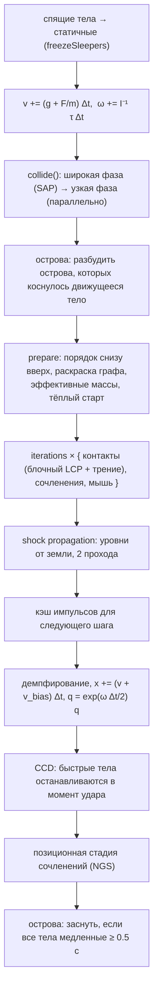
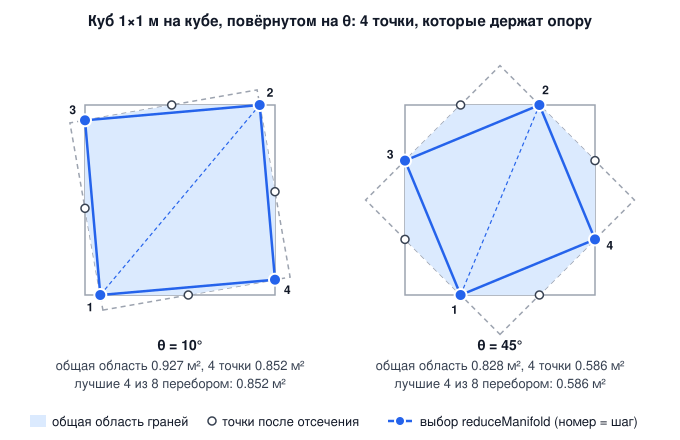
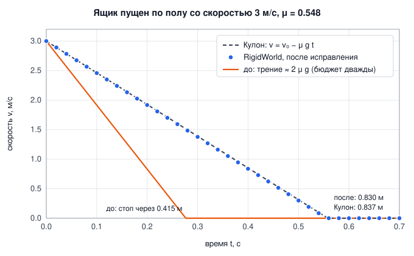
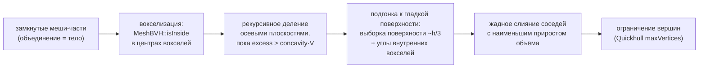

# 2. Твёрдые тела

[← Математика](01-math.md) · [Оглавление](README.md) · [Частицы →](03-particles.md)

**Что это и зачем.** `src/rigid/` — полный конвейер динамики твёрдых тел: выпуклые формы и составные невыпуклые тела, широкая и узкая фаза столкновений, контактный решатель, непрерывные столкновения (CCD), сочленения и выпуклая декомпозиция. Цель — устойчивые высокие стопки (100 кубиков стоят), точное трение и отсутствие туннелирования быстрых тел.

Точка входа — класс `RigidWorld` ([src/rigid/RigidWorld.h](../src/rigid/RigidWorld.h)). Минимальный пример:

```cpp
rf::RigidWorld world;
world.setDomain(rf::AABB({-5, 0, -5}, {5, 10, 5}));   // стенки-плоскости мира
int box  = world.addBox({0, 1, 0}, rf::Vector3(0.25f), rf::Quaternion(), 500.0f /*кг/м³*/, rf::Vector3(1));
int ball = world.addSphere({0.2f, 3, 0}, 0.1f, 1000.0f, rf::Vector3(1));
for (int k = 0; k < world.params.substeps; ++k) world.step(1.0f / 60 / world.params.substeps);
```

---

## 2.1 Один шаг мира

`RigidWorld::step` ([RigidWorld.cpp:179](../src/rigid/RigidWorld.cpp#L179)) по умолчанию использует решатель **последовательных импульсов** (`RigidSolver::SequentialImpulse`):



Шаг вызывается `substeps` раз за кадр (по умолчанию 10). Много маленьких шагов с немногими итерациями устойчивее, чем один большой шаг с многими итерациями — так делают PhysX (TGS) и Jolt.

Интегрирование — полунеявный Эйлер: сначала скорость, потом положение по **новой** скорости. Поворот — точной экспонентой кватерниона (гл. 1.2).

---

## 2.2 Формы и массовые свойства

Каждая выпуклая форма описывается **опорным отображением**

$$
s_A(\mathbf d) = \arg\max_{\mathbf x\in A}\ \mathbf x\cdot\mathbf d .
$$

Больше GJK и EPA ничего не нужно знать о форме. Центр масс формы — в начале её локальной системы, оси — главные оси инерции.

| Класс ([Shapes.h](../src/rigid/Shapes.h)) | Опорная функция | Особенности |
|---|---|---|
| `SphereShape` | $r\,\mathbf d/\lVert\mathbf d\rVert$ | аналитические контакты со сферой и боксом |
| `BoxShape` | $(\pm h_x, \pm h_y, \pm h_z)$ по знакам $\mathbf d$ | SAT с другими боксами |
| `ConvexHullShape` | перебор вершин | вход — уже выпуклый меш; центр масс и главные оси вычисляются в конструкторе |
| `TriangleShape` | лучшая из 3 вершин | треугольник статического меша (только для GJK/EPA) |
| `CompoundShape` | лучшая из частей | невыпуклое тело из выпуклых частей |

**Массовые свойства** многогранника считаются точно (D. Eberly, *Polyhedral Mass Properties*): интегралы $\int 1,\ \int x,\ \int x^2,\ \int xy$ по объёму сводятся по теореме Гаусса к сумме по треугольникам ([Shapes.cpp:307](../src/rigid/Shapes.cpp#L307)). Затем `symmetricEigen` поворачивает вершины в главные оси ([Shapes.cpp:353](../src/rigid/Shapes.cpp#L353)), и тензор инерции становится диагональным:

$$
\mathbf I_{world}^{-1} = \mathbf R\,\operatorname{diag}(I_1^{-1}, I_2^{-1}, I_3^{-1})\,\mathbf R^{\mathsf T}.
$$

`RigidBody::updateInertia()` кэширует $\mathbf I_{world}^{-1}$ один раз за шаг — решатель применяет её тысячи раз.

**Составное тело** (`CompoundShape`, [Shapes.cpp:169](../src/rigid/Shapes.cpp#L169)) суммирует тензоры частей по теореме Штейнера и снова диагонализует сумму:

$$
\mathbf I = \sum_c \Big(\mathbf R_c \mathbf I_c \mathbf R_c^{\mathsf T} + m_c\big(|\mathbf d_c|^2\,\mathbb 1 - \mathbf d_c\mathbf d_c^{\mathsf T}\big)\Big), \qquad \mathbf d_c = \mathbf c_c - \mathbf c .
$$

---

## 2.3 GJK: расстояние между выпуклыми телами

Два выпуклых тела пересекаются тогда и только тогда, когда их **разность Минковского** $A - B = \lbrace \mathbf a - \mathbf b\rbrace$ содержит начало координат. Расстояние между телами равно расстоянию от начала координат до $A - B$. Опорная функция разности:

$$
s_{A-B}(\mathbf d) = s_A(\mathbf d) - s_B(-\mathbf d).
$$

[src/rigid/GjkEpa.cpp:13](../src/rigid/GjkEpa.cpp#L13)
```cpp
SV supportAB(const PosedShape& A, const PosedShape& B, const Vector3& d) {
    Vector3 a = A.support(d), b = B.support(-d);
    return {a - b, a, b};
}
```

**Алгоритм Гилберта–Джонсона–Кирти.** Держим симплекс (1–4 точки разности) и точку $\mathbf v$ симплекса, ближайшую к началу координат:

1. Новая опорная точка $\mathbf w = s_{A-B}(-\mathbf v)$.
2. Если $|\mathbf v|^2 - \mathbf v\cdot\mathbf w \le \varepsilon|\mathbf v|^2$ — продвижения нет, $\mathbf v$ и есть ближайшая точка.
3. Добавить $\mathbf w$ в симплекс, найти ближайшую к нулю точку нового симплекса и **сократить** симплекс до той грани/ребра/вершины, где она лежит (`solveSimplex`).
4. Если тетраэдр содержит начало координат — тела пересекаются, симплекс передаётся EPA.

**Ранний выход.** Плоскость $\mathbf v\cdot\mathbf x = \mathbf v\cdot\mathbf w$ отделяет разность от нуля, поэтому $\operatorname{dist} \ge \mathbf v\cdot\mathbf w/|\mathbf v|$. Если эта оценка уже больше `maxDistance` (контактный зазор), GJK останавливается — так делает Jolt:

[src/rigid/GjkEpa.cpp:167](../src/rigid/GjkEpa.cpp#L167)
```cpp
SV w = supportAB(A, B, -v);
// Early out: the whole Minkowski difference lies beyond the plane dot(v, x) = dot(v, w).
const float vw = dot(v, w.w);
if (vw > 0 && vw * vw > maxDistance * maxDistance * dist2) {
    r.intersect = false;
    r.distance = vw / std::sqrt(dist2);
    r.simplexSize = 0;
    return r;
}
// No further progress towards the origin: v is (numerically) the closest point.
if (dist2 - dot(v, w.w) <= 1e-6f * dist2 + 1e-10f) break;
```

> **Важно (устойчивость).** Для тонких длинных тел тетраэдр разности почти плоский, и во `float` знак «с какой стороны грани начало координат» переворачивается от округления — GJK ошибочно сообщает пересечение. Поэтому тест сторон тетраэдра выполняется в `double` с относительным допуском ([GjkEpa.cpp:109](../src/rigid/GjkEpa.cpp#L109)). Тест `GJK robustness on thin boxes`: 300 случайных поз тонких брусков, **0 ошибок** против точного расстояния.

Ближайшие точки на телах восстанавливаются барицентрическими весами $\lambda_i$ симплекса: $\mathbf p_A = \sum\lambda_i \mathbf a_i$, $\mathbf p_B = \sum\lambda_i\mathbf b_i$.

---

## 2.4 EPA: глубина проникновения

Когда тела пересекаются, нужны **нормаль и глубина** — кратчайший вектор, выталкивающий $A$ из $B$. Это ближайшая к началу координат точка **границы** разности. EPA (Expanding Polytope Algorithm, van den Bergen 2001) раздувает многогранник внутри разности:

1. Симплекс GJK достраивается до невырожденного тетраэдра (опорные точки по осям и перпендикулярам).
2. Берётся грань, ближайшая к началу координат, с нормалью $\mathbf n$ и расстоянием $d$.
3. Опорная точка $\mathbf w = s_{A-B}(\mathbf n)$. Если $\mathbf w\cdot\mathbf n - d < 10^{-5}$ — граница достигнута.
4. Иначе удаляются все грани, «видимые» из $\mathbf w$; их **горизонт** (рёбра, принадлежащие ровно одной удалённой грани) соединяется с $\mathbf w$ новыми гранями.

[src/rigid/GjkEpa.cpp:276](../src/rigid/GjkEpa.cpp#L276)
```cpp
std::vector<std::pair<int, int>> horizon;
std::vector<Face> kept;
kept.reserve(faces.size());
for (const Face& fc : faces) {
    if (fc.d != kInf && dot(fc.n, w.w - V[fc.a].w) > 1e-7f) {
        const int e[3][2] = {{fc.a, fc.b}, {fc.b, fc.c}, {fc.c, fc.a}};
        for (auto& ed : e) {
            auto it = std::find(horizon.begin(), horizon.end(), std::make_pair(ed[1], ed[0]));
            if (it != horizon.end()) horizon.erase(it);
            else horizon.emplace_back(ed[0], ed[1]);
        }
    } else {
        kept.push_back(fc);
    }
}
```

Результат: нормаль $-\mathbf n$ (от $B$ к $A$), глубина $d$, глубочайшие точки обоих тел через барицентрические координаты проекции нуля на итоговую грань.

---

## 2.5 Узкая фаза: многоточечные контакты

Одна точка контакта не удерживает ящик на столе — он раскачивается. Нужен **многообразие контакта** (manifold) до 4 точек. `NarrowPhase` выбирает алгоритм по таблице двойной диспетчеризации ([NarrowPhase.cpp:115](../src/rigid/NarrowPhase.cpp#L115)):

| Пара | Алгоритм |
|---|---|
| сфера–сфера, сфера–бокс | аналитически |
| сфера–выпуклое | GJK от центра сферы (точки) + EPA, если центр внутри |
| бокс–бокс | SAT по 15 осям + отсечение Сазерленда–Ходжмана или контакт рёбер |
| выпуклое–выпуклое (оболочки, треугольники) | GJK/EPA → отсечение опорных граней (как в Jolt) → запасной метод возмущений (как в Bullet) |
| составное–что угодно | каждая часть против каждой, отсечение по AABB частей |

### Спекулятивные контакты

Контакты создаются заранее, пока тела ещё на расстоянии до `contactMargin` (1 см). У таких точек **отрицательная глубина** — зазор. Решатель разрешает закрыть зазор за шаг, но не больше (раздел 2.7). Так контакт существует непрерывно, тёплый старт работает, а тело не «пропускает» касание между шагами.

### Бокс–бокс: теорема о разделяющей оси (SAT)

Два выпуклых многогранника не пересекаются, если существует ось, на проекции на которую их интервалы не перекрываются. Для двух боксов достаточно проверить 15 осей: 3 нормали граней $A$, 3 нормали $B$ и 9 векторных произведений рёбер $\mathbf a_i\times\mathbf b_j$. Радиус проекции бокса на ось $\mathbf L$:

$$
r_A = \sum_{k} h_k^A\,|\mathbf a_k\cdot\mathbf L|, \qquad
\text{sep} = |\mathbf T\cdot\mathbf L| - (r_A + r_B).
$$

Ось с наибольшим `sep` (наименьшим проникновением) — ось контакта. Оси граней **предпочитаются**: ось ребра выигрывает, только если она лучше на 5 % плюс допуск. Иначе при лежании ящика плашмя ось контакта скакала бы между гранью и ребром, а многообразие — между 4 и 1 точкой.

Для оси грани: инцидентная грань второго бокса (наиболее антипараллельная) отсекается четырьмя боковыми плоскостями опорной грани алгоритмом Сазерленда–Ходжмана; остаются точки не выше плоскости опорной грани (+ зазор). Для оси рёбер — одна точка, середина между ближайшими точками двух рёбер ([NarrowPhase.cpp:212](../src/rigid/NarrowPhase.cpp#L212)).

**Почему хватает 15 осей.** Два выпуклых многогранника пересекаются тогда и только тогда, когда их разность Минковского $A \ominus B = \{\mathbf a - \mathbf b\}$ содержит начало координат. Глубина проникновения — расстояние от начала координат до границы этой разности, а направление — **минимальный вектор выталкивания** (MTV). Разность — тоже выпуклый многогранник, и каждая его грань параллельна одному из трёх объектов: грани $A$, грани $B$ или паре рёбер $(\mathbf a_i, \mathbf b_j)$. Поэтому минимум перекрытия по **всем** направлениям достигается на одной из нормалей этих граней:

$$
\text{overlap}(\mathbf L) = r_A(\mathbf L) + r_B(\mathbf L) - \big|(\mathbf p_A - \mathbf p_B)\cdot\mathbf L\big|,
\qquad
d_{\min} = \min_{\mathbf L \,\in\, \{\mathbf a_i,\ \mathbf b_j,\ \widehat{\mathbf a_i\times\mathbf b_j}\}} \text{overlap}(\mathbf L).
$$

У двух боксов это 3 + 3 + 9 = 15 направлений; параллельные рёбра ($\mathbf a_i\times\mathbf b_j \approx 0$) новых граней не дают и пропускаются. Тест считает эталон этим перебором, независимо от движка:

[tests/HardContactTests.h:142](../tests/HardContactTests.h#L142)
```cpp
inline float satReference(const Vector3& ha, const Matrix3x3& Ra, const Vector3& pa, const Vector3& hb, const Matrix3x3& Rb,
                          const Vector3& pb, Vector3& normal, float& secondBest) {
    std::vector<Vector3> axes;
    for (int i = 0; i < 3; ++i) {
        axes.push_back(Ra.col(i));
        axes.push_back(Rb.col(i));
    }
    for (int i = 0; i < 3; ++i)
        for (int j = 0; j < 3; ++j) {
            const Vector3 c = cross(Ra.col(i), Rb.col(j));
            if (length(c) > 1e-4f) axes.push_back(normalize(c));
        }
    float best = 1e9f;
    secondBest = 1e9f;
    for (const Vector3& L : axes) {
        const float ra = ha.x * std::fabs(dot(Ra.col(0), L)) + ha.y * std::fabs(dot(Ra.col(1), L)) + ha.z * std::fabs(dot(Ra.col(2), L));
        const float rb = hb.x * std::fabs(dot(Rb.col(0), L)) + hb.y * std::fabs(dot(Rb.col(1), L)) + hb.z * std::fabs(dot(Rb.col(2), L));
        const float d = dot(pa - pb, L);
        const float overlap = ra + rb - std::fabs(d);
```

`secondBest` — наименьшее перекрытие на **другой** оси. Если оно почти равно `best`, MTV неоднозначен, и такие позы тест не сравнивает. На 216 случайных глубоко вложенных парах путь GJK/EPA совпал с эталоном без единой ошибки (глубина до 3·10⁻⁷ м). SAT узкой фазы намеренно отдаёт предпочтение граням: его глубина может превышать минимум не больше чем на 5 %.

### Выпуклое–выпуклое: опорные грани

GJK/EPA даёт нормаль и глубину, но только одну точку. Многообразие строится **отсечением опорных граней** обоих тел вдоль нормали (Jolt, `ManifoldBetweenTwoFaces`):

[src/rigid/NarrowPhase.cpp:321](../src/rigid/NarrowPhase.cpp#L321)
```cpp
bool NarrowPhase::faceManifold(const PosedShape& A, const PosedShape& B, const Vector3& n, std::vector<ContactPoint>& pts) {
    std::vector<Vector3> fa, fb;
    A.feature(-n, fa); // A's face towards B
    B.feature(n, fb);  // B's face towards A
```

Опорная грань (`supportFeature`) — грань, нормаль которой ближе всего к направлению. Опорной выбирается та из двух граней, что лучше совмещена с нормалью контакта (не хуже 25°, `cosMax = 0.9`); другая — инцидентная — отсекается её боковыми плоскостями.

Глубина каждой точки меряется **вдоль нормали контакта** $\mathbf n$ от опорной плоскости другого тела, а не вдоль нормали опорной грани (они могут расходиться до 25°):

$$
d_i = \max_{\mathbf y\in B}\mathbf n\cdot\mathbf y - \mathbf n\cdot\mathbf x_i \quad(\mathbf x_i \text{ на } A).
$$

Тогда самая глубокая точка в точности равна глубине EPA, а все глубины согласованы с направлением, в котором решатель расталкивает тела. Прежний замер вдоль нормали грани завышал глубину при глубоком проникновении до 5 %.

Если граней нет (вершина в грань, сфероподобные оболочки), срабатывает **метод возмущений** (Bullet): меньшее тело 4 раза поворачивается на малый угол вокруг осей, перпендикулярных нормали, EPA даёт новые точки, близкие точки сливаются ([NarrowPhase.cpp:412](../src/rigid/NarrowPhase.cpp#L412)).

### Сокращение до 4 точек

`reduceManifold` ([NarrowPhase.cpp:69](../src/rigid/NarrowPhase.cpp#L69)), как `PruneContactPoints` в Jolt и `sortCachedPoints` в Bullet:

1. самая глубокая точка; если глубины равны (плоский контакт) — самая дальняя от центра области, то есть угол;
2. самая дальняя от первой;
3. самая дальняя от прямой через первые две — по одну сторону;
4. самая дальняя — по другую сторону (знаковая площадь относительно нормали).

Четырёхугольник всегда охватывает опору, в каком бы порядке ни пришли точки. Прежний жадный выбор зависел от порядка: у куба, повёрнутого на 10°, он давал опору 0.658 м² вместо 0.852 м², и тело могло раскачиваться.

**Формулы.** Пусть $\mathbf x_i$ — точки, $d_i$ — их глубины, $\mathbf c$ — центр, $\mathbf n$ — нормаль контакта. Сначала выбираются две точки, образующие диагональ:

$$
i_0 = \arg\max_{i:\; d_i \,\ge\, d_{\max} - \tau} \lVert \mathbf x_i - \mathbf c\rVert^2, \qquad
\tau = 10^{-4}\,|d_{\max}| + 10^{-6}, \qquad
i_1 = \arg\max_i \lVert \mathbf x_i - \mathbf x_{i_0}\rVert^2 .
$$

Допуск $\tau$ нужен, потому что «равные» глубины плоского контакта различаются на ошибку округления. Затем для диагонали $\mathbf a = \mathbf x_{i_0}$, $\mathbf b = \mathbf x_{i_1}$ считается удвоенная знаковая площадь треугольника $(\mathbf a, \mathbf b, \mathbf x_i)$:

$$
s_i = \big((\mathbf b - \mathbf a)\times(\mathbf x_i - \mathbf a)\big)\cdot \mathbf n,
\qquad
i_L = \arg\max_{s_i > 0} s_i, \qquad i_R = \arg\min_{s_i < 0} s_i .
$$

Площадь четырёхугольника $\mathbf a, \mathbf x_{i_L}, \mathbf b, \mathbf x_{i_R}$ равна $\tfrac12\,(s_{i_L} - s_{i_R})$. Слагаемые независимы, поэтому лучшая точка слева и лучшая справа вместе дают **наибольшую площадь при заданной диагонали**. Диагональ $i_0 i_1$ соединяет самые далёкие друг от друга точки, и в тестах результат совпал с перебором всех четвёрок (рисунок ниже).

[src/rigid/NarrowPhase.cpp:83](../src/rigid/NarrowPhase.cpp#L83)
```cpp
    const float tie = 1e-4f * std::fabs(maxDepth) + 1e-6f; // equal up to rounding: a flat contact
    size_t i0 = 0;
    float far0 = -1;
    for (size_t i = 0; i < pts.size(); ++i) {
        if (pts[i].depth < maxDepth - tie) continue;
        const float d = length2(pts[i].position - centre);
        if (d > far0) { far0 = d; i0 = i; }
    }
    size_t i1 = i0;
    float best = -1;
    for (size_t i = 0; i < pts.size(); ++i) {
        float d = length2(pts[i].position - pts[i0].position);
        if (d > best) { best = d; i1 = i; }
    }
    std::vector<ContactPoint> out = {pts[i0]};
    if (i1 != i0) out.push_back(pts[i1]);
    if (maxPoints >= 4 && i1 != i0) {
        const Vector3 n = pts[i0].normal, a = pts[i0].position, b = pts[i1].position;
        size_t left = pts.size(), right = pts.size();
        float maxLeft = 1e-9f, maxRight = -1e-9f;
        for (size_t i = 0; i < pts.size(); ++i) {
            const float s = dot(cross(b - a, pts[i].position - a), n); // twice the signed triangle area
            if (s > maxLeft) { maxLeft = s; left = i; }
            if (s < maxRight) { maxRight = s; right = i; }
        }
```



При 10° общая область — восьмиугольник площадью 0.927 м². Выбранные 4 точки охватывают 0.852 м² — столько же, сколько лучшая из 70 четвёрок при переборе. При 45° восьмиугольник правильный ($8a^2\tan\frac{\pi}{8} = 0.828$ м² при $a = 0.5$ м), и лучшая четвёрка — квадрат через его вершины, 0.586 м². Четыре точки больше не охватят. Тест — `rotatedFaceOnFace` в [tests/HardContactTests.h](../tests/HardContactTests.h).

---

## 2.6 Широкая фаза

Интерфейс `BroadPhase` ([BroadPhase.h](../src/rigid/BroadPhase.h)) — паттерн «Стратегия». Все реализации возвращают **одинаковые** пары (проверено тестом против перебора):

| Класс | Идея | Когда хорош |
|---|---|---|
| `BruteForceBroadPhase` | все пары, $O(n^2)$ | эталон для тестов |
| `BvhBroadPhase` | BVH перестраивается каждый шаг, запросы параллельно | много быстро движущихся тел |
| `AABBTreeBroadPhase` | постоянное динамическое дерево (гл. 1.8), переставляются только тела, покинувшие толстый бокс | большие сцены с покоем |
| `SweepAndPruneBroadPhase` | **по умолчанию** (`fatten = 0.1`, [RigidWorld.h:299](../src/rigid/RigidWorld.h#L299)) | когерентное движение |

### Инкрементальный Sweep and Prune

На каждой оси хранится отсортированный список концов интервалов (min и max каждого бокса). Между кадрами тела смещаются мало, и сортировка вставками почти линейна. Каждый обмен двух концов — **событие** (Baraff 1992; Bullet `btAxisSweep3`):

- `min` тела $e$ проходит ниже `max` тела $f$ → интервалы начинают перекрываться на этой оси → если боксы перекрываются в 3D, пара добавляется;
- `max` тела $e$ проходит ниже `min` тела $f$ → интервалы разошлись → пара удаляется.

[src/rigid/BroadPhase.cpp:116](../src/rigid/BroadPhase.cpp#L116)
```cpp
while (j > 0 && before(e, E[j - 1])) {
    const Endpoint& f = E[j - 1];
    const uint32_t be = e.data >> 1, bf = f.data >> 1;
    if (be != bf) {
        const bool eMax = e.data & 1, fMax = f.data & 1;
        if (!eMax && fMax) {
            // e's min passes below f's max: the intervals start to overlap on this axis.
            if (bounds_[be].overlaps(bounds_[bf])) pairs_.insert(key(be, bf));
        } else if (eMax && !fMax) {
            // e's max passes below f's min: the intervals separate.
            pairs_.erase(key(be, bf));
        }
    }
```

С толстыми боксами тело, которое дрожит на месте, вообще не двигает свои концы. Пары выдаются отсортированными — результат не зависит от порядка хэш-множества (детерминизм).

---

## 2.7 Контактный решатель: последовательные импульсы

### Уравнение одной точки

Относительная скорость точек контакта вдоль нормали $\mathbf n$ (от $B$ к $A$):

$$
v_n = \big(\mathbf v_A + \boldsymbol\omega_A\times\mathbf r_A - \mathbf v_B - \boldsymbol\omega_B\times\mathbf r_B\big)\cdot\mathbf n .
$$

Импульс $\lambda\mathbf n$ в точке меняет её на $\lambda/m_{eff}$, где **эффективная масса**

$$
m_{eff}^{-1} = w_A + (\mathbf r_A\times\mathbf n)^{\mathsf T}\mathbf I_A^{-1}(\mathbf r_A\times\mathbf n) + w_B + (\mathbf r_B\times\mathbf n)^{\mathsf T}\mathbf I_B^{-1}(\mathbf r_B\times\mathbf n).
$$

[src/rigid/ContactSolver.cpp:168](../src/rigid/ContactSolver.cpp#L168)
```cpp
static float effMass(const RigidBody& A, const RigidBody* B, const Vector3& ra, const Vector3& rb, const Vector3& dir) {
    float k = A.invMass + dot(cross(A.applyInvInertiaWorld(cross(ra, dir)), ra), dir);
    if (B) k += B->invMass + dot(cross(B->applyInvInertiaWorld(cross(rb, dir)), rb), dir);
    return k > 1e-12f ? 1.0f / k : 0.0f;
}
```

Метод последовательных импульсов (E. Catto, GDC 2005) — это проективный Гаусс–Зейдель для LCP контакта: для каждой точки по очереди

$$
\lambda \leftarrow \max\big(0,\ \lambda + m_{eff}\,(b - v_n)\big),
$$

где $b$ — целевая скорость (смещение), а **накопленный** импульс $\lambda \ge 0$ (контакт только толкает). Ограничивается накопленный импульс, а не приращение — это позволяет итерациям «забирать» лишний импульс обратно.

### Целевая скорость $b$: спекулятивный зазор, отскок, проникновение

`prepareManifold` ([ContactSolver.cpp:221](../src/rigid/ContactSolver.cpp#L221)) задаёт для каждой точки с глубиной $d$ (зазор $= -d$):

| Случай | Смещение по скорости | Смещение по положению |
|---|---|---|
| зазор больше `slop` ($d < -s$) | $b = (d + s(1-\beta))/\Delta t$ — можно закрыть весь зазор, кроме мёртвой зоны | — |
| зазор в мёртвой зоне ($-s \le d < 0$) | $b = \beta d/\Delta t$ — мягкое закрытие | — |
| проникновение ($d \ge 0$), удар быстрее 1 м/с | $b = -e\,v_n$ (отскок) | $\beta\max(d - s, 0)/\Delta t$ |

Здесь $\beta$ = `baumgarte` = 0.2, $s$ = `slop` = 4 мм, $e$ — коэффициент восстановления (максимум двух тел). Мёртвая зона нужна потому, что субмиллиметровая разница зазоров углов превращалась бы в сантиметры в секунду разницы целевых скоростей и наклоняла бы падающий ящик.

### Гироскопический член: уравнения Эйлера

Свободное тело с неравными моментами инерции кувыркается: в системе тела уравнения Эйлера

$$
\mathbf I\,\dot{\boldsymbol\omega} = -\boldsymbol\omega\times(\mathbf I\boldsymbol\omega)
$$

сохраняют $|\mathbf L| = |\mathbf I\boldsymbol\omega|$ и энергию $\tfrac12\boldsymbol\omega\cdot\mathbf I\boldsymbol\omega$, а вращение вокруг средней оси неустойчиво (эффект Джанибекова, инкремент $\sigma = \omega_2\sqrt{(I_2-I_1)(I_3-I_2)/(I_1 I_3)}$). Без этого члена интегратор хранит $\boldsymbol\omega$, а не $\mathbf L$, и переворотов нет — так и было до теста Нётер. Явная схема при быстром вращении расходится; неявный Эйлер (Catto 2015) устойчив, но гасит $|\mathbf L|$ (5.6 % за 10 с). Взята **неявная средняя точка**: $\mathbf I(\boldsymbol\omega_1-\boldsymbol\omega_0) + h\,\boldsymbol\omega_m\times\mathbf I\boldsymbol\omega_m = 0$, $\boldsymbol\omega_m = \tfrac12(\boldsymbol\omega_0+\boldsymbol\omega_1)$ — симплектична и сохраняет оба квадратичных инварианта; три шага Ньютона с якобианом $\mathbf I + \tfrac h2\big([\boldsymbol\omega_m]_\times\mathbf I - [\mathbf I\boldsymbol\omega_m]_\times\big)$ сходятся до невязки $10^{-4}$ даже при $h|\boldsymbol\omega| = 0.33$ (пластина 200 рад/с при 600 Гц). Тест `CCD for a fast-spinning plate` теперь судит удар по $|\mathbf L|$, а не по одной компоненте $\boldsymbol\omega$: тонкая пластина, задетая за край, кувыркается ($I$ вдоль длинной оси в 300 раз меньше), и гироскопика перекачивает $\boldsymbol\omega$ между осями при постоянном $|\mathbf L|$ (37.5 % → 37.4 % за 0.1 с — только демпфирование); без члена $\boldsymbol\omega$ в мировой системе застывала — нефизично.

[src/rigid/RigidWorld.cpp:166](../src/rigid/RigidWorld.cpp#L166)
```cpp
Vector3 RigidWorld::gyroscopicStep(const RigidBody& b, float h) {
    const Matrix3x3 R = b.rotation();
    const Vector3 I(1.0f / b.invInertiaLocal.x, 1.0f / b.invInertiaLocal.y, 1.0f / b.invInertiaLocal.z);
    const Vector3 w0 = R.transposed() * b.angVel; // in the body frame, where I is diagonal
    Vector3 w1 = w0;
    for (int it = 0; it < 3; ++it) {
        const Vector3 wm = (w0 + w1) * 0.5f, Iwm = I * wm;
        const Vector3 f = I * (w1 - w0) + cross(wm, Iwm) * h;
        const Matrix3x3 J = Matrix3x3::diag(I) + (Matrix3x3::skew(wm) * Matrix3x3::diag(I) - Matrix3x3::skew(Iwm)) * (0.5f * h);
        w1 = w1 - J.inverse() * f;
    }
    return R * w1;
}
```

### Реституция: скорость подхода без гравитации шага, отскок одним проходом

Скорость подхода берётся **в момент касания**. Шаг интегрирует гравитацию в скорости до решения контактов, поэтому $v_n$ несёт лишние $g\,\Delta t$, и мяч с $e = 1$ набирал $2g\Delta t/|v_n| = 0.74\,\%$ энергии за отскок при 600 Гц (тест Нётер). Поправка: $v_n^{imp} = v_n - (\mathbf g_A - \mathbf g_B)\cdot\mathbf n\,\Delta t$, где гравитация вычитается только у динамических тел. Тем же тестом найдено, что реституция применялась лишь к контактам, зажатым CCD, — обычные удары были неупругими.

[src/rigid/ContactSolver.cpp:226](../src/rigid/ContactSolver.cpp#L226)
```cpp
        const float vnImpact = vn - dot(gRel, n) * dt;
```

Как *применять* отскок — отдельный вопрос, и ответ дала стопка из 100 кубов. Если цель $-e\,v_n^{imp}$ стоит внутри итераций как неравенство на весь шаг (так делает Box2D v2), то в стопке нижний контакт всё время дожимает верхний куб до скорости отскока, пока на него садится следующий: каждый уровень отскакивает быстрее предыдущего, и стопка разлетается (кубы 100-этажной стопки, сброшенной с 1 см, достигали 40 м/с). Поэтому отскок — **отдельный проход после итераций** (как в Box2D v3): для манифолда, который нёс нагрузку ($j_n > 0$) и чья скорость подхода была ударной, нормальная задача решается ещё раз с целью $-e\,v_n^{imp}$ — в той же блочной форме, что и основное решение (точка за точкой первый угол получал бы весь импульс и закручивал пластину, ударенную плашмя: встречные пластины потом били друг друга на 30 м/с). Импульсы отскока **не остаются в $j_n$**: $j_n$ разогревает следующий шаг (warm start), а удар — событие одноразовое; повторное приложение его как постоянной нагрузки давало +15 % кинетической энергии стопки за подшаг (замерено по стадиям шага: до решения → после итераций → после реституции → после ударного прохода). Порядок в шаге: итерации → отскок → ударный проход: он односторонний с нулевыми аккумуляторами и разлёт отнять не может, зато снимает вдавливание нижнего куба стопки, которое отскок оставляет (с отскоком после него стопка из 200 кубов рушилась). Единственный двусторонний пересчёт внутри ударного прохода — пары одного уровня — для ударных пар пропускается: он видел разлёт и отбирал его (пуля 300 м/с вязла в ящике). Порог `restitutionThreshold` = 1 м/с, как в Box2D: медленнее — покой, не удар. Итог: стопка из 200 кубов после исправления стоит точнее, чем до него (смещение 7 мм вместо 6 см).

[src/rigid/ContactSolver.cpp:452](../src/rigid/ContactSolver.cpp#L452)
```cpp
void RigidWorld::applyRestitution() {
    for (Manifold& m : manifolds_) {
        bool impact = false, loaded = false;
        for (const SolverPoint& p : m.points) {
            impact |= p.bounce > 0;
            loaded |= p.jn > 0;
        }
        if (!impact || !loaded) continue; // a resting touch, or a contact that carried no load
        // The bounce is the normal solve of this manifold once more with the bounce as its target:
        // the block form couples the points, where one sweep point by point gives the first corner
```


### Разделённый импульс (split impulse)

Выталкивание из проникновения **не должно добавлять энергии**. Поэтому оно решается отдельно на «псевдоскоростях» `biasVel`, `biasAngVel`, которые сдвигают тело при интегрировании и затем обнуляются, а в настоящую скорость не попадают ([ContactSolver.cpp:469](../src/rigid/ContactSolver.cpp#L469)). Без этого тело, вытолкнутое из пола, подпрыгивало бы.

### Блочный решатель: точный LCP для многообразия

Гаусс–Зейдель по точкам одного многообразия плох: угол, решённый первым, забирает весь вес, и приземлившийся плашмя ящик начинает раскачиваться. Поэтому нормальные импульсы до 4 точек многообразия находятся **совместно, точно**. Это обобщение блочного решателя Box2D (2 точки) на 4 точки ([ContactSolver.cpp:368](../src/rigid/ContactSolver.cpp#L368)).

Матрица эффективных масс точек $K_{ij} = \mathbf J_i\mathbf M^{-1}\mathbf J_j^{\mathsf T}$ считается в `prepareManifold`. Нужно решить задачу дополнительности (LCP):

$$
\mathbf w = \mathbf K\mathbf x + \mathbf b', \qquad \mathbf x \ge 0,\quad \mathbf w \ge 0,\quad x_i w_i = 0,
$$

где $\mathbf x$ — накопленные импульсы, $\mathbf w$ — итоговые скорости расхождения. Для $n \le 4$ точек можно **перебрать все активные множества** (подмножества точек, где $x_i > 0$): на активном множестве решить $\mathbf K_{aa}\mathbf x_a = -\mathbf b'_a$ (`solveSmall`), проверить $\mathbf x_a \ge 0$ и $\mathbf w \ge 0$ на остальных точках.

[src/rigid/ContactSolver.cpp:399](../src/rigid/ContactSolver.cpp#L399)
```cpp
auto tryMask = [&](int mask) {
    int idx[4], k = 0;
    for (int i = 0; i < n; ++i)
        if (mask & (1 << i)) idx[k++] = i;
    float x[4] = {0, 0, 0, 0};
    if (k > 0) {
        float Ms[4][4], rs[4], xs[4];
        for (int i = 0; i < k; ++i) {
            rs[i] = -bb[idx[i]];
            for (int j = 0; j < k; ++j) Ms[i][j] = Kc[idx[i]][idx[j]];
        }
        if (!solveSmall(k, Ms, rs, xs)) return false;
        for (int i = 0; i < k; ++i)
            if (xs[i] < 0.0f) return false;
        for (int i = 0; i < k; ++i) x[idx[i]] = xs[i];
    }
    for (int i = 0; i < n; ++i) {
        if (mask & (1 << i)) continue;
        float w = bb[i];
        for (int j = 0; j < n; ++j) w += Kc[i][j] * x[j];
        if (w < -1e-5f) return false;
    }
    for (int i = 0; i < n; ++i) xBest[i] = x[i];
    return true;
};
```

Четыре копланарные точки дают вырожденную матрицу ранга 3 (нагрузку на 4 ножки стола можно распределить бесконечно многими способами). Малая регуляризация на диагонали $\varepsilon = $ `blockCfm`$\cdot\operatorname{tr}\mathbf K/n$ делает задачу корректной и выбирает решение **минимальной энергии** — симметричное. Порядок перебора: сначала $\mathbf x = 0$ (многообразие расходится — частый случай для спекулятивных точек), потом активное множество прошлой итерации, потом все остальные от больших к меньшим.

> **Почему это важно.** Блочный решатель — решающее исправление, после которого тест «100 кубиков, брошенных с 1 см» проходит со строгими критериями.

### Трение, кручение, качение

Трение приложено **к центру пятна контакта**, а не к каждой точке (как в ReactPhysics3D): две касательные $\mathbf t_1, \mathbf t_2$ и кручение вокруг нормали. Предел Кулона — от **суммарной** нормальной нагрузки многообразия:

$$
|\lambda_{t}| \le \mu \sum_i \lambda_{n,i}, \qquad
\mu = \begin{cases} \mu_s, & |\mathbf v_t| < v_{stick}\\ \mu_k, & \text{иначе}\end{cases}
$$

[src/rigid/ContactSolver.cpp:538](../src/rigid/ContactSolver.cpp#L538)
```cpp
Vector3 vc = relVel(m.center);
float slide = length(vc - m.normal * dot(vc, m.normal));
const float mu = slide < params.stickVelocity ? m.staticFriction : m.friction;
const float maxF = mu * total;
float old = m.jt1;
m.jt1 = clampv(old - m.massT1 * dot(relVel(m.center), m.t1), -maxF, maxF);
apply(m.t1 * (m.jt1 - old), m.center);
```

- Коэффициенты пары: $\mu_k = \sqrt{\mu_{k,A}\mu_{k,B}}$, $\mu_s = \max(\sqrt{\mu_{s,A}\mu_{s,B}}, \mu_k)$, отскок $e = \max(e_A, e_B)$ ([ContactSolver.cpp:24](../src/rigid/ContactSolver.cpp#L24)).
- Кручение ограничено моментом $\mu\sum\lambda_n\cdot\max(r_{patch}, 0.25R)$, где $r_{patch}$ — средний радиус пятна.
- **Сопротивление качению**: угловой импульс против относительного вращения, предел `rollingResistance`$\cdot\sum\lambda_n\cdot R$.
- **Блокировка вращения** (`rotationalLock`): покоящийся контакт гранью (≥ 3 точки) запоминает относительную ориентацию $q_B^{-1}q_A$ и удерживает все три компоненты относительной угловой скорости, как угловая часть сварного шарнира, пока ошибка $\lVert\log(q_{rel}q_{ref}^{-1})\rVert < 0.2$ рад и хватает момента трения. При опрокидывании блокировка снимается.

### Тёплый старт

Импульсы прошлого шага — отличное начальное приближение: стопка «помнит» свой вес. Точки сопоставляются между шагами по **хэшу квантованного положения в системе тела A** (ячейка $0.05R + 5$ мм), а при переходе через границу ячейки — по ближайшей точке ([ContactSolver.cpp:144](../src/rigid/ContactSolver.cpp#L144)).

Когда конфигурация контакта меняется (4 угла → 2 точки ребра), несопоставленные новые точки делят остаток прошлого суммарного импульса, а сумма сохраняется ([ContactSolver.cpp:318](../src/rigid/ContactSolver.cpp#L318)). Опора не теряется и не удваивается.

### Порядок и параллельность

- Многообразия сортируются **снизу вверх вдоль гравитации**, статические контакты первыми ([RigidWorld.cpp:160](../src/rigid/RigidWorld.cpp#L160)). В Гаусс–Зейделе опора проходит через всю стопку за первые итерации, а не по уровню за итерацию.
- При ≥ 256 многообразиях граф контактов **раскрашивается** жадно (до 63 цветов): многообразия одного цвета не делят динамических тел и решаются параллельно ([ContactSolver.cpp:174](../src/rigid/ContactSolver.cpp#L174)).

### Распространение удара (shock propagation)

Guendelman, Bridson, Fedkiw (2003). После обычных итераций поиск в ширину по графу контактов назначает каждому телу **уровень** — расстояние до статического окружения ([ShockPropagation.cpp:10](../src/rigid/ShockPropagation.cpp#L10)). Затем 2 прохода от земли вверх, где **нижнее тело считается бесконечно тяжёлым**: исправляется только скорость верхнего ([ShockPropagation.cpp:41](../src/rigid/ShockPropagation.cpp#L41)). Импульс идёт в одну сторону, и высокая стопка ведёт себя как низкая.

В последнем проходе верхнее тело ещё и увлекается опорой трением (без вращения), с изменением скорости не больше $\mu|\mathbf g|\Delta t$ за шаг. Это независимо от высоты столба: в равновесии нормальный импульс равен весу всего столба над контактом. Без этого боковой толчок доходил бы до вершины по уровню за итерацию, и стопка сдвигалась бы «лесенкой».

**Бюджет Кулона.** Обычные итерации уже приложили к этому контакту импульс трения $\mathbf j_t$ (накопленные `jt1`, `jt2`). Проход удара может добавить только то, что ещё осталось в конусе Кулона $|\mathbf j_t| \le \mu \sum_k j_{n,k}$:

$$
\Delta v = \min\Big(\,|\mathbf v_t|,\ \ \mu\,|\mathbf g|\,\Delta t,\ \ \frac{1}{m_U}\max\big(0,\ \mu\textstyle\sum_k j_{n,k} - |\mathbf j_t|\big)\Big),
\qquad
\mathbf v_U \leftarrow \mathbf v_U - \Delta v\,\frac{\mathbf v_t}{|\mathbf v_t|}.
$$

Здесь $\mathbf v_t$ — касательная скорость верхнего тела $U$ относительно опоры, $\mu$ — статический коэффициент при $|\mathbf v_t| <$ `stickVelocity`, иначе кинетический.

[src/rigid/ShockPropagation.cpp:113](../src/rigid/ShockPropagation.cpp#L113)
```cpp
    const float mu = vtl < params.stickVelocity ? m.staticFriction : m.friction;
    const float used = length(m.t1 * m.jt1 + m.t2 * m.jt2);
    const float budget = std::max(0.0f, mu * normalTotal - used);
    const float dv = std::min({vtl, mu * length(params.gravity) * lastDt_, budget * U.invMass});
    U.vel -= t * dv;
```

Без третьего предела проход брал $\mu|\mathbf g|\Delta t$ **сверх** уже израсходованного бюджета, и трение скольжения удваивалось на каждом контакте с землёй: ящик, пущенный со скоростью 3 м/с, останавливался через 0.415 м вместо $v_0^2/(2\mu g) = 0.837$ м.



Теперь торможение $5.42$ м/с² при $\mu g = 5.37$ м/с² (1 %), путь 0.830 м. Проверка — пункт 3 теста `coherence` в [tests/RigidTests.cpp](../tests/RigidTests.cpp).

### Сон островов

Острова — компоненты связности графа контактов и сочленений между динамическими телами (union-find, [Islands.cpp:88](../src/rigid/Islands.cpp#L88)). Если все тела острова медленнее `sleepLinear` и `sleepAngular` дольше `sleepTime`, остров засыпает целиком. Спящие тела на время шага получают нулевую обратную массу (`freezeSleepers`) — все пути решателя видят их статичными. Касание движущимся телом будит весь остров сразу (как в Box2D), и импульсы спящих пар сохраняются в кэше: разбуженная стопка сразу держит свой вес.

### Удержание тел (`hold`)

Иногда тело нужно подвесить до какого-то момента: в сцене «Огонь» чайник и кролик висят, пока не поднимется дым, и падают через 1.5 с. `hold` делает тело статическим тем же механизмом, что и сон, — на время удержания

$$
m^{-1} \to 0, \qquad \mathbf I^{-1}_{local} \to 0,
$$

а `releaseHeld` возвращает сохранённые значения и будит тело. Отдельного флага «кинематическое» в решателе нет: все пути (импульсы, блочный LCP, CCD, частицы) уже правильно обрабатывают нулевую обратную массу.

[src/rigid/Islands.cpp:49](../src/rigid/Islands.cpp#L49)
```cpp
void RigidWorld::hold(int i) {
    if (i < 0 || i >= int(bodies_.size()) || bodies_[i].invMass == 0) return; // static already
    held_.push_back(makeStatic(i));
}

void RigidWorld::releaseHeld() {
    for (const Frozen& f : held_) {
        if (f.body >= int(bodies_.size())) continue;
        restore(f);
        wake(f.body);
    }
    held_.clear();
}
```

---

## 2.8 Непрерывные столкновения (CCD): консервативное продвижение

Пуля 300 м/с за подшаг 1/600 с пролетает 50 см и может проскочить стену толщиной 2 см между двумя проверками. CCD (B. Mirtich, 1996) находит **момент удара**.

Движение за шаг параметризуется $s\in[0,1]$: положение линейно, ориентация — экспонентой вектора поворота $\Delta\boldsymbol\theta$ ([TimeOfImpact.h:15](../src/rigid/TimeOfImpact.h#L15)). Расстояние между телами не может уменьшаться быстрее, чем

$$
\text{bound} = |\Delta\mathbf p_A - \Delta\mathbf p_B| + |\Delta\boldsymbol\theta_A|\,r_A + |\Delta\boldsymbol\theta_B|\,r_B \quad\text{на единицу } s,
$$

где $r$ — радиус описанной сферы. Значит, если GJK даёт текущее расстояние $d$, можно безопасно продвинуться на $\Delta s = d/\text{bound}$:

[src/rigid/TimeOfImpact.cpp:16](../src/rigid/TimeOfImpact.cpp#L16)
```cpp
for (int it = 0; it < maxIt; ++it) {
    r.iterations = it + 1;
    GjkResult g = gjk(A.at(s), B.at(s));
    if (g.intersect) {
        if (s == 0) return r; // already touching: the discrete solver owns this pair
        r.hit = true;         // overshot inside the tolerance band: report the last safe s
        r.s = s;
        return r;
    }
    if (g.distance < tol) {
        // Touching at the start of the step: a resting/sliding contact owned by the discrete
        // (speculative) solver - never freeze such pairs.
        if (s == 0) return r;
        r.hit = true;
        r.s = s;
        return r;
    }
    // Conservative step: the gap cannot close faster than `bound` per unit s. Aim slightly
    // short of contact so the next GJK still sees separated shapes.
    s += std::max((g.distance - 0.5f * tol) / bound, 1e-6f);
    if (s > 1.0f) return r;
}
```

Метод работает для любых выпуклых форм (нужна только опорная функция). У сферы вращение не меняет формы, поэтому `angularReach() = 0`.

**В мире** (`continuousCollision`, [TimeOfImpact.cpp:70](../src/rigid/TimeOfImpact.cpp#L70)):

1. «Быстрое» тело — то, что за шаг смещается больше чем на `ccdThreshold` × половину своего наименьшего размера (как в Bullet). Если быстрых нет — выход сразу.
2. Широкая фаза CCD — BVH по заметённым боксам.
3. Оба тела пары останавливаются в общем моменте удара (motion clamping), **скорость сохраняется**. Остановленное тело становится статичным до конца шага, и проходы повторяются (до 8): так ловятся цепочки «A бьёт B, B бьёт C».
4. Удар разрешает спекулятивный контакт следующего шага, с отскоком (`clamped && vn < -1` в `prepareManifold`).

---

## 2.9 Сочленения

Все сочленения ([Joints.h](../src/rigid/Joints.h)) построены на общем механизме **строк якобиана** $\mathbf J = [\mathbf J^{lin}_A, \mathbf J^{ang}_A, \mathbf J^{lin}_B, \mathbf J^{ang}_B]$:

[src/rigid/Joints.h:22](../src/rigid/Joints.h#L22)
```cpp
struct JacobianRow {
    Vector3 linA, angA, linB, angB;
    float effMass = 0;   // 1 / (J M^-1 J^T)
    float bias = 0;      // target: J v = -bias
    float lo = -std::numeric_limits<float>::infinity();
    float hi = std::numeric_limits<float>::infinity();
    float softness = 0;  // gamma of a soft constraint (springs), 0 = rigid
    float lambda = 0;    // accumulated impulse
};
```

| Тип | Строки | Параметры |
|---|---|---|
| `BallJoint` (шаровое) | 3 линейные: точки совпадают | — |
| `HingeJoint` (шарнир) | шаровое + 2 угловые перпендикулярно оси | пределы угла `lower/upper`, мотор `motorSpeed`, `maxMotorTorque` |
| `SliderJoint` (ползун) | 3 угловые + 2 линейные поперёк оси | пределы хода |
| `FixedJoint` (сварка) | шаровое + 3 угловые | — |
| `DistanceJoint` | 1 строка вдоль отрезка | `rope` (только тянет), `frequency`, `dampingRatio` (пружина) |

**Скоростная стадия** — последовательные импульсы по строкам с ограничением накопленного импульса и тёплым стартом ([Joints.cpp:94](../src/rigid/Joints.cpp#L94)):

$$
\lambda \leftarrow \operatorname{clamp}\!\big(\lambda - m_{eff}(\mathbf J\mathbf v + b + \gamma\lambda),\ \lambda_{lo},\ \lambda_{hi}\big).
$$

Мотор — строка с $b = -\omega_{motor}$ и пределом $|\lambda| \le \tau_{max}\Delta t$. Предел угла — односторонняя строка ($\lambda_{lo}=0$ или $\lambda_{hi}=0$).

**Мягкие связи (пружины)** в формулировке Box2D. Для частоты $f$ и коэффициента демпфирования $\zeta$: $\omega = 2\pi f$, $k = m_{eff}\omega^2$, $c = 2m_{eff}\zeta\omega$,

$$
\gamma = \frac{1}{\Delta t\,(c + \Delta t\,k)}, \qquad b = C\,\Delta t\,k\,\gamma .
$$

**Позиционная стадия** — нелинейный Гаусс–Зейдель: псевдоимпульсы сразу сдвигают позы и убирают дрейф $C(\mathbf x, q)$ через эффективную массу, без члена Баумгарта в скоростях — сочленения не впрыскивают энергию. Для точечной связи

$$
\mathbf P = -\mathbf K^{-1}\beta\mathbf C, \qquad
\mathbf K = (w_A + w_B)\mathbb 1 - [\mathbf r_A]_\times\mathbf I_A^{-1}[\mathbf r_A]_\times - [\mathbf r_B]_\times\mathbf I_B^{-1}[\mathbf r_B]_\times,
$$

$\beta = 0.5$, шаг ограничен 0.2 м и 0.5 рад ([Joints.cpp:113](../src/rigid/Joints.cpp#L113)). Угловая ошибка берётся на $SO(3)$ как логарифм: $\mathbf e = \log\big((q_B^{-1}q_A)\,q_{ref}^{-1}\big)$ ([Joints.cpp:162](../src/rigid/Joints.cpp#L162)).

**Мышь** (`GrabJoint`, как `b2MouseJoint`) — мягкая точечная связь 5 Гц, $\zeta = 0.7$, с ограничением силы ([Grab.cpp:21](../src/rigid/Grab.cpp#L21)).

---

## 2.10 Невыпуклые тела: Quickhull и выпуклая декомпозиция

### Quickhull

`buildConvexHull(points, maxVertices)` ([ConvexDecomposition.cpp:22](../src/rigid/ConvexDecomposition.cpp#L22)) — Barber, Dobkin, Huhdanpaa (1996), в `double`:

1. Начальный тетраэдр из крайних точек.
2. Каждая грань хранит список точек **снаружи** себя (conflict list).
3. Глобально самая далёкая точка добавляется первой. Видимая из неё область растёт как связный участок граней, горизонт — один замкнутый цикл, новые грани соединяют горизонт с точкой, «осиротевшие» точки раздаются новым граням.

Добавление крайних точек первыми держит грани хорошо обусловленными — поэтому оболочка устойчива на плотных почти копланарных выборках гладких поверхностей. С `maxVertices` алгоритм останавливается на лучшей аппроксимации заданного размера (жадно уменьшает хаусдорфово расстояние, как «cooking» с ограничением вершин в PhysX).

### Декомпозиция в духе V-HACD

`convexDecomposition(parts, params)` ([ConvexDecomposition.cpp:216](../src/rigid/ConvexDecomposition.cpp#L216)):



Критерий «почти выпуклости» части:

$$
V_{hull} - V_{voxels} \le \text{concavity}\cdot V_{total}.
$$

Разрез выбирается так, чтобы минимизировать пустоту в ограничивающих боксах половин. После деления часть подгоняется к **настоящей** поверхности (точки гладкого меша внутри её области), а не к ступенькам вокселей. Затем соседние части жадно сливаются, пока прирост объёма в пределах бюджета.

Чайник раскладывается на 8 частей, покрывает 98.8 % тела при 3.5 % лишнего объёма (вывод теста `convex hull + convex decomposition`).

Результат передаётся в `CompoundShape`; столкновения идут часть против части.

---

## 2.11 Экспериментальный XPBD-решатель

`RigidSolver::XPBD` ([XpbdSolver.cpp](../src/rigid/XpbdSolver.cpp)) — Müller et al. 2020, *Detailed Rigid Body Simulation with Extended Position Based Dynamics*: интегрирование → позиционные контакты со статическим трением → скорости из смещений → динамическое трение и отскок. Контакты хранят якоря в локальных системах тел, поэтому глубина пересчитывается каждый подшаг, а обнаружение столкновений идёт раз в `collisionInterval` подшагов.

> **Важно:** по умолчанию используется `SequentialImpulse` ([RigidWorld.h:32](../src/rigid/RigidWorld.h#L32)). Комментарий в `enum RigidSolver` называет XPBD «default» — это устаревшая пометка. XPBD-путь экспериментальный: высокие стопки на нём неустойчивы. Идея XPBD-контакта с обобщёнными обратными массами используется в связи частиц с телами (гл. 3.5).

---

## 2.12 Параметры (`RigidParams`)

[src/rigid/RigidWorld.h:31](../src/rigid/RigidWorld.h#L31)

| Параметр | Смысл | Ед. | По умолчанию |
|---|---|---|---|
| `solver` | `SequentialImpulse` или `XPBD` | — | `SequentialImpulse` |
| `gravity` | ускорение свободного падения | м/с² | (0, −9.81, 0) |
| `iterations` | итераций скоростей на подшаг | — | 6 |
| `substeps` | подшагов на кадр (задаёт вызывающий код) | — | 10 |
| `manifoldIterations` | локальные проходы по точкам многообразия (если блочный решатель выключен) | — | 4 |
| `baumgarte` | доля коррекции проникновения за шаг, $\beta$ | — | 0.2 |
| `slop` | допустимое проникновение / мёртвая зона зазора | м | 0.004 |
| `contactMargin` | дистанция спекулятивных контактов | м | 0.01 |
| `linearDamping`, `angularDamping` | демпфирование | 1/с | 0.02, 0.05 |
| `warmStarting` | тёплый старт | — | true |
| `splitImpulse` | выталкивание на псевдоскоростях | — | true |
| `shockPropagation`, `shockIterations`, `shockFriction` | распространение удара | — | true, 2, true |
| `blockSolver`, `blockCfm` | точный LCP для многообразия, регуляризация | —, отн. | true, 1e-3 |
| `rollingResistance` | доля нагрузки против качения | — | 0.02 |
| `rotationalLock` | угловая связь покоящегося контакта гранью | — | true |
| `sleeping`, `sleepLinear`, `sleepAngular`, `sleepTime` | сон островов | —, м/с, рад/с, с | true, 0.05, 0.1, 0.5 |
| `stickVelocity` | ниже этой скорости скольжения — статическое трение | м/с | 0.01 |
| `restDamping` | гашение остаточных скоростей в покое (вредно для стопок) | м/с² | 0 (выкл.) |
| `jointPositionIterations` | проходов позиционной стадии сочленений | — | 3 |
| `ccd`, `ccdThreshold`, `ccdTolerance` | непрерывные столкновения | —, доля, м | true, 0.5, 0.002 |
| `collisionInterval`, `positionIterations` | только XPBD | — | 4, 4 |

Свойства тела (`RigidBody`): `restitution` = 0.2, `friction` ($\mu_k$) = 0.5, `staticFriction` ($\mu_s$) = 0.7. Статическое окружение (стенки, меш) использует $\mu_k = 0.6$, $\mu_s = 0.8$, $e = 0.1$.

---

## Проверка

| Тест | Результат |
|---|---|
| `Noether` — инварианты по симметриям: энергия (мяч, $e = 1$, 20 отскоков с 1 м), импульс и момент импульса (косой удар двух ящиков в невесомости), свободное вращение с неравными моментами инерции | энергия мяча дрейфует **0.37 %** за 20 отскоков (было: мяч останавливался — реституция применялась только при CCD; потом +0.74 % за отскок от гравитации шага); $|\mathbf P|$ 1.9·10⁻⁸, $|\mathbf L|$ 6.4·10⁻⁴; Джанибеков: 6 переворотов за 10 с, период 3.40 с $= 20.4/\sigma$, дрейф $|\mathbf L|$ 7.5·10⁻⁴, энергии 1.5·10⁻³ (было: переворотов нет — гироскопического члена не было) |
| `stack of 100 boxes dropped from 1 cm` | верх на высоте 19.900 м (ожидается 19.900), смещение **3.2 мм** (было 1.7 см до переноса реституции в отдельный проход), скорости всех тел равны нулю — стопка спит |
| `stack of 200 boxes dropped from 1 cm` | 40 м, 199 ударов каскадом: верх на 39.8995 м (ожидается 39.900), все 200 тел стоят вертикально (наклон 0) и спят, смещение вбок **7 мм** (было 6–9 см: кубы проскальзывали зигзагом при осадке — это была реституция внутри итераций, см. выше), шаг 0.8 мс |
| `joints` — маятник на шаровом шарнире, 10° | $T = 2.0083$ с, теория $2\pi\sqrt{L/g} = 2.0061$ с (0.1 %), дрейф якоря 1.6e-5 м |
| `joints` — шарнир, мотор, стержень | внеосевая $\lVert\boldsymbol\omega\rVert$ 1.8e-7 рад/с; мотор выходит на 3.000 рад/с; ошибка длины стержня 1.3e-6 м |
| `100 non-convex teapots` | 15.4 мс/кадр, худшее перекрытие частей 2.4 мм, все уснули, никто не вылетел |
| `GJK robustness on thin boxes` | 300 поз, **0** ошибок (допуск 1 мм) |
| `continuous collision` — пуля 300 м/с в стену 2 см | с CCD дальше всего $x = -0.031$ м (перед стеной); без CCD пролетает до 5.27 м |
| `continuous collision` — пуля 300 м/с в свободную плиту, $e = 0.5$ | импульс 80.42 → 80.37 кг·м/с; скорость разлёта 149.9 м/с при ожидаемых $e\cdot 300 = 150$ |
| `continuous collision` — время удара двух сфер | $s = 0.6666$ (точно 2/3) за 2 итерации |
| `CCD for a fast-spinning plate` — пластина 1 м, 200 рад/с, столб 2 см в 0.3 м от оси | с CCD удар есть: остаётся **37 %** $|\mathbf L|$ (один удар свободной пластины на $r = 0.3$ м уносит $\ge 52\,\%$ момента), перекрытие 0; без CCD пластина проходит сквозь столб (перекрытие 1.6 см) |
| `broad phase BVH, SAP, AABB tree == brute force` | 200 кадров, 0 расхождений |
| `convex hull + convex decomposition` | оболочки — замкнутые многообразия с $F = 2V - 4$; чайник: 8 частей, 98.8 % покрытия, 3.5 % лишнего |

### Сложные случаи контактов

Случаи, на которых известно ошибаются движки, — [tests/HardContactTests.h](../tests/HardContactTests.h). У каждого эталон, посчитанный независимо от движка; каждый проверяется обоими путями узкой фазы (SAT и GJK/EPA + опорные грани).

| Случай | Эталон | Результат |
|---|---|---|
| скрещённые «ромбом» балки, ребро на ребро, углы 90°/60°/30°/10° | точка пересечения рёбер, нормаль = векторное произведение рёбер | точка **1·10⁻⁷ м**, глубина 6·10⁻⁹ м |
| куб на кубе, повёрнутом на 10° и 45° | все точки внутри обеих граней; площадь опоры лучших 4 углов восьмиугольника | 0.852 и **0.586 м²** (максимум для 45°: 0.586 из 0.828) |
| коробка 2 см на блоке 20 м (1 : 1000) | 4 угла малой коробки | **6·10⁻⁷ м** |
| глубокое проникновение, 216 случайных пар коробок | перебор 15 осей SAT (минимальный вектор выталкивания многогранников лежит на одной из них) | EPA: **0** ошибок, глубина 3·10⁻⁷ м; SAT — в пределах намеренного предпочтения граней (5 %, как в ODE/Bullet) |
| скольжение без трения по полу из 512 треугольников | ни одного «призрачного» удара о внутренние рёбра | $\lvert v_y\rvert$ = 0, $\lvert\boldsymbol\omega\rvert$ = 0 |
| башня Дженга, 16 этажей × 3 бруска | стоит | дрейф 0.3 мм, перекрытий нет |
| балка «ромбом» падает ребром на острый гребень | без проникновения, энергия не растёт | перекрытие 0, энергия ≤ начальной |

## Литература

- E. G. Gilbert, D. W. Johnson, S. S. Keerthi. *A fast procedure for computing the distance between complex objects in three-dimensional space.* IEEE J. Robotics and Automation, 1988.
- G. van den Bergen. *Proximity Queries and Penetration Depth Computation on 3D Game Objects.* GDC 2001 (EPA).
- S. Gottschalk. *Separating axis theorem.* TR96-024, UNC 1996.
- D. Baraff. *Dynamic Simulation of Non-Penetrating Rigid Bodies.* PhD thesis, Cornell 1992 (sweep and prune).
- E. Catto. *Iterative Dynamics with Temporal Coherence.* GDC 2005; *Modeling and Solving Constraints.* GDC 2009; *Soft Constraints.* GDC 2011.
- E. Guendelman, R. Bridson, R. Fedkiw. *Nonconvex Rigid Bodies with Stacking.* SIGGRAPH 2003 (shock propagation).
- B. Mirtich. *Impulse-based Dynamic Simulation of Rigid Body Systems.* PhD thesis, UC Berkeley 1996 (консервативное продвижение).
- C. B. Barber, D. P. Dobkin, H. Huhdanpaa. *The Quickhull Algorithm for Convex Hulls.* ACM TOMS 22(4), 1996.
- K. Mamou. *V-HACD: Volumetric Hierarchical Approximate Convex Decomposition.* Game Engine Gems 3, 2016.
- D. Eberly. *Polyhedral Mass Properties (Revisited).* Geometric Tools, 2002.
- M. Müller et al. *Detailed Rigid Body Simulation with Extended Position Based Dynamics.* SCA 2020.
- J. Rouwé. Jolt Physics — `ManifoldBetweenTwoFaces`, `GetSupportingFace`, `PruneContactPoints` (открытый исходный код).
- E. Coumans. Bullet Physics — `btPersistentManifold::sortCachedPoints` (открытый исходный код).
- C. Ericson. *Real-Time Collision Detection.* Morgan Kaufmann 2005 (гл. 4.4 и 5.2: SAT, разность Минковского).
