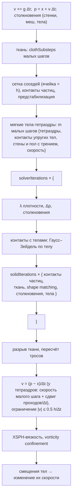
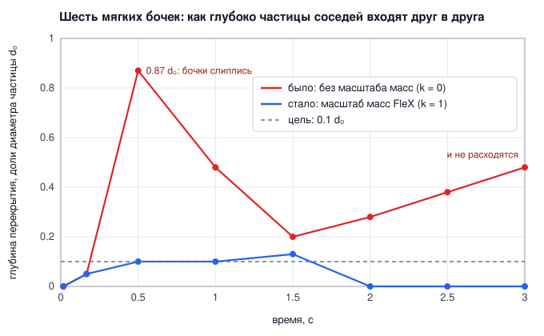

# 3. Частицы: жидкость, мягкие тела, ткань

[← Твёрдые тела](02-rigid-bodies.md) · [Оглавление](README.md) · [Газ →](04-gas-navier-stokes.md)

**Что это и зачем.** `src/particles/` — **единый решатель частиц** в духе NVIDIA FleX (Macklin, Müller, Chentanez, Kim 2014). Все частицы живут в одной сетке соседей и одном цикле ограничений. У каждой частицы есть **фаза**:

| Фаза | Модель | Файл |
|---|---|---|
| `Fluid` — жидкость | Position Based Fluids (Macklin & Müller 2013), разновидность SPH | [ParticleSystem.cpp](../src/particles/ParticleSystem.cpp) |
| `Soft` — мягкое тело | тетраэдры stable Neo-Hookean, XPBD малыми шагами (Macklin & Müller 2021); для сравнения — shape matching на кластерах (Müller et al. 2005) | [SoftTets.cpp](../src/particles/SoftTets.cpp), [ParticleSoftBodies.cpp](../src/particles/ParticleSoftBodies.cpp), [SoftBody.cpp](../src/particles/SoftBody.cpp) |
| `Cloth` — ткань | XPBD-ограничения нитей, сдвига, изгиба; разрыв и горение | [Cloth.cpp](../src/particles/Cloth.cpp) |

Частицы разных фаз сталкиваются между собой; жидкость давит на твёрдые частицы (плавучесть мягких тел); твёрдые тела из гл. 2 связаны с частицами двусторонне.

Минимальный пример:

```cpp
rf::ParticleSystem ps;
rf::RigidWorld world;                                   // тела, с которыми связаны частицы
ps.setRigidWorld(&world);
ps.reset(rf::AABB({-1, 0, -0.4f}, {1, 1.2f, 0.4f}));    // домен = стенки бака
ps.addBlock(rf::AABB({-1, 0, -0.4f}, {-0.4f, 0.7f, 0.4f}));   // столб воды
const float dt = 1.0f / 60 / ps.params.substeps;
for (int s = 0; s < ps.params.substeps; ++s) { world.step(dt); ps.step(dt); }
```

---

## Откуда уравнения

Коротко, по шести частям. Вывод целиком в главах [11.4](11-action.md#114-ткань-и-мягкие-тела) и [11.5](11-action.md#115-жидкость-частицами-pbf).

### Действие

Частицы с массами $m_i$ и потенциальная энергия. Для ткани это упругие нити $\tfrac12 k_j C_j^2$ с податливостью $\alpha_j = 1/k_j$. Для мягкого тела — упругая энергия stable Neo-Hookean по тетраэдрам (раздел 3.6). Для жидкости это лагранжиан SPH с плотностью по ядру, $\rho_i = \sum_j m_j W_{ij}$, а в несжимаемом пределе связь $C_i = \rho_i/\rho_0 - 1 = 0$ с множителем на частицу.

$$
S = \int\Big(\sum_i \tfrac12 m_i|\dot{\mathbf x}_i|^2 - U(\mathbf x) - \sum_i m_i g\,y_i\Big)\,dt .
$$

### Уравнения

$m_i\ddot{\mathbf x}_i = -\nabla_i U + m_i\mathbf g$. Сила SPH симметрична по паре частиц, поэтому импульс и момент импульса сохраняются по Нётер: действие не меняется при сдвиге и повороте всех частиц. Давление жидкости есть множитель связи плотности.

### Дискретизация

Шаг неявного Эйлера точно равен минимуму «инерция плюс потенциал», $\arg\min_{\mathbf x}\tfrac12\|\mathbf x - \tilde{\mathbf x}\|_M^2 + h^2U(\mathbf x)$ (Gast et al. 2015). Это дискретное действие шага. XPBD решает его условия минимума с множителями, $\tilde\alpha = \alpha/h^2$, и натяжение нити равно $\lambda/h^2$. Неявный Эйлер не симплектичен: ткань затухает сама. Искусственное давление, XSPH и удержание вихрей в действие не входят.

### Код

Связь XPBD: [Cloth.cpp:200](../src/particles/Cloth.cpp#L200). Мягкое тело: тетраэдр XPBD [SoftTets.cpp:243](../src/particles/SoftTets.cpp#L243), кластеры (для сравнения) [SoftBody.cpp:162](../src/particles/SoftBody.cpp#L162). Множители плотности: [DensitySolver.cpp:81](../src/particles/DensitySolver.cpp#L81). Симметричная поправка: [DensitySolver.cpp:125](../src/particles/DensitySolver.cpp#L125).

### Графики

Графиков баланса энергии для частиц пока нет. Следующие: энергия качающегося полотна при трёх шагах и энергия плещущейся воды в закрытом ящике.

### Границы

Численное затухание неявного Эйлера и вклад XSPH и удержания вихрей в энергию не измерены. Разрыв нити есть событие вне действия. Масштаб масс в стопке мягких тел (FleX, раздел 5.2) тоже вне действия: контакт частиц на разной высоте сохраняет импульс только приближённо (раздел 3.7). Мягкие тела-тетраэдры: неявный Эйлер XPBD и неупругий контакт теряют энергию, её рост не наблюдался (раздел 3.6). Распутывание тел, вошедших друг в друга (раздел 3.4), исправляет начальное положение вне действия: скорости оно не трогает, но поднятое из перекрытия тело получает потенциальную энергию $m g \cdot$ перекрытие. Ошибка плотности PBF до 1 %.

---

## 3.1 Шаг решателя

`ParticleSystem::step` ([ParticleSystem.cpp:315](../src/particles/ParticleSystem.cpp#L315)) — схема Position Based Dynamics: предсказать положения, проецировать ограничения, получить скорости из смещений.



### Подшаги в кадре: твёрдые тела и частицы

Твёрдым телам и частицам нужно разное число подшагов на кадр: $n_r$ = `rigid.params.substeps` и $n_p$ = `particles.params.substeps`. `Simulation::stepBodiesAndParticles` чередует их так, чтобы длина шага каждого решателя не зависела от другого:

$$
h_r = \frac{\Delta t_{frame}}{n_r}, \qquad h_p = \frac{\Delta t_{frame}}{n_p}, \qquad
r_{end}(p) = \left\lfloor \frac{(p+1)\,n_r}{n_p} \right\rfloor .
$$

Перед шагом частиц $p$ выполняются все шаги тел, которые заканчиваются внутри него. Когда шаг частиц начинается, тела уже стоят там, где будут к его концу. При $n_r = 10$, $n_p = 3$ получаются группы 3, 3, 4.

[src/scene/Coupling.cpp:182](../src/scene/Coupling.cpp#L182)
```cpp
    const int nr = std::max(1, rigid.params.substeps), np = std::max(1, particles.params.substeps);
    const float hr = frameDt / float(nr), hp = frameDt / float(np);
    int r = 0;
    for (int p = 0; p < np; ++p) {
        const int rEnd = (p + 1) * nr / np; // rigid steps done by the end of this particle step
        for (; r < rEnd; ++r) rigid.step(hr);
        if (gasDrag) {
            Probe::Timer timer("scene/coupling ms");
            applyGasDragOnCloth(hp);
            applyGasDragOnLiquid(hp);
        }
        particles.step(hp);
    }
```


Раньше на каждый шаг частиц приходилось $\lfloor n_r/n_p\rfloor$ шагов тел: при 10 и 3 — 9 шагов по 1/9 кадра вместо 10 по 1/10. Длина шага тел зависела от того, есть ли в сцене частицы, и одна и та же стопка вела себя по-разному. Теперь тела шагают одинаково в любом режиме. Шаги частиц в сцене без частиц почти ничего не стоят: работает только эмиттер.

---

## 3.2 Position Based Fluids

### Ядра

Радиус частицы $r$, расстояние между частицами в покое $2r$, радиус ядра $h = 4r$ ([ParticleSystem.cpp:18](../src/particles/ParticleSystem.cpp#L18)). Для плотности — ядро **poly6**, для градиентов — **spiky** (у poly6 градиент исчезает в нуле, и частицы слипались бы):

$$
W_{poly6}(\mathbf r) = \frac{315}{64\pi h^9}\,(h^2 - |\mathbf r|^2)^3, \qquad
\nabla W_{spiky}(\mathbf r) = -\frac{45}{\pi h^6}\,(h - |\mathbf r|)^2\,\frac{\mathbf r}{|\mathbf r|}, \qquad |\mathbf r| < h.
$$

[src/particles/ParticleSystem.h:265](../src/particles/ParticleSystem.h#L265)
```cpp
inline float W(float r2) const {
    if (r2 >= h2_) return 0.0f;
    float d = h2_ - r2;
    return poly6_ * d * d * d;
}
inline Vector3 gradW(const Vector3& r) const {
    float l2 = length2(r);
    if (l2 >= h2_ || l2 < 1e-20f) return Vector3(0.0f);
    float l = std::sqrt(l2);
    float d = h_ - l;
    return r * (spikyGrad_ * d * d / l);
}
```

Масса частицы **калибруется**, а не берётся как $\rho_0(2r)^3$: сумма ядра по полной решётке $7^3$ соседей с шагом $2r$ должна дать ровно $\rho_0$ ([ParticleSystem.cpp:24](../src/particles/ParticleSystem.cpp#L24)). Иначе жидкость в покое была бы сжата или растянута на ошибку дискретизации ядра.

### Ограничение плотности

Для каждой частицы жидкости — ограничение

$$
C_i = \max\!\left(\frac{\rho_i}{\rho_0} - 1,\ 0\right), \qquad
\rho_i = \sum_j m\,V_j\,W(\mathbf p_i - \mathbf p_j) + \rho_0\,\Phi_{wall}(\mathbf p_i).
$$

- **Одностороннее** ($\max(\cdot, 0)$): жидкость не сжимается, но может разрежаться. Без этого у свободной поверхности частицы слипаются в сгустки — ограничение тянуло бы их друг к другу.
- $V_j$ = `volume_` — объём частицы относительно частицы жидкости (листы ткани тоньше).
- В сумму входят **и твёрдые частицы**: жидкость выталкивается из них, а они получают обратно её давление (плавучесть).
- $\Phi_{wall}$ — часть ядра за стенками домена, раздел 3.3.

Множитель Лагранжа (одна итерация Ньютона по $C_i$):

$$
\lambda_i = -\frac{C_i}{\displaystyle\sum_{j \ne i} \frac{w_j}{w_0}\left|\nabla_{\mathbf p_j} C_i\right|^2 + \left|\nabla_{\mathbf p_i} C_i\right|^2 + \varepsilon}, \qquad
\nabla_{\mathbf p_j}C_i = -\frac{m_j}{\rho_0}\nabla W_{ij}, \quad
\nabla_{\mathbf p_i}C_i = \sum_j \frac{m_j}{\rho_0}\nabla W_{ij} + \nabla\Phi_{wall}.
$$

$\varepsilon$ = `relaxation`$/h^2$ — регуляризация (constraint force mixing), которая не даёт делить на ноль у одиноких частиц.

**Обобщённые массы** (Macklin et al. 2014, *Unified Particle Physics*). $w_j$ — обратная масса соседа, $w_0 = 1/m$ — обратная масса частицы жидкости. Поправка положения сдвигает соседа пропорционально $w_j/w_0$ (`computeDeltaP`), поэтому в знаменателе шага Ньютона он весит столько же. Лёгкая ткань ($w_j/w_0 \approx 100$) не отлетает в 100 раз дальше, чем нужно ограничению. Закреплённая частица ($w_j = 0$) не двигается и в сумму не входит. В коде это множитель `invMass_[nb[k]] * mass_` в строке `sum2 += …` ниже.

[src/particles/DensitySolver.cpp:33](../src/particles/DensitySolver.cpp#L33)
```cpp
const Vector3 pi = p_[i];
float rho = mass_ * W(0);
Vector3 gi(0.0f);
float sum2 = 0;
const int* nb = &nbr_[size_t(i) * kMaxNeighbors];
for (int k = 0; k < nbrCount_[i]; ++k) {
    // Solid particles count too: they occupy the same volume as a fluid particle, so
    // the liquid is pushed out of them - and pushes back on them (buoyancy).
    Vector3 r = pi - p_[nb[k]];
    const float mj = mass_ * volume_[nb[k]];
    rho += mj * W(length2(r));
    Vector3 g = gradW(r) * (mj * invRho0);
    // Generalized masses (Macklin et al. 2014): a neighbour moves by its inverse mass
    // relative to a fluid particle's (computeDeltaP), so it weighs that much here - a
    // light cloth is not pushed 100x further than the constraint needs, a pinned one
    // not at all.
    sum2 += length2(g) * (invMass_[nb[k]] * mass_);
    gi += g;
}
Vector3 gWall;
rho += params.restDensity * wallVolume(pi, gWall); // the walls as liquid at rest
gi += gWall;
rho_[i] = rho;
float C = std::max(rho * invRho0 - 1.0f, 0.0f);
err += C;
lambda_[i] = -C / (sum2 + length2(gi) + eps);
```

### Поправка положения и искусственное давление

> **Размерность.** У Macklin & Müller $\lambda$ безразмерна ($h = 1$), у нас $\lambda = -C/(\sum|\nabla C|^2+\varepsilon)$ имеет размерность $h^2$ (градиенты $\sim 1/h$). Поэтому $s_{corr} = -k\,h^2\,(W(r)/W(\Delta q))^4$: с одним и тем же безразмерным $k$ (по умолчанию 0.03; у Маклина 0.1) поправка одинаково слаба для крупных и мелких частиц. С $k$ в абсолютных единицах столб 5-мм частиц в покое раздувался на 80 % — нашёл тест дам-брейка.

$$
\Delta\mathbf p_i = \frac{m}{\rho_0}\sum_j \big(\lambda_i + \lambda_j + s_{corr}\big)\,\nabla W_{ij} + \lambda_i\,\nabla\Phi_{wall},
\qquad
s_{corr} = -k\left(\frac{W(\mathbf p_i - \mathbf p_j)}{W(\Delta q)}\right)^4, \quad |\Delta q| = 0.2h .
$$

$s_{corr}$ (`tensileK` = $k$ = 0.03, умножается на $h^2$: у Macklin & Müller $\lambda$ безразмерна, у нас в единицах $h^2$) — искусственное давление: слабое отталкивание на малых расстояниях против кластеризации частиц при отрицательном давлении; заодно даёт эффект поверхностного натяжения.

Твёрдая частица получает долю поправок давления соседей-жидкостей, масштабированную её обратной массой ([DensitySolver.cpp:180](../src/particles/DensitySolver.cpp#L180)): так вода двусторонне давит на мягкие тела и ткань.

### Вязкость XSPH и vorticity confinement

После получения скоростей ([DensitySolver.cpp:162](../src/particles/DensitySolver.cpp#L162)):

$$
\mathbf v_i \leftarrow \mathbf v_i + c\sum_j V_j\,(\mathbf v_j - \mathbf v_i)\,W_{ij}
\qquad (c = \texttt{viscosity}),
$$

$$
\boldsymbol\omega_i = \sum_j V_j\,\nabla W_{ij}\times(\mathbf v_j - \mathbf v_i), \quad
\boldsymbol\eta_i = \sum_j V_j\,(|\boldsymbol\omega_j| - |\boldsymbol\omega_i|)\,\nabla W_{ij}, \quad
\mathbf v_i \leftarrow \mathbf v_i + \epsilon\,\Delta t\ \frac{\boldsymbol\eta_i}{|\boldsymbol\eta_i|}\times\boldsymbol\omega_i .
$$

Confinement возвращает мелкие вихри, которые численная диссипация PBD размазывает. Скорость ограничена $0.5h/\Delta t$: частица не проскакивает больше половины ядра за шаг.

---

## 3.3 Стенки в плотности (Koschier & Bender 2017)

**Проблема.** Частица у стенки видит только половину своего ядра — за стенкой соседей нет. Её плотность занижена, ограничение (одностороннее!) не работает, и жидкость у стенки сбивается в плотные слои. В углу бака частицы выстраивались вдоль ребра и выбрасывались струёй вдоль угла. До исправления максимальная плотность в углах достигала **10 279 кг/м³** — в 10 раз больше плотности воды.

**Решение** (Koschier & Bender 2017, *Density Maps for Improved SPH Boundary Handling*): часть ядра за стенкой считается **жидкостью в покое**. Для плоской стенки на расстоянии $d$ эта часть — объём ядра poly6 за плоскостью. Если нарезать полупространство $z > d$ дисками, интеграл по диску радиуса $\sqrt{h^2 - z^2}$ берётся точно:

$$
\int_0^{\sqrt{h^2-z^2}} k\,(h^2 - z^2 - \rho^2)^3\,2\pi\rho\,d\rho = \frac{\pi k}{4}\,(h^2 - z^2)^4,
$$

откуда замкнутая формула ($k = 315/(64\pi h^9)$ — константа poly6)

$$
\Phi(d) = \frac{\pi k}{4}\int_d^h (h^2 - z^2)^4\,dz, \qquad
\Phi(0) = \frac{315}{256}\cdot\frac{128}{315} = \frac12, \qquad
\Phi'(d) = -\frac{\pi k}{4}(h^2 - d^2)^4 .
$$

Первообразная $(h^2 - z^2)^4$ — многочлен $F(z) = z\big(h^8 - \tfrac43 h^6 z^2 + \tfrac65 h^4 z^4 - \tfrac47 h^2 z^6 + \tfrac19 z^8\big)$, поэтому ничего не табулируется:

[src/particles/DensitySolver.cpp:59](../src/particles/DensitySolver.cpp#L59)
```cpp
float ParticleSystem::wallVolume(const Vector3& p, Vector3& gradient) const {
    const float h = h_, h2 = h2_;
    const float c = 0.25f * kPi * poly6_;
    auto F = [&](float z) { // antiderivative of (h^2 - z^2)^4
        const float z2 = z * z;
        return z * (h2 * h2 * h2 * h2 + z2 * (-4.0f / 3.0f * h2 * h2 * h2 + z2 * (1.2f * h2 * h2 + z2 * (-4.0f / 7.0f * h2 + z2 / 9.0f))));
    };
    const float Fh = F(h);
    float phi = 0;
    gradient = Vector3(0.0f);
    for (int a = 0; a < 3; ++a)
        for (int side = 0; side < 2; ++side) {
            const float d = side == 0 ? p[a] - domain_.lo[a] : domain_.hi[a] - p[a];
            if (d >= h) continue;
            const float dc = std::max(d, 0.0f);
            const float q = h2 - dc * dc;
            phi += c * (Fh - F(dc));
            gradient[a] += (side == 0 ? -1.0f : 1.0f) * c * q * q * q * q; // Phi'(d) dd/dp
        }
    return phi;
}
```

Стенка входит и в плотность ($+\rho_0\Phi$), и в градиент ограничения, и в поправку $\lambda_i\nabla\Phi$ — стенка толкает **вдоль своей нормали**. В углу вклады стенок складываются.


---

## 3.4 Столкновения частиц

`collide(i, p, start, record, dt)` ([ParticleContacts.cpp:497](../src/particles/ParticleContacts.cpp#L497); `start` — положение в начале шага, от которого меряется проскальзывание для трения):

1. **Стенки домена** — отсечение положения в бокс, уменьшенный на $r$.
2. **Статический меш** — ближайшая точка через `MeshBVH` (гл. 1.7); если знаковое расстояние $< r$, частица выталкивается вдоль псевдонормали, касательное смещение гасится на долю `wallFriction`.
3. **Твёрдые тела** — через `RigidBody::signedDistance`. Для закреплённых тел частица просто выталкивается. Для подвижных тел контакт **только записывается** (нормаль, глубина, точка) и решается вместе с телом в `solveBodyContacts` (раздел 3.5).

### Частица о частицу: касание и пересечение

Частицы разных фаз (ткань–мягкое тело, мягкое–мягкое), частицы разных мягких тел и несоседние частицы одной ткани держат расстояние $d_0 = 2r$. Метод — NVIDIA FleX: Macklin, Müller, Chentanez, Kim 2014, *Unified Particle Physics for Real-Time Applications*, ACM TOG 33(4), разделы 4.4, 5.1 и 5.2.

**Что было.** Нашёл пользователь: мягкие тела, вошедшие друг в друга, разлетались. Тест `scene graph: soft bodies inside each other are pushed apart, not thrown` меряет два случая. Два желе в невесомости, на треть друг в друге, разлетались со скоростью 0.36 м/с. Желе, начатое на 10 см внутри лежащего на полу, взлетало на 0.31 м, и энергия частиц росла на 25.8 Дж при допуске 4.0 Дж; в первой версии — на 2.6 м и 272 Дж. Причин две:

1. Решатель на положениях превращает каждый метр, на который он раздвигает пару, в скорость $1/\Delta t$ (FleX, раздел 4.4, рис. 4: частица, начатая в полу, «выстреливает» из него).
2. Решётки двух тел, вошедших друг в друга, сцепляются (FleX, рис. 6). Линия между центрами соседних частиц смотрит куда угодно, толчки гасят друг друга, форма тела снова вдавливает его в соседа, а масштаб масс стопки (раздел 3.7) каждый шаг поднимает верхнее тело.

Выключить масштаб масс нельзя: возвращается прежняя беда, шесть бочек проседают друг в друга на 0.92 $d_0$.

**Действие.** Касание двух частиц — односторонняя связь «твёрдые шары» с множителем $\lambda_{ij}$ в действии $S$ главы:

$$
C_{ij}(\mathbf x) = |\mathbf x_i - \mathbf x_j| - d_0 \ge 0, \qquad \lambda_{ij} \ge 0, \qquad \lambda_{ij}\,C_{ij} = 0 .
$$

Сила связи идёт по нормали и работы не совершает: пока касание держится, $\dot C_{ij} = 0$. Состояние с $C_{ij} < 0$ лежит вне конфигурационного пространства действия. Это ошибка начальных условий (тела созданы друг в друге, вдавлены мышью, прошли друг в друга за шаг), а не физика. Вернуть его в $C \ge 0$ нужно, **не меняя скоростей**, иначе энергия берётся ниоткуда.

**Уравнения.** $m_i\ddot{\mathbf x}_i = \mathbf f_i + \sum_j \lambda_{ij}\nabla_i C_{ij}$. PBD решает связь проекцией (FleX, уравнения 18–19; здесь $\mathbf n$ — направление, куда движется частица $i$):

$$
\Delta\mathbf x_i = +\frac{w_i}{w_i + w_j}\,t\,\mathbf n, \qquad
\Delta\mathbf x_j = -\frac{w_j}{w_i + w_j}\,t\,\mathbf n, \qquad w = 1/m .
$$

Пара раздвигается вдоль $\mathbf n$, пока шары не разойдутся на $d_0$: $|\mathbf r + t\,\mathbf n| = d_0$ при $\mathbf r = \mathbf x_i - \mathbf x_j$, откуда

$$
t = \sqrt{d_0^2 - s^2} - a, \qquad a = \mathbf r\cdot\mathbf n, \qquad s^2 = |\mathbf r|^2 - a^2 .
$$

Вдоль линии центров это привычное $d_0 - |\mathbf r|$; паре бок о бок нужно меньше, паре, прошедшей мимо друг друга вдоль $\mathbf n$, — больше.

**Дискретизация.** За подшаг три шага.

1. **Пары** (`findParticleContacts`): все пары ближе $1.5\,d_0$ в предсказанных положениях.
2. **Пересечения** (`preStabilizeContacts`, предстабилизация FleX, раздел 4.4, алгоритм 1, строки 10–15). Пара тел (или тело и частица ткани, жидкости) **пересекается**, если в начале шага хоть одна пара их частиц перекрыта глубже $d_0/4$ — или если предстабилизация прошлого шага ещё не развела их до конца. Всё остальное — **касание**. Пересечение распутывается до основного решателя, в начальных положениях $\mathbf x$, и предсказанные $\mathbf p$ сдвигаются так же: скорость $(\mathbf p - \mathbf x)/\Delta t$ его не видит.
   - *Кто движется.* Мягкое тело — целиком, одним сдвигом всех частиц. Если толкать отдельные частицы, как FleX, у мягкого тела останется вмятина: она спружинит обратно в соседа, и перекрытие всё-таки станет скоростью (у FleX тела твёрдые, и вмятину стирает следующее сопоставление формы). Частица ткани или жидкости движется одна.
   - *Куда.* По знаковому полю расстояний тел (FleX, раздел 5.1). Каждая частица мягкого тела хранит глубину $|\phi|$ под поверхностью своего тела в покое и направление наружу $\nabla\phi$, повёрнутое вращениями её кластеров. Решает частица, что ближе к своей поверхности (уравнение 17): другая выталкивается из её тела по её нормали, а сама она уходит вглубь. В поверхностном слое ($|\phi| < d_0$) берётся линия центров $\hat{\mathbf x}_{ij}$, отражённая, если она гонит соседа внутрь тела (уравнение 20, Müller & Chentanez 2011): частица поверхности — односторонний шар.

   $$
   \mathbf n_{ij} = \begin{cases} -\nabla\phi_i, & |\phi_i| < |\phi_j| \\ +\nabla\phi_j, & \text{иначе} \end{cases}
   \qquad
   \mathbf n^*_{ij} = \begin{cases} \hat{\mathbf x}_{ij} - 2(\hat{\mathbf x}_{ij}\cdot\mathbf n_{ij})\,\mathbf n_{ij}, & \hat{\mathbf x}_{ij}\cdot\mathbf n_{ij} < 0 \\ \hat{\mathbf x}_{ij}, & \text{иначе} \end{cases}
   $$

   - *Как.* Проходы Якоби с усреднением (FleX, уравнение 12): каждая перекрытая пара просит раздвинуть её на $t$, и каждое тело сдвигается на **среднее** того, что просили его пары. Толчки, которые спорят (боковые грани двух кубов друг в друге), гасятся, а не бросают тело. После каждого прохода сдвинутое тело выталкивается из стенок, препятствия и закреплённых тел на глубину своей самой глубокой частицы: лежащее на полу тело не вдавливается в пол. До 8 проходов за подшаг.
3. **Основной решатель** (`solveParticleContacts`, в каждом проходе твёрдых связей, Гаусс–Зейдель): каждая пара — два твёрдых шара вдоль линии центров, зафиксированной в начале шага (пара не может поменяться сторонами внутри шага, даже если ткань отпружинит или тяжёлое тело продавит частицу). Цель — $d_0$. Для ещё не распутанного пересечения цель — расстояние, с которого пара начала шаг: «не глубже», и ни метра раздвижки со скоростью. Обратные массы масштабируются по высоте (раздел 3.7).

**Почему четверть $d_0$ и почему память.** В столбе под нагрузкой основной решатель оставляет пары перекрытыми до ~0.2 $d_0$ (шесть бочек: 0.21 $d_0$ в худший момент). Это касание: если поднимать из него бочку целиком, она двигается каждый шаг, и вбок тоже, куда наклонены пары, — столб падал за четверть секунды. А отпустить пересечение на глубине $d_0/4$ нельзя: остаток раздвинет основной решатель, со скоростью (0.08 м/с у двух жёстких желе). Поэтому пересечение держится, пока предстабилизация не разведёт тела до конца. Разведённые тела, которые снова давят друг на друга (верхнее желе легло на нижнее), — уже касание.

**Код.** Сколько раздвинуть пару вдоль $\mathbf n$:

[src/particles/ParticleContacts.cpp:39](../src/particles/ParticleContacts.cpp#L39)
```cpp
static float pushAlong(const Vector3& r, const Vector3& n, float target) {
    const float r2 = length2(r);
    if (r2 >= target * target) return 0.0f;
    const float along = dot(r, n);
    const float across2 = std::max(0.0f, r2 - along * along);
    return std::sqrt(target * target - across2) - along;
}
```

Нормаль пересечения, уравнения 17 и 20:

[src/particles/ParticleContacts.cpp:244](../src/particles/ParticleContacts.cpp#L244)
```cpp
Vector3 ParticleSystem::intersectionNormal(int i, int j) const {
    const Vector3 centres = x_[i] - x_[j];
    const Vector3 line = length2(centres) > 1e-12f ? normalize(centres) : Vector3(0.0f);
    if (!hasSurface(i) || !hasSurface(j)) return line;
    const bool iDecides = surfaceDepth_[i] < surfaceDepth_[j];
    const int k = iDecides ? i : j;
    const Vector3 way = iDecides ? -surfaceNormal_[k] : surfaceNormal_[k]; // as i moves: k into its body, or out of it
    if (surfaceDepth_[k] >= spacing() || length2(line) == 0) return way;
    const float against = dot(line, way);
    return against >= 0 ? line : line - way * (2.0f * against); // mirrored into the free side
}
```

Проход Якоби: пары просят, тела сдвигаются на среднее:

[src/particles/ParticleContacts.cpp:262](../src/particles/ParticleContacts.cpp#L262)
```cpp
bool ParticleSystem::pushMoversApart() {
    const float d0 = spacing(), tolerance = kOverlapTolerance * d0;
    std::fill(moverMove_.begin(), moverMove_.end(), Vector3(0.0f));
    std::fill(moverAsks_.begin(), moverAsks_.end(), 0);
    for (const ParticleContact& c : contacts_) {
        if (!c.intersecting) continue;
        const int a = moverOf_[c.i], b = moverOf_[c.j];
        const Vector3 r = (x_[c.i] + moverShift_[a]) - (x_[c.j] + moverShift_[b]);
        const float depth = pushAlong(r, c.normal, d0);
        const float wa = moverInvMass_[a] * c.lift, wb = moverInvMass_[b] / c.lift;
        if (depth <= tolerance || wa + wb == 0) continue; // apart, or two held bodies
        const Vector3 corr = c.normal * (depth / (wa + wb));
        moverMove_[a] += corr * wa;
        moverMove_[b] -= corr * wb;
        ++moverAsks_[a];
        ++moverAsks_[b];
    }
```

Цель основного решателя — $d_0$, для пересечения — «не глубже»:

[src/particles/ParticleContacts.cpp:361](../src/particles/ParticleContacts.cpp#L361)
```cpp
void ParticleSystem::setMainSolveTargets() {
    const float d0 = spacing(), touching = (1.0f - kOverlapTolerance) * d0;
    for (ParticleContact& c : contacts_) {
        Vector3 centres = x_[c.i] - x_[c.j];
        if (length2(centres) < 1e-12f) centres = p_[c.i] - p_[c.j];
        const float apart = length(centres);
        c.normal = apart > 1e-6f ? centres / apart : Vector3(0.0f);
        c.target = c.intersecting && apart < touching ? apart : d0;
    }
}
```

Знаковое поле тела строится один раз, в `addSoftBody`. Глубина — от ближайшей точки меша. Градиент — центральная разность знакового расстояния на радиус частицы в каждую сторону, а не нормаль ближайшего треугольника: на ребре и в углу ближайшей может быть любая из двух-трёх граней, а разность наклоняется между ними (диагональные стрелки на рис. 7 FleX). Частица на ободе грани должна смотреть «вверх и наружу».

[src/particles/ParticleSoftBodies.cpp:144](../src/particles/ParticleSoftBodies.cpp#L144)
```cpp
void ParticleSystem::measureSurface(const MeshBVH& bvh, const Vector3& p, float& depth, Vector3& normal) const {
    ClosestHit nearest;
    bvh.closestPoint(p, kInf, nearest);
    depth = std::max(0.0f, -nearest.signedDistance);
    const float h = params.particleRadius;
    auto slope = [&](const Vector3& e) { return bvh.signedDistance(p + e * h, kInf) - bvh.signedDistance(p - e * h, kInf); };
    const Vector3 gradient(slope(Vector3(1, 0, 0)), slope(Vector3(0, 1, 0)), slope(Vector3(0, 0, 1)));
    normal = length2(gradient) > 1e-6f * h * h ? normalize(gradient) : normalize(nearest.normal);
}
```

Нормаль поворачивается с телом — вращениями кластеров частицы из последнего сопоставления формы, усреднёнными: $\nabla\phi = \operatorname{normalize}\big(\sum_c \mathbf R_c\,\nabla\phi^0\big)$ ([SoftBody.cpp:146](../src/particles/SoftBody.cpp#L146)).

**Числа.** Оба теста до и после, в тех же сценах:

| | было | стало |
|---|---|---|
| два желе в невесомости, на треть друг в друге: быстрейший центр за 2 с | 0.362 м/с | **0.0000 м/с** |
| желе на 10 см внутри лежащего на полу: подъём (перекрытие 0.100 м) | 0.307 м | **0.098 м** |
| рост энергии частиц (допуск $m g \cdot 0.1$ м = 3.97 Дж) | +25.8 Дж | **+3.93 Дж** |
| шесть бочек: перекрытие соседей, пока столб стоит | 0.33 $d_0$ | **0.11 $d_0$** |
| то же при падении и ударах | 0.66 $d_0$ | **0.21 $d_0$** |
| торцы: частицы / кожи заходят друг за друга | 2.36 / 2.29 $d_0$ | 0.69 / 0.40 $d_0$ |
| пар глубже $0.05\,d_0$ через 2.5 с | 0 | 0 |
| самый высокий подъём бочки | 61 мм | 7 мм |
| бочки: мс на кадр (10 потоков) | 94 | 57 |

Бочки меньше заходят друг в друга, пар-кандидатов вдвое меньше (1289 против 2871 за подшаг), и шаг быстрее. Без пересечений предстабилизация стоит один проход по парам; сколько пар пересекается в подшаге, пишет канал `particles/intersecting pairs`.

Та же куча (желе на 10 см в другом на полу) при разной жёсткости и числе проходов, 2 с (`soft_flight`): подъём и рост энергии против допусков «перекрытие + 1 см» и $m g \cdot$ перекрытие. Невесомые пары — быстрейший центр.

| жёсткость, `solidIterations` | 0.05, 2 | 0.05, 8 | 0.3, 2 | 0.3, 8 | 1, 2 | 1, 8 |
|---|---|---|---|---|---|---|
| было: подъём, м / энергия, Дж | 0.036 / 3.45 | 0.051 / 4.65 | 0.302 / 25.4 | 0.409 / 36.9 | 2.49 / 309 | 2.48 / 323 |
| стало: подъём, м / энергия, Дж | 0.098 / 3.93 | 0.098 / 3.93 | 0.098 / 3.93 | 0.098 / 3.93 | 0.098 / 3.92 | 0.100 / 3.95 |
| допуск | 0.110 / 3.97 | 0.110 / 3.97 | 0.110 / 3.97 | 0.110 / 3.97 | 0.110 / 3.97 | 0.110 / 3.97 |
| невесомость, было / стало, м/с | 0.124 / 0.0000 | — | 0.339 / 0.0000 | — | 1.297 / 0.0008 | — |

Подъём на 0.098 м — это и есть перекрытие: верхнее желе поднято из нижнего, нижнее лежит на полу. Рост энергии — потенциальная энергия этого подъёма, кинетической почти нет.

**Проверено и отвергнуто.**

1. *Знаковое поле и в основном решателе, как у FleX.* На ободе бочки, сжатой грузом, нормаль поверхности смотрит вбок, и односторонний шар уравнения 20 превращает опору бочки сверху в боковой толчок. Столб падал за 0.25 с (2 проверки вместо 5), пары входили друг в друга до 0.88 $d_0$.
2. *Предстабилизировать каждое перекрытие и держать каждое «не глубже».* Одинокая вмятина на ободе нагруженной бочки тонет в среднем по телу, а основной решатель её только держит. Она росла на ~0.03 $d_0$ за подшаг, до 0.88 $d_0$.
3. *Толкать отдельные частицы мягкого тела (предстабилизация FleX как есть).* Вмятины пружинят обратно: 0.36 м/с в невесомости.
4. *Отпускать пересечение на глубине $d_0/4$, без памяти.* Остаток раздвигал основной решатель: 0.08 м/с у двух жёстких желе.
5. *Прежние опыты:* масштаб масс «только пока верхняя частица не уходит вверх» и «свежее касание — не ближе 0.9 $d_0$ в начале шага». Убраны: первое не нужно, раз пересечения не доходят до основного решателя; второе заменено делением на касание и пересечение.

> **Ограничения.**
> 1. **Энергия распутывания.** Верхнее тело поднимается из нижнего на глубину перекрытия, и потенциальная энергия растёт на $m g \cdot$ перекрытие (3.93 Дж в тесте). Это исправление начального положения вне действия, а не кинетическая энергия.
> 2. **Поле формы покоя.** Знаковое поле поворачивается с кластерами, но не сжимается: у сплющенного тела глубины частиц — те, что в покое.
> 3. **Трения между частицами нет.** Желе на желе соскальзывает за 2 с (и в прежней версии тоже): у сжатого нижнего желе верх выпуклый.
> 4. **Касание и масштаб масс.** Касания в основном решателе — два шара вдоль линии центров, со всеми известными артефактами решётки частиц (торцы бочек заходят друг за друга на 0.69 $d_0$). Масштаб масс сохраняет импульс только как опора (раздел 3.7).
> 5. **Ограничение всех позиционных решателей (FleX тоже):** при большом отношении масс соприкасающихся частиц (тяжёлое тело на очень лёгкой ткани, больше ~1:10) лёгкая сторона забирает почти всю коррекцию, опора сходится медленно. Используйте реалистичные материалы (холст 1–2 кг/м² под поролоном) или больше `solidIterations`.

---

## 3.5 Двусторонняя связь с твёрдыми телами: XPBD-контакты

### Что было не так

Первая версия считала контакт частицы с телом так, будто **тело бесконечно тяжёлое**: частица выталкивалась целиком, а её реакция $m_p\Delta\mathbf p/\Delta t$ прикладывалась к телу как импульс. Для тяжёлого тела это почти верно. Но пляжный мяч (80 кг/м³, $r = 8$ см, масса 0.17 кг — как 12 частиц воды) в волне касается сотен частиц сразу. Каждая частица считала **полный** импульс, нужный для неподвижного тела, и эти импульсы **складывались**: мяч получал в сотни раз больше, чем вода могла ему передать. Итог: **155 м/с и 9000 рад/с**.

Попытка усреднять импульсы (Якоби: делить на число контактов) дала обратное: тело получало только среднее, и давление со всех сторон больше не складывалось в архимедову силу — мяч **тонул**.

### Как сейчас (Müller et al. 2020)

Каждый контакт делит коррекцию между частицей и телом по **обобщённым обратным массам** (XPBD для твёрдых тел, eq. 2–3):

$$
w_p = \frac{1}{m_p}, \qquad
w_b = \frac{1}{M} + (\mathbf r\times\mathbf n)^{\mathsf T}\,\mathbf I^{-1}\,(\mathbf r\times\mathbf n), \qquad
\lambda = \frac{d}{w_p + w_b},
$$

$$
\mathbf p \mathrel{+}= w_p\lambda\,\mathbf n, \qquad
\Delta\mathbf x_b \mathrel{-}= \frac{\lambda}{M}\,\mathbf n, \qquad
\Delta\boldsymbol\theta_b \mathrel{-}= \lambda\,\mathbf I^{-1}(\mathbf r\times\mathbf n).
$$

И главное — контакты одного тела решаются **по очереди** (Гаусс–Зейдель). Каждый следующий контакт видит тело, уже сдвинутое предыдущими: текущая глубина равна исходной минус то, насколько тело с тех пор ушло от частицы.

[src/particles/ParticleContacts.cpp:418](../src/particles/ParticleContacts.cpp#L418)
```cpp
for (size_t b = 0; b < bodies.size(); ++b) {
    if (contacts[b].empty()) continue;
    const RigidBody& body = bodies[b];
    const Vector3 shift0 = bodyShift_[b], turn0 = bodyTurn_[b]; // the pose the contacts were found at
    for (int i : contacts[b]) {
        const Vector3 n = contactNormal_[i], c = contactPoint_[i];
        const Vector3 rc = c - (body.pos + bodyShift_[b]);
        // Penetration now: what it was, minus how far the body has moved away from it since.
        const Vector3 moved = (bodyShift_[b] - shift0) + cross(bodyTurn_[b] - turn0, rc);
        const float depth = contactDepth_[i] + dot(moved, n);
        if (depth <= 0) continue;
        // Generalized inverse masses (Mueller et al. 2020, eq. 2-3): the particle, the body at c.
        const float wp = invMass_[i];
        const Vector3 rn = cross(rc, n);
        const float wb = body.invMass + dot(rn, body.applyInvInertiaWorld(rn));
        const float lambda = depth / (wp + wb); // [kg m]
        p_[i] += n * (lambda * wp);
        bodyShift_[b] -= n * (lambda * body.invMass);
        bodyTurn_[b] -= body.applyInvInertiaWorld(rn) * lambda;
```

Результат:

- лёгкое тело сдвигается **не дальше, чем его толкает вода** — сумма коррекций согласована;
- импульс сохраняется: частица и тело получают равные и противоположные $\lambda\mathbf n$;
- давление со всех сторон на плавающее тело оставляет **ровно его плавучесть** — архимедова сила возникает сама, без отдельной формулы.

Тело внутри подшага существует как «исходная поза + `bodyShift_` + малый поворот `bodyTurn_`», и частицы встречают его там, где оно сейчас. В конце подшага смещение превращается в изменение скорости тела `applyVelocityChange(shift/Δt, turn/Δt)`; двигает тело уже решатель гл. 2 на следующем шаге. Трение считается так же: касательное проскальзывание частицы относительно тела делится по $w_p, w_b$.


---

## 3.6 Мягкие тела: тетраэдры Neo-Hookean (XPBD, малые шаги)

Как в Houdini Vellum и в кодах МКЭ: мягкое тело — упругий **материал** с модулем Юнга $E$, коэффициентом Пуассона $\nu$, плотностью и трением, а частицы — узлы его тетраэдров. Это модель по умолчанию; shape matching (раздел 3.7) остался для сравнения (`SoftMaterial::model`, в файле сцены `model shape-matching`). Тело строит и ведёт малыми шагами [ParticleSoftBodies.cpp](../src/particles/ParticleSoftBodies.cpp), материал — [SoftTets.cpp](../src/particles/SoftTets.cpp). Все контакты раздела 3.4 (предстабилизация, знаковое поле, масштаб масс) работают как прежде: частицы те же.

### Действие

Узлы с массами $m_i$ (каждая частица — свой кубик решётки, $m_i = \rho s^3$), сила тяжести и упругая энергия с плотностью **stable Neo-Hookean** (Smith, de Goes, Kim 2018) в форме Macklin & Müller 2021:

$$
\Psi(\mathbf F) = \frac{\mu}{2}\big(\operatorname{tr}\mathbf F^{\mathsf T}\mathbf F - 3\big) + \frac{\lambda}{2}\big(\det\mathbf F - \gamma\big)^2,
\qquad \gamma = 1 + \frac{\mu}{\lambda},
\qquad S = \int\Big(\sum_i \tfrac12 m_i|\dot{\mathbf x}_i|^2 - \int\Psi\,dV - \sum_i m_i g\,y_i\Big)dt .
$$

$\mathbf F = \partial\mathbf x/\partial\mathbf X$ — градиент деформации. Сдвиг $\gamma$ делает форму покоя $\mathbf F = \mathbf I$ свободной от напряжений: $\partial\Psi/\partial\mathbf F = \mu\mathbf F + \lambda(\det\mathbf F - \gamma)\operatorname{cof}\mathbf F = \mu\mathbf I - \mu\mathbf I = 0$. Логарифма $\det\mathbf F$ нет, поэтому вывернутый тетраэдр ($\det\mathbf F < 0$) возвращается, а не взрывается.

Параметры Ламе из $E$ и $\nu$ (Ландау, Лифшиц, «Теория упругости», § 5): $\mu = E/(2(1+\nu))$, $\lambda = \lambda_{LE} + \mu$, $\lambda_{LE} = E\nu/((1+\nu)(1-2\nu))$, $\nu \in [0.05, 0.495]$. Почему $+\mu$: разложение $\Psi$ при малых деформациях — линейная упругость с $\mu$ и $\lambda - \mu$ (тот же сдвиг параметров у Smith et al. 2018, разд. 3.4). С одним $\lambda_{LE}$ консоль при $\nu = 0.3$ выходила на 10 % мягче теории.

### Уравнения

$m_i\ddot{\mathbf x}_i = -\partial U/\partial\mathbf x_i + m_i\mathbf g$, $U = \sum_{\text{тетр.}} V\,\Psi(\mathbf F)$, $\mathbf F = \mathbf D_s\mathbf D_m^{-1}$ ($\mathbf D_s$, $\mathbf D_m$ — рёбра тетраэдра сейчас и в покое). Энергия тетраэдра — два ограничения с податливостями:

$$
C_D = \sqrt{\operatorname{tr}\mathbf F^{\mathsf T}\mathbf F},\quad \alpha_D = \frac{1}{\mu V};\qquad
C_H = \det\mathbf F - \gamma,\quad \alpha_H = \frac{1}{\lambda V};\qquad
\frac{C_D^2}{2\alpha_D} + \frac{C_H^2}{2\alpha_H} = V\Psi + \text{const}.
$$

Градиенты по узлам: столбцы $\frac{\partial C}{\partial\mathbf F}\mathbf D_m^{-\mathsf T}$ для $\mathbf x_1..\mathbf x_3$ и минус их сумма для $\mathbf x_0$; $\partial C_D/\partial\mathbf F = \mathbf F/C_D$, $\partial C_H/\partial\mathbf F = \operatorname{cof}\mathbf F = [\mathbf f_1\times\mathbf f_2,\ \mathbf f_2\times\mathbf f_0,\ \mathbf f_0\times\mathbf f_1]$.

### Дискретизация

1. **Сетка.** Та же решётка частиц с шагом $s = 2r$. Каждый её куб режется на пять тетраэдров: центральный (треть куба) на четырёх углах одной чётности и четыре угловых. Чётность берётся по решётке, $(i+j+k+a+b+c)$, поэтому диагональ общей грани двух кубов одна с обеих сторон — тетраэдры стыкуются грань в грань. Тетраэдр берётся, если все четыре его угла внутри тела; частица, не попавшая ни в один тетраэдр (кончик тонкого шипа), не создаётся — её нечему держать. Тело тоньше двух частиц строится кластерами (раздел 3.7).
2. **XPBD** (Macklin, Müller, Chentanez 2016, ур. 18 и 26) на шаге $h$, $\tilde\alpha = \alpha/h^2$, множители с нуля. Оба ограничения тетраэдра решаются **вместе**, системой 2 × 2 ($k, l \in \{D, H\}$, $w = 1/m$):
   $$(1+g)\sum_{\text{узлы}} w\,\nabla C_k\!\cdot\!\nabla C_l\,\Delta\lambda_l + \tilde\alpha_k\,\Delta\lambda_k = -C_k - \tilde\alpha_k\lambda_k - g\,\nabla C_k\!\cdot\!(\mathbf x - \mathbf x^{n}),$$
   $g = \beta/h$ — затухание Рэлея $\beta\mathbf K$ (`damping`, по умолчанию $\beta = 10^{-3}$ с: колебание частоты $\omega$ теряет долю $\beta\omega/2$ амплитуды за радиан — дрожь узлов гаснет, качание тела почти нет). В покое градиенты $C_D$ и $C_H$ параллельны, и их тяги в точности гасят друг друга; решённые по очереди, первое сплющило бы тетраэдр, второе раздуло бы обратно.
3. **Малые шаги** (Macklin et al. 2019). Подшаг $\Delta t$ режется на $m = \lceil\Delta t\,\omega/f\rceil$ малых шагов, $\omega = 2c/s$ — высшая частота решётки, $c = \sqrt{(\lambda_{LE}+2\mu)/\rho}$ — скорость звука, $f$ = `softStepFraction` = 1; $m \in [4, 32]$. Каждый малый шаг: полёт под тяжестью; один проход по тетраэдрам — 8 цветов кубов, кубы одного цвета не делят частиц и решаются параллельно; контакты упругих тел между собой и с тканью (с истинными массами); стены, меш и неподвижные тела с трением Кулона; скорость по смещению. Контакты найдены до малых шагов, со всей машиной раздела 3.4. Скорость частицы в конце подшага — скорость последнего малого шага плюс то, что сдвинули основные проходы (жидкость, подвижные тела), делённое на $\Delta t$. Средняя скорость подшага $(\mathbf p - \mathbf x)/\Delta t$ отстаёт на $\mathbf a\,\Delta t/2$: начатая с неё, консоль получала лишний толчок в половину своей пружины и качалась на 30 % медленнее.
4. **Трение Кулона по положениям** (Macklin et al. 2014, разд. 6.1): у контакта, раздвинутого на глубину $d$, сдвиг вдоль поверхности $\Delta\mathbf x_\perp$ с начала шага; если $|\Delta\mathbf x_\perp| < \mu d$ — покой (сдвиг снимается целиком), иначе скольжение (снимается $\mu d$). Пары частиц мягких тел, частица о пол, стены, меш и твёрдые тела; коэффициенты смешиваются как $\sqrt{\mu_a\mu_b}$ (Box2D). У жидкости и ткани прежняя доля проскальзывания `wallFriction`.
5. **Кожа.** Вершина меша (раздробленного до полутора шагов) вкладывается в тетраэдр: барицентрические координаты в покое, $\mathbf x_v = \sum_k w_k\mathbf x_k$. Вершина между оболочкой частиц и поверхностью меша (полшага) берёт ближайший тетраэдр и экстраполирует.
6. **Без невидимых стен.** В сцене без жидкости частицы, как и твёрдые тела (глава 2), видят только пол: `setWalls(openAbove(box))`; сетка соседей остаётся в коробке сцены, вышедшие частицы ложатся в её крайние ячейки.

### Код

Система 2 × 2 одного тетраэдра:

[src/particles/SoftTets.cpp:260](../src/particles/SoftTets.cpp#L260)
```cpp
    const double a11 = (1 + g) * dd + alphaD, a22 = (1 + g) * hh + alphaH, a12 = (1 + g) * dh;
    const double b1 = -(c.deviatoric + alphaD * t.lambdaD + g * rateD);
    const double b2 = -(c.hydrostatic + alphaH * t.lambdaH + g * rateH);
    const double det = a11 * a22 - a12 * a12;
    if (!(det > 0)) return;
    const double dD = (b1 * a22 - b2 * a12) / det, dH = (a11 * b2 - a12 * b1) / det;
```

Трение Кулона:

[src/particles/ParticleContacts.cpp:54](../src/particles/ParticleContacts.cpp#L54)
```cpp
static Vector3 coulombFriction(const Vector3& slip, const Vector3& n, float depth, float mu) {
    const Vector3 along = slip - n * dot(slip, n);
    const float length2Along = length2(along);
    if (depth <= 0 || mu <= 0 || length2Along < 1e-24f) return Vector3(0.0f);
    const float limit = mu * depth;
    if (length2Along <= limit * limit) return along;       // sticks
    return along * (limit / std::sqrt(length2Along));     // slides
}
```

Малые шаги — [ParticleSoftBodies.cpp:231](../src/particles/ParticleSoftBodies.cpp#L231), материал в редакторе — `SoftRole` и заготовки `softPreset` ([SceneGraph.h](../src/scene/SceneGraph.h)).

### Числа (тесты `soft fem`, [SoftFemTests.cpp](../tests/SoftFemTests.cpp))

| Опыт | Теория | У нас |
|---|---|---|
| Консоль $0.1 \times 0.1 \times 0.6$ м, $E$ = 0.8 МПа, $\nu$ = 0.3, защемлена, нагрузка $\rho g' (H+s)^2$, $g'$ = 1 м/с²; прогиб конца | Эйлер–Бернулли $qL^4/(8EI)$: 37.97 мм (4 × 4 клетки), 30.75 мм (8 × 8) | 35.85 мм (**−5.6 %**), 30.94 мм (**+0.6 %**) — ошибка падает с разрешением |
| Та же консоль, первая частота | $f_1 = \frac{1.875^2}{2\pi L^2}\sqrt{EI/(\rho A)}$: 1.015 и 1.128 Гц | 1.024 Гц (**+0.9 %**), 1.097 Гц (**−2.8 %**) |
| Куб 0.2 м, $\nu$ = 0.49, $E$ = 5 кПа, на полу под своим весом | $-p/K$ от −0.35 % (бока свободны) до −1.18 % (бока держит трение пола) | **−0.79 %** под нагрузкой, не больше 1.29 % в раскачке |
| Резиновый куб на склоне, трение 0.5 | $\tan\theta$ = 0.3 — стоит; $\tan\theta$ = 0.8 — $a = g(\sin\theta - \mu\cos\theta)$ = 2.298 м/с² | смещение **0.00 мм** за 2 с; **2.292 м/с²** (−0.3 %) |
| Мяч без затухания падает с 0.4 м | энергия не растёт | не выше начальной (**+0.000 %**), за 2 с 19.15 → 5.40 Дж |
| Резиновый мяч, толчок 3 м/с, сцена без жидкости | катится за край пола | через 3 с на $x$ = 5.06 м (коробка частиц кончается на 2 м), высота 0.16 м |
| Шесть бочек пользователя (старый `stiffness 0.5` → $E$ = 1 МПа) | не тонут друг в друге, энергия не растёт | перекрытие **0.00** $d_0$, бочка не поднялась (0 мм); кадр 58.6 мс против 61.5 мс у shape matching (×0.95; при занятой машине 76.9 против 70.1, ×1.10) |

### Границы

- **Упругое тело — оболочка центров частиц**, на полшага внутри меша с каждой стороны; масса — полные кубики. Тело в четыре частицы поперёк упруго имеет толщину трёх. Тесты сравнивают с теорией для оболочки; кожа рисуется по мешу.
- **Линейные тетраэдры запирают изгиб** при грубой сетке: консоль в 4 клетки на 5.6 % жёстче теории, в 8 клеток — в пределах процента.
- **Жёсткие материалы.** Малых шагов не больше 32 на подшаг. Статика от этого не зависит (неподвижная точка XPBD точна с точностью $O(h^2g)$), но волны в материале с $\omega\Delta t > 32$ идут медленнее: «мягкий пластик» 5 МПа при $s$ = 3 см — на границе, более жёсткие пластики ведут себя как он.
- **Жидкость и подвижные твёрдые тела** толкают частицы в основных проходах; упругий ответ приходит в малых шагах следующего подшага (расщепление).
- **Масштаб масс в стопке** (раздел 3.4) — только в основных проходах. В малых шагах контакты упругих тел решаются с истинными массами: примененный в каждом малом шаге, масштаб подбросил верхнюю бочку столба на 6 см.
- **Энергия.** Неявный Эйлер и неупругий контакт (нормальная скорость частицы у пола гасится) теряют энергию: мяч без затухания материала за 2 с отдал 72 %.

---

## 3.7 Мягкие тела по-старому: shape matching на кластерах (для сравнения)

Müller, Heidelberger, Teschner, Gross 2005, *Meshless Deformations Based on Shape Matching*; кластеры — как в FleX. Модель оставлена для сравнения: `SoftMaterial::model = SoftModel::ShapeMatching`, в файле сцены `soft ... model shape-matching stiffness K`.

Мягкое тело заполняется частицами на решётке с шагом $2r$ внутри замкнутого меша (`addSoftBody`, [ParticleSoftBodies.cpp](../src/particles/ParticleSoftBodies.cpp)). Частицы группируются в **перекрывающиеся кластеры**: центры на решётке с шагом $1.5\cdot 2r$, радиус $2\cdot 2r$ — кластер накрывает ~4 частицы поперёк, и тело толщиной в несколько частиц гнётся и сминается между кластерами. Один большой кластер — твёрдое тело: прежние кластеры (шаг 3, радиус 4) накрывали куб из 6 частиц целиком, и мягкие тела выглядели твёрдыми. Тело должно быть **не тоньше трёх частиц**: у кластера из плоского слоя частиц нет определённого вращения, и его кожа разлетается. Как рисуется поверхность тела, рассказано ниже, в «Кожа».

> **Ограничение.** У цепочки перекрывающихся кластеров нет изгибной жёсткости: каждый проход подтягивает частицы к цели *своего* кластера, и длинное тонкое тело (балка 60 × 9 см из 20 кластеров) провисает как верёвка при любой `stiffness` — проверено консолью, защемлённой в стене (`pinParticles`): свободный конец уходит под корень даже при $k = 0.95$. Модель честна для компактных тел (кубы, мячи сминаются на десятки процентов и пружинят), но модуля Юнга у неё нет. Поэтому по умолчанию теперь тетраэдры Neo-Hookean (раздел 3.6): та же консоль по Эйлеру–Бернулли сходится в пределах процента.

Для каждого кластера с частицами $\mathbf p_i$ и положениями покоя $\mathbf q_i$ относительно центра масс покоя:

$$
\mathbf c = \frac1n\sum_i\mathbf p_i, \qquad
\mathbf A = \sum_i(\mathbf p_i - \mathbf c)\,\mathbf q_i^{\mathsf T}, \qquad
\mathbf R = \operatorname{extractRotation}(\mathbf A), \qquad
\mathbf g_i = \mathbf c + \mathbf R\,\mathbf q_i .
$$

Цель $\mathbf g_i$ — где частица была бы при жёстком движении кластера. Частица, входящая в несколько кластеров, идёт к **среднему** своих целей. Жёсткость `stiffness` ∈ [0, 1] — доля пути к форме покоя **за подшаг**; решатель делает $n$ проходов за подшаг, и на каждый приходится (Müller et al. 2007, PBD)

$$
k' = 1 - (1 - k)^{1/n},
$$

так что мягкость не зависит от числа итераций. Раньше `stiffness` применялась на каждом проходе: при 8 проходах даже 0.15 оставляло от деформации $(1-0.15)^8 = 27\%$, а 0.4 — 1.7 %, и тела не гнулись.

[src/particles/SoftBody.cpp:169](../src/particles/SoftBody.cpp#L169)
```cpp
        const float kPass = k >= 1.0f ? 1.0f : 1.0f - std::pow(1.0f - k, 1.0f / float(std::max(1, passesPerStep)));
```

[src/particles/SoftBody.cpp:175](../src/particles/SoftBody.cpp#L175)
```cpp
for (SoftCluster& cl : body.clusters) {
    // Current centre of mass (all particles of a body have the same mass).
    Vector3 c(0.0f);
    for (int i : cl.particles) c += p[i];
    c /= float(cl.particles.size());
    // A = sum (p - c) q^T: the deformation of the cluster from rest.
    Matrix3x3 A = Matrix3x3::zero();
    for (size_t m = 0; m < cl.particles.size(); ++m) A += Matrix3x3::outer(p[cl.particles[m]] - c, cl.restOffsets[m]);
    cl.rotation = extractRotation(A, cl.rotation, 10);
    cl.deformation = A * cl.restInverseQQ; // the linear fit F (for the skin only)
    cl.centre = c;
    const Matrix3x3 R = cl.rotation.toMatrix3x3();
    for (size_t m = 0; m < cl.particles.size(); ++m) {
        int slot = cl.particles[m] - first;
        goalSum[slot] += c + R * cl.restOffsets[m];
        goalCount[slot] += 1;
    }
}
```

> **Сохранение импульса.** Частицы входят в разное число кластеров, поэтому поправки $\Delta\mathbf p_i$ сами по себе не суммируются в ноль. Из них вычитается среднее — внутренняя сила не должна сдвигать центр масс тела. Исключение: часть тела закреплена или схвачена мышью — это внешняя опора, за которой тело должно следовать ([SoftBody.cpp:193](../src/particles/SoftBody.cpp#L193)).

Вращение извлекается устойчивым методом Müller et al. 2016 (гл. 1.2) с тёплым стартом от прошлого кадра — вывернутый кластер не ломает симуляцию.

### Стопка мягких тел: масштаб масс (FleX, раздел 5.2)

**Что было.** Пользователь поставил столбом шесть мягких бочек: цилиндры 0.3 м, плотность 500 кг/м³, `stiffness` 0.5, зазор 2 мм. Бочки упали, вошли друг в друга и слиплись в одну «колбасу».

**Как измерено.** Тест `soft bodies: six barrels stacked do not sink into each other` загружает ту же сцену через граф сцены и считает 3 секунды. Каждые 5 кадров он находит самое глубокое перекрытие двух частиц **разных** бочек, в долях диаметра частицы $d_0 = 2r$:

$$
\delta = \max_{i \in A,\; j \in B,\; A \ne B} \frac{d_0 - |\mathbf x_i - \mathbf x_j|}{d_0} .
$$

При $\delta = 0$ частицы соседей не ближе диаметра, при $\delta = 1$ две частицы стоят в одной точке.



**Какие причины проверены.**

1. *Начальное перекрытие* — нет: в кадре 1 $\delta = 0.00$.
2. *Пропущенные контакты и порядок проходов* (форма тела после контактов) — нет. С теми же найденными парами и тем же порядком перекрытие снял один масштаб масс, описанный ниже. Значит, пары находятся, но не успевают сойтись.
3. *Сходимость* — главная причина. Коррекция контакта уходит на одну частицу за проход (FleX, раздел 5.2). Решатель делает $4 \times 2 = 8$ проходов за подшаг, а столб из шести бочек — это 60 слоёв частиц. Нижние слои не успевают узнать о весе верхних, и столб садится сам в себя: за полсекунды $\delta = 0.87$, 1654 пары глубже $0.1\,d_0$.
4. *Раздутая кожа* — вторая причина, видимая глазом. Кожа следовала только вращениям кластеров, и сжатая бочка рисовалась в полный рост. Её кожа входила в соседнюю на 3–4.7 см, где частицы уже не перекрывались. Исправлено ниже, в «Кожа».

**Лекарство FleX.** Macklin, Müller, Chentanez, Kim 2014, раздел 5.2 «Stiff Stacks», уравнение 21. На время контактов масса частицы умножается на

$$
s_i = e^{-k\,h(\mathbf x_i)},
$$

где $h$ — высота частицы против силы тяжести. Верхняя частица легче нижней. Контакт поднимает верхнюю, а нижнюю оставляет на месте, как опору. Столб держится за несколько проходов, и обходить слои снизу вверх по одному не нужно (так делает shock propagation, Guendelman, Bridson, Fedkiw 2003). Для пары важна только разность высот, поэтому множитель делится пополам между двумя частицами:

$$
w_i^* = w_i\,e^{+k\,\Delta h/2}, \qquad
w_j^* = w_j\,e^{-k\,\Delta h/2}, \qquad
\Delta h = (\mathbf x_i - \mathbf x_j)\cdot\hat{\mathbf u}, \qquad
\hat{\mathbf u} = -\mathbf g/|\mathbf g| ,
$$

где $w = 1/m$ — обратная масса. Огромных чисел нет при любой высоте кучи. Высота меряется в шагах частиц $d_0$, так что при $k = 1$ две частицы одна над другой различаются по массе в $e \approx 2.7$ раза. FleX брал $k$ от 1 до 5 для куч твёрдых тел. Множитель считается один раз за шаг, по начальным положениям, когда пара найдена (у FleX — алгоритм 1, строка 4), и живёт только в контактах: сами массы не меняются.

[src/particles/ParticleContacts.cpp:103](../src/particles/ParticleContacts.cpp#L103)
```cpp
float ParticleSystem::stackLift(int i, int j) const {
    const float g = length(params.gravity);
    if (g == 0 || params.stackMassScaling == 0 || invMass_[i] == 0 || invMass_[j] == 0) return 1.0f;
    const Vector3 up = params.gravity * (-1.0f / g);
    const float k = params.stackMassScaling / spacing(); // per metre of height
    return std::exp(0.5f * k * dot(x_[i] - x_[j], up));
}
```

Основной решатель делит толчок по масштабированным обратным массам (малые шаги тетраэдров — по истинным, раздел 3.6):

[src/particles/ParticleContacts.cpp:383](../src/particles/ParticleContacts.cpp#L383)
```cpp
void ParticleSystem::solveParticleContacts(bool inSmallStep) {
    const std::vector<Vector3>& from = inSmallStep ? softStart_ : x_; // where the friction's slip is measured from
    for (const ParticleContact& c : contacts_) {
        if (inSmallStep && !c.smallSteps) continue;
        const float depth = pushAlong(p_[c.i] - p_[c.j], c.normal, c.target);
        if (depth <= 0) continue;
```

Масштаб масс и вызвал полёт желе, вошедших друг в друга: касания в глубоком перекрытии каждый шаг поднимали верхнее тело. Теперь такое перекрытие — пересечение, и его распутывает предстабилизация без скорости (раздел 3.4); масштаб масс работает только в касаниях.

**Почему $k = 1$.** Масштаб масс не выводится из действия. Контакт частиц на разной высоте сохраняет импульс только приближённо, как опора земли. При большом $k$ он ещё и вносит энергию. Самая высокая бочка поднималась над своим начальным положением на 0.4 м при $k = 1.5$, на 1.1 м при $k = 2$ и на 3.8 м при $k = 4$. При $k = 1$ подъём 35 мм, без масштаба 26 мм. В невесомости масштаб выключается сам ($k = 0$ при $\mathbf g = 0$), и лобовое столкновение мягких тел сохраняет импульс точно (таблица «Проверка»).

**Результат** — тот же тест до и после, 180 кадров:

| | было, $k = 0$ | $k = 1$ | $k = 1$ и пересечения (раздел 3.4) |
|---|---|---|---|
| $\delta$, пока столб стоит | 0.81 | **0.10** | **0.11** |
| $\delta$ в любой момент, с падением и ударами | 0.92 | 0.17 | 0.21 |
| пар глубже $0.05\,d_0$ через 2.5 с (бочки слиплись) | 1589 | **0** | **0** |
| торцы: частицы соседей заходят друг за друга | 2.97 $d_0$ | 1.38 $d_0$ | 0.69 $d_0$ |
| торцы: кожи соседей пересекаются | 2.67 $d_0$ | 1.14 $d_0$ | 0.40 $d_0$ |
| самый высокий подъём бочки | 26 мм | 35 мм | 7 мм |
| время теста | 21.2 с | 19.0 с | 10.9 с |

Строки «торцы» меряются грубо: самая высокая точка нижней бочки против самой низкой точки верхней в круге 8 см у оси. Для частиц к разнице прибавляется $d_0$, так что 0 значит «слои касаются». Выгнутый торец в такой мере тоже считается пересечением, поэтому это верхняя оценка. Шаг с масштабом масс не дороже: одна экспонента на контакт, а бочки, которые не слиплись, дают меньше пар. Одна физика, без замеров перекрытия, заняла 104 и 102 мс на кадр против 118 и 129 мс без масштаба (по два запуска на загруженной машине).

> **Ограничения.**
> 1. **Торцы вкладываются друг в друга.** Под нагрузкой частицы сжатого торца расходятся, и слой соседа садится в промежутки между ними, как яйца в лоток. Частицы при этом не перекрываются глубже $0.11\,d_0$, но торцы, по грубой мере выше, заходят друг за друга до $0.69\,d_0$, а кожи — до $0.40\,d_0$ (1.2 см). Средства: плотнее упаковать поверхность тела (FleX, раздел 5.1: «some overlap between particles in the rest pose») или мягкие тела на тетраэдрах со сплошной поверхностью (Macklin & Müller 2021). Знаковое поле поверхности FleX (раздел 5.1, уравнения 17–20) в касаниях измерено хуже: односторонние шары на ободе сжатой бочки толкают соседа вбок, и столб падает за 0.25 с. Оно работает только в пересечениях (раздел 3.4).
> 2. **$\delta \approx 0.1$, пока столб стоит.** В моменты падения и ударов $\delta$ доходит до 0.21. `solidIterations` 4 дают меньше, но шаг дорожает на 70–80 %, поэтому по умолчанию 2.
> 3. **Импульс и энергия** — см. «Почему $k = 1$».

### Кожа: линейная деформация кластеров

Кожа — треугольный меш, который рисует редактор. Частицы её не видят: она только повторяет их движение. Раньше вершина следовала лишь **вращениям** кластеров, и сжатое тело рисовалось несжатым. Теперь кожа следует **линейной** деформации кластера: вращению, сжатию и сдвигу вместе (Müller et al. 2005, раздел 4.3):

$$
\mathbf F = \mathbf A_{pq}\,\mathbf A_{qq}^{-1}, \qquad
\mathbf A_{pq} = \sum_i(\mathbf p_i - \mathbf c)\,\mathbf q_i^{\mathsf T}, \qquad
\mathbf A_{qq} = \sum_i\mathbf q_i\,\mathbf q_i^{\mathsf T} .
$$

$\mathbf F$ — лучшая по наименьшим квадратам линейная карта формы покоя в нынешнюю. $\mathbf A_{qq}^{-1}$ постоянна и считается один раз, при создании кластера. Частицы тянутся по-прежнему к жёсткой цели $\mathbf c + \mathbf R\,\mathbf q_i$: $\mathbf F$ нужна только коже. Вершина собирается в три шага (`bindSurface`, `skinSurface`):

1. **Якорь.** Вершина привязана к ближайшей частице тела. Кожа идёт за частицами, как бы их ни сжало там, где тело давит на соседа.
2. **Смещение от якоря** поворачивается и сжимается смесью карт $\mathbf F_n$ кластеров вокруг вершины — тех, чей центр покоя ближе полутора радиусов, с весами $(1 - d/R)^2$. Смесь гладкая: соседние вершины не рвутся там, где кластеры повёрнуты по-разному.
3. **Защита.** Кластер, сжатый в блин, раздутый или вывернутый ($\det\mathbf F$ вне $(1/4,\ 4)$), даёт коже вместо $\mathbf F$ своё вращение.

$$
\mathbf v = \mathbf x_a + \Big(\sum_n w_n\,\mathbf F_n\Big)\,(\mathbf v^0 - \mathbf x_a^0) ,
$$

где $\mathbf x_a$ — якорная частица сейчас, $\mathbf v^0$ и $\mathbf x_a^0$ — вершина и якорь в покое.

[src/particles/SoftBody.cpp:137](../src/particles/SoftBody.cpp#L137)
```cpp
for (size_t v = 0; v < out.size(); ++v) {
    Matrix3x3 blend = Matrix3x3::zero();
    for (size_t n = 0; n < body.vertexClusters[v].size(); ++n)
        blend += skinMap(body.clusters[size_t(body.vertexClusters[v][n])]) * body.vertexWeights[v][n];
    const Vector3& anchor = positions[size_t(body.particles[size_t(body.vertexAnchor[v])])];
    out[v] = anchor + blend * body.vertexAnchorOffset[v];
}
```

В покое кожа совпадает с моделью с точностью $4\cdot10^{-9}$ м. В сжатой стопке кожа, следующая только вращениям, пересекала соседа на 3–4.7 см; линейная кожа в те же моменты — на 0.7–2.6 см.

---

## 3.8 Ткань: XPBD, малые шаги, тросы, разрыв

### Модель

Ткань — сетка частиц с шагом `clothSpacing`·$r$. Линии вдоль $x$ — **основа** (warp), вдоль $y$ — **уток** (weft). Ограничения расстояния ([Cloth.cpp:16](../src/particles/Cloth.cpp#L16)):

| Вид | Между | Податливость $\alpha$ | Прочность |
|---|---|---|---|
| `Warp`, `Weft` (нити) | соседи по сетке | $l_0/(E t\cdot b)$ | `strengthWarp/Weft` · $b$ (× `seamStrength` на шве) |
| `Shear` | диагонали ячейки | $1/k_{shear}$ | не рвутся |
| `Bend` | через одну частицу | `bendCompliance` | не рвутся |

Нить — полоска ткани шириной $b$, которую она представляет, и длиной звена $l_0$. Поэтому её пружина $k = E t\cdot b/l_0$, где $E t$ = `tensileStiffness` [Н/м], а натяжение — просто $T = k\cdot\Delta l$. Ширина $b$ — та же доля листа, что и площадь частицы: у нити основы (строки) $|\mathbf v|/H$, у нити утка (столбца) $|\mathbf u|/W$ (`Cloth::warpWidth`, `weftWidth`). Строки вместе ровно так же широки, как лист, при любом шаге частиц. Раньше нить считалась полоской шириной в шаг $s$, и у полосы шириной 4 шага было 5 строк: она была на 25 % жёстче и прочнее заявленного. Натяжение на единицу ширины — $T/b$ (`threadWidth`).

**Площадь и масса частицы.** Лист со сторонами $\mathbf u$, $\mathbf v$ покрыт $W\times H$ частицами, и каждая представляет одинаковую долю ткани:

$$
A_p = \frac{\lvert \mathbf u\times\mathbf v\rvert}{W\,H}, \qquad m_p = \sigma\,A_p, \qquad \sum_p m_p = \sigma\,\lvert\mathbf u\times\mathbf v\rvert ,
$$

где $\sigma$ = `areaDensity` [кг/м²]. Через ту же $A_p$ = `Cloth::particleArea` считаются тепло и топливо при горении и сопротивление ткани в газе ([Cloth.cpp:262](../src/particles/Cloth.cpp#L262)). Масса, горение и сопротивление поэтому согласованы, а сумма масс частиц в точности равна массе листа. Раньше масса считалась по $A_p$, а тепло и топливо — по $s^2$ с шагом сетки $s = |\mathbf u|/(W-1)$. Для квадратного листа из 11×11 частиц это $1/100$ против $1/121$ площади листа, то есть расхождение 21 %.

[src/particles/ParticleSystem.cpp:126](../src/particles/ParticleSystem.cpp#L126)
```cpp
    c.particleArea = length(cross(u, v)) / float(c.width * c.height);
    const float invMass = 1.0f / (material.areaDensity * c.particleArea);
```

### XPBD (Macklin, Müller, Chentanez 2016)

Ограничение $C = |\mathbf p_a - \mathbf p_b| - l_0$ с податливостью $\alpha$ [м/Н]:

$$
\tilde\alpha = \frac{\alpha}{\Delta t^2}, \qquad
\Delta\lambda = \frac{-C - \tilde\alpha\,\lambda}{w_a + w_b + \tilde\alpha}, \qquad
\mathbf p_a \mathrel{+}= w_a\Delta\lambda\,\mathbf n, \quad \mathbf p_b \mathrel{-}= w_b\Delta\lambda\,\mathbf n .
$$

[src/particles/Cloth.cpp:231](../src/particles/Cloth.cpp#L231)
```cpp
static void solveConstraint(DistanceConstraint& c, std::vector<Vector3>& p, const std::vector<float>& invMass, float invDt2) {
    const float wa = invMass[c.a], wb = invMass[c.b];
    if (c.broken || wa + wb == 0) return;
    const Vector3 d = p[c.a] - p[c.b];
    const float len = length(d);
    if (len < 1e-9f) return;
    const Vector3 n = d / len;
    const float violation = len - c.restLength;
    const float alpha = c.compliance * invDt2;
    const float dLambda = (-violation - alpha * c.lambda) / (wa + wb + alpha);
    c.lambda += dLambda;
    p[c.a] += n * (wa * dLambda);
    p[c.b] -= n * (wb * dLambda);
}
```

В отличие от обычного PBD, жёсткость XPBD не зависит от числа итераций и шага: $\alpha$ — физическая податливость. Натяжение нити ([Cloth.cpp:195](../src/particles/Cloth.cpp#L195)):

$$
T = \begin{cases} \Delta l/\alpha, & \alpha > 0\ \text{(упругая нить)}\\ -\lambda/\Delta t^2, & \alpha = 0\ \text{(нерастяжимая)}\end{cases}
$$

### Малые шаги (Macklin et al. 2019)

*Small Steps in Physics Simulation*: много маленьких шагов с одной итерацией сходятся **намного** лучше, чем один шаг со многими итерациями. Ткань внутри каждого подшага проходит `clothSubsteps` = 8 малых шагов: гравитация, один проход ограничений, проверка разрыва, столкновения ([ParticleSystem.cpp:242](../src/particles/ParticleSystem.cpp#L242)). Закреплённые и схваченные частицы движутся линейно к своей цели подшага.

### Нити — цепочки: точное решение прогонкой

Для **разрыва** натяжение нити должно быть физическим, а не отставанием недосошедшегося решателя. Малых шагов для этого мало. Один проход Гаусса–Зейделя передаёт поправку на одно-два звена, поэтому в нити из $n$ звеньев, висящей на закреплённом крае, верхнее звено остаётся растянутым примерно на падение всего, что ниже, за шаг: $n\,g\,\Delta t^2$. У полотна 1 м это 3–8 % деформации вместо 0.03 %, которые даёт его вес. Натяжение $T = k\,\Delta l$ читалось в сто раз больше настоящего: у края 1000 Н/м вместо 9 Н/м, в нижней точке маха до 0.99 прочности. Полотно 0.6 м из графа сцены теряло там ~200 нитей.

Поэтому нити решаются **линиями**. Каждая линия основы (строка) и утка (столбец) — цепочка: звено $k$ кончается в той частице, где начинается $k+1$. Система XPBD всей линии

$$
\left(J M^{-1} J^T + \tilde\alpha\right)\Delta\boldsymbol\lambda = -\mathbf C - \tilde\alpha\,\boldsymbol\lambda,
\qquad A_{kk} = w_a + w_b + \tilde\alpha,\quad A_{k,k+1} = -w_{\text{общ}}\,\mathbf n_k\cdot\mathbf n_{k+1}
$$

трёхдиагональна и решается одной прогонкой (алгоритм Томаса) за $O(n)$. Так прямо решают тросы и стержни Servin & Lacoursière 2008 (*Rigid body cable for virtual environments*) и Deul, Kugelstadt, Weiler, Bender 2018 (*Direct position-based solver for stiff rods*). Строки не делят частиц и решаются параллельно, затем столбцы. Порванное звено получает строку «$\Delta\lambda = 0$» ([Cloth.cpp](../src/particles/Cloth.cpp), `solveThreadLine`). Сдвиг и изгиб остаются одним проходом Гаусса–Зейделя.

Вторая половина той же ошибки была в проходах контактов. После малых шагов ткань решается ещё раз, уже на весь шаг $\Delta t$. Раньше $\lambda$ перед этим обнулялась, и XPBD принимал упругое растяжение, на котором ткань держит свой вес, за ошибку и снимал до 90 % его за проход. Нити к концу шага читали треть нагрузки, а ткань дёргалась между двумя состояниями. Теперь проходы начинают с силы, которую нити уже несут. Сила — это $\lambda/\Delta t^2$, поэтому $\lambda_h$ последнего малого шага переходит в $\lambda_h(\Delta t/h)^2 = \lambda_h m^2$ ([ParticleSystem.cpp](../src/particles/ParticleSystem.cpp), `ParticleSystem::step`). В этих проходах нити только проецируются, по одной (`ThreadSolve::Projection`). Точное решение линий по направлениям, которым уже целый шаг, под натяжением перескакивает: помахивание шторой рвало 6–17 нитей.

**Устойчивость натянутой нити.** Натянутая нить — струна: изогнутая вбок, она выпрямляется волной со скоростью $c = \sqrt{T/\rho_l}$. Решатель применяет это выпрямление явно, от положений начала шага. Это устойчиво, пока волна за шаг проходит не больше звена: $c\,h \le l$, то есть $h \le \sqrt{m\,l/T}$. Иначе поправка перескакивает, нить идёт зигзагом и показывает ложное натяжение. Поэтому число малых шагов ткани берётся `clothSubsteps`, а когда нити натянуты сильнее — столько, чтобы $h$ укладывался в этот предел, но не больше 64 ([ParticleSystem.cpp](../src/particles/ParticleSystem.cpp), `clothSmallSteps`; [Cloth.cpp](../src/particles/Cloth.cpp), `stableClothStep`). Натяжение для оценки — то, с которым каждая нить закончила прошлое решение (`DistanceConstraint::force`). Способ без ограничения шага — геометрическая жёсткость натяжения в матрице (Tournier et al. 2015). Проба показала, что без неё же в сдвиге и изгибе он делает ткань неустойчивой, поэтому оставлено дробление шага.

Проверка — два теста в [ParticleTests.cpp](../tests/ParticleTests.cpp):

| Тест | Что сравнивается | Результат |
|---|---|---|
| `cloth: threads carry the static load…` | полотно 0.6 м висит на штанге, вес нарастает 1.5 с; сумма вертикальных сил всех связей под штангой против веса (закон Ньютона) | 1424.5 Н против 1404.9 Н (+1.4 %); нити несут 100 % (при прежнем сдвиге 3 000 Н/м — 86 %) |
| то же | прочность: нагрузка 0.8 от прочности утка / 1.3 (доля нитей 3884 Н/м против 3000 Н/м) | 0 нитей / рвётся весь верхний ряд, 41 из 41 |
| `cloth: a sheet swinging…` | полотно 1 × 1 м, закреплено краем, отпущено горизонтально, 3 с | 0 порванных нитей |
| то же, хлопок (умолчания) | натяжение у края, пока полотно падает, против предела маятника $3Mg$ = 8.8 Н/м; максимум против оценки щелчка $v\sqrt{k\mu}$ = 512 Н/м | 4.8 Н/м; максимум 271 Н/м |
| то же, «картон» (прежние умолчания: сдвиг 3 000 Н/м, изгиб 1e-3) | те же величины | 41 Н/м у края, максимум 1392 Н/м (0.46 прочности) |
| `soft bodies and cloth` | штора на штанге, помахивание | нити нагружены не больше чем на 36 % прочности, 0 порвано |
| `rf_verify`: `cloth-elastic-catenary` | провис полосы между двумя опорами против упругой цепной линии Ирвина | 0.07751 м против 0.07769 м (−0.2 %, пулл −0.9σ; было 0.058 м, −25 %): равновесие после плавного нагружения, шаг 0.005 м |

До исправления у края было ~1000 Н/м, а пик доходил до 0.99 прочности. Остаток у «картона» — это модель изгиба, а не решатель. Изгиб задан связями расстояния через одну частицу (`Bend`). На остром сгибе, например там, где полотно переваливается через штангу, такая связь сжата и давит на нити. Настоящее средство — угловой изгиб с физической жёсткостью $B$ [Н·м], это отдельная задача.

**Стоимость.** Прогонка по линии стоит $O(n)$, как и проход Гаусса–Зейделя по тем же звеньям, только с одним лишним обходом. Дробление шага срабатывает лишь под сильным натяжением: у хлопка по умолчанию во всех тестах ткани малых шагов ровно `clothSubsteps` = 8. Замер парами, прежний решатель и точные нити один за другим на той же машине, мс:

| Тест | прежний | точные нити | |
|---|---|---|---|
| `soft bodies and cloth` | 34 824 | 34 410 | 0.99 |
| `scene graph: a plane made cloth…` | 9 138 | 9 504 | 1.04 |
| `coherence…` | 2 343 | 2 430 | 1.04 |
| `meta-objects: a plane rigid -> cloth…` | 2 535 | 2 716 | 1.07 |
| `debug layers: one line per cloth thread` | 369 | 387 | 1.05 |
| `fire: burner ignites a curtain…` | 66 472 * | 65 037 | 0.98 |

\* прежний решатель на спокойной машине; в паре он попал под нагрузку соседних сборок и показал 126 550. В нескольких парах новое вышло вдвое быстрее — это тот же шум нагрузки, а не ускорение. Честный итог: не дороже прежнего больше чем на 10 %. (Замер «в 20–50 раз медленнее», из-за которого точные нити откладывались, был сделан на промежуточной сборке с жёсткостью «картона» и дроблением до 64 шагов под нагрузкой; на хлопке по умолчанию он не повторяется.)

Ограничения раскрашены в 16 независимых пакетов (нити и сдвиг — через столбец, изгиб — через три): внутри пакета нет общих частиц. Пакеты 0–3 — нити, их решают линии. Сдвиг и изгиб большой ткани (≥ 60 000 ограничений) решаются пакетами параллельно, малой — последовательно, это быстрее синхронизации.

### Тросы (long range attachments, Kim, Chentanez, Müller 2012)

Каждая частица привязана к ≤ 4 ближайшим закреплённым частицам: она не может отойти от якоря дальше, чем позволяет ткань между ними. Это одностороннее ограничение ([Cloth.cpp:181](../src/particles/Cloth.cpp#L181)) убирает провисание длинной висящей ткани без сотен итераций.

- Рвущаяся ткань получает **15 % слабины** — больше, чем нити тянутся до разрыва. Тросы — только страховка, а нагрузку несут (и концентрируют) нити.
- После разрыва длины тросов пересчитываются **по ткани**: многоисточниковый поиск Дейкстры по целым нитям и диагоналям. Частица, отрезанная от всех якорей, больше не привязана ([Cloth.cpp:75](../src/particles/Cloth.cpp#L75)).

### Разрыв по нитям и швам

Нить рвётся, когда натяжение превышает прочность:

$$
T > \sigma_{warp/weft}\cdot s \cdot f_{seam}\cdot f_{burn}, \qquad
f_{burn} = c_{char} + (1 - c_{char})\,\min(u_a, u_b),
$$

где $\sigma$ — прочность ткани [Н/м], $s$ — ширина полоски, $f_{seam}$ = `seamStrength` = 0.3 на шве, $u$ — доля несгоревшего материала (гл. 5). Нагрузка разорванной нити переходит на соседей, и трещина бежит **вдоль переплетения, поперёк нагрузки**, нить за нитью ([Cloth.cpp:245](../src/particles/Cloth.cpp#L245)). Вместе с нитью рвутся изгибные связи через разрыв. Ячейка «разрезается» (удаляются диагонали, она больше не рисуется), только когда трещина пересекла её полностью — обе её нити этого направления порваны ([Cloth.cpp:203](../src/particles/Cloth.cpp#L203)). До этого ячейка — вершина трещины.

**Швы** — линии стежков между столбцами `seamColumns` или строками `seamRows`, держат лишь часть прочности. Одежда расходится по шву первой.

Горение ткани (пиролиз, обугливание, прогорание нитей) — в [главе 5](05-fire.md#55-пиролиз-хлопка).

### Удаление по одному: группы частиц

Каждое `add*` создаёт **группу**: блок жидкости, мягкое тело, полотно ткани; всё, что выпускает сопло, — ещё одна группа. `removeGroup` убирает одну группу, не трогая остальные (мета-объекты редактора: объект был мягким телом, стал водой — заменяется только его группа, и из **источника** — геометрии объекта — строится новая). Частицы группы уходят, массивы смыкаются **с сохранением порядка**, поэтому оставшаяся система — та же самая, только без дыр: мягкие тела переписывают номера своих частиц и кластеров, полотно ткани (его частицы идут одним блоком) сдвигается целиком на число удалённых перед ним частиц — нити, тросы и индекс нитей следуют за ним.

[src/particles/ParticleSystem.cpp:493](../src/particles/ParticleSystem.cpp#L493)
```cpp
void ParticleSystem::removeGroup(int group) {
    if (group < 0 || std::find(group_.begin(), group_.end(), group) == group_.end()) return;
    releaseGrab(); // the grabbed particles may be among the removed ones
    const std::vector<int> newIndex = renumberWithout(group);
    size_t kept = 0;
    for (int k : newIndex) kept += k >= 0 ? 1 : 0;
    renumberSolids(group, newIndex); // uses the old numbering of the cloths' first particles
    compactParticles(newIndex, kept);
    if (group == emitterGroup_) emitterGroup_ = -1; // the nozzle starts a new group next time
}
```

Тест `particles: remove one group`: бассейн, мягкий куб в нём и штора на штанге; куб удалён на ходу — частиц стало 4148 → 4084 (ровно его 64), штанга шторы не сдвинулась (0 м), NaN нет; затем удалена вода — осталась только штора (784 частицы); новый мягкий шар после этого падает на пол и ложится (нижняя частица на 0.015 м).

---

## 3.9 Параметры

### `ParticleParams` ([ParticleSystem.h:42](../src/particles/ParticleSystem.h#L42))

| Параметр | Смысл | Ед. | По умолчанию |
|---|---|---|---|
| `particleRadius` | радиус $r$; шаг $2r$, ядро $h = 4r$ (применяется в `reset`) | м | 0.015 |
| `restDensity` | $\rho_0$ | кг/м³ | 1000 |
| `solverIterations` | итераций плотности за подшаг | — | 4 |
| `solidIterations` | проходов контактов/ткани/кластеров за итерацию | — | 2 |
| `stackMassScaling` | масштаб масс в стопке $k$ (FleX, уравнение 21): в контакте частица легче в $e^{k}$ раз на каждый шаг $d_0$ высоты; 0 — выключен | 1/шаг частиц | 1 |
| `clothSubsteps` | малых шагов ткани в подшаге | — | 8 |
| `softSubsteps`, `softMaxSubsteps` | малых шагов мягких тел-тетраэдров в подшаге: не меньше и не больше (раздел 3.6) | — | 4, 32 |
| `softStepFraction` | $h\,\omega$ на малый шаг для самого жёсткого тела ($\omega = 2c/s$) | — | 1 |
| `clothSpacing` | шаг частиц ткани, в радиусах | — | 1.0 |
| `substeps` | подшагов на кадр | — | 3 |
| `viscosity` | коэффициент XSPH $c$ | — | 0.02 |
| `vorticity` | сила confinement $\epsilon$ | м/с² | 0 |
| `relaxation` | CFM $\varepsilon h^2$ | — | 0.1 |
| `tensileK` | искусственное давление $k$ (× $h^2$) | — | 0.03 |
| `wallFriction` | 0 — скольжение, 1 — прилипание | — | 0.1 |
| `maxParticles` | предел числа частиц | — | 250 000 |

### `SoftMaterial` ([SoftBody.h](../src/particles/SoftBody.h)) и заготовки редактора

| Параметр | Смысл | Ед. | По умолчанию | Желе | Резина | Мягкий пластик |
|---|---|---|---|---|---|---|
| `youngModulus` | модуль Юнга $E$: напряжение, растягивающее на 1 %, — $E/100$ | Па | 15 000 | 15 000 | 1 000 000 | 5 000 000 |
| `poissonRatio` | коэффициент Пуассона $\nu$: 0.5 — несжимаемое | — | 0.45 | 0.45 | 0.47 | 0.40 |
| `density` | плотность | кг/м³ | 1050 | 1050 | 1100 | 950 |
| `friction` | коэффициент трения Кулона | — | 0.5 | 0.5 | 0.8 | 0.4 |
| `damping` | время затухания Рэлея $\beta$ | с | 0.001 | | | |
| `model` | `NeoHookean` или `ShapeMatching` (для сравнения, со своей `stiffness`) | — | NeoHookean | | | |

Старый файл сцены с `stiffness K` загружается с $E$ = `youngFromStiffness(K)` = $10^{3.5 + 5\min(K, 0.7)}$ Па: 0.05 — 5.6 кПа, 0.3 — 100 кПа, 0.5 — 1 МПа.

### `ClothMaterial` ([Cloth.h:25](../src/particles/Cloth.h#L25)), механика

| Параметр | Смысл | Ед. | По умолчанию |
|---|---|---|---|
| `areaDensity` | поверхностная плотность (хлопок 0.15–0.3, холст 0.5–1.5) | кг/м² | 0.3 |
| `tensileStiffness` | жёсткость нитей на единицу ширины (0 — нерастяжимая) | Н/м | 30 000 |
| `shearStiffness` | жёсткость ткани на сдвиг $G$: две диагонали квадратной ячейки со жёсткостью $k$ запасают $k s^2\gamma^2/2$, то есть $G = k$ | Н/м на радиан | 100 (было 3 000) |
| `bendCompliance` | податливость связи изгиба через две ячейки; при сгибе $\theta$ на частицу она действует как жёсткость изгиба $B = s^2\theta^2/(16\,c)$ | м/Н | 0.1 (было 1e-3) |

**Откуда умолчания сдвига и изгиба — хлопок.** Прибор KES-F Kawabata (S. Kawabata, *The Standardization and Analysis of Hand Evaluation*, 1980) измеряет у хлопковых тканей жёсткость на сдвиг $G$ = 0.5–3 гс/(см·град). Это 28–170 Н/м на радиан, так как 1 гс/(см·град) = 56 Н/м на радиан. Выбрано 100 — средний хлопок. Жёсткость изгиба у хлопка $B$ = 0.01–0.2 гс·см²/см, то есть $10^{-6}$–$2\cdot10^{-5}$ Н·м. Связь изгиба с $c$ = 0.1 при шаге 15 мм и сгибе 0.3 рад на частицу даёт $B = 1.3\cdot10^{-5}$ Н·м, внутри диапазона. Модели тканей, подогнанные под такие измерения, — Clyde, Teran, Tamstorf 2017 (*Modeling and data-driven parameter estimation for woven fabrics*). Прежние умолчания, сдвиг 3 000 Н/м и $c$ = 1e-3, были в 20–100 раз жёстче хлопка, скорее как картон. Пока решатель не сходился, это не было видно. Когда нити стали решаться точно, флаг без ветра перестал провисать. Сцены, где материал задан явно (холст батута, шёлк, флаг, сохранённые `.rfscene` со своим `bendCompliance`), не меняются. Роль «ткань» в графе сцены взяла новое умолчание изгиба 0.1.
| `strengthWarp`, `strengthWeft` | прочность на разрыв (0 — не рвётся) | Н/м | 4 000, 3 000 |
| `seamColumns`, `seamRows`, `seamStrength` | швы и доля прочности шва | —, —, — | пусто, пусто, 0.3 |

Параметры горения — в [главе 5](05-fire.md#57-параметры).

---

## Проверка

| Тест | Результат |
|---|---|
| `particles: remove one group` — бассейн, мягкий куб и штора на штанге; куб, затем вода удаляются на ходу | 4148 → 4084 частиц (ровно 64 куба), штанга шторы сдвинулась на 0 м, NaN нет; после удаления воды остаётся 784 частицы шторы; новый мягкий шар ложится на пол |
| `benchmark: dam break front` — обрушение столба воды $a \times 2a$ (Martin & Moyce 1952, $n^2 = 2$), фронт $Z = x/a$ от $T = t\sqrt{2g/a}$ | среднее отклонение от эксперимента **12 %** при $T \in [0.5, 3]$ (коды SPH/PBF: 3–8 %), поздний наклон $dZ/dT$ 1.30 (эксперимент ~1.7). До исправления искусственного давления было 35 %: столб *в покое* раздувался на 80 % (5-мм частицы) — коэффициент $k$ у Маклина безразмерный, а наша $\lambda$ в м², поправка $s_{corr}$ теперь умножается на $h^2$ |
| `liquid walls in the density` | $\Phi(0) = 0.5000$, внутри 0; бак с волной за 4 с: $\rho_{max}$ = **1091** кг/м³ (было 10 279 в углах) |
| `light body in a wave` | пляжный мяч 80 кг/м³: $\max\lVert\mathbf v\rVert$ = **2.35** м/с, $\max\lVert\boldsymbol\omega\rVert$ = **12.2** рад/с (было 155 м/с и 9000 рад/с); плавает: центр в среднем на 0.43 м при спокойном уровне ≈ 0.32 м |
| `particles rest` | столб воды в покое: средняя ошибка плотности < 5 %, $\lVert\mathbf v\rVert < 0.5$ м/с |
| `particles floating` | ящик 400 кг/м³ плавает, 3000 кг/м³ тонет |
| `soft bodies and cloth` — штора 41×41 на двух углах | максимальное растяжение 0.01 % |
| `soft bodies and cloth` — мягкий куб (512 частиц, тетраэдры, старый `stiffness` 0.1 → $E$ = 10 кПа) | деформация при ударе 27.1 %, прогиб под своим весом 2.96 %, после снятия нагрузки 0.16 % — восстанавливает форму; кожа в покое совпадает с моделью с точностью $3\cdot10^{-8}$ м; пенный куб на батуте из холста: $\max\lVert\mathbf v\rVert$ 0.147 м/с |
| `soft bodies and cloth` — мягкий куб 500 кг/м³ в воде | центр 0.285 м при поверхности 0.292 м — плавает наполовину погружённым |
| `soft fem: …` — тетраэдры против теории упругости | консоль, частота, объём, трение, энергия, без стен, цена кадра — таблица в разделе 3.6 |
| `soft bodies and cloth` — разрыв | висящая и слегка качаемая штора не рвётся (0 нитей); рывок вниз рвёт поперёк: 183 нити утка + 104 основы; сшитые полотна расходятся по шву: 41 из 41 стежка |
| `soft bodies and cloth` — лобовое столкновение мягких тел в невесомости | импульс 0.9882 → 0.9995 кг·м/с (ограничение скорости частиц $0.5h/\Delta t$ срезает пики упругой волны) |
| `soft bodies: six barrels stacked` — столб из шести мягких бочек, сцена пользователя (тетраэдры, $E$ = 1 МПа) | перекрытие частиц соседей, пока столб стоит, и в любой момент **0.00** $d_0$ (у shape matching было 0.11 и 0.21); через 2.5 с слиплось **0** пар; торцы и кожи заходят друг за друга на 0.00 $d_0$ (было 0.69 и 0.40); бочка не поднялась (0 мм) |
| `scene graph: soft bodies inside each other are pushed apart, not thrown` — два желе в невесомости на треть друг в друге; желе на 10 см внутри лежащего на полу | быстрейший центр за 2 с **0.0000** м/с (было 0.36); верхнее поднято на 0.095 м при перекрытии 0.100 м, прирост энергии 27.44 Дж при допуске 27.81 Дж ($mg\cdot$ перекрытие) |
| `soft bodies: two thrown together, a box on a jelly` — два мягких куба навстречу по 1 м/с в невесомости; твёрдый ящик на мягком кубе | кубы: перекрытие 0.00 $d_0$, через 1 с центры в 1.463 м и расходятся со скоростью 1.27 м/с, 0 слипшихся пар; ящик через 2 с лежит на желе, дно на 0.4 мм ниже верхних частиц (допуск $r/2$). Ящик теперь ставится *на* желе: раньше он начинался на 7 см внутри него (`box()` берёт половины сторон) |

## Литература

- M. Macklin, M. Müller, N. Chentanez, T.-Y. Kim. *Unified Particle Physics for Real-Time Applications.* ACM TOG (SIGGRAPH) 33(4), 2014, doi:10.1145/2601097.2601152 (раздел 4.4 — предстабилизация; раздел 5.1, уравнения 17–20 — знаковое поле расстояний на частицах; раздел 5.2 «Stiff Stacks», уравнение 21 — масштаб масс в стопке; уравнение 12 — усреднение Якоби).
- M. Müller, N. Chentanez. *Solid Simulation with Oriented Particles.* ACM TOG (SIGGRAPH) 30(4), 2011 (односторонние столкновения частиц поверхности).
- E. Guendelman, R. Bridson, R. Fedkiw. *Nonconvex Rigid Bodies with Stacking.* ACM TOG (SIGGRAPH) 22(3), 2003 (shock propagation).
- M. Macklin, M. Müller. *Position Based Fluids.* ACM TOG (SIGGRAPH) 32(4), 2013.
- M. Müller, D. Charypar, M. Gross. *Particle-Based Fluid Simulation for Interactive Applications.* SCA 2003 (ядра poly6 / spiky).
- D. Koschier, J. Bender. *Density Maps for Improved SPH Boundary Handling.* SCA 2017.
- M. Müller, M. Macklin, N. Chentanez, S. Jeschke, T.-Y. Kim. *Detailed Rigid Body Simulation with Extended Position Based Dynamics.* SCA 2020.
- M. Müller, B. Heidelberger, M. Teschner, M. Gross. *Meshless Deformations Based on Shape Matching.* SIGGRAPH 2005 (раздел 4.3 — линейная деформация, по ней идёт кожа).
- M. Macklin, M. Müller. *A Constraint-based Formulation of Stable Neo-Hookean Materials.* MIG 2021, doi:10.1145/3487983.3488289 (два ограничения XPBD на тетраэдр, $C_D$ и $C_H$).
- B. Smith, F. de Goes, T. Kim. *Stable Neo-Hookean Flesh Simulation.* ACM TOG 37(2), 2018, doi:10.1145/3180491 (энергия со сдвигом $\gamma$; разд. 3.4 — согласование параметров Ламе с линейной упругостью).
- M. Macklin, M. Müller, N. Chentanez. *XPBD: Position-Based Simulation of Compliant Constrained Dynamics.* MIG 2016 (ур. 18 — податливость, ур. 26 — затухание).
- M. Macklin, K. Storey, M. Lu, P. Terdiman, N. Chentanez, S. Jeschke, M. Müller. *Small Steps in Physics Simulation.* SCA 2019.
- S. Timoshenko, J. Gere. *Mechanics of Materials* (консоль под равномерной нагрузкой: $qL^4/(8EI)$; первая частота $1.875^2/(2\pi L^2)\sqrt{EI/\rho A}$). Л. Д. Ландау, Е. М. Лифшиц. *Теория упругости*, § 5 (модули $E$, $\nu$, $\mu$, $\lambda$, $K$).
- E. Catto. Box2D (смешение трения $\sqrt{\mu_a\mu_b}$, `b2MixFriction`). NVIDIA PhysX 5, «deformable volume»: та же идея — тетраэдры симуляции из вокселей (PxTetMaker), материал $E$, $\nu$, трение, затухание; код не заимствован.
- M. Müller, J. Bender, N. Chentanez, M. Macklin. *A Robust Method to Extract the Rotational Part of Deformations.* MIG 2016.
- M. Macklin, M. Müller, N. Chentanez. *XPBD: Position-Based Simulation of Compliant Constrained Dynamics.* MIG 2016.
- M. Macklin, K. Storey, M. Lu, P. Terdiman, N. Chentanez, S. Jeschke, M. Müller. *Small Steps in Physics Simulation.* SCA 2019.
- T.-Y. Kim, N. Chentanez, M. Müller-Fischer. *Long Range Attachments — A Method to Simulate Inextensible Clothing in Computer Games.* SCA 2012.
- J. J. Monaghan. *Smoothed Particle Hydrodynamics.* Rep. Prog. Phys. 68, 2005 (XSPH).
