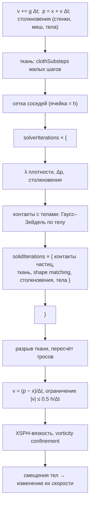
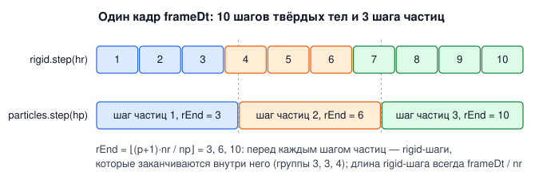
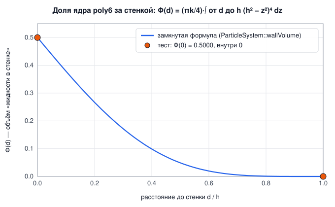
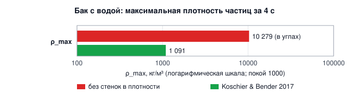
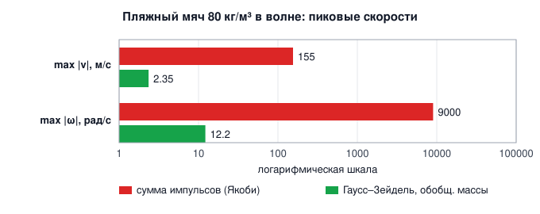

# 3. Частицы: жидкость, мягкие тела, ткань

[← Твёрдые тела](02-rigid-bodies.md) · [Оглавление](README.md) · [Газ →](04-gas-navier-stokes.md)

**Что это и зачем.** `src/particles/` — **единый решатель частиц** в духе NVIDIA FleX (Macklin, Müller, Chentanez, Kim 2014). Все частицы живут в одной сетке соседей и одном цикле ограничений. У каждой частицы есть **фаза**:

| Фаза | Модель | Файл |
|---|---|---|
| `Fluid` — жидкость | Position Based Fluids (Macklin & Müller 2013), разновидность SPH | [ParticleSystem.cpp](../src/particles/ParticleSystem.cpp) |
| `Soft` — мягкое тело | shape matching на перекрывающихся кластерах (Müller et al. 2005) | [SoftBody.cpp](../src/particles/SoftBody.cpp) |
| `Cloth` — ткань | XPBD-ограничения нитей, сдвига, изгиба; разрыв и горение | [Cloth.cpp](../src/particles/Cloth.cpp) |

Частицы разных фаз сталкиваются между собой; жидкость давит на твёрдые частицы (плавучесть мягких тел); твёрдые тела из гл. 2 связаны с частицами двусторонне.

Минимальный пример:

```cpp
rf::ParticleSystem ps;
rf::RigidWorld world;                                   // тела, с которыми связаны частицы
ps.setRigidWorld(&world);
ps.reset(rf::AABB({-1, 0, -0.4f}, {1, 1.2f, 0.4f}));    // домен = стенки бака
ps.addBlock(rf::AABB({-1, 0, -0.4f}, {-0.4f, 0.7f, 0.4f}));   // столб воды
const float dt = 1.0f / 60 / ps.params.substeps;
for (int s = 0; s < ps.params.substeps; ++s) { world.step(dt); ps.step(dt); }
```

---

## 3.1 Шаг решателя

`ParticleSystem::step` ([ParticleSystem.cpp:305](../src/particles/ParticleSystem.cpp#L305)) — схема Position Based Dynamics: предсказать положения, проецировать ограничения, получить скорости из смещений.



### Подшаги в кадре: твёрдые тела и частицы

Твёрдым телам и частицам нужно разное число подшагов на кадр: $n_r$ = `rigid.params.substeps` и $n_p$ = `particles.params.substeps`. `Simulation::stepBodiesAndParticles` чередует их так, чтобы длина шага каждого решателя не зависела от другого:

$$
h_r = \frac{\Delta t_{frame}}{n_r}, \qquad h_p = \frac{\Delta t_{frame}}{n_p}, \qquad
r_{end}(p) = \left\lfloor \frac{(p+1)\,n_r}{n_p} \right\rfloor .
$$

Перед шагом частиц $p$ выполняются все шаги тел, которые заканчиваются внутри него. Когда шаг частиц начинается, тела уже стоят там, где будут к его концу. При $n_r = 10$, $n_p = 3$ получаются группы 3, 3, 4.

[src/scene/Coupling.cpp:154](../src/scene/Coupling.cpp#L154)
```cpp
    const int nr = std::max(1, rigid.params.substeps), np = std::max(1, particles.params.substeps);
    const float hr = frameDt / float(nr), hp = frameDt / float(np);
    int r = 0;
    for (int p = 0; p < np; ++p) {
        const int rEnd = (p + 1) * nr / np; // rigid steps done by the end of this particle step
        for (; r < rEnd; ++r) rigid.step(hr);
        if (gasDrag) {
            applyGasDragOnCloth(hp);
            applyGasDragOnLiquid(hp);
        }
        particles.step(hp);
    }
```



Раньше на каждый шаг частиц приходилось $\lfloor n_r/n_p\rfloor$ шагов тел: при 10 и 3 — 9 шагов по 1/9 кадра вместо 10 по 1/10. Длина шага тел зависела от того, есть ли в сцене частицы, и одна и та же стопка вела себя по-разному. Теперь тела шагают одинаково в любом режиме. Шаги частиц в сцене без частиц почти ничего не стоят: работает только эмиттер.

---

## 3.2 Position Based Fluids

### Ядра

Радиус частицы $r$, расстояние между частицами в покое $2r$, радиус ядра $h = 4r$ ([ParticleSystem.cpp:17](../src/particles/ParticleSystem.cpp#L17)). Для плотности — ядро **poly6**, для градиентов — **spiky** (у poly6 градиент исчезает в нуле, и частицы слипались бы):

$$
W_{poly6}(\mathbf r) = \frac{315}{64\pi h^9}\,(h^2 - |\mathbf r|^2)^3, \qquad
\nabla W_{spiky}(\mathbf r) = -\frac{45}{\pi h^6}\,(h - |\mathbf r|)^2\,\frac{\mathbf r}{|\mathbf r|}, \qquad |\mathbf r| < h.
$$

[src/particles/ParticleSystem.h:168](../src/particles/ParticleSystem.h#L168)
```cpp
inline float W(float r2) const {
    if (r2 >= h2_) return 0.0f;
    float d = h2_ - r2;
    return poly6_ * d * d * d;
}
inline Vector3 gradW(const Vector3& r) const {
    float l2 = length2(r);
    if (l2 >= h2_ || l2 < 1e-20f) return Vector3(0.0f);
    float l = std::sqrt(l2);
    float d = h_ - l;
    return r * (spikyGrad_ * d * d / l);
}
```

Масса частицы **калибруется**, а не берётся как $\rho_0(2r)^3$: сумма ядра по полной решётке $7^3$ соседей с шагом $2r$ должна дать ровно $\rho_0$ ([ParticleSystem.cpp:22](../src/particles/ParticleSystem.cpp#L22)). Иначе жидкость в покое была бы сжата или растянута на ошибку дискретизации ядра.

### Ограничение плотности

Для каждой частицы жидкости — ограничение

$$
C_i = \max\!\left(\frac{\rho_i}{\rho_0} - 1,\ 0\right), \qquad
\rho_i = \sum_j m\,V_j\,W(\mathbf p_i - \mathbf p_j) + \rho_0\,\Phi_{wall}(\mathbf p_i).
$$

- **Одностороннее** ($\max(\cdot, 0)$): жидкость не сжимается, но может разрежаться. Без этого у свободной поверхности частицы слипаются в сгустки — ограничение тянуло бы их друг к другу.
- $V_j$ = `volume_` — объём частицы относительно частицы жидкости (листы ткани тоньше).
- В сумму входят **и твёрдые частицы**: жидкость выталкивается из них, а они получают обратно её давление (плавучесть).
- $\Phi_{wall}$ — часть ядра за стенками домена, раздел 3.3.

Множитель Лагранжа (одна итерация Ньютона по $C_i$):

$$
\lambda_i = -\frac{C_i}{\displaystyle\sum_{j \ne i} \frac{w_j}{w_0}\left|\nabla_{\mathbf p_j} C_i\right|^2 + \left|\nabla_{\mathbf p_i} C_i\right|^2 + \varepsilon}, \qquad
\nabla_{\mathbf p_j}C_i = -\frac{m_j}{\rho_0}\nabla W_{ij}, \quad
\nabla_{\mathbf p_i}C_i = \sum_j \frac{m_j}{\rho_0}\nabla W_{ij} + \nabla\Phi_{wall}.
$$

$\varepsilon$ = `relaxation`$/h^2$ — регуляризация (constraint force mixing), которая не даёт делить на ноль у одиноких частиц.

**Обобщённые массы** (Macklin et al. 2014, *Unified Particle Physics*). $w_j$ — обратная масса соседа, $w_0 = 1/m$ — обратная масса частицы жидкости. Поправка положения сдвигает соседа пропорционально $w_j/w_0$ (`computeDeltaP`), поэтому в знаменателе шага Ньютона он весит столько же. Лёгкая ткань ($w_j/w_0 \approx 100$) не отлетает в 100 раз дальше, чем нужно ограничению. Закреплённая частица ($w_j = 0$) не двигается и в сумму не входит. В коде это множитель `invMass_[nb[k]] * mass_` в строке `sum2 += …` ниже.

[src/particles/DensitySolver.cpp:33](../src/particles/DensitySolver.cpp#L33)
```cpp
const Vector3 pi = p_[i];
float rho = mass_ * W(0);
Vector3 gi(0.0f);
float sum2 = 0;
const int* nb = &nbr_[size_t(i) * kMaxNeighbors];
for (int k = 0; k < nbrCount_[i]; ++k) {
    // Solid particles count too: they occupy the same volume as a fluid particle, so
    // the liquid is pushed out of them - and pushes back on them (buoyancy).
    Vector3 r = pi - p_[nb[k]];
    const float mj = mass_ * volume_[nb[k]];
    rho += mj * W(length2(r));
    Vector3 g = gradW(r) * (mj * invRho0);
    // Generalized masses (Macklin et al. 2014): a neighbour moves by its inverse mass
    // relative to a fluid particle's (computeDeltaP), so it weighs that much here - a
    // light cloth is not pushed 100x further than the constraint needs, a pinned one
    // not at all.
    sum2 += length2(g) * (invMass_[nb[k]] * mass_);
    gi += g;
}
Vector3 gWall;
rho += params.restDensity * wallVolume(pi, gWall); // the walls as liquid at rest
gi += gWall;
rho_[i] = rho;
float C = std::max(rho * invRho0 - 1.0f, 0.0f);
err += C;
lambda_[i] = -C / (sum2 + length2(gi) + eps);
```

### Поправка положения и искусственное давление

$$
\Delta\mathbf p_i = \frac{m}{\rho_0}\sum_j \big(\lambda_i + \lambda_j + s_{corr}\big)\,\nabla W_{ij} + \lambda_i\,\nabla\Phi_{wall},
\qquad
s_{corr} = -k\left(\frac{W(\mathbf p_i - \mathbf p_j)}{W(\Delta q)}\right)^4, \quad |\Delta q| = 0.2h .
$$

$s_{corr}$ (`tensileK` = $k$ = 1e-4) — искусственное давление: слабое отталкивание на малых расстояниях против кластеризации частиц при отрицательном давлении; заодно даёт эффект поверхностного натяжения.

Твёрдая частица получает долю поправок давления соседей-жидкостей, масштабированную её обратной массой ([DensitySolver.cpp:180](../src/particles/DensitySolver.cpp#L180)): так вода двусторонне давит на мягкие тела и ткань.

### Вязкость XSPH и vorticity confinement

После получения скоростей ([DensitySolver.cpp:162](../src/particles/DensitySolver.cpp#L162)):

$$
\mathbf v_i \leftarrow \mathbf v_i + c\sum_j V_j\,(\mathbf v_j - \mathbf v_i)\,W_{ij}
\qquad (c = \texttt{viscosity}),
$$

$$
\boldsymbol\omega_i = \sum_j V_j\,\nabla W_{ij}\times(\mathbf v_j - \mathbf v_i), \quad
\boldsymbol\eta_i = \sum_j V_j\,(|\boldsymbol\omega_j| - |\boldsymbol\omega_i|)\,\nabla W_{ij}, \quad
\mathbf v_i \leftarrow \mathbf v_i + \epsilon\,\Delta t\ \frac{\boldsymbol\eta_i}{|\boldsymbol\eta_i|}\times\boldsymbol\omega_i .
$$

Confinement возвращает мелкие вихри, которые численная диссипация PBD размазывает. Скорость ограничена $0.5h/\Delta t$: частица не проскакивает больше половины ядра за шаг.

---

## 3.3 Стенки в плотности (Koschier & Bender 2017)

**Проблема.** Частица у стенки видит только половину своего ядра — за стенкой соседей нет. Её плотность занижена, ограничение (одностороннее!) не работает, и жидкость у стенки сбивается в плотные слои. В углу бака частицы выстраивались вдоль ребра и выбрасывались струёй вдоль угла. До исправления максимальная плотность в углах достигала **10 279 кг/м³** — в 10 раз больше плотности воды.

**Решение** (Koschier & Bender 2017, *Density Maps for Improved SPH Boundary Handling*): часть ядра за стенкой считается **жидкостью в покое**. Для плоской стенки на расстоянии $d$ эта часть — объём ядра poly6 за плоскостью. Если нарезать полупространство $z > d$ дисками, интеграл по диску радиуса $\sqrt{h^2 - z^2}$ берётся точно:

$$
\int_0^{\sqrt{h^2-z^2}} k\,(h^2 - z^2 - \rho^2)^3\,2\pi\rho\,d\rho = \frac{\pi k}{4}\,(h^2 - z^2)^4,
$$

откуда замкнутая формула ($k = 315/(64\pi h^9)$ — константа poly6)

$$
\Phi(d) = \frac{\pi k}{4}\int_d^h (h^2 - z^2)^4\,dz, \qquad
\Phi(0) = \frac{315}{256}\cdot\frac{128}{315} = \frac12, \qquad
\Phi'(d) = -\frac{\pi k}{4}(h^2 - d^2)^4 .
$$

Первообразная $(h^2 - z^2)^4$ — многочлен $F(z) = z\big(h^8 - \tfrac43 h^6 z^2 + \tfrac65 h^4 z^4 - \tfrac47 h^2 z^6 + \tfrac19 z^8\big)$, поэтому ничего не табулируется:

[src/particles/DensitySolver.cpp:59](../src/particles/DensitySolver.cpp#L59)
```cpp
float ParticleSystem::wallVolume(const Vector3& p, Vector3& gradient) const {
    const float h = h_, h2 = h2_;
    const float c = 0.25f * kPi * poly6_;
    auto F = [&](float z) { // antiderivative of (h^2 - z^2)^4
        const float z2 = z * z;
        return z * (h2 * h2 * h2 * h2 + z2 * (-4.0f / 3.0f * h2 * h2 * h2 + z2 * (1.2f * h2 * h2 + z2 * (-4.0f / 7.0f * h2 + z2 / 9.0f))));
    };
    const float Fh = F(h);
    float phi = 0;
    gradient = Vector3(0.0f);
    for (int a = 0; a < 3; ++a)
        for (int side = 0; side < 2; ++side) {
            const float d = side == 0 ? p[a] - domain_.lo[a] : domain_.hi[a] - p[a];
            if (d >= h) continue;
            const float dc = std::max(d, 0.0f);
            const float q = h2 - dc * dc;
            phi += c * (Fh - F(dc));
            gradient[a] += (side == 0 ? -1.0f : 1.0f) * c * q * q * q * q; // Phi'(d) dd/dp
        }
    return phi;
}
```

Стенка входит и в плотность ($+\rho_0\Phi$), и в градиент ограничения, и в поправку $\lambda_i\nabla\Phi$ — стенка толкает **вдоль своей нормали**. В углу вклады стенок складываются.





---

## 3.4 Столкновения частиц

`collide(i, p, start, record, dt)` ([ParticleContacts.cpp:104](../src/particles/ParticleContacts.cpp#L104); `start` — положение в начале шага, от которого меряется проскальзывание для трения):

1. **Стенки домена** — отсечение положения в бокс, уменьшенный на $r$.
2. **Статический меш** — ближайшая точка через `MeshBVH` (гл. 1.7); если знаковое расстояние $< r$, частица выталкивается вдоль псевдонормали, касательное смещение гасится на долю `wallFriction`.
3. **Твёрдые тела** — через `RigidBody::signedDistance`. Для закреплённых тел частица просто выталкивается. Для подвижных тел контакт **только записывается** (нормаль, глубина, точка) и решается вместе с телом в `solveBodyContacts` (раздел 3.5).

**Контакты между частицами разных фаз** (ткань–мягкое тело, мягкое–мягкое, несоседние частицы одной ткани) держат расстояние $2r$. Пары собираются один раз за подшаг, нормаль фиксируется по положениям **в начале** шага: пара не может поменяться сторонами внутри шага, даже если ткань отпружинит или тяжёлое тело продавит частицу ([ParticleContacts.cpp:9](../src/particles/ParticleContacts.cpp#L9)). Решаются Гауссом–Зейделем с делением коррекции по обратным массам ([ParticleContacts.cpp:39](../src/particles/ParticleContacts.cpp#L39)).

> **Ограничение всех позиционных решателей (FleX тоже):** при большом отношении масс соприкасающихся частиц (тяжёлое тело на очень лёгкой ткани, больше ~1:10) лёгкая сторона забирает почти всю коррекцию, опора сходится медленно. Используйте реалистичные материалы (холст 1–2 кг/м² под поролоном) или больше `solidIterations`.

---

## 3.5 Двусторонняя связь с твёрдыми телами: XPBD-контакты

### Что было не так

Первая версия считала контакт частицы с телом так, будто **тело бесконечно тяжёлое**: частица выталкивалась целиком, а её реакция $m_p\Delta\mathbf p/\Delta t$ прикладывалась к телу как импульс. Для тяжёлого тела это почти верно. Но пляжный мяч (80 кг/м³, $r = 8$ см, масса 0.17 кг — как 12 частиц воды) в волне касается сотен частиц сразу. Каждая частица считала **полный** импульс, нужный для неподвижного тела, и эти импульсы **складывались**: мяч получал в сотни раз больше, чем вода могла ему передать. Итог: **155 м/с и 9000 рад/с**.

Попытка усреднять импульсы (Якоби: делить на число контактов) дала обратное: тело получало только среднее, и давление со всех сторон больше не складывалось в архимедову силу — мяч **тонул**.

### Как сейчас (Müller et al. 2020)

Каждый контакт делит коррекцию между частицей и телом по **обобщённым обратным массам** (XPBD для твёрдых тел, eq. 2–3):

$$
w_p = \frac{1}{m_p}, \qquad
w_b = \frac{1}{M} + (\mathbf r\times\mathbf n)^{\mathsf T}\,\mathbf I^{-1}\,(\mathbf r\times\mathbf n), \qquad
\lambda = \frac{d}{w_p + w_b},
$$

$$
\mathbf p \mathrel{+}= w_p\lambda\,\mathbf n, \qquad
\Delta\mathbf x_b \mathrel{-}= \frac{\lambda}{M}\,\mathbf n, \qquad
\Delta\boldsymbol\theta_b \mathrel{-}= \lambda\,\mathbf I^{-1}(\mathbf r\times\mathbf n).
$$

И главное — контакты одного тела решаются **по очереди** (Гаусс–Зейдель). Каждый следующий контакт видит тело, уже сдвинутое предыдущими: текущая глубина равна исходной минус то, насколько тело с тех пор ушло от частицы.

[src/particles/ParticleContacts.cpp:71](../src/particles/ParticleContacts.cpp#L71)
```cpp
for (size_t b = 0; b < bodies.size(); ++b) {
    if (contacts[b].empty()) continue;
    const RigidBody& body = bodies[b];
    const Vector3 shift0 = bodyShift_[b], turn0 = bodyTurn_[b]; // the pose the contacts were found at
    for (int i : contacts[b]) {
        const Vector3 n = contactNormal_[i], c = contactPoint_[i];
        const Vector3 rc = c - (body.pos + bodyShift_[b]);
        // Penetration now: what it was, minus how far the body has moved away from it since.
        const Vector3 moved = (bodyShift_[b] - shift0) + cross(bodyTurn_[b] - turn0, rc);
        const float depth = contactDepth_[i] + dot(moved, n);
        if (depth <= 0) continue;
        // Generalized inverse masses (Mueller et al. 2020, eq. 2-3): the particle, the body at c.
        const float wp = invMass_[i];
        const Vector3 rn = cross(rc, n);
        const float wb = body.invMass + dot(rn, body.applyInvInertiaWorld(rn));
        const float lambda = depth / (wp + wb); // [kg m]
        p_[i] += n * (lambda * wp);
        bodyShift_[b] -= n * (lambda * body.invMass);
        bodyTurn_[b] -= body.applyInvInertiaWorld(rn) * lambda;
```

Результат:

- лёгкое тело сдвигается **не дальше, чем его толкает вода** — сумма коррекций согласована;
- импульс сохраняется: частица и тело получают равные и противоположные $\lambda\mathbf n$;
- давление со всех сторон на плавающее тело оставляет **ровно его плавучесть** — архимедова сила возникает сама, без отдельной формулы.

Тело внутри подшага существует как «исходная поза + `bodyShift_` + малый поворот `bodyTurn_`», и частицы встречают его там, где оно сейчас. В конце подшага смещение превращается в изменение скорости тела `applyVelocityChange(shift/Δt, turn/Δt)`; двигает тело уже решатель гл. 2 на следующем шаге. Трение считается так же: касательное проскальзывание частицы относительно тела делится по $w_p, w_b$.



---

## 3.6 Мягкие тела: shape matching на кластерах

Müller, Heidelberger, Teschner, Gross 2005, *Meshless Deformations Based on Shape Matching*; кластеры — как в FleX.

Мягкое тело заполняется частицами на решётке с шагом $2r$ внутри замкнутого меша (`addSoftBody`, [ParticleSystem.cpp:95](../src/particles/ParticleSystem.cpp#L95)). Частицы группируются в **перекрывающиеся кластеры**: центры на решётке с шагом $1.5cdot 2r$, радиус $2cdot 2r$ — кластер накрывает ~4 частицы поперёк, и тело толщиной в несколько частиц гнётся и сминается между кластерами. Один большой кластер — твёрдое тело: прежние кластеры (шаг 3, радиус 4) накрывали куб из 6 частиц целиком, и мягкие тела выглядели твёрдыми. Тело должно быть **не тоньше трёх частиц**: у кластера из плоского слоя частиц нет определённого вращения, и его кожа разлетается. Поверхностный меш для рисования привязан к кластерам гладко, как в FleX: вершина следует всем кластерам в полутора радиусах с весами $(1 - d/R)^2$ (`bindSurface`, `skinSurface`) — привязка к кластерам одной ближайшей частицы рвала кожу на стыках при изгибе.

> **Ограничение.** У цепочки перекрывающихся кластеров нет изгибной жёсткости: каждый проход подтягивает частицы к цели *своего* кластера, и длинное тонкое тело (балка 60 × 9 см из 20 кластеров) провисает как верёвка при любой `stiffness` — проверено консолью, защемлённой в стене (`pinParticles`): свободный конец уходит под корень даже при $k = 0.95$. Модель честна для компактных тел (кубы, мячи сминаются на десятки процентов и пружинят), но модуля Юнга у неё нет. Следующая ступень — мягкое тело на тетраэдрах XPBD с материалом Neo-Hookean (Macklin & Müller 2021) и параметрами $E$, $
u$; приёмочный тест — прогиб консоли $delta = qL^4/(8EI)$ по Эйлеру–Бернулли.

Для каждого кластера с частицами $\mathbf p_i$ и положениями покоя $\mathbf q_i$ относительно центра масс покоя:

$$
\mathbf c = \frac1n\sum_i\mathbf p_i, \qquad
\mathbf A = \sum_i(\mathbf p_i - \mathbf c)\,\mathbf q_i^{\mathsf T}, \qquad
\mathbf R = \operatorname{extractRotation}(\mathbf A), \qquad
\mathbf g_i = \mathbf c + \mathbf R\,\mathbf q_i .
$$

Цель $mathbf g_i$ — где частица была бы при жёстком движении кластера. Частица, входящая в несколько кластеров, идёт к **среднему** своих целей. Жёсткость `stiffness` ∈ [0, 1] — доля пути к форме покоя **за подшаг**; решатель делает $n$ проходов за подшаг, и на каждый приходится (Müller et al. 2007, PBD)

$$
k^prime = 1 - (1 - k)^{1/n},
$$

так что мягкость не зависит от числа итераций. Раньше `stiffness` применялась на каждом проходе: при 8 проходах даже 0.15 оставляло от деформации $(1-0.15)^8 = 27%$, а 0.4 — 1.7 %, и тела не гнулись.

[src/particles/SoftBody.cpp:102](../src/particles/SoftBody.cpp#L102)
```cpp
        const float kPass = k >= 1.0f ? 1.0f : 1.0f - std::pow(1.0f - k, 1.0f / float(std::max(1, passesPerStep)));
```

[src/particles/SoftBody.cpp:108](../src/particles/SoftBody.cpp#L108)
```cpp
for (SoftCluster& cl : body.clusters) {
    // Current centre of mass (all particles of a body have the same mass).
    Vector3 c(0.0f);
    for (int i : cl.particles) c += p[i];
    c /= float(cl.particles.size());
    // A = sum (p - c) q^T: the deformation of the cluster from rest.
    Matrix3x3 A = Matrix3x3::zero();
    for (size_t m = 0; m < cl.particles.size(); ++m) A += Matrix3x3::outer(p[cl.particles[m]] - c, cl.restOffsets[m]);
    cl.rotation = extractRotation(A, cl.rotation, 10);
    cl.centre = c;
    const Matrix3x3 R = cl.rotation.toMatrix3x3();
    for (size_t m = 0; m < cl.particles.size(); ++m) {
        int slot = cl.particles[m] - first;
        goalSum[slot] += c + R * cl.restOffsets[m];
        goalCount[slot] += 1;
    }
}
```

> **Сохранение импульса.** Частицы входят в разное число кластеров, поэтому поправки $\Delta\mathbf p_i$ сами по себе не суммируются в ноль. Из них вычитается среднее — внутренняя сила не должна сдвигать центр масс тела. Исключение: часть тела закреплена или схвачена мышью — это внешняя опора, за которой тело должно следовать ([SoftBody.cpp:104](../src/particles/SoftBody.cpp#L104)).

Вращение извлекается устойчивым методом Müller et al. 2016 (гл. 1.2) с тёплым стартом от прошлого кадра — вывернутый кластер не ломает симуляцию.

**Отрисовка.** Поверхностный меш «натягивается» на кластеры, как в FleX: каждая вершина следует жёстким движениям кластеров ближайшей частицы (`skinSurface`). В покое скин совпадает с моделью с точностью 1.7e-8 м.

---

## 3.7 Ткань: XPBD, малые шаги, тросы, разрыв

### Модель

Ткань — сетка частиц с шагом `clothSpacing`·$r$. Линии вдоль $x$ — **основа** (warp), вдоль $y$ — **уток** (weft). Ограничения расстояния ([Cloth.cpp:16](../src/particles/Cloth.cpp#L16)):

| Вид | Между | Податливость $\alpha$ | Прочность |
|---|---|---|---|
| `Warp`, `Weft` (нити) | соседи по сетке | $1/k_{tensile}$ | `strengthWarp/Weft` · $s$ (× `seamStrength` на шве) |
| `Shear` | диагонали ячейки | $1/k_{shear}$ | не рвутся |
| `Bend` | через одну частицу | `bendCompliance` | не рвутся |

Нить между соседями представляет полоску ширины $s$ и длины $s$, поэтому её пружина $k = $ `tensileStiffness` [Н/м], а натяжение нити — просто $T = k\cdot\Delta l$.

**Площадь и масса частицы.** Лист со сторонами $\mathbf u$, $\mathbf v$ покрыт $W\times H$ частицами, и каждая представляет одинаковую долю ткани:

$$
A_p = \frac{\lvert \mathbf u\times\mathbf v\rvert}{W\,H}, \qquad m_p = \sigma\,A_p, \qquad \sum_p m_p = \sigma\,\lvert\mathbf u\times\mathbf v\rvert ,
$$

где $\sigma$ = `areaDensity` [кг/м²]. Через ту же $A_p$ = `Cloth::particleArea` считаются тепло и топливо при горении и сопротивление ткани в газе ([Cloth.cpp:262](../src/particles/Cloth.cpp#L262)). Масса, горение и сопротивление поэтому согласованы, а сумма масс частиц в точности равна массе листа. Раньше масса считалась по $A_p$, а тепло и топливо — по $s^2$ с шагом сетки $s = |\mathbf u|/(W-1)$. Для квадратного листа из 11×11 частиц это $1/100$ против $1/121$ площади листа, то есть расхождение 21 %.

[src/particles/ParticleSystem.cpp:139](../src/particles/ParticleSystem.cpp#L139)
```cpp
    c.particleArea = length(cross(u, v)) / float(c.width * c.height);
    const float invMass = 1.0f / (material.areaDensity * c.particleArea);
```

### XPBD (Macklin, Müller, Chentanez 2016)

Ограничение $C = |\mathbf p_a - \mathbf p_b| - l_0$ с податливостью $\alpha$ [м/Н]:

$$
\tilde\alpha = \frac{\alpha}{\Delta t^2}, \qquad
\Delta\lambda = \frac{-C - \tilde\alpha\,\lambda}{w_a + w_b + \tilde\alpha}, \qquad
\mathbf p_a \mathrel{+}= w_a\Delta\lambda\,\mathbf n, \quad \mathbf p_b \mathrel{-}= w_b\Delta\lambda\,\mathbf n .
$$

[src/particles/Cloth.cpp:156](../src/particles/Cloth.cpp#L156)
```cpp
static void solveConstraint(DistanceConstraint& c, std::vector<Vector3>& p, const std::vector<float>& invMass, float invDt2) {
    const float wa = invMass[c.a], wb = invMass[c.b];
    if (c.broken || wa + wb == 0) return;
    Vector3 d = p[c.a] - p[c.b];
    float len = length(d);
    if (len < 1e-9f) return;
    Vector3 n = d / len;
    float C = len - c.restLength;
    float alpha = c.compliance * invDt2;
    float dl = (-C - alpha * c.lambda) / (wa + wb + alpha);
    c.lambda += dl;
    p[c.a] += n * (wa * dl);
    p[c.b] -= n * (wb * dl);
}
```

В отличие от обычного PBD, жёсткость XPBD не зависит от числа итераций и шага: $\alpha$ — физическая податливость. Натяжение нити ([Cloth.cpp:195](../src/particles/Cloth.cpp#L195)):

$$
T = \begin{cases} \Delta l/\alpha, & \alpha > 0\ \text{(упругая нить)}\\ -\lambda/\Delta t^2, & \alpha = 0\ \text{(нерастяжимая)}\end{cases}
$$

### Малые шаги (Macklin et al. 2019)

*Small Steps in Physics Simulation*: много маленьких шагов с одной итерацией сходятся **намного** лучше, чем один шаг со многими итерациями. Ткань внутри каждого подшага проходит `clothSubsteps` = 8 малых шагов: гравитация, один проход ограничений, проверка разрыва, столкновения ([ParticleSystem.cpp:221](../src/particles/ParticleSystem.cpp#L221)). Закреплённые и схваченные частицы движутся линейно к своей цели подшага.

Это важно для **разрыва**: натяжения нитей становятся физическими, а не отставанием недосошедшегося решателя. Иначе ткань рвалась бы под собственным весом.

Ограничения раскрашены в 16 независимых пакетов (нити и сдвиг — через столбец, изгиб — через три): внутри пакета нет общих частиц. Большая ткань (≥ 60 000 ограничений) решается пакетами параллельно; малая — последовательно, это быстрее синхронизации.

### Тросы (long range attachments, Kim, Chentanez, Müller 2012)

Каждая частица привязана к ≤ 4 ближайшим закреплённым частицам: она не может отойти от якоря дальше, чем позволяет ткань между ними. Это одностороннее ограничение ([Cloth.cpp:181](../src/particles/Cloth.cpp#L181)) убирает провисание длинной висящей ткани без сотен итераций.

- Рвущаяся ткань получает **15 % слабины** — больше, чем нити тянутся до разрыва. Тросы — только страховка, а нагрузку несут (и концентрируют) нити.
- После разрыва длины тросов пересчитываются **по ткани**: многоисточниковый поиск Дейкстры по целым нитям и диагоналям. Частица, отрезанная от всех якорей, больше не привязана ([Cloth.cpp:75](../src/particles/Cloth.cpp#L75)).

### Разрыв по нитям и швам

Нить рвётся, когда натяжение превышает прочность:

$$
T > \sigma_{warp/weft}\cdot s \cdot f_{seam}\cdot f_{burn}, \qquad
f_{burn} = c_{char} + (1 - c_{char})\,\min(u_a, u_b),
$$

где $\sigma$ — прочность ткани [Н/м], $s$ — ширина полоски, $f_{seam}$ = `seamStrength` = 0.3 на шве, $u$ — доля несгоревшего материала (гл. 5). Нагрузка разорванной нити переходит на соседей, и трещина бежит **вдоль переплетения, поперёк нагрузки**, нить за нитью ([Cloth.cpp:245](../src/particles/Cloth.cpp#L245)). Вместе с нитью рвутся изгибные связи через разрыв. Ячейка «разрезается» (удаляются диагонали, она больше не рисуется), только когда трещина пересекла её полностью — обе её нити этого направления порваны ([Cloth.cpp:203](../src/particles/Cloth.cpp#L203)). До этого ячейка — вершина трещины.

**Швы** — линии стежков между столбцами `seamColumns` или строками `seamRows`, держат лишь часть прочности. Одежда расходится по шву первой.

Горение ткани (пиролиз, обугливание, прогорание нитей) — в [главе 5](05-fire.md#55-пиролиз-хлопка).

---

## 3.8 Параметры

### `ParticleParams` ([ParticleSystem.h:41](../src/particles/ParticleSystem.h#L41))

| Параметр | Смысл | Ед. | По умолчанию |
|---|---|---|---|
| `particleRadius` | радиус $r$; шаг $2r$, ядро $h = 4r$ (применяется в `reset`) | м | 0.015 |
| `restDensity` | $\rho_0$ | кг/м³ | 1000 |
| `solverIterations` | итераций плотности за подшаг | — | 4 |
| `solidIterations` | проходов контактов/ткани/кластеров за итерацию | — | 2 |
| `clothSubsteps` | малых шагов ткани в подшаге | — | 8 |
| `clothSpacing` | шаг частиц ткани, в радиусах | — | 1.0 |
| `substeps` | подшагов на кадр | — | 3 |
| `viscosity` | коэффициент XSPH $c$ | — | 0.02 |
| `vorticity` | сила confinement $\epsilon$ | м/с² | 0 |
| `relaxation` | CFM $\varepsilon h^2$ | — | 0.1 |
| `tensileK` | искусственное давление $k$ | — | 1e-4 |
| `wallFriction` | 0 — скольжение, 1 — прилипание | — | 0.1 |
| `maxParticles` | предел числа частиц | — | 250 000 |

### `ClothMaterial` ([Cloth.h:25](../src/particles/Cloth.h#L25)), механика

| Параметр | Смысл | Ед. | По умолчанию |
|---|---|---|---|
| `areaDensity` | поверхностная плотность (хлопок 0.15–0.3, холст 0.5–1.5) | кг/м² | 0.3 |
| `tensileStiffness` | жёсткость нитей на единицу ширины (0 — нерастяжимая) | Н/м | 30 000 |
| `shearStiffness` | жёсткость сдвига ячеек | Н/м | 3 000 |
| `bendCompliance` | податливость изгиба | м/Н | 1e-3 |
| `strengthWarp`, `strengthWeft` | прочность на разрыв (0 — не рвётся) | Н/м | 4 000, 3 000 |
| `seamColumns`, `seamRows`, `seamStrength` | швы и доля прочности шва | —, —, — | пусто, пусто, 0.3 |

Параметры горения — в [главе 5](05-fire.md#57-параметры).

---

## Проверка

| Тест | Результат |
|---|---|
| `liquid walls in the density` | $\Phi(0) = 0.5000$, внутри 0; бак с волной за 4 с: $\rho_{max}$ = **1091** кг/м³ (было 10 279 в углах) |
| `light body in a wave` | пляжный мяч 80 кг/м³: $\max\lVert\mathbf v\rVert$ = **2.35** м/с, $\max\lVert\boldsymbol\omega\rVert$ = **12.2** рад/с (было 155 м/с и 9000 рад/с); плавает: центр в среднем на 0.43 м при спокойном уровне ≈ 0.32 м |
| `particles rest` | столб воды в покое: средняя ошибка плотности < 5 %, $\lVert\mathbf v\rVert < 0.5$ м/с |
| `particles floating` | ящик 400 кг/м³ плавает, 3000 кг/м³ тонет |
| `soft bodies and cloth` — штора 41×41 на двух углах | максимальное растяжение 0.01 % |
| `soft bodies and cloth` — мягкий куб (512 частиц, 27 кластеров) | деформация при ударе 9.8 %, через 3 с 0.62 % — восстанавливает форму |
| `soft bodies and cloth` — мягкий куб 500 кг/м³ в воде | центр 0.263 м при поверхности 0.269 м — плавает наполовину погружённым |
| `soft bodies and cloth` — разрыв | висящая и слегка качаемая штора не рвётся (0 нитей); рывок вниз рвёт поперёк: 183 нити утка + 104 основы; сшитые полотна расходятся по шву: 41 из 41 стежка |
| `soft bodies and cloth` — лобовое столкновение мягких тел в невесомости | импульс 0.9882 → 0.9882 кг·м/с |

## Литература

- M. Macklin, M. Müller, N. Chentanez, T.-Y. Kim. *Unified Particle Physics for Real-Time Applications.* ACM TOG (SIGGRAPH) 33(4), 2014.
- M. Macklin, M. Müller. *Position Based Fluids.* ACM TOG (SIGGRAPH) 32(4), 2013.
- M. Müller, D. Charypar, M. Gross. *Particle-Based Fluid Simulation for Interactive Applications.* SCA 2003 (ядра poly6 / spiky).
- D. Koschier, J. Bender. *Density Maps for Improved SPH Boundary Handling.* SCA 2017.
- M. Müller, M. Macklin, N. Chentanez, S. Jeschke, T.-Y. Kim. *Detailed Rigid Body Simulation with Extended Position Based Dynamics.* SCA 2020.
- M. Müller, B. Heidelberger, M. Teschner, M. Gross. *Meshless Deformations Based on Shape Matching.* SIGGRAPH 2005.
- M. Müller, J. Bender, N. Chentanez, M. Macklin. *A Robust Method to Extract the Rotational Part of Deformations.* MIG 2016.
- M. Macklin, M. Müller, N. Chentanez. *XPBD: Position-Based Simulation of Compliant Constrained Dynamics.* MIG 2016.
- M. Macklin, K. Storey, M. Lu, P. Terdiman, N. Chentanez, S. Jeschke, M. Müller. *Small Steps in Physics Simulation.* SCA 2019.
- T.-Y. Kim, N. Chentanez, M. Müller-Fischer. *Long Range Attachments — A Method to Simulate Inextensible Clothing in Computer Games.* SCA 2012.
- J. J. Monaghan. *Smoothed Particle Hydrodynamics.* Rep. Prog. Phys. 68, 2005 (XSPH).
