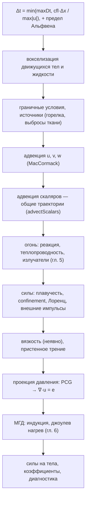
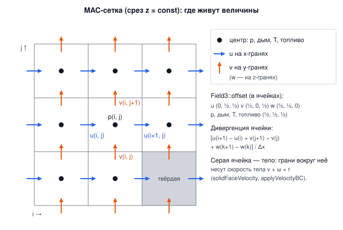

# 4. Газ: уравнения Навье–Стокса на MAC-сетке

[← Частицы](03-particles.md) · [Оглавление](README.md) · [Огонь →](05-fire.md)

**Что это и зачем.** `NSGridSolver` ([src/grid/NSGridSolver.h](../src/grid/NSGridSolver.h)) — решатель несжимаемого газа на разнесённой (MAC) сетке. Он работает как «виртуальная аэродинамическая труба» (сопротивление и подъёмная сила тел, давление по поверхности), как дым и горячий газ в закрытых и открытых объёмах, и как среда, в которой падают, плавают и горят тела и ткани. На нём же построены огонь (гл. 5) и МГД (гл. 6).

---

## 4.1 Уравнения

Несжимаемый газ постоянной плотности $\rho$:

$$
\frac{\partial\mathbf u}{\partial t} + (\mathbf u\cdot\nabla)\mathbf u = -\frac{1}{\rho}\nabla p + \nu\nabla^2\mathbf u + \mathbf f, \qquad
\nabla\cdot\mathbf u = e .
$$

| Символ | Смысл | Единицы |
|---|---|---|
| $\mathbf u$ | скорость газа | м/с |
| $p$ | давление (избыточное, без гидростатики) | Па |
| $\nu$ | кинематическая вязкость (воздух 1.5e-5) | м²/с |
| $\mathbf f$ | массовые силы: плавучесть, vorticity confinement, сила Лоренца | м/с² |
| $e$ | источник объёма: расширение сгоревшего газа (гл. 5), иначе 0 | 1/с |

Скаляры (дым $S$, температура $T$, топливо $Y$, продукты сгорания $P$) переносятся потоком: $\partial\phi/\partial t + \mathbf u\cdot\nabla\phi = \text{источники}$.

**Расщепление по физическим процессам** — шаг `NSGridSolver::step` ([NSGridSolver.cpp:1002](../src/grid/NSGridSolver.cpp#L1002)):



Шаг адаптивный: $\Delta t \le \text{cfl}\cdot\Delta x/u_{max}$ с `cfl` = 2. Полулагранжева адвекция безусловно устойчива, поэтому CFL больше 1 допустим — он ограничивает только точность.

---

## 4.2 MAC-сетка

Домен делится на $n_x\times n_y\times n_z$ кубических ячеек со стороной $\Delta x$ = `domainSize.x / resolutionX`. Величины живут в разных местах ячейки (Harlow & Welch 1965):



- **Давление и скаляры** — в центрах ячеек.
- **Компоненты скорости** — на гранях, по нормали к грани: $u$ на $x$-гранях, $v$ на $y$-гранях, $w$ на $z$-гранях.

Каждая компонента — отдельный `Field3` ([Field3.h](../src/grid/Field3.h)) со своим смещением `offset` (в ячейках) и размерами:

[src/grid/NSGridSolver.cpp:27](../src/grid/NSGridSolver.cpp#L27)
```cpp
u_.init(nx_ + 1, ny_, nz_, {0, 0.5f, 0.5f}, u0);
v_.init(nx_, ny_ + 1, nz_, {0.5f, 0, 0.5f});
w_.init(nx_, ny_, nz_ + 1, {0.5f, 0.5f, 0});
u0_ = u_; v0_ = v_; w0_ = w_;
p_.init(nx_, ny_, nz_, Vector3(0.5f));
smoke_.init(nx_, ny_, nz_, Vector3(0.5f));
```

Зачем разносить: дивергенция ячейки и градиент давления на грани получаются **центральными разностями без усреднения**:

$$
(\nabla\cdot\mathbf u)_{ijk} = \frac{u_{i+1} - u_i + v_{j+1} - v_j + w_{k+1} - w_k}{\Delta x}, \qquad
\left(\frac{\partial p}{\partial x}\right)_{i} = \frac{p_{i} - p_{i-1}}{\Delta x}.
$$

На совмещённой сетке такие разности «не видят» шахматные колебания давления, а на MAC-сетке их нет.

`Field3::sample(gp)` — трилинейная интерполяция в точке `gp` (в ячейках от начала домена) с отсечением по краям; `sampleMinMax` — минимум и максимум 8 соседних значений (для ограничителя MacCormack).

---

## 4.3 Адвекция: полулагранжев метод и MacCormack

### Полулагранжев шаг

Значение в узле $\mathbf x$ через $\Delta t$ — это значение в точке, откуда туда пришла частица газа (Stam 1999). Точка отправления находится обратной трассировкой методом Рунге–Кутты 2-го порядка:

$$
\mathbf x_{mid} = \mathbf x - \tfrac12\Delta t\,\mathbf u(\mathbf x), \qquad
\mathbf x_{dep} = \mathbf x - \Delta t\,\mathbf u(\mathbf x_{mid}), \qquad
\phi^{n+1}(\mathbf x) = \phi^n(\mathbf x_{dep}).
$$

[src/grid/NSGridSolver.cpp:420](../src/grid/NSGridSolver.cpp#L420)
```cpp
Vector3 NSGridSolver::backtrace(const Vector3& gp, float dt) const {
    Vector3 v1 = sampleVelGrid(gp);
    Vector3 mid = gp - v1 * (0.5f * dt);
    Vector3 v2 = sampleVelGrid(mid);
    return gp - v2 * dt;
}
```

Метод безусловно устойчив (новое значение — интерполяция старых, экстремумы не растут), но диффузен: интерполяция размывает дым и вихри.

### MacCormack с ограничителем

Selle, Fedkiw, Kim, Liu, Rossignac (2008) — поправка до второго порядка из двух полулагранжевых шагов. Пусть $\mathcal A$ — шаг вперёд, $\mathcal A^R$ — шаг назад (с $-\Delta t$):

$$
\hat\phi = \mathcal A(\phi^n), \qquad
\tilde\phi = \mathcal A^R(\hat\phi), \qquad
\phi^{n+1} = \hat\phi + \tfrac12\big(\phi^n - \tilde\phi\big).
$$

Разница $\phi^n - \tilde\phi$ — ошибка «туда и обратно», половина её компенсируется. Поправка может создать новые экстремумы (осцилляции), поэтому **ограничитель**: если результат выходит за $[\min, \max]$ восьми значений вокруг точки отправления, берётся простой полулагранжев результат $\hat\phi$.

### Общие траектории для всех скаляров

Дым, температура, топливо и продукты переносятся **одним и тем же** потоком. Значит, точки отправления (и прибытия — для обратного шага MacCormack) достаточно найти **один раз** для всех скаляров ([NSGridSolver.cpp:473](../src/grid/NSGridSolver.cpp#L473)):

[src/grid/NSGridSolver.cpp:489](../src/grid/NSGridSolver.cpp#L489)
```cpp
parallelFor(nz_, [&](int k) {
    for (int j = 0; j < ny_; ++j)
        for (int i = 0; i < nx_; ++i) {
            const size_t c = cidx(i, j, k);
            const Vector3 gp(i + 0.5f, j + 0.5f, k + 0.5f);
            departure_[c] = backtrace(gp, dt);
            arrival_[c] = backtrace(gp, -dt);
            fromOutside_[c] = uint8_t(outside(departure_[c]) | (outside(arrival_[c]) << 1));
        }
}, 1);
for (Field3* field : fields) {
    Field3& f = *field;
    t1_.init(nx_, ny_, nz_, f.offset);
    t2_.init(nx_, ny_, nz_, f.offset);
    parallelFor(int(n), [&](int c) { t1_.d[c] = (fromOutside_[c] & 1) ? 0.0f : f.sample(departure_[c]); }, 4096);
    if (params.maccormack) {
        // MacCormack: trace the result back, correct by half the round-trip error, fall back to
        // the plain value where the correction leaves the range of the departure cell (limiter).
        parallelFor(int(n), [&](int c) { t2_.d[c] = (fromOutside_[c] & 2) ? 0.0f : t1_.sample(arrival_[c]); }, 4096);
        parallelFor(int(n), [&](int c) {
            if (fromOutside_[c] & 1) return;
            const float val = t1_.d[c] + 0.5f * (f.d[c] - t2_.d[c]);
            float lo, hi;
            f.sampleMinMax(departure_[c], lo, hi);
            if (val >= lo && val <= hi) t1_.d[c] = val;
        }, 4096);
    }
    f.d.swap(t1_.d);
}
```

Каждая трассировка — 2 трилинейные выборки трёх компонент скорости. В сцене «Огонь» четыре скаляра, и общая трассировка сократила шаг сетки с **48 до 32 мс**.

> **Важно:** то, что приходит через открытую сторону домена (приток или сток), — чистый окружающий газ: дым, перегрев, топливо и продукты равны 0 (`fromOutside_`), а не копия граничной ячейки.

---

## 4.4 Силы

`addForces` ([NSGridSolver.cpp:594](../src/grid/NSGridSolver.cpp#L594)).

**Плавучесть.** Сетка не хранит гидростатического давления, поэтому подъёмная сила горячего газа добавляется явно на $y$-грани:

$$
f_y = \begin{cases} \beta_T\,T - \beta_S\,S, & \text{Буссинеск (дым)}\\[2pt] g\,\dfrac{T}{T_0 + T} - \beta_S\,S, & \text{огонь: идеальный газ}\end{cases}
$$

где $T$ — перегрев над окружающим газом, $T_0$ — температура окружающего газа, $\beta_T$ = `heatBuoyancy`, $\beta_S$ = `smokeBuoyancy` (дым тяжелее воздуха и оседает). Для огня форма Буссинеска $gT/T_0$ завышает подъём в разы при температуре пламени, поэтому используется точная форма для идеального газа (гл. 5.2).

**Vorticity confinement** (Fedkiw, Stam, Jensen 2001) возвращает мелкие вихри, которые сетка теряет из-за численной вязкости:

$$
\boldsymbol\omega = \nabla\times\mathbf u, \qquad
\mathbf N = \frac{\nabla|\boldsymbol\omega|}{|\nabla|\boldsymbol\omega||}, \qquad
\mathbf f_{conf} = \epsilon\,\Delta x\,(\mathbf N\times\boldsymbol\omega).
$$

Сила считается в центрах ячеек и усредняется на грани.

**Вязкость** — неявная диффузия $(1 - \nu\Delta t\nabla^2)\mathbf u^{new} = \mathbf u$, 20 итераций Якоби ([NSGridSolver.cpp:648](../src/grid/NSGridSolver.cpp#L648)). Пропускается, если $\nu\Delta t/\Delta x^2 < 10^{-3}$: для воздуха физическая вязкость на такой сетке много меньше численной вязкости адвекции.

**Внешние импульсы** (`addImpulse`) — например, реакция сопротивления ткани. Импульс раскладывается по окрестным граням с трилинейными весами, сумма весов 1: газ получает ровно этот импульс ([NSGridSolver.cpp:278](../src/grid/NSGridSolver.cpp#L278)).

---

## 4.5 Проекция давления

После адвекции и сил поле $\mathbf u^*$ не бездивергентно. Проекция вычитает градиент давления так, чтобы $\nabla\cdot\mathbf u^{n+1} = e$:

$$
\mathbf u^{n+1} = \mathbf u^* - \frac{\Delta t}{\rho}\nabla p, \qquad
\nabla\cdot\mathbf u^{n+1} = e \ \Rightarrow\
\frac{\Delta t}{\rho}\nabla^2 p = \nabla\cdot\mathbf u^* - e .
$$

В коде удобно решать для безразмерного $q = p\,\Delta t/(\rho\,\Delta x)$. Тогда уравнение ячейки — дискретный лапласиан со «сток-исток» правой частью:

$$
d_c\,q_c - \sum_{n\in\text{газ}} q_n = b_c, \qquad
b_c = -\big(u_{i+1} - u_i + v_{j+1} - v_j + w_{k+1} - w_k\big) + e_c\,\Delta x,
$$

$d_c$ — число соседей-газов плюс сторон с условием Дирихле (сток, $p = 0$). Твёрдые соседи и стенки — условие Неймана ($\partial p/\partial n = 0$): они просто не входят в сумму и в $d_c$ ([NSGridSolver.cpp:115](../src/grid/NSGridSolver.cpp#L115)). Затем $u_i \mathrel{-}= q_i - q_{i-1}$ на гранях между двумя газовыми ячейками.

### Сопряжённые градиенты с предобуславливателем Якоби

Матрица $\mathbf A$ симметрична и положительно (полу)определена — метод сопряжённых градиентов (PCG) в `double` с диагональным предобуславливателем $\mathbf z = \mathbf D^{-1}\mathbf r$:

[src/grid/NSGridSolver.cpp:781](../src/grid/NSGridSolver.cpp#L781)
```cpp
for (; it < params.maxPressureIterations && rnorm > tol; ++it) {
    applyA(s_, As_);
    double sAs = dotp(s_, As_);
    if (std::fabs(sAs) < 1e-30) break;
    double alpha = rz / sAs;
    struct Two {
        double a = 0, b = 0;
        Two& operator+=(const Two& o) { a += o.a; b += o.b; return *this; }
    };
    Two t = parallelSum<Two>(int(n), [&](int c0, int c1) {
        Two x;
        for (int c = c0; c < c1; ++c) {
            q_[c] += alpha * s_[c];
            r_[c] -= alpha * As_[c];
            z_[c] = diag_[c] ? r_[c] / diag_[c] : 0.0;
            x.a += r_[c] * z_[c];
            x.b += r_[c] * r_[c];
        }
        return x;
    }, 4096);
    double rzNew = t.a, rr = t.b;
    rnorm = std::sqrt(rr);
    double beta = rzNew / rz;
    rz = rzNew;
    parallelFor(int(long(n)), [&](int c_) {
        long c = c_; s_[c] = z_[c] + beta * s_[c];
    }, 4096);
}
```

- Критерий остановки — относительная невязка $\lVert\mathbf r\rVert \le$ `pressureTolerance`$\cdot\lVert\mathbf b\rVert$ (по умолчанию 1e-4), не более `maxPressureIterations` = 400.
- Тёплый старт: начальное $q$ — давление прошлого шага. Давление меняется плавно, и итераций нужно меньше.
- Обновление $\mathbf q$, $\mathbf r$, $\mathbf z$ и оба скалярных произведения делаются **за один параллельный проход** — мало синхронизаций (поэтому собственный пул потоков, а не OpenMP).

### Совместность замкнутых областей

Если область газа со всех сторон окружена стенками (закрытый ящик, карман под упавшим телом), уравнение Пуассона с условием Неймана разрешимо только при нулевом суммарном притоке:

$$
\int_\Omega \nabla\cdot\mathbf u\,dV = \oint_{\partial\Omega}\mathbf u\cdot\mathbf n\,dS = 0 .
$$

Движущееся тело, сжимающее закрытый объём, или расширяющийся горящий газ в закрытом ящике это условие нарушают, и PCG не сходится. Поэтому области газа находятся заливкой (6-связность), для каждой отмечается, касается ли она стока, и в каждой **закрытой** области из правой части вычитается её среднее ([NSGridSolver.cpp:717](../src/grid/NSGridSolver.cpp#L717)). Диагностика `maxDivergence()` учитывает это среднее: она измеряет только ту часть дивергенции, за которую отвечает проекция.

---

## 4.6 Граничные условия

`params.bc[6]` — для сторон $-x, +x, -y, +y, -z, +z$ ([NSGridSolver.cpp:523](../src/grid/NSGridSolver.cpp#L523)):

| Тип | Нормальная скорость на границе | Давление | Скаляры, пришедшие снаружи |
|---|---|---|---|
| `Wall` | 0 | Нейман | — |
| `Inflow` | $\pm U$ (`inflowSpeed`) | Нейман | 0 (чистый газ) |
| `Outflow` | копия изнутри, только **наружу** | Дирихле $p = 0$ | 0 |

Грани у твёрдых ячеек несут скорость тела (раздел 4.7) или 0 для статического препятствия.

---

## 4.7 Движущиеся тела: двусторонняя связь

Bridson, *Fluid Simulation for Computer Graphics*, гл. 5; Crane, Llamas, Tariq, *GPU Gems 3*, гл. 30.

### Тело → газ

Каждый шаг тела **вокселизуются** ([NSGridSolver.cpp:170](../src/grid/NSGridSolver.cpp#L170)): ячейка твёрдая, если её центр внутри тела (`MovingSolid::inside`). Грани вокруг твёрдой ячейки получают скорость точки тела

$$
\mathbf u_{face} = \mathbf v + \boldsymbol\omega\times(\mathbf x_{face} - \mathbf x_{body})
$$

(условие непротекания), и проекция давления сама расталкивает газ с пути тела.

- Спящее тело (`resting`) использует ячейки прошлой вокселизации — без проверок «внутри».
- Дым, тепло и топливо ячеек, в которые въехало тело, **выталкиваются** в соседние газовые ячейки, а не исчезают внутри тела.
- **Жидкость** (частицы гл. 3) — тоже движущееся препятствие: ячейки с частицами твёрдые и движутся со средней скоростью своих частиц (`setLiquid`).

### Газ → тело

Сила и момент давления — сумма по граням тела, выходящим в газ ([NSGridSolver.cpp:301](../src/grid/NSGridSolver.cpp#L301)):

$$
\mathbf F = -\sum_{faces} p\,\mathbf n\,\Delta x^2, \qquad
\boldsymbol\tau = \sum_{faces}(\mathbf x_f - \mathbf x_{body})\times\big(-p\,\mathbf n\,\Delta x^2\big).
$$

### Слабая (разнесённая) связь по кадрам

`Simulation::stepGasWithBodies` ([Simulation.cpp:749](../src/sim/Simulation.cpp#L749)), один обмен за кадр:

1. **газ → тела**: импульсы давления, накопленные за шаги газа прошлого кадра, плюс **архимедова сила газа** $\rho_{gas}V\,|\mathbf g|\,\Delta t$ — сетка Буссинеска не несёт гидростатического давления, поэтому выталкивающая сила добавляется явно;
2. подшаги твёрдых тел (с частицами — вперемешку);
3. **тела → газ**: тела в новых позах и скоростях — движущиеся границы для шагов газа, покрывающих тот же кадр.

Спящее тело не будится шумом давления ниже половины порога сна.

---

## 4.8 Пристенное трение (wall function)

Пограничный слой у стенки (~мм) намного тоньше ячейки (см). Разрешить его сетка не может, поэтому касательное напряжение берётся из корреляций для плоской пластины (Schlichting):

$$
\mathrm{Re} = \frac{|\mathbf u_t|\,L}{\nu}, \qquad
C_f = \begin{cases} 1.328/\sqrt{\mathrm{Re}}, & \mathrm{Re} < 5\cdot10^5 \ \text{(ламинарный)}\\ 0.074\,\mathrm{Re}^{-0.2}, & \text{иначе (турбулентный)}\end{cases}
\qquad
\boldsymbol\tau = \tfrac12\rho\,C_f\,|\mathbf u_t|\,\mathbf u_t,
$$

где $\mathbf u_t$ — касательная скорость газа в ячейке у стенки относительно стенки, $L$ — характерный размер тела.

Импульс, отобранный у газа, отдаётся телу (действие = противодействие). Трение применяется **неявно** — оно не может развернуть поток:

$$
\Delta\mathbf u_t = -\mathbf u_t\,\frac{\kappa}{1 + \kappa}, \qquad \kappa = \tfrac12 C_f\,|\mathbf u_t|\,\frac{\Delta t}{\Delta x}.
$$

[src/grid/NSGridSolver.cpp:380](../src/grid/NSGridSolver.cpp#L380)
```cpp
const float mag = length(rel);
if (mag < 1e-6f) continue;
const float L = owner >= 0 ? moving_[owner].length : staticLength_;
const float Re = std::max(mag * L / nu, 1.0f);
const float cf = Re < 5e5f ? 1.328f / std::sqrt(Re) : 0.074f * std::pow(Re, -0.2f);
// tau dA dt / (rho dx^3) = k u_t, taken implicitly (never reverses the flow).
const float kk = 0.5f * cf * mag * dt / dx_;
const Vector3 delta = rel * (-kk / (1.0f + kk));
```

---

## 4.9 Нагрузки на треугольники поверхности

`computeSurfaceLoads` ([SurfaceLoads.cpp:7](../src/grid/SurfaceLoads.cpp#L7)) — распределение нагрузки по **настоящему** мешу тела, а не по ступенчатым вокселям:

1. Для каждого треугольника газ читается на расстоянии $1\Delta x$ и $2\Delta x$ по нормали, интерполяцией **только по газовым ячейкам** (`fluidPressureAt`) — вокселизованное тело может выступать за истинную поверхность на полячейки.
2. Давление экстраполируется к стенке линейно: $p_{wall} = 2p(1\Delta x) - p(2\Delta x)$. Чтение на одной ячейке пропустило бы рост давления к точке торможения ($C_p$ 0.7 вместо 1).
3. Коэффициент давления, трение и сила:

$$
C_p = \frac{p}{q_\infty}, \quad q_\infty = \tfrac12\rho U^2, \qquad
\mathbf F_{tri} = (-p\,\mathbf n + \boldsymbol\tau)\,A_{tri}.
$$

4. Суммы дают силы давления и трения, момент относительно опорной точки и коэффициенты $C_d, C_l, C_s, C_m$ с разделением сопротивления на **форму** и **трение**. `saveSurfaceLoadsCsv` пишет строку на треугольник: центр, нормаль, площадь, $C_p$, $C_f$, сила.

Интегральные коэффициенты решателя ([NSGridSolver.cpp:850](../src/grid/NSGridSolver.cpp#L850)): $C_d = F_x/(q_\infty A_{ref})$, где $A_{ref}$ — площадь проекции вокселизованного тела (лобовая или в плане — `usePlanformArea`). Средние значения `dragCoefficientAvg()` — экспоненциальное скользящее среднее за время прохода потока через домен.

---

## 4.10 Газ ↔ ткань и газ ↔ жидкость

`Simulation::applyGasDragOnCloth` ([Simulation.cpp:654](../src/sim/Simulation.cpp#L654)). Каждая частица ткани — площадка $s^2$ с нормалью из соседей по сетке. Относительный ветер $\mathbf w = \mathbf u_{gas} - \mathbf v$ раскладывается на нормальную и касательную части:

$$
\Delta\mathbf v = \mathbf n\,w_n\frac{\kappa_n}{1 + \kappa_n} + \mathbf w_t\frac{\kappa_t}{1 + \kappa_t}, \qquad
\kappa_n = \tfrac12\rho\,C_d\,s^2\,|w_n|\,\frac{\Delta t}{m}, \quad
\kappa_t = \tfrac12\rho\,C_f\,s^2\,|\mathbf w_t|\,\frac{\Delta t}{m},
$$

$C_d$ = 1.2 (плоская пластина), $C_f$ = 0.02. Неявная форма не даёт частице обогнать ветер за шаг. Реакция $-m\Delta\mathbf v$ уходит в газ в той же точке (`addImpulse`) — импульс сохраняется.

`applyGasDragOnLiquid` ([Simulation.cpp:684](../src/sim/Simulation.cpp#L684)): частицы жидкости, касающиеся газа (поверхность, брызги, капли), — сферы радиуса $r$ с $C_d = 0.47$. Ветер срывает брызги и тащит поверхность, летящие капли тормозятся.

---

## 4.11 Параметры

### `NSParams` ([NSGridSolver.h:35](../src/grid/NSGridSolver.h#L35))

| Параметр | Смысл | Ед. | По умолчанию |
|---|---|---|---|
| `domainSize` | размер домена (применяется в `reset`) | м | (4, 2, 2) |
| `resolutionX` | ячеек вдоль $x$; $\Delta x$ = size.x / resolutionX | — | 96 |
| `inflowSpeed` | скорость притока $U$; масштаб для $C_p$, $C_d$ | м/с | 10 |
| `fluidDensity` | $\rho$ газа | кг/м³ | 1.225 |
| `kinematicViscosity` | $\nu$ | м²/с | 1.5e-5 |
| `cfl` | число Куранта | — | 2 |
| `maxPressureIterations`, `pressureTolerance` | PCG | —, отн. | 400, 1e-4 |
| `maccormack` | второй порядок адвекции | — | true |
| `vorticityConfinement` | $\epsilon$ | — | 0 |
| `smokeRake` | струйки дыма на притоке | — | true |
| `smokeBuoyancy`, `heatBuoyancy` | $\beta_S$, $\beta_T$ (Буссинеск) | м/с² на ед. | 0, 0 |
| `smokeDissipation`, `temperatureDissipation` | экспоненциальное затухание | 1/с | 0, 0 |
| `usePlanformArea` | $A_{ref}$ в плане вместо лобовой | — | false |
| `wallFriction` | пристенное трение | — | true |
| `bc[6]` | стороны −x, +x, −y, +y, −z, +z | — | Inflow, Outflow, Wall ×4 |

### `HeatSource` ([NSGridSolver.h:57](../src/grid/NSGridSolver.h#L57))

Сфера `center`, `radius`, в которой поддерживаются `temperature`, `smoke`, `fuel` (горелка), и струя `velocity`.

---

## Проверка

| Тест | Результат |
|---|---|
| `grid uniform flow` | однородный поток сохраняется: $\lvert u - U\rvert < 0.05$, $\lvert v\rvert < 0.05$ м/с |
| `grid sphere drag` (64 ячейки на 4 м) | $C_d$(ср.) = **0.678**, $C_l \approx 0$, невязка давления < 1e-4. Эксперимент для докритической сферы 0.4–0.5: грубая сетка без модели турбулентности даёт правильный порядок |
| `surface loads per triangle` | в точке торможения $C_p = 0.90$ (теория 1); $C_d$ = 0.427 = давление 0.422 + трение 0.005; площадь смачивания 0.7826 при точной 0.7854 м² |
| `grid wing lift` | NACA 2412: $C_l$ растёт с углом атаки ($-0.027$ при 0°, 0.141 при 8°) |
| `smoke closed box` | закрытый ящик 32×48×32: $\max\lvert\nabla\cdot\mathbf u\rvert$ = **6.1e-4** 1/с, стенки непроницаемы, дым в $[0, 1]$ |
| `gas <-> rigid bodies` | тела падают сквозь шлейф: $\max\lvert\nabla\cdot\mathbf u\rvert\,\Delta x/U$ = 2.5e-5; блок 1 м/с толкает газ перед собой (0.81 м/с), газ обтекает его сбоку (−0.11 м/с); сфера 200 кг/м³ в газе 50 кг/м³ через 0.5 с: −4.88 м/с при односторонней связи (свободное падение −4.86) и −2.69 м/с при двусторонней |
| `gas + soft bodies + cloth + rigid bodies` | шёлковый платок держится в восходящем потоке: центр на высоте 0.32 м с сопротивлением газа и −1.18 м (на полу) без него |
| производительность | шаг сетки сцены «Огонь»: 48 → **32 мс** после общих траекторий скаляров |

## Литература

- F. H. Harlow, J. E. Welch. *Numerical Calculation of Time-Dependent Viscous Incompressible Flow of Fluid with Free Surface.* Phys. Fluids 8, 1965 (MAC-сетка).
- J. Stam. *Stable Fluids.* SIGGRAPH 1999.
- R. Fedkiw, J. Stam, H. W. Jensen. *Visual Simulation of Smoke.* SIGGRAPH 2001 (vorticity confinement).
- A. Selle, R. Fedkiw, B. Kim, Y. Liu, J. Rossignac. *An Unconditionally Stable MacCormack Method.* J. Sci. Comput. 35, 2008.
- R. Bridson. *Fluid Simulation for Computer Graphics*, 2nd ed., CRC Press 2015.
- K. Crane, I. Llamas, S. Tariq. *Real-Time Simulation and Rendering of 3D Fluids.* GPU Gems 3, гл. 30, 2007.
- H. Schlichting, K. Gersten. *Boundary-Layer Theory*, 9th ed., Springer 2017.
- Y. Saad. *Iterative Methods for Sparse Linear Systems*, 2nd ed., SIAM 2003 (PCG).
