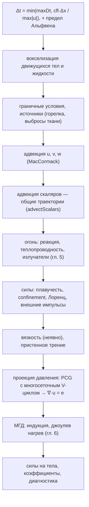

# 4. Газ: уравнения Навье–Стокса на MAC-сетке

[← Частицы](03-particles.md) · [Оглавление](README.md) · [Огонь →](05-fire.md)

**Что это и зачем.** `GasSolver` ([src/gas/GasSolver.h](../src/gas/GasSolver.h)) — решатель несжимаемого газа на разнесённой (MAC) сетке. Он работает как «виртуальная аэродинамическая труба» (сопротивление и подъёмная сила тел, давление по поверхности), как дым и горячий газ в закрытых и открытых объёмах, и как среда, в которой падают, плавают и горят тела и ткани. На нём же построены огонь (гл. 5) и МГД (гл. 6).

---

## Откуда уравнения

Коротко, по шести частям. Вывод целиком в главе [11.6](11-action.md#116-газ).

### Действие

Несжимаемая жидкость по Арнольду (1966): частицы движутся отображением $X(\mathbf a, t)$, и

$$
S = \int\!\!\int \Big(\tfrac12\rho\,|\partial_t X|^2 - p\,\big(\det\nabla_{\mathbf a}X - 1\big) - \rho'\,g\,y\Big)\,d^3a\,dt .
$$

Давление $p$ есть множитель Лагранжа связи «объём не меняется». Симметрии: сдвиг во времени даёт энергию, перемаркировка частиц даёт теорему Кельвина о циркуляции.

### Уравнения

Вариация даёт уравнение Эйлера с плавучестью. Вязкость добавляет функция Рэлея $R = \nu\rho\int|\mathbf S|^2\,dV$, отсюда член $\nu\rho\nabla^2\mathbf u$ и $dK/dt = -2R$: кинетическая энергия убывает ровно на вязкое рассеяние.

### Дискретизация

Проекция давления ищет ближайшее бездивергентное поле, и давление в ней точно множитель связи $\nabla\cdot\mathbf u = 0$. Проекция энергию только отнимает. Полулагранжев перенос не вариационный: он рассеивает энергию сам, без вязкости.

### Код

Проекция: [PressureSolver.cpp:22](../src/gas/PressureSolver.cpp#L22). Вязкость неявным Эйлером: [GasSolver.cpp:350](../src/gas/GasSolver.cpp#L350).

### Графики

Вихрь Тейлора–Грина: потеря энергии решателем, вязкое рассеяние по Рэлею и точная потеря $K_0(1 - e^{-4\nu\pi^2t})$.


### Границы

На сетке 32 численная диссипация переноса составляет 13.8 % потери энергии. Счёт $|\mathbf S|^2$ по центрам ячеек занижает вязкое рассеяние на 3.4 % (тест `action: viscous dissipation 2 nu |S|^2 of a Taylor-Green vortex`).

---

## 4.1 Уравнения

Несжимаемый газ постоянной плотности $\rho$:

$$
\frac{\partial\mathbf u}{\partial t} + (\mathbf u\cdot\nabla)\mathbf u = -\frac{1}{\rho}\nabla p + \nu\nabla^2\mathbf u + \mathbf f, \qquad
\nabla\cdot\mathbf u = e .
$$

| Символ | Смысл | Единицы |
|---|---|---|
| $\mathbf u$ | скорость газа | м/с |
| $p$ | давление (избыточное, без гидростатики) | Па |
| $\nu$ | кинематическая вязкость (воздух 1.5e-5) | м²/с |
| $\mathbf f$ | массовые силы: плавучесть, vorticity confinement, сила Лоренца | м/с² |
| $e$ | источник объёма: расширение сгоревшего газа (гл. 5), иначе 0 | 1/с |

Скаляры (дым $S$, температура $T$, топливо $Y$, продукты сгорания $P$) переносятся потоком: $\partial\phi/\partial t + \mathbf u\cdot\nabla\phi = \text{источники}$.

**Расщепление по физическим процессам** — шаг `GasSolver::step` ([GasSolver.cpp:390](../src/gas/GasSolver.cpp#L390)):



Шаг адаптивный: $\Delta t \le \text{cfl}\cdot\Delta x/u_{max}$ с `cfl` = 2. Полулагранжева адвекция безусловно устойчива, поэтому CFL больше 1 допустим — он ограничивает только точность.

---

## 4.2 MAC-сетка

Домен делится на $n_x\times n_y\times n_z$ кубических ячеек со стороной $\Delta x$ = `domainSize.x / resolutionX`. Величины живут в разных местах ячейки (Harlow & Welch 1965):


- **Давление и скаляры** — в центрах ячеек.
- **Компоненты скорости** — на гранях, по нормали к грани: $u$ на $x$-гранях, $v$ на $y$-гранях, $w$ на $z$-гранях.

Каждая компонента — отдельный `Field3` ([Field3.h](../src/gas/Field3.h)) со своим смещением `offset` (в ячейках) и размерами:

[src/gas/GasSolver.cpp:65](../src/gas/GasSolver.cpp#L65)
```cpp
u_.init(nx_ + 1, ny_, nz_, {0, 0.5f, 0.5f}, u0);
v_.init(nx_, ny_ + 1, nz_, {0.5f, 0, 0.5f});
w_.init(nx_, ny_, nz_ + 1, {0.5f, 0.5f, 0});
u0_ = u_; v0_ = v_; w0_ = w_;
p_.init(nx_, ny_, nz_, Vector3(0.5f));
smoke_.init(nx_, ny_, nz_, Vector3(0.5f));
```

Зачем разносить: дивергенция ячейки и градиент давления на грани получаются **центральными разностями без усреднения**:

$$
(\nabla\cdot\mathbf u)_{ijk} = \frac{u_{i+1} - u_i + v_{j+1} - v_j + w_{k+1} - w_k}{\Delta x}, \qquad
\left(\frac{\partial p}{\partial x}\right)_{i} = \frac{p_{i} - p_{i-1}}{\Delta x}.
$$

На совмещённой сетке такие разности «не видят» шахматные колебания давления, а на MAC-сетке их нет.

`Field3::sample(gp)` — трилинейная интерполяция в точке `gp` (в ячейках от начала домена) с отсечением по краям; `sampleMinMax` — минимум и максимум 8 соседних значений (для ограничителя MacCormack).

---

## 4.3 Адвекция: полулагранжев метод и MacCormack

### Полулагранжев шаг

Значение в узле $\mathbf x$ через $\Delta t$ — это значение в точке, откуда туда пришла частица газа (Stam 1999). Точка отправления находится обратной трассировкой методом Рунге–Кутты 2-го порядка:

$$
\mathbf x_{mid} = \mathbf x - \tfrac12\Delta t\,\mathbf u(\mathbf x), \qquad
\mathbf x_{dep} = \mathbf x - \Delta t\,\mathbf u(\mathbf x_{mid}), \qquad
\phi^{n+1}(\mathbf x) = \phi^n(\mathbf x_{dep}).
$$

[src/gas/Advection.cpp:15](../src/gas/Advection.cpp#L15)
```cpp
Vector3 GasSolver::backtrace(const Vector3& gp, float dt) const {
    Vector3 v1 = sampleVelGrid(gp);
    Vector3 mid = gp - v1 * (0.5f * dt);
    Vector3 v2 = sampleVelGrid(mid);
    return gp - v2 * dt;
}
```

Метод безусловно устойчив (новое значение — интерполяция старых, экстремумы не растут), но диффузен: интерполяция размывает дым и вихри.

### MacCormack с ограничителем

Selle, Fedkiw, Kim, Liu, Rossignac (2008) — поправка до второго порядка из двух полулагранжевых шагов. Пусть $\mathcal A$ — шаг вперёд, $\mathcal A^R$ — шаг назад (с $-\Delta t$):

$$
\hat\phi = \mathcal A(\phi^n), \qquad
\tilde\phi = \mathcal A^R(\hat\phi), \qquad
\phi^{n+1} = \hat\phi + \tfrac12\big(\phi^n - \tilde\phi\big).
$$

Разница $\phi^n - \tilde\phi$ — ошибка «туда и обратно», половина её компенсируется. Поправка может создать новые экстремумы (осцилляции), поэтому **ограничитель**: если результат выходит за $[\min, \max]$ восьми значений вокруг точки отправления, берётся простой полулагранжев результат $\hat\phi$.

### Общие траектории для всех скаляров

Дым, температура, топливо и продукты переносятся **одним и тем же** потоком. Значит, точки отправления (и прибытия — для обратного шага MacCormack) достаточно найти **один раз** для всех скаляров ([Advection.cpp:68](../src/gas/Advection.cpp#L68)):

[src/gas/Advection.cpp:84](../src/gas/Advection.cpp#L84)
```cpp
parallelFor(nz_, [&](int k) {
    for (int j = 0; j < ny_; ++j)
        for (int i = 0; i < nx_; ++i) {
            const size_t c = cidx(i, j, k);
            const Vector3 gp(i + 0.5f, j + 0.5f, k + 0.5f);
            departure_[c] = backtrace(gp, dt);
            arrival_[c] = backtrace(gp, -dt);
            fromOutside_[c] = uint8_t(outside(departure_[c]) | (outside(arrival_[c]) << 1));
        }
}, 1);
for (Field3* field : fields) {
    Field3& f = *field;
    t1_.init(nx_, ny_, nz_, f.offset);
    t2_.init(nx_, ny_, nz_, f.offset);
    parallelFor(int(n), [&](int c) { t1_.d[c] = (fromOutside_[c] & 1) ? 0.0f : f.sample(departure_[c]); }, 4096);
    if (params.maccormack) {
        // MacCormack: trace the result back, correct by half the round-trip error, fall back to
        // the plain value where the correction leaves the range of the departure cell (limiter).
        parallelFor(int(n), [&](int c) { t2_.d[c] = (fromOutside_[c] & 2) ? 0.0f : t1_.sample(arrival_[c]); }, 4096);
        parallelFor(int(n), [&](int c) {
            if (fromOutside_[c] & 1) return;
            const float val = t1_.d[c] + 0.5f * (f.d[c] - t2_.d[c]);
            float lo, hi;
            f.sampleMinMax(departure_[c], lo, hi);
            if (val >= lo && val <= hi) t1_.d[c] = val;
        }, 4096);
    }
    f.d.swap(t1_.d);
}
```

Каждая трассировка — 2 трилинейные выборки трёх компонент скорости. В сцене «Огонь» четыре скаляра, и общая трассировка сократила шаг сетки с **48 до 32 мс**.

> **Важно:** то, что приходит через открытую сторону домена (приток или сток), — чистый окружающий газ: дым, перегрев, топливо и продукты равны 0 (`fromOutside_`), а не копия граничной ячейки.

---

## 4.4 Силы

`addForces` ([GasSolver.cpp:265](../src/gas/GasSolver.cpp#L265)).

**Плавучесть.** Сетка не хранит гидростатического давления, поэтому подъёмная сила горячего газа добавляется явно на $y$-грани:

$$
f_y = \begin{cases} \beta_T\,T - \beta_S\,S, & \text{Буссинеск (дым)}\\[2pt] g\,\dfrac{T}{T_0 + T} - \beta_S\,S, & \text{огонь: идеальный газ}\end{cases}
$$

где $T$ — перегрев над окружающим газом, $T_0$ — температура окружающего газа, $\beta_T$ = `heatBuoyancy`, $\beta_S$ = `smokeBuoyancy` (дым тяжелее воздуха и оседает). Для огня форма Буссинеска $gT/T_0$ завышает подъём в разы при температуре пламени, поэтому используется точная форма для идеального газа (гл. 5.2).

**Vorticity confinement** (Fedkiw, Stam, Jensen 2001) возвращает мелкие вихри, которые сетка теряет из-за численной вязкости:

$$
\boldsymbol\omega = \nabla\times\mathbf u, \qquad
\mathbf N = \frac{\nabla|\boldsymbol\omega|}{|\nabla|\boldsymbol\omega||}, \qquad
\mathbf f_{conf} = \epsilon\,\Delta x\,(\mathbf N\times\boldsymbol\omega).
$$

Сила считается в центрах ячеек и усредняется на грани.

**Вязкость** — неявный шаг для каждой компоненты скорости на её гранях ([Viscosity.cpp:44](../src/gas/Viscosity.cpp#L44)):

$$(\mathbf I - a\,\mathbf L)\,\mathbf u^{new} = \mathbf u - \frac{\Delta t}{\rho}\nabla p^{old},\qquad a = \frac{\nu\,\Delta t}{\Delta x^2},$$

после чего $\frac{\Delta t}{\rho}\nabla p^{old}$ прибавляется обратно и поле идёт в проекцию. Пропускается, если $a < 10^{-3}$: для воздуха физическая вязкость на такой сетке много меньше численной вязкости адвекции. Три детали делают ответ вторым порядком и не зависящим от шага по времени. Их нашли случаи верификации `gas-poiseuille` и `gas-couette` (глава 10):

- **Прилипание на самой стенке.** Отсчёт скорости, у которого обе ячейки твёрдые, лежит на полъячейки внутри стены. Если взять его как есть, стенка сдвигается на полъячейки, и профиль у стенки получается только первого порядка. Вместо него берётся призрачное значение $u_{ghost} = 2u_{wall} - u$: прямая через отсчёт газа и собственную скорость стенки на твёрдой грани между ними (Gibou, Fedkiw, Cheng & Kang 2002). У подвижного тела $u_{wall}$ равна скорости его точки на этой грани ([Viscosity.cpp:128](../src/gas/Viscosity.cpp#L128)). Матрица остаётся симметричной: призрак только добавляет $a$ к диагонали.
- **Решение до допуска.** Сопряжённые градиенты с диагональным предобуславливателем идут до относительной невязки `viscosityTolerance` = $10^{-6}$ ([Viscosity.cpp:183](../src/gas/Viscosity.cpp#L183)). Раньше было ровно 20 итераций Якоби. Оставшаяся ошибка зависела от $a$, то есть от шага, и стационарный профиль вместе с ней.
- **Поправка давления в приращениях** (Goda 1979; van Kan 1986; Guermond, Minev & Shen 2006). Старый градиент давления входит в правую часть и возвращается после решения ([Viscosity.cpp:85](../src/gas/Viscosity.cpp#L85)). Проекция начинает со старого давления, поэтому решает ровно для его приращения. Без этого шаг вязкости не видит силу давления, и после проекции стенка проскальзывает на $\Delta t\,|\nabla p|/\rho$. Это первый порядок по $\Delta t$, на 8 ячейках канала Пуазейля около четверти средней скорости. Где вязкость пропускается, схема совпадает с прежней.

| Случай, $\mathrm{Re} = 2$ | Порядок до | Порядок после | Профили при Куранте 0.5 и 0.1 |
|---|---|---|---|
| Пуазейль | 0.97 | **1.96** | было 0.165 и 0.135 от $U$, стало расхождение $2.9\cdot10^{-5}\,U$ |
| Куэтт–Пуазейль, крышка движется | 0.95 (чистый Куэтт) | **1.96** | расхождение $6.2\cdot10^{-7}\,U$ |
| Чистый Куэтт, линейный профиль | 0.95 | точно: ошибка $1.0\cdot10^{-5}\,U$ на всех сетках | — |

Линейный профиль схема второго порядка передаёт без ошибки, остаётся только допуск решателей. Поэтому порядок проверяется на течении Куэтта–Пуазейля, где у профиля есть кривизна.

**Внешние импульсы** (`addImpulse`) — например, реакция сопротивления ткани. Импульс раскладывается по окрестным граням с трилинейными весами, сумма весов 1: газ получает ровно этот импульс ([MovingSolids.cpp:123](../src/gas/MovingSolids.cpp#L123)).

---

## 4.5 Проекция давления

После адвекции и сил поле $\mathbf u^*$ не бездивергентно. Проекция вычитает градиент давления так, чтобы $\nabla\cdot\mathbf u^{n+1} = e$:

$$
\mathbf u^{n+1} = \mathbf u^* - \frac{\Delta t}{\rho}\nabla p, \qquad
\nabla\cdot\mathbf u^{n+1} = e \ \Rightarrow\
\frac{\Delta t}{\rho}\nabla^2 p = \nabla\cdot\mathbf u^* - e .
$$

В коде удобно решать для безразмерного $q = p\,\Delta t/(\rho\,\Delta x)$. Тогда уравнение ячейки — дискретный лапласиан со «сток-исток» правой частью:

$$
d_c\,q_c - \sum_{n\in\text{газ}} q_n = b_c, \qquad
b_c = -\big(u_{i+1} - u_i + v_{j+1} - v_j + w_{k+1} - w_k\big) + e_c\,\Delta x,
$$

$d_c$ — число соседей-газов плюс сторон с условием Дирихле (сток, $p = 0$). Твёрдые соседи и стенки — условие Неймана ($\partial p/\partial n = 0$): они просто не входят в сумму и в $d_c$ ([GasSolver.cpp:139](../src/gas/GasSolver.cpp#L139)). Затем $u_i \mathrel{-}= q_i - q_{i-1}$ на гранях между двумя газовыми ячейками.

### Сопряжённые градиенты с предобуславливателем Якоби

Матрица $\mathbf A$ симметрична и положительно (полу)определена — метод сопряжённых градиентов (PCG) в `double`. Простейший предобуславливатель — диагональный, $\mathbf z = \mathbf D^{-1}\mathbf r$ (`pressurePreconditioner = Jacobi`). По умолчанию вместо него работает многосеточный V-цикл, о нём следующий раздел. Сам метод один и тот же, меняется только строка, где из $\mathbf r$ получается $\mathbf z$:

[src/gas/PressureSolver.cpp:187](../src/gas/PressureSolver.cpp#L187)
```cpp
for (; it < params.maxPressureIterations && rnorm > tol; ++it) {
    applyA(s_, As_);
    double sAs = dotp(s_, As_);
    if (std::fabs(sAs) < 1e-30) break;
    double alpha = rz / sAs;
    struct Two {
        double a = 0, b = 0;
        Two& operator+=(const Two& o) { a += o.a; b += o.b; return *this; }
    };
    Two t = parallelSum<Two>(int(n), [&](int c0, int c1) {
        Two x;
        for (int c = c0; c < c1; ++c) {
            q_[c] += alpha * s_[c];
            r_[c] -= alpha * As_[c];
            z_[c] = diagW_[c] > 0 ? r_[c] / diagW_[c] : 0.0;
            x.a += r_[c] * z_[c];
            x.b += r_[c] * r_[c];
        }
        return x;
    }, 4096);
    double rzNew = t.a, rr = t.b;
    rnorm = std::sqrt(rr);
    double beta = rzNew / rz;
    rz = rzNew;
    parallelFor(int(long(n)), [&](int c_) {
        long c = c_; s_[c] = z_[c] + beta * s_[c];
    }, 4096);
}
```

- Критерий остановки — относительная невязка $\lVert\mathbf r\rVert \le$ `pressureTolerance`$\cdot\lVert\mathbf b\rVert$ (по умолчанию 1e-4), не более `maxPressureIterations` = 400.
- Тёплый старт: начальное $q$ — давление прошлого шага. Давление меняется плавно, и итераций нужно меньше.
- Обновление $\mathbf q$, $\mathbf r$, $\mathbf z$ и оба скалярных произведения делаются **за один параллельный проход** — мало синхронизаций (поэтому собственный пул потоков, а не OpenMP).

### Многосеточный предобуславливатель (MGPCG)

Якоби выравнивает масштаб каждой ячейки, но не видит длинных волн давления. Ошибка длиной во весь домен за одну итерацию сдвигается лишь на одну ячейку, поэтому итераций нужно порядка $n$ на сторону. На сетке $128^3$ это уже 500 итераций. Многосеточный метод убирает все длины волн сразу. Короткие гасит сглаживание на мелкой сетке. Длинные на сетке вдвое грубее становятся вдвое короче, и там их гасит то же сглаживание, и так далее до сетки в несколько сотен ячеек. Один такой V-цикл служит предобуславливателем $\mathbf z = \mathbf V(\mathbf r)$ того же метода сопряжённых градиентов (MGPCG, McAdams, Sifakis, Teran 2010) ([Multigrid.h](../src/gas/Multigrid.h)).

[src/gas/Multigrid.cpp:316](../src/gas/Multigrid.cpp#L316)
```cpp
void PressureMultigrid::vcycle(int level) {
    Level& L = levels_[size_t(level)];
    std::fill(L.x.begin(), L.x.end(), 0.0);
    if (level + 1 == int(levels_.size())) {
        smooth(L, kCoarsestSweeps, true);
        smooth(L, kCoarsestSweeps, false);
        return;
    }
    Level& C = levels_[size_t(level) + 1];
    smoothBand(L, kBandSweeps, true);
    smooth(L, smoothingSweeps, true);
    computeResidual(L);
    restrictResidual(L, C);
    vcycle(level + 1);
    interpolateCorrection(C, L);
    smooth(L, smoothingSweeps, false);
    smoothBand(L, kBandSweeps, false);
}
```

Из чего собран цикл:

- **Уровни.** Каждая ось, где не меньше 4 ячеек, делится пополам, пока на уровне больше 512 ячеек. Тонкий домен (цилиндр Штроухаля, $96\times96\times12$) сначала огрубляется по всем осям, потом только по толстым.
- **Грубая грань** — среднее весов мелких граней, которые она накрывает, делённое на $f^2$ ($f = 2$ вдоль огрублённой оси). Лапласиан сетки с шагом $2h$ связывает соседей вчетверо слабее. Мелкая ячейка за пределами домена считается стенкой. Стенки, тела и открытые стороны домена переходят на грубые уровни сами, через нулевые и ненулевые веса.
- **Перенос вниз и вверх.** Вверх поправка переносится трилинейной интерполяцией между центрами ячеек, с весами $3/4$ и $1/4$ по оси. Если соседняя грубая ячейка внутри стены, её вес отбрасывается, а остальные нормируются. Вниз невязка переносится транспонированной интерполяцией, делённой на 2 по каждой огрублённой оси, поэтому гладкая невязка приходит своим средним.
- **Сглаживание** — красно-чёрный Гаусс–Зейдель, 2 прохода. До спуска идут красные, потом чёрные ячейки, после подъёма в обратном порядке. Так V-цикл симметричен, а методу сопряжённых градиентов нужен именно симметричный положительно определённый предобуславливатель. Ячейки одного цвета соседей своего цвета не имеют, поэтому они обновляются параллельно.
- **Полоса у тел.** Рядом с телом грубые уровни повторяют мелкий лишь приблизительно: грубая ячейка, наполовину занятая телом, всё ещё считается газом. Без поправки там оставались пики невязки. При том же допуске $10^{-4}$ худшая дивергенция у тел была вчетверо больше, чем у Якоби. Покоящиеся на дне ящика тела дрожали со скоростью 0.08 м/с, а граница магнитосферы при допуске сцены $10^{-3}$ сдвигалась с 0.32 до 0.20 м. Поэтому ячейки у твёрдых стенок внутри сетки и их соседи получают по 2 лишних прохода до и после основного сглаживания, как у McAdams et al. (2010, разд. 4). Прямые стенки домена в полосу не входят: каждый уровень передаёт их точно. После поправки тела стоят (0.000 м/с), а магнитосфера даёт 0.32 м, как и полностью сошедшееся решение обоих методов при допуске $10^{-5}$.
- **Самый грубый уровень** решается 20 проходами вперёд и 20 назад.
- **Страховка.** Если скалярное произведение $\mathbf s\cdot\mathbf A\mathbf s$ или $\mathbf r\cdot\mathbf z$ выйдет не положительным, значит V-цикл для этой матрицы не годится. Тогда решение продолжает PCG Якоби с того же $\mathbf q$, а счётчик `gas/multigrid fallbacks` в Probe растёт. Тест проверяет, что он остаётся нулём.
- **Память.** Уровни выделяются при первом шаге и при смене размера сетки. Шаг газа ничего не выделяет.

Проверка (тест `gas: multigrid pressure matches PCG and converges in few iterations`) идёт на кубе 1 м со сферой $R$ = 0.2 м в потоке 1 м/с. Первая проекция из покоя — полное решение уравнения Пуассона без тёплого старта. При допуске $10^{-7}$ на сетке $48^3$ течения Якоби и MGPCG расходятся не больше чем на $2.4\cdot10^{-7}$ м/с. При допуске $10^{-4}$:

| Сетка | PCG Якоби, итераций | MGPCG, итераций | Якоби, мс | MGPCG, мс | Быстрее |
|---|---|---|---|---|---|
| $32^3$ | 122 | 6 | 43 | 34 | 1.3× |
| $64^3$ | 247 | 7 | 477 | 140 | 3.4× |
| $128^3$ | 496 | 8 | 7930 | 962 | 8.2× |

У Якоби число итераций растёт как $n$, у V-цикла почти не растёт. Цикл стоит примерно 7 итераций Якоби, поэтому на малой сетке выигрыша нет, а с ростом сетки он растёт.

В сценах давление решается с тёплого старта, из давления прошлого шага. Ниже миллисекунды давления на кадр, медиана трёх кругов подряд: Якоби, потом многосеточный, после 30 кадров разгона, по 60 кадров. Замер запускается отдельно:

```bat
set RF_TEST=benchmark: gas pressure
rf_tests.exe
```

| Сцена | Сетка | Якоби, мс | MGPCG, мс | Итераций Якоби / MGPCG | Быстрее |
|---|---|---|---|---|---|
| дым в закрытом ящике | 64×64×64 | 203 | 64 | 125 / 3 | 3.2× |
| огонь: горелка и штора | 40×53×33 | 158 | 95 | 145 / 5 | 1.7× |
| аэротруба: сфера | 96×48×48 | 216 | 100 | 143 / 4 | 2.2× |
| аэротруба: цилиндр | 96×48×48 | 330 | 104 | 168 / 5 | 3.2× |
| плазма: магнитосфера, веса Бориса | 60×35×35 | 175 | 111 | 53 / 3 | 1.6× |

Абсолютные миллисекунды завышены: в момент замера процессор был занят другими программами. Отношение честное, потому что оба решателя шли вперемежку в одни и те же минуты. Без полосы у тел (см. выше) выигрыш был 2.2–4.2×, но у тел оставались пики дивергенции. Полоса стоит части скорости и того стоит.

### Совместность замкнутых областей

Если область газа со всех сторон окружена стенками (закрытый ящик, карман под упавшим телом), уравнение Пуассона с условием Неймана разрешимо только при нулевом суммарном притоке:

$$
\int_\Omega \nabla\cdot\mathbf u\,dV = \oint_{\partial\Omega}\mathbf u\cdot\mathbf n\,dS = 0 .
$$

Движущееся тело, сжимающее закрытый объём, или расширяющийся горящий газ в закрытом ящике это условие нарушают, и PCG не сходится. Поэтому области газа находятся заливкой (6-связность), для каждой отмечается, касается ли она стока, и в каждой **закрытой** области из правой части вычитается её среднее ([PressureSolver.cpp:85](../src/gas/PressureSolver.cpp#L85)). Диагностика `maxDivergence()` учитывает это среднее: она измеряет только ту часть дивергенции, за которую отвечает проекция.

---

## 4.6 Граничные условия

`params.bc[6]` — для сторон $-x, +x, -y, +y, -z, +z$ ([GasSolver.cpp:194](../src/gas/GasSolver.cpp#L194)):

| Тип | Нормальная скорость на границе | Давление | Скаляры, пришедшие снаружи |
|---|---|---|---|
| `Wall` | 0 | Нейман | — |
| `Inflow` | $\pm U$ (`inflowSpeed`) | Нейман | 0 (чистый газ) |
| `Outflow` | копия изнутри, только **наружу** | Дирихле $p = 0$ | 0 |

Грани у твёрдых ячеек несут скорость тела (раздел 4.7) или 0 для статического препятствия.

---

## 4.7 Движущиеся тела: двусторонняя связь

Bridson, *Fluid Simulation for Computer Graphics*, гл. 5; Crane, Llamas, Tariq, *GPU Gems 3*, гл. 30.

### Тело → газ

Каждый шаг тела **вокселизуются** ([MovingSolids.cpp:13](../src/gas/MovingSolids.cpp#L13)): ячейка твёрдая, если её центр внутри тела (`MovingSolid::inside`). Грани вокруг твёрдой ячейки получают скорость точки тела

$$
\mathbf u_{face} = \mathbf v + \boldsymbol\omega\times(\mathbf x_{face} - \mathbf x_{body})
$$

(условие непротекания), и проекция давления сама расталкивает газ с пути тела.

- Спящее тело (`resting`) использует ячейки прошлой вокселизации — без проверок «внутри».
- Дым, тепло и топливо ячеек, в которые въехало тело, **выталкиваются** в соседние газовые ячейки, а не исчезают внутри тела.
- **Жидкость** (частицы гл. 3) — тоже движущееся препятствие: ячейки с частицами твёрдые и движутся со средней скоростью своих частиц (`setLiquid`).

### Газ → тело

Сила и момент давления — сумма по граням тела, выходящим в газ ([MovingSolids.cpp:160](../src/gas/MovingSolids.cpp#L160)):

$$
\mathbf F = -\sum_{faces} p\,\mathbf n\,\Delta x^2, \qquad
\boldsymbol\tau = \sum_{faces}(\mathbf x_f - \mathbf x_{body})\times\big(-p\,\mathbf n\,\Delta x^2\big).
$$

### Слабая (разнесённая) связь по кадрам

`Simulation::stepGasWithBodies` ([Coupling.cpp:190](../src/scene/Coupling.cpp#L190)), один обмен за кадр:

1. **газ → тела**: импульсы давления, накопленные за шаги газа прошлого кадра, плюс **архимедова сила газа** $\rho_{gas}V\,|\mathbf g|\,\Delta t$ — сетка Буссинеска не несёт гидростатического давления, поэтому выталкивающая сила добавляется явно;
2. подшаги твёрдых тел (с частицами — вперемешку);
3. **тела → газ**: тела в новых позах и скоростях — движущиеся границы для шагов газа, покрывающих тот же кадр.

Спящее тело не будится шумом давления ниже половины порога сна.

---

## 4.8 Пристенное трение (wall function)

Пограничный слой у стенки (~мм) намного тоньше ячейки (см). Разрешить его сетка не может, поэтому касательное напряжение берётся из корреляций для плоской пластины (Schlichting):

$$
\mathrm{Re} = \frac{|\mathbf u_t|\,L}{\nu}, \qquad
C_f = \begin{cases} 1.328/\sqrt{\mathrm{Re}}, & \mathrm{Re} < 5\cdot10^5 \ \text{(ламинарный)}\\ 0.074\,\mathrm{Re}^{-0.2}, & \text{иначе (турбулентный)}\end{cases}
\qquad
\boldsymbol\tau = \tfrac12\rho\,C_f\,|\mathbf u_t|\,\mathbf u_t,
$$

где $\mathbf u_t$ — касательная скорость газа в ячейке у стенки относительно стенки, $L$ — характерный размер тела.

Импульс, отобранный у газа, отдаётся телу (действие = противодействие). Трение применяется **неявно** — оно не может развернуть поток:

$$
\Delta\mathbf u_t = -\mathbf u_t\,\frac{\kappa}{1 + \kappa}, \qquad \kappa = \tfrac12 C_f\,|\mathbf u_t|\,\frac{\Delta t}{\Delta x}.
$$

[src/gas/MovingSolids.cpp:268](../src/gas/MovingSolids.cpp#L268)
```cpp
const float mag = length(rel);
if (mag < 1e-6f) continue;
const float L = owner >= 0 ? moving_[owner].length : staticLength_;
const float cf = skinFrictionCoefficient(mag * L / nu);
const float kk = 0.5f * cf * mag * dt / dx_;
const Vector3 delta = rel * (-kk / (1.0f + kk));
```

$C_f$ считает одна функция `skinFrictionCoefficient` ([GasSolver.h:90](../src/gas/GasSolver.h#L90)) — её же использует `SurfaceLoads`, поэтому решатель и нагрузки по треугольникам сообщают одно и то же трение.

---

## 4.9 Нагрузки на треугольники поверхности

`computeSurfaceLoads` ([SurfaceLoads.cpp:9](../src/gas/SurfaceLoads.cpp#L9)) — распределение нагрузки по **настоящему** мешу тела, а не по ступенчатым вокселям:

1. Для каждого треугольника газ читается на расстоянии $1\Delta x$ и $2\Delta x$ по нормали, интерполяцией **только по газовым ячейкам** (`fluidPressureAt`) — вокселизованное тело может выступать за истинную поверхность на полячейки.
2. Давление экстраполируется к стенке линейно: $p_{wall} = 2p(1\Delta x) - p(2\Delta x)$. Чтение на одной ячейке пропустило бы рост давления к точке торможения ($C_p$ 0.7 вместо 1).
3. Коэффициент давления, трение и сила:

$$
C_p = \frac{p}{q_\infty}, \quad q_\infty = \tfrac12\rho U^2, \qquad
\mathbf F_{tri} = (-p\,\mathbf n + \boldsymbol\tau)\,A_{tri}.
$$

4. Суммы дают силы давления и трения, момент относительно опорной точки и коэффициенты $C_d, C_l, C_s, C_m$ с разделением сопротивления на **форму** и **трение**. `saveSurfaceLoadsCsv` пишет строку на треугольник: центр, нормаль, площадь, $C_p$, $C_f$, сила.

Интегральные коэффициенты решателя ([MovingSolids.cpp:273](../src/gas/MovingSolids.cpp#L273)): $C_d = F_x/(q_\infty A_{ref})$, где $A_{ref}$ — площадь проекции вокселизованного тела (лобовая или в плане — `usePlanformArea`). Средние значения `dragCoefficientAvg()` — экспоненциальное скользящее среднее за время прохода потока через домен.

---

## 4.10 Газ ↔ ткань и газ ↔ жидкость

`Simulation::applyGasDragOnCloth` ([Coupling.cpp:67](../src/scene/Coupling.cpp#L67)). Каждая частица ткани — площадка $s^2$ с нормалью из соседей по сетке. Относительный ветер $\mathbf w = \mathbf u_{gas} - \mathbf v$ раскладывается на нормальную и касательную части:

$$
\Delta\mathbf v = \mathbf n\,w_n\frac{\kappa_n}{1 + \kappa_n} + \mathbf w_t\frac{\kappa_t}{1 + \kappa_t}, \qquad
\kappa_n = \tfrac12\rho\,C_d\,s^2\,|w_n|\,\frac{\Delta t}{m}, \quad
\kappa_t = \tfrac12\rho\,C_f\,s^2\,|\mathbf w_t|\,\frac{\Delta t}{m},
$$

$C_d$ = 1.2 (плоская пластина), $C_f$ = 0.02. Неявная форма не даёт частице обогнать ветер за шаг. Реакция $-m\Delta\mathbf v$ уходит в газ в той же точке (`addImpulse`) — импульс сохраняется.

`applyGasDragOnLiquid` ([Coupling.cpp:97](../src/scene/Coupling.cpp#L97)): частицы жидкости, касающиеся газа (поверхность, брызги, капли), — сферы радиуса $r$ с $C_d = 0.47$. Ветер срывает брызги и тащит поверхность, летящие капли тормозятся.

---

## 4.11 Параметры

### `GasParams` ([GasSolver.h:35](../src/gas/GasSolver.h#L35))

| Параметр | Смысл | Ед. | По умолчанию |
|---|---|---|---|
| `domainSize` | размер домена (применяется в `reset`) | м | (4, 2, 2) |
| `resolutionX` | ячеек вдоль $x$; $\Delta x$ = size.x / resolutionX | — | 96 |
| `inflowSpeed` | скорость притока $U$; масштаб для $C_p$, $C_d$ | м/с | 10 |
| `fluidDensity` | $\rho$ газа | кг/м³ | 1.225 |
| `kinematicViscosity` | $\nu$ | м²/с | 1.5e-5 |
| `cfl` | число Куранта | — | 2 |
| `maxPressureIterations`, `pressureTolerance` | PCG | —, отн. | 400, 1e-4 |
| `pressurePreconditioner` | предобуславливатель PCG: `Multigrid` (V-цикл) или `Jacobi` | — | Multigrid |
| `maxViscosityIterations`, `viscosityTolerance` | сопряжённые градиенты неявной вязкости, на компоненту | —, отн. | 1000, 1e-6 |
| `maccormack` | второй порядок адвекции | — | true |
| `vorticityConfinement` | $\epsilon$ | — | 0 |
| `smokeRake` | струйки дыма на притоке | — | true |
| `smokeBuoyancy`, `heatBuoyancy` | $\beta_S$, $\beta_T$ (Буссинеск) | м/с² на ед. | 0, 0 |
| `smokeDissipation`, `temperatureDissipation` | экспоненциальное затухание | 1/с | 0, 0 |
| `usePlanformArea` | $A_{ref}$ в плане вместо лобовой | — | false |
| `wallFriction` | пристенное трение | — | true |
| `bc[6]` | стороны −x, +x, −y, +y, −z, +z | — | Inflow, Outflow, Wall ×4 |

### `HeatSource` ([GasSolver.h:57](../src/gas/GasSolver.h#L57))

Сфера `center`, `radius`, в которой поддерживаются `temperature`, `smoke`, `fuel` (горелка), и струя `velocity`.

---

## Проверка

| Тест | Результат |
|---|---|
| `grid convergence` — тепловое пятно ($\alpha = 10^{-3}$ м²/с, 1 с) и перенос гауссова облака дыма потоком 1 м/с на трёх сетках 16/32/64 и 32/64/128 | порядок сходимости по Ричардсону **2.12 → 2.21** (диффузия, GCI на мелкой сетке 1.5 %) и **1.69 → 1.87** (перенос MacCormack, пик 0.97 из 1); две ловушки записаны в тесте: при фиксированном крупном шаге по времени порядок падает до 1.2 (ошибка по времени первого порядка не измельчается), а при числе Куранта ровно 2 обратные трассы попадают в центры ячеек и ошибка переноса обнуляется |
| `benchmark: cylinder vortex street` — вихревая дорожка за цилиндром, Re = 100, труба 8 D высотой (загромождение 12.5 %), 40 с | **St = 0.157** при 0.164 по Williamson (1996) в безграничном потоке и ~0.17 при таком загромождении (Sahin & Owens 2004); амплитуда $C_L$ 0.31 (2D-эталон ≈ 0.33), $C_D$ 1.38 (эталон 1.3–1.4) |
| `grid uniform flow` | однородный поток сохраняется: $\lvert u - U\rvert < 0.05$, $\lvert v\rvert < 0.05$ м/с |
| `grid sphere drag` (64 ячейки на 4 м) | $C_d$(ср.) = **0.678**, $C_l \approx 0$, невязка давления < 1e-4. Эксперимент для докритической сферы 0.4–0.5: грубая сетка без модели турбулентности даёт правильный порядок |
| `surface loads per triangle` | в точке торможения $C_p = 0.90$ (теория 1); $C_d$ = 0.427 = давление 0.422 + трение 0.005; площадь смачивания 0.7826 при точной 0.7854 м² |
| `grid wing lift` | NACA 2412: $C_l$ растёт с углом атаки ($-0.027$ при 0°, 0.141 при 8°) |
| `smoke closed box` | закрытый ящик 32×48×32: $\max\lvert\nabla\cdot\mathbf u\rvert$ = **6.1e-4** 1/с, стенки непроницаемы, дым в $[0, 1]$ |
| `gas <-> rigid bodies` | тела падают сквозь шлейф: $\max\lvert\nabla\cdot\mathbf u\rvert\,\Delta x/U$ = 2.5e-5; блок 1 м/с толкает газ перед собой (0.81 м/с), газ обтекает его сбоку (−0.11 м/с); сфера 200 кг/м³ в газе 50 кг/м³ через 0.5 с: −4.88 м/с при односторонней связи (свободное падение −4.86) и −2.69 м/с при двусторонней |
| `gas + soft bodies + cloth + rigid bodies` | шёлковый платок держится в восходящем потоке: центр на высоте 0.28 м с сопротивлением газа и −1.17 м (на полу) без него |
| производительность | шаг сетки сцены «Огонь»: 48 → **32 мс** после общих траекторий скаляров |

## Литература

- F. H. Harlow, J. E. Welch. *Numerical Calculation of Time-Dependent Viscous Incompressible Flow of Fluid with Free Surface.* Phys. Fluids 8, 1965 (MAC-сетка).
- J. Stam. *Stable Fluids.* SIGGRAPH 1999.
- R. Fedkiw, J. Stam, H. W. Jensen. *Visual Simulation of Smoke.* SIGGRAPH 2001 (vorticity confinement).
- A. Selle, R. Fedkiw, B. Kim, Y. Liu, J. Rossignac. *An Unconditionally Stable MacCormack Method.* J. Sci. Comput. 35, 2008.
- R. Bridson. *Fluid Simulation for Computer Graphics*, 2nd ed., CRC Press 2015.
- K. Crane, I. Llamas, S. Tariq. *Real-Time Simulation and Rendering of 3D Fluids.* GPU Gems 3, гл. 30, 2007.
- H. Schlichting, K. Gersten. *Boundary-Layer Theory*, 9th ed., Springer 2017.
- Y. Saad. *Iterative Methods for Sparse Linear Systems*, 2nd ed., SIAM 2003 (PCG).
- A. McAdams, E. Sifakis, J. Teran. *A Parallel Multigrid Poisson Solver for Fluids Simulation on Large Grids.* SCA 2010 (MGPCG).
- U. Trottenberg, C. W. Oosterlee, A. Schüller. *Multigrid.* Academic Press 2001 (V-цикл, красно-чёрный Гаусс–Зейдель, перенос между уровнями).
