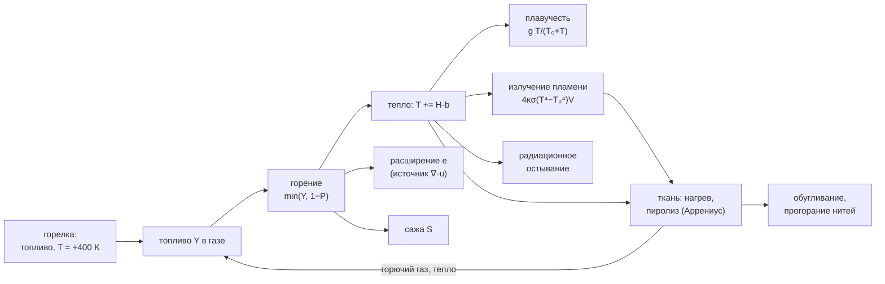
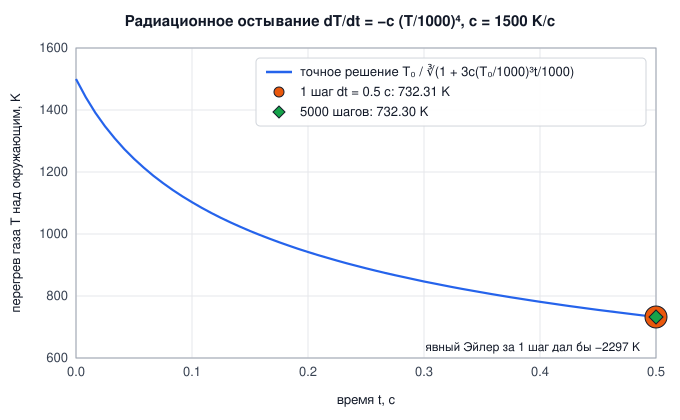
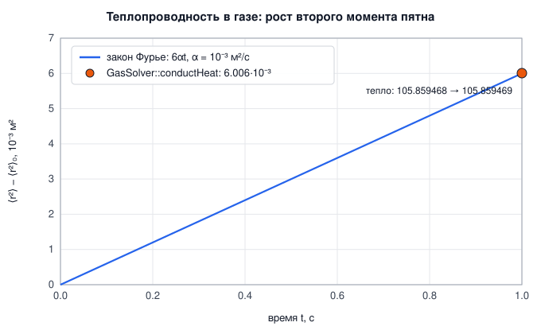
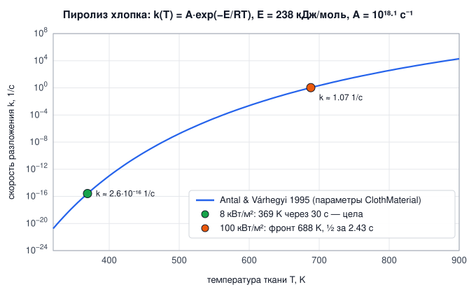
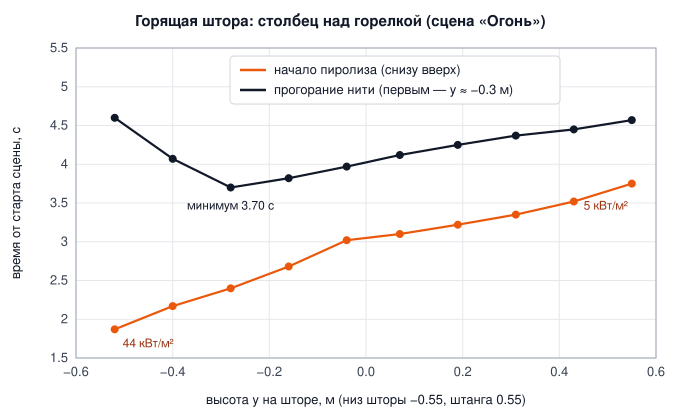

# 5. Огонь

[← Газ](04-gas-navier-stokes.md) · [Оглавление](README.md) · [МГД →](06-mhd-plasma.md)

**Что это и зачем.** Огонь в PhysRealFlow — не частицы-спрайты, а физика: горючий газ сгорает в газе сетки (гл. 4), выделяет тепло, сажу и объём; горячий газ всплывает, светится и остывает излучением; ткань нагревается пламенем, разлагается (пиролиз) и сама выделяет горючий газ. Порога воспламенения ткани в модели **нет** — он получается из кинетики и теплового баланса.

| Часть | Где |
|---|---|
| горение газа, радиационное остывание | `Combustion` — [src/gas/Combustion.h](../src/gas/Combustion.h), [Combustion.cpp](../src/gas/Combustion.cpp) |
| плавучесть, расширение, теплопроводность, излучение пламени | `GasSolver` — [src/gas/GasSolver.cpp](../src/gas/GasSolver.cpp) |
| нагрев, пиролиз, обугливание и прогорание ткани | `burnCloth` — [src/particles/Cloth.cpp](../src/particles/Cloth.cpp#L256) |
| обмен ткань ↔ газ | `Simulation::stepGasWithBodies` — [src/scene/Snapshot.cpp:472](../src/scene/Snapshot.cpp#L472) |

Все температуры в газе огня — **перегрев в кельвинах над окружающим воздухом** $T_0$ = `ambientTemperature` = 293 K. Абсолютная температура $T + T_0$.



---

## 5.1 Модель горения

Nguyen, Fedkiw, Jensen (2002), *Physically Based Modeling and Animation of Fire*, в упрощённой сеточной форме Bridson (*Fluid Simulation for Computer Graphics*, гл. «Fire») — та же модель стоит за Houdini Pyro. Поля ячейки:

| Поле | Смысл | Диапазон |
|---|---|---|
| $Y$ — `fuel_` | концентрация горючего газа; 1 = стехиометрическая смесь с воздухом | ≥ 0 |
| $P$ — `products_` | продукты сгорания: 0 — свежий воздух, 1 — кислорода не осталось | [0, 1] |
| $T$ — `temp_` | перегрев над окружающим воздухом | K |
| $S$ — `smoke_` | плотность сажи/дыма | ≥ 0 |

Все четыре переносятся потоком (общие траектории, гл. 4.3); через открытые стороны приходит свежий воздух ($P = 0$).

### Реакция и кислородный предел

Где газ горячее температуры воспламенения $T_{ign}$, топливо сгорает реакцией первого порядка со скоростью $k$ = `burnRate`. Но сгореть может не больше, чем позволяет **оставшийся кислород** $1 - P$:

$$
b = \min(Y,\ 1 - P)\,\big(1 - e^{-k\Delta t}\big), \qquad
Y \mathrel{-}= b,\quad P \mathrel{+}= b,\quad T \mathrel{+}= H\,b,\quad S \mathrel{+}= s_y\,b,\quad e = \frac{\epsilon\,b}{\Delta t}.
$$

- $1 - e^{-k\Delta t}$ — точная доля для реакции первого порядка за шаг любой длины.
- Ячейка, богатая топливом, горит **только так быстро, как в неё подмешивается свежий воздух**, и никогда не нагревается выше адиабатической температуры пламени: $H$ = `heatRelease` = 1800 K над окружающим воздухом.
- $e$ — скорость расширения сгоревшего газа [1/с]. Она входит в правую часть уравнения давления как источник дивергенции ($\nabla\cdot\mathbf u = e$, гл. 4.5). Расширение выталкивает пламя наружу и заставляет его клубиться.

[src/gas/Combustion.cpp:19](../src/gas/Combustion.cpp#L19)
```cpp
for (int c = b; c < e; ++c) {
    expansionRate[c] = 0;
    if (solid[c]) continue;
    float& T = temperature[c];
    const float air = 1.0f - products[c]; // what can still burn here (oxygen)
    if (fuel[c] > 0 && air > 0 && T >= ignitionTemperature) {
        const float burnt = std::min(fuel[c], air) * burntFraction;
        fuel[c] -= burnt;
        products[c] += burnt;
        T += heatRelease * burnt;
        smoke[c] += sootYield * burnt;
        expansionRate[c] = expansion * burnt / dt;
        burntSum += burnt;
    }
    if (T > 0) {
        const float t = T * 1e-3f;
        T /= std::cbrt(1.0f + k * t * t * t);
    }
}
```

Мощность пламени ([GasSolver.cpp:427](../src/gas/GasSolver.cpp#L427)): каждая единица сгоревшего топлива нагрела ячейку на $H$, поэтому

$$
\dot Q = \frac{\sum b\cdot H\cdot\rho\,c_p\,\Delta x^3}{\Delta t}\quad[\text{Вт}].
$$

### Радиационное остывание — точное решение

Горячий оптически тонкий газ остывает излучением (Стефан–Больцман; Nguyen et al., ур. 7):

$$
\frac{dT}{dt} = -c\left(\frac{T}{1000}\right)^4, \qquad c = \texttt{radiativeCooling} = 1500\ \text{K/с}.
$$

Явный шаг Эйлера здесь неустойчив: при $T = 1500$ K и $\Delta t = 0.5$ с он дал бы $1500 - 1500\cdot1.5^4\cdot0.5 = -2297$ K. Но уравнение решается точно. Для $\theta = T/1000$: $d\theta/dt = -(c/1000)\theta^4$, откуда $\theta^{-3} = \theta_0^{-3} + 3(c/1000)t$ и

$$
T(t) = \frac{T_0}{\sqrt[3]{1 + 3c\,(T_0/1000)^3\,t/1000}} .
$$

Код применяет это решение за шаг любой длины (последние строки фрагмента выше, `k = 3c·10⁻³·Δt`). Большие шаги остаются устойчивыми и точными.



---

## 5.2 Расширение и плавучесть идеального газа

**Расширение** $e$ из реакции добавляется в правую часть проекции: $b_c = -\operatorname{div}_c + e_c\Delta x$ ([PressureSolver.cpp:37](../src/gas/PressureSolver.cpp#L37)). В закрытой области среднее вычитается (гл. 4.5) — иначе горение в закрытом ящике не имело бы решения.

**Плавучесть.** Сетка несжимаемая: каждая ячейка несёт массу $\rho_0\Delta x^3$. Горячий газ при том же давлении легче: $\rho = \rho_0 T_0/(T_0 + T)$. Архимедова сила на объём $(\rho_0 - \rho)g$, отнесённая к массе ячейки $\rho_0$, даёт ускорение

$$
a = g\,\frac{\rho_0 - \rho}{\rho_0} = g\,\frac{T}{T_0 + T} .
$$

Форма Буссинеска $gT/T_0$ верна только при малом перегреве. При 1500 K перегрева она завышает подъём в $(T_0 + T)/T_0 \approx 6$ раз.

[src/gas/Combustion.h:47](../src/gas/Combustion.h#L47)
```cpp
float buoyancy(float temperature) const { return gravity * temperature / (ambientTemperature + temperature); }
```

---

## 5.3 Теплопроводность газа (закон Фурье)

$$
\frac{\partial T}{\partial t} = \nabla\cdot\big(\alpha(T)\,\nabla T\big), \qquad
\alpha(T) = \alpha_0\left(\frac{T + T_0}{T_0}\right)^{1.75},
$$

$\alpha_0$ = `thermalDiffusivity` = 2.2e-5 м²/с (воздух при 293 K). Рост $\propto T^{1.75}$ — из кинетической теории газов ($\alpha \propto \lambda/\rho c_p$, теплопроводность воздуха $\propto T^{0.75}$, плотность $\propto 1/T$).

Дискретизация — в форме потоков через грани, с коэффициентом грани = среднее двух ячеек; через стены и в твёрдые ячейки потока нет. Поэтому тепло сохраняется **точно**. Схема явная, в стольких подшагах, сколько требует устойчивость $6\alpha_{max}h/\Delta x^2 \le 0.9$ ([Heat.cpp:37](../src/gas/Heat.cpp#L37)):

[src/gas/Heat.cpp:25](../src/gas/Heat.cpp#L25)
```cpp
const int steps = std::max(1, int(std::ceil(6.0f * alphaMax * dt / (dx_ * dx_) / 0.9f)));
const float h = dt / float(steps) / (dx_ * dx_);
const long sx = 1, sy = nx_, sz = long(nx_) * ny_;
std::vector<float> T;
for (int s = 0; s < steps; ++s) {
    T = temp_.d;
    parallelFor(nz_, [&](int k) {
        for (int j = 0; j < ny_; ++j)
            for (int i = 0; i < nx_; ++i) {
                const size_t c = cidx(i, j, k);
                if (solid_[c]) continue;
                float flux = 0;
                auto face = [&](bool inside, long step) {
                    if (!inside || solid_[c + step]) return;
                    flux += 0.5f * (alpha[c] + alpha[c + step]) * (T[c + step] - T[c]);
                };
```

**Проверка.** Для диффузии в 3D второй момент пятна растёт линейно при любой его форме: $d\langle r^2\rangle/dt = 6\alpha$.



---

## 5.4 Излучение пламени

Сажистое пламя — **оптически тонкий излучатель** (Siegel & Howell, *Thermal Radiation Heat Transfer*). Ячейка с абсолютной температурой выше 700 K излучает равномерно во все стороны мощность

$$
P_{cell} = 4\kappa\sigma\,\big((T + T_0)^4 - T_0^4\big)\,\Delta x^3, \qquad \kappa = \texttt{absorptionCoefficient} = 2\ \text{м}^{-1}.
$$

Ниже 700 K излучение пламени пренебрежимо. Горячие ячейки собираются в список точечных источников (`collectRadiators`, [Heat.cpp:50](../src/gas/Heat.cpp#L50)), и облучённость в точке — сумма по ним без затенения:

$$
q(\mathbf x) = \sum_{cells}\frac{P_{cell}}{4\pi\max(|\mathbf x - \mathbf x_c|^2,\ \Delta x^2)}\quad[\text{Вт/м}^2].
$$

[src/gas/Heat.cpp:64](../src/gas/Heat.cpp#L64)
```cpp
float GasSolver::irradianceAt(const Vector3& world) const {
    const float minR2 = dx_ * dx_; // a point source is only fair from about a cell away
    float q = 0;
    for (const Radiator& r : radiators_) q += r.power / (4.0f * kPi * std::max(length2(r.position - world), minR2));
    return q;
}
```

Точечный источник корректен только с расстояния ~ячейки, поэтому расстояние ограничено снизу $\Delta x$.

---

## 5.5 Пиролиз хлопка

Ткань (`ClothMaterial::flammable = true`) горит так же, как настоящая: **сама ткань не горит**, она разлагается при нагреве (пиролиз) и выделяет горючий газ, который горит в воздухе как пламя.

`burnCloth` ([Cloth.cpp:256](../src/particles/Cloth.cpp#L256)) — на каждую частицу ткани приходится площадка $A = s^2$ массой $m_0 = \sigma_A A$ в свежем виде. Доля ещё не разложившегося материала $u$ (1 — свежая ткань, 0 — прогорела насквозь). Теплоёмкость площадки убывает по мере горения:

$$
C = m_0\big(\chi + (1 - \chi)\,u\big)\,c_p, \qquad \chi = \texttt{charMassFraction} = 0.2 .
$$

### Шаг 1 — теплопроводность вдоль ткани

Между двумя площадками, соединёнными **целой** нитью основы или утка, течёт тепло через полоску сечением $s\times t$ и длиной $s$:

$$
Q_{a\leftarrow b} = k\,t\,(T_b - T_a)\,\Delta t .
$$

Через прожжённую дыру тепло не идёт. Схема явная: $kt\Delta t/C \ll 1$ ([Cloth.cpp:270](../src/particles/Cloth.cpp#L270)).

### Шаг 2 — нагрев излучением и конвекцией (точно за шаг)

Площадка поглощает излучение пламени $q$ (облучённость из 5.4), сама излучает с обеих сторон и обменивается теплом с газом конвекцией с обеих сторон ($h$ = `heatTransfer`):

$$
R = \varepsilon A\big(q - 2\sigma(T_{abs}^4 - T_0^4)\big), \qquad hA_{2} = 2hA, \qquad
C\frac{dT}{dt} = R + hA_2\,(T_g - T).
$$

При излучении, замороженном на шаг, это линейное уравнение с точным решением — релаксация к температуре газа, сдвинутой на $R/hA_2$:

$$
T_{heated} = T_g + \frac{R}{hA_2} + \left(T - T_g - \frac{R}{hA_2}\right)e^{-hA_2\Delta t/C}.
$$

[src/particles/Cloth.cpp:299](../src/particles/Cloth.cpp#L299)
```cpp
const float Tabs = T + T0;
const float radiation = m.emissivity * area * (irradiance[k] - 2.0f * sigma * (Tabs * Tabs * Tabs * Tabs - T0 * T0 * T0 * T0));
float Theated = hA > 0 ? Tgas + radiation / hA + (T - Tgas - radiation / hA) * std::exp(-hA / heatCapacity * dt)
                       : T + radiation * dt / heatCapacity; // no convection: radiation alone
heatToGas[k] += hA * (0.5f * (T + Theated) - Tgas) * dt;    // a hotter patch warms the gas
```

Горячая площадка отдаёт тепло газу — оно уходит в сетку.

### Шаг 3 — пиролиз по Аррениусу с неявным энергетическим балансом

Скорость разложения — одностадийная глобальная кинетика целлюлозы (Antal & Várhegyi 1995):

$$
k(T) = A\,e^{-E/(R_g T)}, \qquad A = 10^{18.1} = 1.26\cdot10^{18}\ \text{с}^{-1},\quad E = 238\ \text{кДж/моль}.
$$

За шаг разлагается доля $f = 1 - e^{-k(T)\Delta t}$ оставшихся летучих $m_v = m_0(1 - \chi)u$. Разложение **эндотермическое**: оно забирает теплоту пиролиза $H_p$ из площадки. Кинетика очень жёсткая — $k$ растёт в 10 раз на каждые ~50 K. Явная схема здесь либо «проспит» воспламенение, либо разложит всё за один шаг с отрицательной температурой. Поэтому конечная температура $T_{end}$ находится из **неявного** энергетического баланса:

$$
g(T_{end}) = C\,(T_{end} - T_{heated}) + H_p\,m_v\big(1 - e^{-k(T_{end})\Delta t}\big) = 0 .
$$

$g$ монотонно растёт, $g(T_{heated}) \ge 0$, а при $T_{end} = T_{heated} - H_p m_v/C$ (всё разложилось) $g \le 0$. Корень ищется **бисекцией**, 30 шагов:

[src/particles/Cloth.cpp:309](../src/particles/Cloth.cpp#L309)
```cpp
const float volatileMass = freshMass * (1.0f - m.charMassFraction) * unburnt; // [kg] left to decompose
float decomposed = 0;                                                         // fraction of `unburnt`
if (unburnt > 0 && pyrolysisRate(Theated) * dt > 1e-7f) {
    auto balance = [&](float Tend, float& fraction) {
        fraction = 1.0f - std::exp(-pyrolysisRate(Tend) * dt);
        return heatCapacity * (Tend - Theated) + m.pyrolysisHeat * volatileMass * fraction;
    };
    float lo = std::max(-T0 + 1.0f, Theated - m.pyrolysisHeat * volatileMass / heatCapacity), hi = Theated;
    for (int it = 0; it < 30; ++it) {
        const float mid = 0.5f * (lo + hi);
        float f;
        (balance(mid, f) > 0 ? hi : lo) = mid;
    }
    balance(hi, decomposed);
    Theated = hi;
}
```

Разложившиеся летучие уходят в газ как топливо объёмом `fuelYield`$\cdot m_v f$ [м³ стехиометрической смеси]. Значение 5.5 м³/кг: летучие целлюлозы при сгорании дают ~12 МДж/кг, а стехиометрическая смесь ~2.2 МДж/м³ ($1800\ \text{K}\times1231\ \text{Дж/(м³·K)}$). Когда $u < 0.02$, площадка прогорела.

### Шаг 4 — обугливание и прогорание нитей

- Нить, у которой **оба конца** прогорели, распадается (`breakThread`, [Cloth.cpp:332](../src/particles/Cloth.cpp#L332)).
- Обугленная ткань слабеет: прочность нити умножается на $c_{char} + (1 - c_{char})\min(u_a, u_b)$, $c_{char}$ = `charStrength` = 0.001 ([Cloth.cpp:239](../src/particles/Cloth.cpp#L239)). Прогоревшая ткань рвётся под собственным весом.
- Сгоревшая ткань легче: масса частицы $m_0(\chi + (1 - \chi)u)$ ([ParticleSystem.cpp:206](../src/particles/ParticleSystem.cpp#L206)).

### Порога воспламенения нет — он получается сам

В модели нет параметра «температура воспламенения ткани». Площадка начинает быстро разлагаться там, где подводимое тепло обгоняет теплоту реакции и потери (излучение $\propto T^4$, конвекция). Фронт пиролиза устанавливается при температуре, где они уравновешены. Под слабым потоком потери растут быстрее подвода, и ткань просто греется до равновесия.



Тест `cotton pyrolysis` (площадка хлопка 0.2 кг/м² под постоянным лучистым потоком, как в конусном калориметре):

| Поток | Результат |
|---|---|
| 100 кВт/м² | половина массы разложилась за **2.43 с**, фронт пиролиза при **688 K** ($k \approx 1$ 1/с) |
| 8 кВт/м² | через 30 с ткань цела, равновесная температура **369 K** ($k \sim 10^{-16}$ 1/с) — ниже критического потока хлопка (~10–15 кВт/м²) |

---

## 5.6 Связь ткани с газом

`Simulation::stepGasWithBodies` ([Coupling.cpp:190](../src/scene/Coupling.cpp#L190)) один раз за кадр:

[src/scene/Coupling.cpp:194](../src/scene/Coupling.cpp#L194)
```cpp
if (grid.combustion.enabled) {
    std::vector<FireOutput> fire;
    auto gasHeat = [this](const Vector3& x) { return GasHeat{grid.temperatureAt(x), grid.irradianceAt(x)}; };
    particles.burnCloths(frameDt, gasHeat, grid.combustion.ambientTemperature, fire);
    for (const FireOutput& f : fire) grid.addEmission({f.position, f.fuel, f.heat, 0.0f});
}
```

Выбросы добавляются в ячейку в начале следующего шага газа: топливо — $Y \mathrel{+}= V_{fuel}/\Delta x^3$, тепло — $T \mathrel{+}= Q/(\rho\,c_p\,\Delta x^3)$ ([Heat.cpp:71](../src/gas/Heat.cpp#L71)). Цикл замыкается: пламя греет ткань → ткань выделяет газ → газ горит над ней → пламя поднимается выше.

---

## 5.7 Параметры

### `Combustion` ([Combustion.h:26](../src/gas/Combustion.h#L26))

| Параметр | Смысл | Ед. | По умолчанию |
|---|---|---|---|
| `enabled` | огонь включён (тогда $T$ — перегрев в K) | — | false |
| `ambientTemperature` | $T_0$ | K | 293 |
| `ignitionTemperature` | топливо горит в газе горячее этого | K над $T_0$ | 300 |
| `burnRate` | $k$, доля топлива ячейки в секунду | 1/с | 6 |
| `heatRelease` | $H$, нагрев на единицу сгоревшего топлива (адиабатическая температура пламени) | K | 1800 |
| `sootYield` | $s_y$, сажа на единицу топлива | — | 0.2 |
| `expansion` | $\epsilon$, объём продуктов на объём сгоревшего топлива | — | 1 |
| `radiativeCooling` | $c$, скорость остывания газа при +1000 K | K/с | 1500 |
| `absorptionCoefficient` | $\kappa$ сажистого газа | 1/м | 2 |
| `thermalDiffusivity` | $\alpha_0$ воздуха при $T_0$ | м²/с | 2.2e-5 |
| `gravity` | $g$ | м/с² | 9.81 |
| `specificHeat` | $c_p$ газа | Дж/(кг·K) | 1005 |

### `ClothMaterial`, горение ([Cloth.h:42](../src/particles/Cloth.h#L42))

| Параметр | Смысл | Ед. | По умолчанию |
|---|---|---|---|
| `flammable` | ткань горит | — | false |
| `pyrolysisPreExponential` | $A$ | 1/с | 1.26e18 |
| `pyrolysisActivationEnergy` | $E$ | Дж/моль | 238e3 |
| `pyrolysisHeat` | $H_p$, забирается из ткани | Дж/кг | 4e5 |
| `fuelYield` | горючего газа (стехиометрической смеси) на кг | м³/кг | 5.5 |
| `specificHeat` | $c_p$ ткани | Дж/(кг·K) | 1300 |
| `heatTransfer` | $h$, конвекция на сторону | Вт/(м²·K) | 40 |
| `emissivity` | $\varepsilon$ серого тела | — | 0.9 |
| `charMassFraction` | $\chi$, остаток угля | — | 0.2 |
| `charStrength` | доля прочности обугленной ткани | — | 0.001 |
| `conductivity`, `thickness` | $k$ и $t$ для теплопроводности вдоль ткани | Вт/(м·K), м | 0.06, 0.5e-3 |

---

## 5.8 Сцена «Огонь» и наблюдаемая физика

Сцена 23 ([samples/FireScene.cpp](../samples/FireScene.cpp)): угол комнаты 1.2 × 1.6 × 1.0 м, открытый сверху, сетка 3 см. На полу — газовая горелка (сфера 6 см, топливо 1, перегрев 400 K, струя 0.5 м/с вверх). Рядом висит хлопковая штора 0.6 × 1.1 м (0.2 кг/м²) на штанге на высоте 0.55 м; её нижний край — на ладонь выше пламени горелки. Вокруг — ящик, чайник, брошенный мяч и мягкий куб.

Тест `fire: burner ignites a curtain, it burns through` (300 кадров = 5 с):

| Величина | Значение |
|---|---|
| штора воспламеняется | через **1.78 с** |
| огонь поднимается | до штанги |
| прогоревших нитей | **74** |
| максимальная температура пламени | **1542 K** (кислородный предел не даёт перегреться) |
| пиковая мощность | **270 кВт** |

### Снизу загорается, выше прогорает

Столбец ткани над горелкой (диагностический прогон сцены; облучённость — от пламени горелки до воспламенения ткани):

| Высота $y$, м | Излучение пламени до воспламенения, кВт/м² | Начало пиролиза, с | Нить прогорела, с |
|---:|---:|---:|---:|
| 0.55 | 5.0 | 3.75 | 4.57 |
| 0.43 | 6.9 | 3.52 | 4.45 |
| 0.31 | 9.0 | 3.35 | 4.37 |
| 0.19 | 11.6 | 3.22 | 4.25 |
| 0.07 | 14.7 | 3.10 | 4.12 |
| −0.04 | 18.4 | 3.02 | 3.97 |
| −0.16 | 22.7 | 2.68 | 3.82 |
| −0.28 | 27.8 | 2.40 | **3.70** |
| −0.40 | 34.4 | 2.17 | 4.07 |
| −0.52 | 44.0 | **1.87** | 4.60 |



Что здесь происходит физически:

1. **Пиролиз начинается внизу** (1.87 с при $y = -0.52$) — там сильнее всего облучение пламенем горелки (44 кВт/м²), и фронт поднимается вверх. Это **восходящее распространение пламени** по вертикальной поверхности (Quintiere, *Fundamentals of Fire Phenomena*): горящий участок высотой $x_p$ даёт пламя высотой $x_f > x_p$, которое прогревает ткань выше себя, и фронт идёт со скоростью $v \approx (x_f - x_p)/t_{ig}$.
2. **Прогорает первым не самый низ, а участок на ~25 см выше** ($y \approx -0.3$ м, 3.70 с). Горючий газ, выделившийся внизу, уносится потоком вверх и сгорает **над** местом выделения. Кромка шторы стоит в холодном воздухе, который подсасывается в пламя снизу, и её тепло уносит конвекция. А участок чуть выше омывается пламенем, питаемым газом всей ткани ниже плюс горелкой, — суммарный тепловой поток там наибольший, и летучие выгорают быстрее всего.
3. Выше прогорание идёт позже: поток тепла падает с высотой (облучение 27.8 → 5 кВт/м²).

Ни одно из этих чисел не задано в сцене — они следуют из модели.

---

## Проверка

| Тест | Результат |
|---|---|
| `combustion` — остывание от 1500 K за 0.5 с | **732.31 K за 1 шаг** против **732.30 K за 5000 шагов** — интегратор точный |
| `combustion` — кислородный предел | ячейка с 10-кратным избытком топлива сжигает ровно **1.0000** единицы (сколько позволяет её воздух), нагрев **1800.0 K** = `heatRelease`; топливо сохраняется; холодное топливо не горит |
| `heat conduction` — газ | $d\langle r^2\rangle/dt$ = **6.006e-3** при $6\alpha$ = 6.000e-3 м²/с; тепло 105.859468 → 105.859469 |
| `heat conduction` — ткань | теплопроводность только по нитям сохраняет тепло (< 1e-2), нагревает соседей; при +100 K пиролиза нет |
| `cotton pyrolysis` | 100 кВт/м²: половина за 2.43 с при 688 K; 8 кВт/м²: цела 30 с при 369 K |
| `fire: burner ignites a curtain` | воспламенение 1.78 с, 74 нити прогорели, $T_{max}$ = 1542 K, пик 270 кВт, всё конечно (нет NaN) |

## Литература

- D. Q. Nguyen, R. Fedkiw, H. W. Jensen. *Physically Based Modeling and Animation of Fire.* ACM TOG (SIGGRAPH) 21(3), 2002.
- R. Bridson. *Fluid Simulation for Computer Graphics*, 2nd ed., CRC Press 2015, гл. «Fire».
- M. J. Antal, G. Várhegyi. *Cellulose Pyrolysis Kinetics: The Current State of Knowledge.* Ind. Eng. Chem. Res. 34(3), 1995.
- J. G. Quintiere. *Fundamentals of Fire Phenomena.* Wiley, 2006 (восходящее распространение пламени, критический поток).
- D. Drysdale. *An Introduction to Fire Dynamics*, 3rd ed., Wiley 2011.
- R. Siegel, J. R. Howell. *Thermal Radiation Heat Transfer*, 4th ed., Taylor & Francis 2002 (оптически тонкий газ).
- S. Chapman, T. G. Cowling. *The Mathematical Theory of Non-Uniform Gases*, 3rd ed., 1970 (зависимость теплопроводности газа от температуры).
