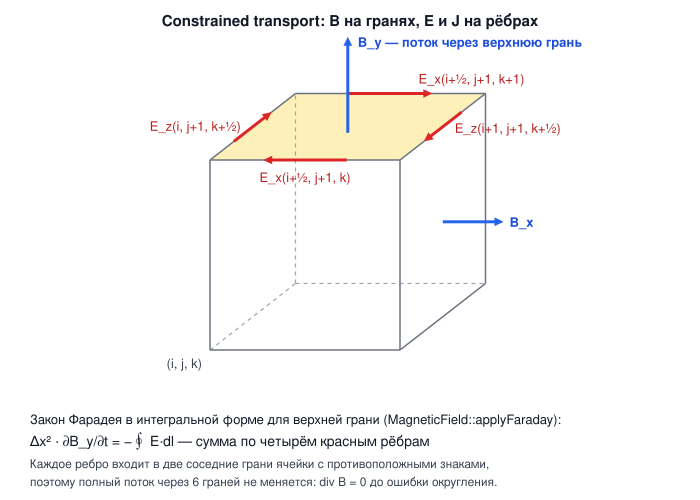
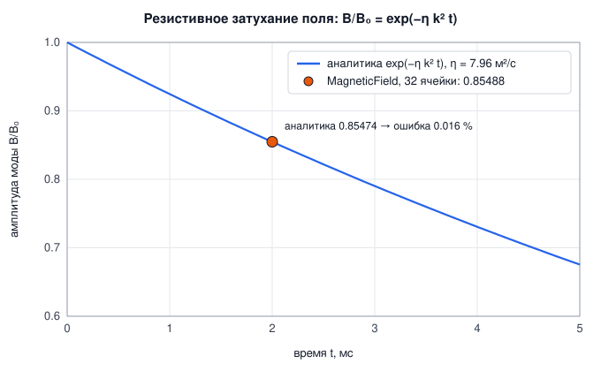
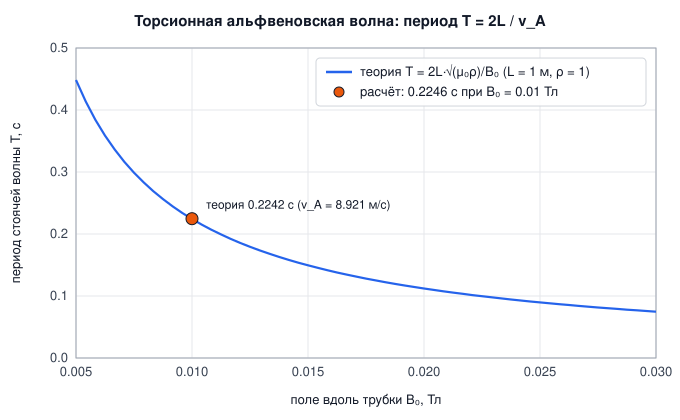

# 6. Магнитная гидродинамика и плазма

[← Огонь](05-fire.md) · [Оглавление](README.md)

**Что это и зачем.** `MagneticField` ([src/plasma/MagneticField.h](../src/plasma/MagneticField.h)) добавляет к газу сетки (гл. 4) электромагнитное поле проводящей среды — плазмы или жидкого металла. Поле переносится, растягивается и закручивается потоком, просачивается сквозь него за счёт сопротивления и давит на газ силой Лоренца. Всё в единицах СИ.

> **Статус главы.** Ядро МГД и сцена «магнитосфера» готовы и проверены тестами ([6.7](#67-магнитосфера-магнит-отклоняет-плазму)). Токамак и ионизированное пламя — в разработке ([6.8](#68-в-разработке)). При изменении кода обновляйте ссылки на строки в этой главе.

Включение на решателе газа:

```cpp
rf::GasSolver gas;
gas.magnetic.enabled = true;
gas.magnetic.conductivity = 1e8f;         // σ, См/м
gas.magnetic.applied = {0.01f, 0, 0};     // однородное поле при reset(), Тл
gas.reset(origin, nullptr);               // создаёт поля B, E, J на сетке газа
gas.step(maxDt);                          // газ + сила Лоренца + индукция + джоулев нагрев
```

---

## Откуда уравнения

Коротко, по шести частям. Вывод целиком в главе [11.8](11-action.md#118-магнитная-гидродинамика).

### Действие

Идеальная МГД по Ньюкомбу (1962): поле вморожено в плазму, $\mathbf B = (\nabla_{\mathbf a}X)\,\mathbf B_0/\mathcal J$, и магнитная энергия играет роль потенциальной:

$$
S = \int\!\!\int \Big(\tfrac12\rho_0|\partial_t X|^2 - \rho_0\,e(\rho) - \frac{|\mathbf B|^2}{2\mu_0}\,\mathcal J\Big)\,d^3a\,dt .
$$

### Уравнения

Вариация даёт $\rho\,D\mathbf u/Dt = -\nabla p + \mathbf J\times\mathbf B$ и вмороженность $\partial_t\mathbf B = \nabla\times(\mathbf u\times\mathbf B)$. Сопротивление добавляет функция Рэлея закона Ома $R = \tfrac12\int\mathbf J^2/\sigma\,dV$. В покоящемся проводнике магнитная энергия убывает ровно на джоулево тепло $\int\mathbf J^2/\sigma\,dV$.

### Дискретизация

Constrained transport есть дискретное внешнее исчисление: $\mathbf B$ на гранях, $\mathbf E$ и $\mathbf J$ на рёбрах. Два дискретных ротора сопряжены, поэтому баланс энергии и $\nabla\cdot\mathbf B = 0$ выполняются точно, до округления. Противопоточная добавка к $\mathbf E$ есть численная функция Рэлея.

### Код

Ток на рёбрах: [MagneticField.cpp:145](../src/plasma/MagneticField.cpp#L145). Закон Фарадея: [MagneticField.cpp:214](../src/plasma/MagneticField.cpp#L214). Джоулево тепло: [MagneticField.cpp:290](../src/plasma/MagneticField.cpp#L290).

### Графики

Магнитная энергия, потерянная полем, против джоулева тепла:


### Границы

Баланс по свободным рёбрам сходится до 0.11 % (тест `action: magnetic energy turns into Joule heat J^2 / sigma`). Нагрев газа `jouleHeating` считается по тем же свободным рёбрам: газ получает столько тепла, сколько теряет поле, с точностью 0.1 %. Прежний счёт по ячейкам вместе с рёбрами стенок давал +3.2 %.

Наша МГД **несжимаемая**: газ — проекция давления при постоянной плотности, ящик — со стенками, без периодических границ. Поэтому у нас нет сжатия плазмы, ударных волн и магнитозвуковых волн, и главный эталон МГД-кодов — вихрь Орсага–Танга (сжимаемый, $\gamma = 5/3$, периодический ящик) — мы честно воспроизвести не можем. Вместо него проверяется точное нелинейное решение несжимаемой МГД, альфвеновское состояние $\mathbf v = \mathbf b$ (раздел «Проверка», пункт 4).

---

## 6.1 Уравнения резистивной МГД

| Закон | Уравнение | В коде |
|---|---|---|
| Ампер (предел МГД, без тока смещения) | $\mathbf J = \dfrac{1}{\mu_0}\nabla\times\mathbf B$ | `computeCurrent` |
| Ом в движущемся проводнике | $\mathbf E = -\mathbf u\times\mathbf B + \dfrac{\mathbf J}{\sigma}$ | `computeElectricField` |
| Фарадей (индукция) | $\dfrac{\partial\mathbf B}{\partial t} = -\nabla\times\mathbf E$ | `applyFaraday` |
| Сила Лоренца на объём | $\mathbf f = \mathbf J\times\mathbf B$ | `applyLorentzForce` |
| Джоулев нагрев на объём | $q = J^2/\sigma$ | `jouleHeating` |

| Символ | Смысл | Единицы |
|---|---|---|
| $\mathbf B$ | магнитная индукция | Тл |
| $\mathbf E$ | электрическое поле | В/м |
| $\mathbf J$ | плотность тока | А/м² |
| $\sigma$ | проводимость | См/м |
| $\mu_0$ | магнитная постоянная, $1.2566\cdot10^{-6}$ | Тл·м/А |
| $\eta = 1/(\mu_0\sigma)$ | магнитная диффузия (резистивность) | м²/с |

Подстановка закона Ома в закон Фарадея с учётом $\nabla\cdot\mathbf B = 0$ даёт **уравнение индукции**:

$$
\frac{\partial\mathbf B}{\partial t} = \nabla\times(\mathbf u\times\mathbf B) + \eta\,\nabla^2\mathbf B .
$$

Первый член — **вмороженность**: силовые линии переносятся, растягиваются и закручиваются потоком, как нити в жидкости. Второй — **диффузия**: линии просачиваются сквозь проводник тем быстрее, чем хуже он проводит.

### Почему без тока смещения

Полное уравнение Ампера–Максвелла: $\nabla\times\mathbf B = \mu_0\mathbf J + c^{-2}\,\partial\mathbf E/\partial t$. В проводнике, движущемся со скоростью $u$, $E \sim uB$, и отношение тока смещения к току проводимости порядка $(u/c)^2$ — для скоростей до км/с это $10^{-11}$ и меньше.

Есть и численная причина. С током смещения уравнения описывают световые волны, и явная схема была бы ограничена условием Куранта для света: $\Delta t < \Delta x/c \approx 0.04\ \text{м}/(3\cdot10^8\ \text{м/с}) \approx 10^{-10}$ с — в миллиарды раз меньше шага газа. Предел МГД убирает свет из уравнений; самым быстрым сигналом остаётся альфвеновская волна.

### Где кончается МГД: специальная теория относительности

МГД не противоречит СТО — она её **низкоскоростной предел**, и в модели три приближения, каждое со своей мерой:

| Приближение | Что отброшено | Мера ошибки | Когда ломается |
|---|---|---|---|
| нет тока смещения | $c^{-2}\partial_t\mathbf E$ в законе Ампера | $(v/c)^2$; в токамаке $v_A \approx 10^7$ м/с $= 0.03c$ → $10^{-3}$ | магнитно-доминированная плазма, $\sigma = B^2/(\mu_0\rho c^2) \gtrsim 1$: струи, магнитосферы пульсаров |
| закон Ома $\mathbf E' = \mathbf E + \mathbf u\times\mathbf B$ | множитель $\gamma$ лоренцева преобразования поля: точно $\mathbf E'_\perp = \gamma(\mathbf E + \mathbf u\times\mathbf B)_\perp$ | $\gamma - 1 \approx (u/c)^2/2$ | то же |
| несжимаемость | конечная скорость звука: давление задаётся эллиптическим уравнением и «распространяется» мгновенно | $Ma^2$ | сверхзвуковые течения, ударные волны |

Поправка Бориса (раздел 6.3) — ровно первая релятивистская поправка: сохранённый ток смещения даёт полю инерцию $B^2/(\mu_0 c^2)$, и $v_A' = v_A/\sqrt{1 + v_A^2/c^2} < c$ (Gombosi et al. 2002, *semirelativistic MHD*). В коде $c$ заменено на `speedLimit` ради шага по времени, но форма уравнения — из СТО. Для Солнца, Земли и токамака этого достаточно; когда $v_A \to c$, нужна релятивистская МГД с 4-скоростью и тензором энергии-импульса (Komissarov 1999) — другой решатель, не поправка к этому.

### Сила Лоренца: магнитное давление и натяжение

$$
\mathbf J\times\mathbf B = \frac{(\nabla\times\mathbf B)\times\mathbf B}{\mu_0}
= -\nabla\!\left(\frac{B^2}{2\mu_0}\right) + \frac{(\mathbf B\cdot\nabla)\mathbf B}{\mu_0}.
$$

Первое слагаемое — **магнитное давление** $B^2/2\mu_0$: поле расталкивает газ из областей сильного поля. Второе — **натяжение** силовых линий $B^2/\mu_0$: изогнутая линия, как натянутая струна, стремится выпрямиться.

### Альфвеновские волны

Натяжение линий плюс инерция газа дают поперечные волны вдоль поля со скоростью Альфвена:

$$
v_A = \frac{B}{\sqrt{\mu_0\rho}} .
$$

При $B = 0.01$ Тл и $\rho = 1$ кг/м³ $v_A = 8.921$ м/с. Торсионная (крутильная) волна не диспергирует: стоячая волна между проводящими стенками на расстоянии $L$ имеет период $T = 2L/v_A$ при любом профиле закрутки.

---

## 6.2 Численный метод: constrained transport

Evans & Hawley (1988). Магнитное поле хранится **на гранях** ячеек, как скорость газа; $\mathbf E$ и $\mathbf J$ — **на рёбрах**:

[src/plasma/MagneticField.cpp:14](../src/plasma/MagneticField.cpp#L14)
```cpp
// Layout (cell (i, j, k) spans [i, i+1] x [j, j+1] x [k, k+1] in cell units):
//   bx(i,j,k) on the x-face at (i, j+1/2, k+1/2)    size (nx+1, ny, nz)   - as the velocity u
//   by(i,j,k) on the y-face at (i+1/2, j, k+1/2)    size (nx, ny+1, nz)
//   bz(i,j,k) on the z-face at (i+1/2, j+1/2, k)    size (nx, ny, nz+1)
//   ex, jx(i,j,k) on the x-edge at (i+1/2, j, k)    size (nx, ny+1, nz+1)
//   ey, jy(i,j,k) on the y-edge at (i, j+1/2, k)    size (nx+1, ny, nz+1)
//   ez, jz(i,j,k) on the z-edge at (i, j, k+1/2)    size (nx+1, ny+1, nz)
```



Закон Фарадея записывается **в интегральной форме**: поток через грань меняется ровно на циркуляцию $\mathbf E$ по четырём её рёбрам,

$$
\Delta x^2\,\frac{\partial B_x}{\partial t} = -\oint \mathbf E\cdot d\mathbf l
\ \Rightarrow\
B_x^{n+1} = B_x^n - \frac{\Delta t}{\Delta x}\Big[\big(E_z^{j+1} - E_z^{j}\big) - \big(E_y^{k+1} - E_y^{k}\big)\Big].
$$

[src/plasma/MagneticField.cpp:214](../src/plasma/MagneticField.cpp#L214)
```cpp
void MagneticField::applyFaraday(float dt) {
    // dB/dt = -curl E: the flux through a face changes by the circulation of E around it.
    const float s = dt / dx_;
    parallelFor(nz_ + 1, [&](int k) {
        for (int j = 0; j <= ny_; ++j)
            for (int i = 0; i <= nx_; ++i) {
                if (j < ny_ && k < nz_)
                    bx.at(i, j, k) -= s * ((ez_.at(i, j + 1, k) - ez_.at(i, j, k)) - (ey_.at(i, j, k + 1) - ey_.at(i, j, k)));
                if (i < nx_ && k < nz_)
                    by.at(i, j, k) -= s * ((ex_.at(i, j, k + 1) - ex_.at(i, j, k)) - (ez_.at(i + 1, j, k) - ez_.at(i, j, k)));
                if (i < nx_ && j < ny_)
                    bz.at(i, j, k) -= s * ((ey_.at(i + 1, j, k) - ey_.at(i, j, k)) - (ex_.at(i, j + 1, k) - ex_.at(i, j, k)));
            }
    }, 1);
}
```

**Почему $\nabla\cdot\mathbf B = 0$ сохраняется точно.** Дискретная дивергенция ячейки — сумма потоков через 6 граней. Каждое ребро ячейки принадлежит ровно двум её граням и входит в их циркуляции с противоположными знаками. Сумма изменений потоков равна нулю **тождественно**, для любых $\mathbf E$. Если начальное поле бездивергентно, оно остаётся таким до ошибок округления. Поэтому начальные поля задаются **через векторный потенциал**: $\mathbf A$ на рёбрах, $\mathbf B = \nabla\times\mathbf A$ той же дискретной операцией ротора (`addFromPotential`, [MagneticField.cpp:95](../src/plasma/MagneticField.cpp#L95)).

### Ток на рёбрах

$\mathbf J = \nabla\times\mathbf B/\mu_0$ — тоже ротор, но от граней к рёбрам ([MagneticField.cpp:135](../src/plasma/MagneticField.cpp#L135)). На стенках домена касательное $\mathbf B$ считается непрерывным (индексы зажимаются): в самой стенке нет токового слоя.

### Электрическое поле на рёбрах и противопоточная диссипация

$$
\mathbf E = -\mathbf u\times\mathbf B + \eta_{eff}\,\mu_0\mathbf J, \qquad
\eta_{eff} = \eta + \max\!\big(f\,|\mathbf u|\,\Delta x,\ |\mathbf u|^2 h\big) .
$$

$\mathbf u$ и $\mathbf B$ усредняются на ребро. Центральные разности для члена переноса $\mathbf u\times\mathbf B$ с явным шагом по времени неустойчивы: за шаг $h$ амплитуда растёт на $(|\mathbf u|h/\Delta x)^2/2$. Ровно столько гасит диссипация $|\mathbf u|^2 h/2$ — это схема Лакса–Вендроффа; в коде берётся вдвое больше, $|\mathbf u|^2 h$, и это **наименьшая** диссипация, при которой перенос устойчив. Первое слагаемое, $f|\mathbf u|\Delta x$ с $f$ = `numericalDissipation` = 0.5, — запас, не зависящий от шага, как в усреднённых противопоточных ЭДС Balsara & Spicer (1999). Там, где течение много медленнее альфвеновской скорости (шаг $h$ мал), первое слагаемое во много раз больше второго и за секунды размывает профиль тока — в сцене токамака $f = 0$. $\eta$ может быть своя в каждой ячейке (`setResistivityMap`): резистивный «вакуум» вокруг шнура плазмы.

> **Почему без $v_A$.** Альфвеновским волнам диссипация не нужна: сила Лоренца и закон Фарадея шагаются по очереди (симплектически) и устойчивы сами — это показывает тест торсионной волны без диссипации. А слагаемое $f\,v_A\,\Delta x$ у сильного магнита (где $v_A$ велика) снижало эффективное магнитное число Рейнольдса примерно до 8: поле «расплывалось» и пропускало плазму.

[src/plasma/MagneticField.cpp:174](../src/plasma/MagneticField.cpp#L174)
```cpp
    const float eta0 = resistivity(), f = numericalDissipation * dx_;
    const bool mapped = !etaCell_.empty();
    auto etaEff = [&](float eta, float a, float b) { // (a, b): the flow components on the edge
        const float u2 = a * a + b * b;
        return eta + std::max(f * std::sqrt(u2), u2 * substep);
    };
```

[src/plasma/MagneticField.cpp:183](../src/plasma/MagneticField.cpp#L183)
```cpp
                if (i < nx_) { // x-edge (i+1/2, j, k)
                    const size_t e = ex_.idx(i, j, k);
                    if (fixedEx_[e]) ex_.d[e] = 0;
                    else {
                        const float vE = 0.5f * (v.at(i, j, k - 1) + v.at(i, j, k)), ByE = 0.5f * (by.at(i, j, k - 1) + by.at(i, j, k));
                        const float wE = 0.5f * (w.at(i, j - 1, k) + w.at(i, j, k)), BzE = 0.5f * (bz.at(i, j - 1, k) + bz.at(i, j, k));
                        ex_.d[e] = -(vE * BzE - wE * ByE) + etaEff(mapped ? etaX_.d[e] : eta0, vE, wE) * kMu0 * jx_.d[e];
                    }
                }
```

### Идеально проводящие стенки

На рёбрах, касающихся проводника (ячейки препятствия или граница домена), касательное $\mathbf E = 0$ (`fixedEx_`…, [MagneticField.cpp:77](../src/plasma/MagneticField.cpp#L77)). Тогда циркуляция по любой грани стенки равна нулю, и **поток через стенку заморожен** — как у сверхпроводящей оболочки. Статическое препятствие газа автоматически становится проводником (стенкой сосуда): `magnetic.setConductors(solid_)` в [GasSolver.cpp:28](../src/gas/GasSolver.cpp#L28).

### Шаги по времени

- Газ ограничивает шаг альфвеновской скоростью: $\Delta t \le 0.5\,\Delta x/(u_{max} + v_A)$ (`maxTimeStep`, [GasSolver.cpp:455](../src/gas/GasSolver.cpp#L455)).
- Индукция внутри шага газа делает столько подшагов, чтобы сигнал проходил не больше полъячейки, а явная диффузия оставалась устойчивой ([MagneticField.cpp:229](../src/plasma/MagneticField.cpp#L229)):

$$
h \le \min\!\left(\frac{0.5\,\Delta x}{u_{max} + v_A},\ \frac{0.9\,\Delta x^2}{6\,\eta_{max}}\right).
$$

### Порядок в шаге газа

[GasSolver.cpp:549](../src/gas/GasSolver.cpp#L549) и [:415](../src/gas/GasSolver.cpp#L415): сила Лоренца добавляется к скоростям вместе с остальными силами **до** проекции давления (градиентная часть магнитного давления уходит в давление газа). Индукция идёт **после** проекции — с новым бездивергентным потоком. Джоулево тепло $J^2\Delta t/\sigma$ нагревает газ: $\Delta T = q/(\rho c_p)$.

---

## 6.3 Сила Лоренца на гранях и коррекция Бориса

Сила считается на гранях скорости: $\mathbf J$ усредняется с рёбер, $\mathbf B$ — с граней ([MagneticField.cpp:240](../src/plasma/MagneticField.cpp#L240)).

**Коррекция Бориса** (Boris 1970; Gombosi et al. 2002, *Semirelativistic MHD and the Boris correction* — как в кодах магнитосферы). Около полюсов магнита поле сильное, $v_A$ огромна, и шаг по времени становится крошечным. Коррекция вводит «уменьшенную скорость света» $c_B$ = `speedLimit`: к инерции газа добавляется инерция поля $B^2/(\mu_0 c_B^2)$, и

$$
\Delta\mathbf u = \frac{(\mathbf J\times\mathbf B)\,\Delta t}{\rho\,\big(1 + B^2/(\mu_0\rho c_B^2)\big)}, \qquad
v_A' = \frac{v_A}{\sqrt{1 + v_A^2/c_B^2}} \le c_B .
$$

[src/plasma/MagneticField.cpp:255](../src/plasma/MagneticField.cpp#L255)
```cpp
const float s0 = dt / std::max(density, 1e-12f);
const float boris = speedLimit > 0 ? 1.0f / (kMu0 * std::max(density, 1e-12f) * speedLimit * speedLimit) : 0.0f;
// Boris correction: the field's inertia (B^2 / mu0 c^2) is added to the gas's.
auto scale = [&](float B2) { return s0 / (1.0f + boris * B2); };
```

Эффективная инерция $\rho_{eff} = \rho\,(1 + B^2/(\mu_0\rho c_B^2))$ должна делить **все** силы, а не только силу Лоренца. Иначе сила давления у сильного магнита оказывается в сотни раз сильнее магнитной, и поле не удерживает плазму — так было в первой версии, и плазма просачивалась в магнитосферу поперёк поля. Поэтому проекция давления решает уравнение с переменной плотностью (Bridson, гл. 5):

$$
\nabla\cdot\big(w\,\nabla p\big) = \frac{\rho}{\Delta t}\,\nabla\cdot\mathbf u^*,\qquad
w = \frac{1}{1 + v_A^2/c_B^2}\ \text{на каждой грани},
$$

и скорость на грани поправляется на $-\Delta t\,w\,\nabla p/\rho$. Веса считает `MagneticField::borisWeights`; без коррекции все $w = 1$, и проекция совпадает с обычной.

**Вес грани.** На грани, нормальной к $x$, своя компонента $B_x$ берётся прямо с грани, а $B_y$ и $B_z$ усредняются по 4 окружающим граням. Затем

$$
w_f = \frac{1}{1 + k\,\lvert\mathbf B_f\rvert^2}, \qquad k = \frac{1}{\mu_0\,\rho\,c_B^2} \quad\Big(\text{то есть } k\,B^2 = v_A^2/c_B^2\Big).
$$

[src/plasma/MagneticField.cpp:322](../src/plasma/MagneticField.cpp#L322)
```cpp
void MagneticField::borisWeights(Field3& wx, Field3& wy, Field3& wz, float density) const {
    wx.init(nx_ + 1, ny_, nz_, bx.offset, 1.0f);
    wy.init(nx_, ny_ + 1, nz_, by.offset, 1.0f);
    wz.init(nx_, ny_, nz_ + 1, bz.offset, 1.0f);
    if (speedLimit <= 0) return;
    const float k = 1.0f / (kMu0 * std::max(density, 1e-12f) * speedLimit * speedLimit); // (v_A / c)^2 per B^2
    auto ci = [&](int i) { return std::clamp(i, 0, nx_ - 1); };
    auto cj = [&](int j) { return std::clamp(j, 0, ny_ - 1); };
    auto ck = [&](int q) { return std::clamp(q, 0, nz_ - 1); };
    // |B|^2 on a face: its own component there, the other two averaged from the 4 faces around.
    parallelFor(nz_ + 1, [&](int kk) {
        for (int j = 0; j <= ny_; ++j)
            for (int i = 0; i <= nx_; ++i) {
                if (j < ny_ && kk < nz_) { // x-face (i, j+1/2, k+1/2)
                    const float Bx = tbx_.at(i, j, kk);
                    const float By = 0.25f * (tby_.at(ci(i - 1), j, kk) + tby_.at(ci(i), j, kk) + tby_.at(ci(i - 1), j + 1, kk) + tby_.at(ci(i), j + 1, kk));
                    const float Bz = 0.25f * (tbz_.at(ci(i - 1), j, kk) + tbz_.at(ci(i), j, kk) + tbz_.at(ci(i - 1), j, kk + 1) + tbz_.at(ci(i), j, kk + 1));
                    wx.at(i, j, kk) = 1.0f / (1.0f + k * (Bx * Bx + By * By + Bz * Bz));
                }
```

**Матрица с весами.** Дискретный $-\nabla\cdot(w\nabla p)$ в ячейке $c$ — сумма по её 6 граням $f$:

$$
(A\,p)_c = \Big(\sum_{f\ \text{открыта}} w_f\Big)\,p_c \;-\; \sum_{f\ \text{к газу}} w_f\,p_{n(f)} .
$$

Грань «открыта», если за ней газ или открытая (outflow) граница. Твёрдая стенка в сумму не входит, потому что там задана скорость, а не давление. Диагональ $\sum w_f$ хранится в `diagW_`. Она же служит предобуславливателем Якоби в методе сопряжённых градиентов. Многосеточный предобуславливатель (гл. 4.5) получает те же веса граней, поэтому и он решает уравнение с весами Бориса. При $w_f \equiv 1$ получается обычный лапласиан, поэтому без коррекции Бориса путь не меняется.

[src/gas/PressureSolver.cpp:135](../src/gas/PressureSolver.cpp#L135)
```cpp
void GasSolver::applyPressureMatrix(const std::vector<double>& x, std::vector<double>& out, bool weighted) const {
    const int NX = nx_, NY = ny_, NZ = nz_;
    parallelFor(int(NZ), [&](int k_) {
        int k = k_;
        for (int j = 0; j < NY; ++j)
            for (int i = 0; i < NX; ++i) {
                size_t c = cidx(i, j, k);
                if (solid_[c] || diag_[c] == 0) { out[c] = 0; continue; }
                double s = diagW_[c] * x[c];
                if (i > 0 && !solid_[c - 1]) s -= faceWeightU(i, j, k, weighted) * x[c - 1];
                if (i < NX - 1 && !solid_[c + 1]) s -= faceWeightU(i + 1, j, k, weighted) * x[c + 1];
                if (j > 0 && !solid_[c - NX]) s -= faceWeightV(i, j, k, weighted) * x[c - NX];
                if (j < NY - 1 && !solid_[c + NX]) s -= faceWeightV(i, j + 1, k, weighted) * x[c + NX];
                size_t sl = size_t(NX) * NY;
                if (k > 0 && !solid_[c - sl]) s -= faceWeightW(i, j, k, weighted) * x[c - sl];
                if (k < NZ - 1 && !solid_[c + sl]) s -= faceWeightW(i, j, k + 1, weighted) * x[c + sl];
                out[c] = s;
```

Равновесия (стационарные состояния, баланс давлений) при этом **не меняются** — меняется только то, как быстро на них реагируют области сильного поля. Та же ограниченная $v_A'$ используется в шаге по времени (`alfvenSpeed`).

---

## 6.4 Фоновое поле: разделение B = B₀ + B₁

`setBackgroundFromPotential(A)` ([MagneticField.cpp:101](../src/plasma/MagneticField.cpp#L101)) задаёт **неподвижное бестоковое** фоновое поле $\mathbf B_0 = \nabla\times\mathbf A$ (магнит, катушки). Эволюционирует только индуцированная часть $\mathbf B_1$ — поля `bx, by, bz` — и **только её ротор считается током** (Tanaka 1994, приём кодов магнитосферы).

Зачем: ротор крутого поля вроде дипольного ($\propto 1/r^3$) на сетке не равен нулю в точности. Если считать его током, рядом с магнитом появились бы ложные токи и ложные течения. Сила Лоренца и закон Ома используют полное поле $\mathbf B_0 + \mathbf B_1$ (`tbx_`…, обновляются `updateTotal`), все функции доступа (`fieldAt`, `cellField`, `energy`, `maxDivergence`) тоже возвращают полное поле.

---

## 6.5 Магнитное число Рейнольдса и масштабирование демо

Отношение переноса поля к его диффузии:

$$
\mathrm{Rm} = \frac{uL}{\eta} = \mu_0\,\sigma\,u\,L .
$$

При $\mathrm{Rm} \gg 1$ поле вморожено в поток; при $\mathrm{Rm} \ll 1$ оно просачивается сквозь проводник почти мгновенно, и поток его почти не деформирует.

Оценки порядка величины:

| Среда | $\sigma$, См/м | $u$, м/с | $L$, м | Rm |
|---|---:|---:|---:|---:|
| слабоионизованная лабораторная плазма (дуга, пламя) | ~$10^2$–$10^4$ | 1 | 0.1 | $10^{-5}$–$10^{-3}$ |
| жидкий металл (ртуть, галлий) | ~$10^6$ | 1 | 0.1 | ~0.1 |
| горячая полностью ионизованная плазма, ~10 эВ | ~$10^6$–$10^7$ | 1 | 0.1 | ~0.1–1 |
| солнечный ветер у Земли | — | $4\cdot10^5$ | $10^7$ | $\gg 10^{10}$ |

Настоящая лабораторная плазма размером в сантиметры при скоростях в метры в секунду **резистивна** ($\mathrm{Rm} \ll 1$): никакой вмороженности, магнитосферы или закрученных линий не будет. Поэтому демонстрационные сцены **масштабированы по безразмерным числам**, а не по размерным величинам: подбираются $\mathrm{Rm}$, альфвеновское число Маха $M_A = u/v_A$ и отношение магнитного давления к скоростному напору так, как в оригинальном явлении. В сцене «Магнитосфера» $\sigma = 10^8$ См/м — нефизично для лаборатории, но даёт $\mathrm{Rm} \sim 100$, как нужно для вмороженного поля.

---

## 6.6 Параметры (`MagneticField`)

[src/plasma/MagneticField.h:34](../src/plasma/MagneticField.h#L34)

| Параметр | Смысл | Ед. | По умолчанию |
|---|---|---|---|
| `enabled` | МГД включена | — | false |
| `applied` | однородное поле в `reset` (внешние катушки) | Тл | (0, 0, 0) |
| `conductivity` | $\sigma$; $\eta = 1/(\mu_0\sigma)$ | См/м | 1e6 |
| `numericalDissipation` | $f$ в $\eta_{num} = \max(f\lVert\mathbf u\rVert\Delta x,\ \lVert\mathbf u\rVert^2 h)$ ($h$ — подшаг индукции) | — | 0.5 |
| `speedLimit` | $c_B$ коррекции Бориса (0 — выключена) | м/с | 0 |
| `kMu0` | $\mu_0$ | Тл·м/А | 1.25663706e-6 |

| Функция | Назначение |
|---|---|
| `addFromPotential(A)` | добавить $\nabla\times\mathbf A$ к эволюционирующему полю (бездивергентно) |
| `setBackgroundFromPotential(A)` | задать фоновое бестоковое $\mathbf B_0$ |
| `setConductors(mask)` | ячейки-проводники (стенки сосуда) |
| `fieldAt`, `currentAt`, `electricFieldAt` | $\mathbf B$, $\mathbf J$, $\mathbf E$ в точке мира |
| `energy()`, `maxField()`, `maxDivergence()` | диагностика: $\int B^2/2\mu_0\,dV$, $\max\lVert\mathbf B\rVert$, $\max\lvert\nabla\cdot\mathbf B\rvert\,\Delta x/\max\lVert\mathbf B\rVert$ |

---

## 6.7 Магнитосфера: магнит отклоняет плазму

Пресет 25 «Плазма: магнит отклоняет поток (магнитосфера)». Поток плазмы («солнечный ветер») набегает на намагниченную сферу — терреллу Биркеланда, маленькую Землю ([samples/plasma/MagnetosphereScene.cpp](../samples/plasma/MagnetosphereScene.cpp)).

| Параметр | Значение |
|---|---|
| диполь $\mathbf m$ | 600 А·м², вверх ($+y$), как **фоновое** поле $\mathbf B_0$ из потенциала $\mathbf A = \frac{\mu_0}{4\pi}\frac{\mathbf m\times\mathbf r}{r^3}$ (разделение $\mathbf B_0 + \mathbf B_1$, §6.4) |
| поток | 1.5 м/с, $\rho = 1$ кг/м³ |
| проводимость | $\sigma = 10^8$ См/м, $Rm \approx 100$ — поле вморожено |
| коррекция Бориса | $c_B = 4$ м/с (у полюсов $v_A$ до ~80 м/с); действует и на давление (взвешенная проекция) |
| сетка | 60 × 35 × 35, $\Delta x = 4$ см; канал 2.4 × 1.4 × 1.4 м |

Магнитопауза Чепмена–Ферраро — там, где магнитное давление диполя $B^2/2\mu_0$ уравновешивает скоростной напор $\rho u^2$. Экваториальное поле диполя $B = \mu_0 m/(4\pi r^3)$, откуда

$$
r_{mp} = \left(\frac{\mu_0\,m^2}{32\pi^2\rho u^2}\right)^{1/6} \approx 0.29\ \text{м},
$$

или ≈ 0.37 м с учётом удвоения поля токами магнитопаузы (множитель $2^{1/3}$). Плазма обтекает магнитосферу, силовые линии с дневной стороны сжимаются, с ночной — сносятся в **хвост**.

**Проверка** — тест `plasma wind vs magnet (magnetopause)` ([PlasmaTests.cpp:136](../tests/PlasmaTests.cpp#L136)):

| Величина | Расчёт | Теория |
|---|---|---|
| где поток замедлился вдвое (перед магнитом) | **0.32 м** | магнитопауза 0.29–0.37 м |
| боковая скорость на фланге (−0.3, 0, 0.35) | 0.73 м/с | > 0: поток отклоняется |
| $\max\lvert\nabla\cdot\mathbf B\rvert\,\Delta x/\max\lvert\mathbf B\rvert$ | $1.7\cdot10^{-7}$ | 0 |

> До исправления поправки Бориса (она делила только силу Лоренца, а не давление) поле у магнита было слишком «слабым», и точка торможения уходила на 0.39 м — за пределы теории.

**Известное ограничение.** Планета — идеальный проводник: поле вморожено в её поверхность, и обтекающая плазма наводит у поверхности токовый слой (~$3\cdot10^4$ А/м²), который раскачивает течение поперёк поля у самой планеты (~0.5–1 м/с). У Земли под ионосферой — плохо проводящая мантия, а сама ионосфера имеет конечную проводимость; правильная внутренняя граница (проводимость ионосферы и уравнение для её потенциала, как в глобальных моделях магнитосферы) — в планах. Плазма у полюсов, приходящая вдоль силовых линий (каспы), — физична.

**Отображение.** Силовые линии $\mathbf B$ трассируются от сферы в обе стороны ([Snapshot.cpp:144](../src/scene/Snapshot.cpp#L144)) и окрашиваются по $\log\lvert\mathbf B\rvert$; плазма светится как оптически тонкий газ (гл. 7). Сфера рисуется процедурной планетой ([Shaders.h:149](https://github.com/werasaimon/phys_realflow_editor/blob/main/src/Shaders.h#L149)): океаны и материки из фрактального шума, облака, день/ночь (Солнце — выше по потоку), атмосфера по краю и **полярные сияния** на магнитной широте ≈ 67°, куда сходятся силовые линии, касающиеся магнитопаузы.

## 6.8 В разработке

> Токамак работает, но его тест кинка ещё красный (запускается только с `RF_TEST=tokamak`); ниже — разбор расхождения с измерениями. Ионизированное пламя — план.

### Токамак: почему кинк растёт медленнее теории

Сцена `samples/plasma/TokamakScene` и тест `tokamak` (только с `RF_TEST=tokamak`). Поля и ток совпадают с формулами. Кинк $m = 1$, $n = 1$ при $q_a = 0.7$ растёт со скоростью 1.32 1/с, а энергетический принцип даёт $\gamma_0 = 2.67$ 1/с ([Tokamak.h](../samples/plasma/Tokamak.h), шапка):

$$\gamma^2 = \frac{2\,(v_{A\theta}/a)^2\,(1-q_a)\,\bigl(q_a(b^2+a^2)-2a^2\bigr)}{(b^2-a^2)\,\bigl(1 + \tfrac{\rho_{out}}{\rho_{in}}\tfrac{b^2+a^2}{b^2-a^2}\bigr)}.$$

Второй множитель в знаменателе — присоединённая масса газа между шнуром и стенкой при сдвиге шнура как целого (потенциальное течение между соосными цилиндрами; Lamb, *Hydrodynamics*; Brennen 1982). В сцене «вакуум» — тот же газ, $\rho_{out}/\rho_{in} = 1$, и эта масса ($5/3$ массы шнура при $b = 2a$) **уже входила** в $\gamma_0$: с безмассовым вакуумом было бы 4.36 1/с (`kinkGrowthRateWithOuterGas(ρ, 0)`). Поэтому гипотеза «разрыв даёт присоединённая масса» опровергнута. Для этого прибора ($ka = a/R_0 = 0.3$) трёхмерный расчёт той же массы через функции Бесселя $I_1, K_1$ даёт 1.44 вместо 1.67 масс шнура: теория выше на 4.5 %, это в пределах остальных неопределённостей.

Что объясняет разрыв (сетка 44, если не сказано иное; «рост плазмы» — наклон $\ln$ смещения центра трассера за 0.2–0.7 с, «рост тока» — то же для центра тока, которым меряет тест):

| Причина | Как проверено | Число |
|---|---|---|
| **Измеритель.** Центр тока отстаёт от самой плазмы: ток расплывается там, где сопротивление растёт к гало | оба центра в одном прогоне | рост тока 0.91 1/с против 1.93 у плазмы (правило теста: 1.32 против 1.51) |
| **Гало недостаточно «вакуумно».** При $\eta_{vac} = 0.2$ м²/с магнитное число Рейнольдса гало $a v_{A\theta}/\eta = 0.57$: линии частично вморожены и тормозят шнур | $\eta_{vac}$ = 0.02 / 0.2 / 2 / 20 | рост плазмы 1.56 / 1.93 / 2.38 / 2.40 1/с; насыщение при $\mathrm{Rm} \lesssim 0.06$ на **0.90** $\gamma_0$ |
| **Потеря тока.** Кольцо уходит наружу на 20 мм ($0.17a$, порог теста 12 мм) и край шнура входит в подъём сопротивления с $1.2a$; ток падает с 643 до ~510 А, $q_a$ растёт к 1, привод кинка слабеет | прогон без течения: потеря 2.6 %; с течением 20 % | теория при фактическом токе 2.09–2.47 1/с вместо 2.67 |
| **Сетка** | 44 / 64 / 88 клеток | рост плазмы 1.93 / 1.99 / 1.93 (без тренда, ±2 %); при $\eta_{vac} = 2$: 2.377 / 2.381 — сошлось; рост тока по правилу теста 1.69 / 1.34 / 1.27 / 1.11 (32–88) — не в асимптотике, Ричардсон неприменим |
| Коррекция Бориса, численная диссипация, положение стенки | параметры сцены | выключены (`speedLimit = 0`, `numericalDissipation = 0`); стенка на сетке $b/a = 1.989$ вместо 2 — теория ниже на 0.5 % |

Итог: при гало с $\mathrm{Rm} \lesssim 0.06$ плазма растёт со скоростью $0.89\text{–}0.90\,\gamma_0$, а на сетке 64 — $0.99$ теории при фактическом токе. Оставшееся — потеря тока из-за сдвига кольца в зону подъёма сопротивления. Что менять (сопротивление гало по умолчанию, измеритель теста, область подъёма, лёгкий газ снаружи) — решение следующего шага; пороги теста не менялись.

### Ионизированное пламя и электрогидродинамика (план)

- Закон Гаусса $\nabla\cdot\mathbf E = \rho_q/\varepsilon_0$ для заряда ионов пламени.
- Дрейф ионов $\mathbf v_i = \mu_i\mathbf E$, ток $\mathbf J = \rho_q\mu_i\mathbf E$.
- Объёмная сила $\mathbf f = \rho_q\mathbf E$ — **ионный ветер**: пламя отклоняется в электрическом поле.

---

## Проверка

Тест `MHD: resistive decay, Alfven wave, div B = 0` ([PlasmaTests.cpp:7](../tests/PlasmaTests.cpp#L7)).

**1. Резистивное затухание.** Покоящийся проводник, $\sigma = 10^5$ См/м ($\eta = 7.96$ м²/с), мода $B_z = B_1\cos(\pi x/L)$, $L = 1$ м, 32 ячейки. Аналитика $B/B_0 = e^{-\eta k^2 t}$ с $k^2$ дискретного лапласиана $(2 - 2\cos k\Delta x)/\Delta x^2$, $k = \pi/L$. Измерено посередине между стенками — в 0.5 м от них, намного дальше диффузионной длины $\sqrt{\eta t} = 0.13$ м.



| $t$ | расчёт | аналитика | ошибка |
|---|---|---|---|
| 2.0 мс | 0.85488 | 0.85474 | 0.016 % |

**2. Торсионная альфвеновская волна.** Идеальный проводник ($\sigma = 10^{12}$), $B_0 = 0.01$ Тл вдоль $x$, $\rho = 1$: закрутка (вихревая трубка внутри сечения) закручивает линии, натяжение раскручивает. Кинетическая и магнитная энергия обмениваются с периодом $2L/v_A$.



| Величина | Расчёт | Теория |
|---|---|---|
| $v_A$ | — | 8.921 м/с |
| период | **0.2246 с** | $2L/v_A$ = 0.2242 с |
| энергия через 2.2 периода | **98.42 %** | 100 % |

Схема слегка диссипативна (разнесённые интерполяции $\mathbf B$ и $\mathbf J$, 1.6 % за 2.2 периода), но энергия **никогда не растёт** — неустойчивости нет. Тест требует $0.97 < E/E_0 < 1.001$.

> **Как мерить энергию слабой волны на сильном поле.** Энергия волны здесь в 3.8 миллиона раз меньше энергии всего поля ($2.6\cdot10^{-6}$ Дж против $9.9$ Дж). Прежде `energy()` складывала квадраты полного поля во `float`, и изменение энергии волны тонуло в округлении: тот же расчёт показывал «сохранено 92.5 %» со слитным умножением-сложением (FMA) и «79 %» без него. Теперь (1) однородное поле катушек `applied` хранится в неподвижном фоне $\mathbf B_0$, а не в эволюционирующей части $\mathbf B_1$ — расщепление $\mathbf B = \mathbf B_0 + \mathbf B_1$ кодов магнитосферы (Tanaka 1994), так что у волны свои полные 24 бита мантиссы; (2) `energy()` складывает $\mathbf B_0 + \mathbf B_1$ и возводит в квадрат в `double`. Обе меры — энергия всего поля и энергия одной волны $\sum|\mathbf B-\mathbf B_0|^2/2\mu_0$ — теперь дают 98.42 % в обеих сборках, и тест сверяет их между собой.

**3. $\nabla\cdot\mathbf B = 0$.** Вихрь 200 шагов закручивает поле идеального проводника ($\sigma = 10^9$): поле усиливается (растяжение линий), а относительная дивергенция $\max|\nabla\cdot\mathbf B|\Delta x/\max|\mathbf B| \approx 8\cdot10^{-6}$ — уровень округления `float`.

### 4. Альфвеновское состояние — точное нелинейное решение (вместо вихря Орсага–Танга)

Тест `MHD: an Alfvénic state v = b is an exact nonlinear solution (Elsässer)` ([PlasmaTests.cpp:275](../tests/PlasmaTests.cpp#L275)) и случай `rf_verify` `mhd-alfvenic-state` ([PlasmaCases.cpp:124](../verification/cases/PlasmaCases.cpp#L124)).

**Почему не Орсаг–Танг.** Вихрь Орсага–Танга (Orszag & Tang 1979; в стандартной форме — Stone et al. 2008, §4.2.3) — главный эталон МГД-кодов, но это **сжимаемая** МГД с $\gamma = 5/3$ и ударными волнами в **периодическом** ящике. Наш газ несжимаемый (проекция давления при постоянной плотности), а ящик со стенками. Честно воспроизвести Орсага–Танга мы не можем — см. «Границы» ниже. Вместо него мы берём точное **нелинейное** решение, которое наша модель может и должна воспроизводить.

**Действие и уравнения.** В альфвеновских единицах $\mathbf b = \mathbf B/\sqrt{\mu_0\rho}$ несжимаемая МГД в переменных Эльзассера $\mathbf z^\pm = \mathbf v \pm \mathbf b$ (Elsasser 1950) записывается так:

$$
\partial_t \mathbf z^\pm + (\mathbf z^\mp\cdot\nabla)\,\mathbf z^\pm = -\nabla P + \frac{\nu+\eta}{2}\nabla^2\mathbf z^\pm + \frac{\nu-\eta}{2}\nabla^2\mathbf z^\mp .
$$

Каждое поле Эльзассера переносится только **другим**. Если $\mathbf v = \mathbf b$ всюду ($\mathbf z^- = 0$), переносить $\mathbf z^+$ нечему: все нелинейные члены сокращаются для любого, сколь угодно запутанного течения — это точное нелинейное решение, «чисто альфвеновское состояние» (Dobrowolny, Mangeney & Veltri 1980). При $\nu = \eta$ остаётся одна диффузия, и каждая собственная мода лапласиана затухает сама по себе: $A_k(t) = A_k(0)\,e^{-\nu k^2 t}$.

**Постановка.** Две ячейки конвекции разного размера в единичном квадрате: $\psi = \tfrac{U_1}{\pi}\sin\pi x\,\sin\pi y + \tfrac{U_2}{2\pi}\sin 2\pi x\,\sin 2\pi y$, $U_1 = 1$, $U_2 = 0{,}5$ м/с, $\mathbf v = (\partial_y\psi, -\partial_x\psi)$, и поле — то же течение, $\mathbf B = \sqrt{\mu_0\rho}\,\mathbf v$. Стенки скользящие и идеально проводящие, и обе ячейки им подходят: на стенке нет ни нормальной скорости и поля, ни завихрённости, ни тока. $\nu = \eta = 0{,}01$ м²/с. **Без поля** та же пара ячеек перемешивает друг друга — их завихрённость не функция $\psi$ — и ячейка (2,2) за 0,5 с даже переворачивается. **С полем** обе должны затухать ровно по экспоненте, и $\mathbf v$ остаётся равным $\mathbf b$.

**Дискретизация.** Скорость и поле задаются одной и той же дискретной разностью $\psi$ на одних и тех же гранях, поэтому $\mathbf v = \mathbf b$ на сетке с самого начала (до округления, $1{,}1\cdot10^{-7}$). Дальше их ведут разные части кода — перенос скорости и сила Лоренца на гранях, закон Фарадея на рёбрах, — и тест проверяет, что они сокращаются, как в уравнениях.

**Графики.** Амплитуда малой ячейки (2,2):


| 32 клетки, 1 с | Ячейка (1,1) | Ячейка (2,2) | $\lvert\mathbf v - \mathbf b\rvert/\lvert\mathbf v + \mathbf b\rvert$ |
|---|---|---|---|
| точно, $e^{-\nu k^2 t}$ | 0,8209 | 0,4540 | 0 |
| МГД, $\mathbf v = \mathbf b$ | 0,8218 | 0,4191 (−7,7 %) | $2{,}6\cdot10^{-2}$ |
| то же течение без поля | 0,8386 | **−0,3564** | — |

Сходимость по сетке (`rf_verify`, случай `mhd-alfvenic-state`):

| Клеток | 16 | 32 | 64 |
|---|---|---|---|
| худшая ошибка амплитуды | 0,069 | 0,036 | 0,018 |
| $\lvert\mathbf v - \mathbf b\rvert/\lvert\mathbf v + \mathbf b\rvert$ | $4{,}6\cdot10^{-2}$ | $2{,}6\cdot10^{-2}$ | $1{,}4\cdot10^{-2}$ |

Наблюдаемый порядок **0,96** при теоретическом 1. Первый порядок даёт стабилизирующее сопротивление $|\mathbf u|^2 h$ центрального явного переноса поля ([MagneticField.cpp:178](../src/plasma/MagneticField.cpp#L178)): поле затухает чуть быстрее течения, и $\mathbf v$ отходит от $\mathbf b$ на величину первого порядка по $\Delta x$. Скорость при переносе с отражением — второго порядка.

**Границы.** Этот эталон проверяет несжимаемую нелинейную МГД: сокращение переноса и силы Лоренца, закон Фарадея, согласие вязкости и сопротивления. Он **не** проверяет сжатие, ударные волны, магнитозвуковые волны и перезамыкание в токовых слоях — всё то, ради чего существует вихрь Орсага–Танга. Для них нужен сжимаемый решатель с римановыми потоками (HLLD, Miyoshi & Kusano 2005) и периодические границы; у нас их нет.

## Литература

- C. R. Evans, J. F. Hawley. *Simulation of magnetohydrodynamic flows: a constrained transport method.* ApJ 332, 659, 1988.
- D. S. Balsara, D. S. Spicer. *A Staggered Mesh Algorithm Using High Order Godunov Fluxes to Ensure Solenoidal Magnetic Fields in MHD Simulations.* J. Comput. Phys. 149, 1999.
- J. P. Boris. *A Physically Motivated Solution of the Alfvén Problem.* NRL Memorandum Report 2167, 1970.
- T. I. Gombosi, G. Tóth, D. L. De Zeeuw, K. C. Hansen, K. Kabin, K. G. Powell. *Semirelativistic Magnetohydrodynamics and Physics-Based Convergence Acceleration.* J. Comput. Phys. 177, 2002.
- S. S. Komissarov. *A Godunov-type scheme for relativistic magnetohydrodynamics.* MNRAS 303, 1999 (где кончается нерелятивистская МГД).
- T. Tanaka. *Finite Volume TVD Scheme on an Unstructured Grid System for Three-Dimensional MHD Simulation of Inhomogeneous Systems Including Strong Background Potential Fields.* J. Comput. Phys. 111, 1994.
- H. Alfvén. *Existence of Electromagnetic-Hydrodynamic Waves.* Nature 150, 1942.
- S. Chapman, V. C. A. Ferraro. *A New Theory of Magnetic Storms.* Terr. Magn. Atmos. Electr. 36, 1931.
- J. P. Freidberg. *Ideal MHD.* Cambridge University Press, 2014 (критерий Крускала–Шафранова).
- P. A. Davidson. *An Introduction to Magnetohydrodynamics*, 2nd ed., Cambridge 2017.
- W. M. Elsasser. *The Hydromagnetic Equations.* Phys. Rev. 79, 183, 1950. [doi:10.1103/PhysRev.79.183](https://doi.org/10.1103/PhysRev.79.183)
- M. Dobrowolny, A. Mangeney, P. Veltri. *Fully Developed Anisotropic Hydromagnetic Turbulence in Interplanetary Space.* Phys. Rev. Lett. 45, 144, 1980 (чисто альфвеновские состояния — точные нелинейные решения). [doi:10.1103/PhysRevLett.45.144](https://doi.org/10.1103/PhysRevLett.45.144)
- S. A. Orszag, C.-M. Tang. *Small-scale structure of two-dimensional magnetohydrodynamic turbulence.* J. Fluid Mech. 90, 129, 1979. [doi:10.1017/S002211207900210X](https://doi.org/10.1017/S002211207900210X)
- J. M. Stone, T. A. Gardiner, P. Teuben, J. F. Hawley, J. B. Simon. *Athena: A New Code for Astrophysical MHD.* ApJS 178, 137, 2008 (стандартная сжимаемая постановка Орсага–Танга, §4.2.3). [doi:10.1086/588755](https://doi.org/10.1086/588755)
