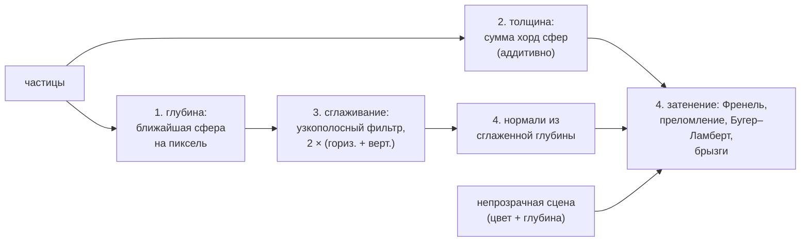

# 7. Рендеринг

[← МГД](06-mhd-plasma.md) · [Оглавление](README.md)

**Что это и зачем.** Рендер — часть демо-приложения (`app/`, Qt), не SDK. SDK отдаёт снимок `RenderSnapshot` ([Simulation.h:74](../src/sim/Simulation.h#L74)): частицы, тела, ткани, срезы полей, 3D-текстуру дыма/температуры, силовые линии. Окно просмотра `Viewport` ([app/Viewport.cpp](../app/Viewport.cpp)) рисует это средствами OpenGL. Цель — физически осмысленная картинка: пламя светится цветом абсолютно чёрного тела своей температуры, дым поглощает и отбрасывает тень внутрь себя, вода преломляет и отражает по Френелю.

---

## 7.1 Переносимость: OpenGL 3.0 / GLSL 1.30

Все шейдеры написаны так, чтобы работать на **OpenGL 3.0** (GLSL 1.30): любая видеокарта последних ~15 лет и процессорный рендер Mesa llvmpipe.

- Приложение просит контекст 3.3 core ([main.cpp:54](../app/main.cpp#L54)). Если драйвер даёт 3.3 core — к шейдерам приписывается `#version 330 core`, иначе (старые драйверы, llvmpipe) — `#version 130` ([Viewport.cpp:408](../app/Viewport.cpp#L408)).
- Атрибуты вершин привязываются **по имени** (`bindAttributeLocation`), а не `layout(location)` — в GLSL 1.30 его нет.
- Вне core-профиля включается `GL_POINT_SPRITE`: без него `gl_PointCoord` не работает.
- Нет OpenGL 3.0 — окно предлагает перезапуск с `--software-gl`.

**Программный рендер.** Ключ `--software-gl` или переменная `RF_SOFTWARE_GL=1` включают `Qt::AA_UseSoftwareOpenGL` до создания приложения ([main.cpp:45](../app/main.cpp#L45)). Qt загружает `opengl32sw.dll` (Mesa llvmpipe), которую CMake копирует к программе. Те же шейдеры выполняются на процессоре. Для скорости там: без мультисэмплинга, 96 шагов луча в объёме вместо 192, вода в половинном разрешении и с 8 отсчётами фильтра вместо 24.

---

## 7.2 Частицы: импосторы сфер

Каждая частица — точечный спрайт (`GL_POINTS`) размером со свою сферу на экране: $\text{size} = 2R\cdot f_{px}/(-z_{eye})$. Фрагментный шейдер **трассирует сферу аналитически** внутри квадрата спрайта:

[app/Viewport.cpp:123](../app/Viewport.cpp#L123)
```glsl
in vec3 vCenter; in float vRad; in float vS; in vec3 vCol;
uniform mat4 uProj; uniform int uUseScalar; uniform float uMin, uMax; uniform int uCmap;
out vec4 o;
void main() {
    vec2 c = gl_PointCoord * 2.0 - 1.0;
    c.y = -c.y;
    float r2 = dot(c, c);
    if (r2 > 1.0) discard;
    vec3 n = vec3(c, sqrt(1.0 - r2));
    vec3 pv = vCenter + n * vRad;
    vec4 clip = uProj * vec4(pv, 1.0);
    gl_FragDepth = clip.z / clip.w * 0.5 + 0.5;
```

Точки вне диска отбрасываются; нормаль $\mathbf n = (c_x, c_y, \sqrt{1 - c^2})$; точка поверхности в системе камеры $\mathbf p = \mathbf c + R\mathbf n$ записывает **настоящую глубину** сферы. Поэтому сферы корректно пересекаются друг с другом и с мешами — миллион частиц без единого треугольника.

---

## 7.3 Объём дыма: ray marching с самозатенением

Газ передаётся 3D-текстурой: канал R — плотность дыма, в режиме огня канал G — температура (байт 255 = `volumeTemperatureScale` = 2000 K над окружающей). Рисуется куб домена гранями, обращёнными **от** камеры (`glCullFace(GL_FRONT)`) — так объём виден и когда камера внутри.

`kVolFS` ([Viewport.cpp:242](../app/Viewport.cpp#L242)) на каждый пиксель:

1. **Луч** пересекается с боксом домена (slab-тест) → $[t_n, t_f]$.
2. **Глубина сцены.** Луч останавливается на первой твёрдой поверхности. Для этого глубина уже нарисованной непрозрачной сцены копируется в текстуру (`copySceneDepth` — blit буфера глубины; форматы должны совпадать: у `QOpenGLWidget` это depth 24 + stencil 8, [Viewport.cpp:1318](../app/Viewport.cpp#L1318)). В шейдере мировая точка восстанавливается обратной матрицей: $\mathbf w = (\mathbf{VP})^{-1}(\text{uv}\cdot2 - 1,\ z\cdot2 - 1,\ 1)$, и $t_f = \min(t_f, (\mathbf w - \mathbf e)\cdot\mathbf d)$. Дым не рисуется поверх тел, которые стоят перед ним.
3. **Шаги** $\Delta t = (t_f - t_n)/N$, $N$ = 192. На каждом шаге — закон Бугера–Ламберта для непрозрачности отрезка и композиция спереди назад:

$$
a = 1 - e^{-d\,\rho_s\,\Delta t}, \qquad
\mathbf C \mathrel{+}= (1 - A)\,a\,\mathbf c, \qquad
A \mathrel{+}= (1 - A)\,a ,
$$

где $\rho_s$ — плотность отображения дыма (`uDensity`). При $A > 0.98$ луч останавливается.
4. **Самозатенение.** Оптическая толщина к источнику света по 6 отсчётам: $\tau = \sum_{k=1}^{6} d(\mathbf p + k\,\ell\,\mathbf L)$, цвет умножается на $0.3 + 0.7\,e^{-\tau\rho_s\ell}$. Середина плотного шлейфа темнеет, и объём читается как объём, а не плоское белое пятно.

[app/Viewport.cpp:297](../app/Viewport.cpp#L297)
```glsl
if (d > 0.004) {
    float a = 1.0 - exp(-d * uDensity * dt);
    vec3 col = mix(vec3(0.55, 0.6, 0.68), vec3(0.97, 0.97, 1.0), clamp(d * 1.5, 0.0, 1.0));
    if (uFire == 1) col *= 0.3; // soot: dark grey
    // Self-shadowing: optical depth towards the light over a few samples; the inside of a
    // dense plume darkens and the volume reads as a volume instead of a flat white blob.
    const vec3 L = vec3(0.37, 0.86, 0.35);
    const float ls = 0.04;
    float od = 0.0;
    for (int k = 1; k <= 6; ++k) od += texture(uVol, p + L * (float(k) * ls) / uSize).r;
    col *= 0.3 + 0.7 * exp(-od * uDensity * ls);
    acc.rgb += (1.0 - acc.a) * a * col;
    acc.a += (1.0 - acc.a) * a;
    if (acc.a > 0.98) break;
}
```

---

## 7.4 Пламя: излучение абсолютно чёрного тела

В режиме огня горячий газ **излучает**. На каждом шаге луча абсолютная температура $T = T_0 + g\cdot T_{scale}$.

**Цвет** — цвет абсолютно чёрного тела температуры $T$, нормированный: аппроксимация локуса Планка Таннера Хелланда (Helland 2012) — степенные и логарифмические приближения каналов по $t = T/100$:

[app/Viewport.cpp:252](../app/Viewport.cpp#L252)
```glsl
vec3 blackbody(float T) {
    float t = T / 100.0;
    vec3 c;
    c.r = t <= 66.0 ? 1.0 : 1.292936 * pow(t - 60.0, -0.1332047);
    c.g = t <= 66.0 ? 0.3900816 * log(t) - 0.6318414 : 1.1298909 * pow(t - 60.0, -0.0755148);
    c.b = t >= 66.0 ? 1.0 : (t <= 19.0 ? 0.0 : 0.5432068 * log(t - 10.0) - 1.1962541);
    return clamp(c, 0.0, 1.0);
}
```

При 1000 K это красно-оранжевый, при 1500 K — оранжевый, около 3000 K — жёлтый, к 6600 K — белый.

**Яркость** — по закону Стефана–Больцмана $\propto T^4$, начиная с **точки Дрейпера** (~798 K — температура, с которой нагретое тело начинает заметно светиться):

$$
I = F\left(\frac{T}{1500\ \text{K}}\right)^4\operatorname{smoothstep}(800, 1100, T), \qquad
\mathbf G \mathrel{+}= (1 - A)\,\mathbf{bb}(T)\,I\,\Delta t .
$$

Свет пламени ослабляется дымом, который уже лежит перед ним ($1 - A$). Сажа сама тёмная (цвет дыма × 0.3) и затемняет то, что за ней. В конце свет тонмапится: $\mathbf C_{out} = \mathbf C + (1 - e^{-\mathbf G})$ — горячее ядро насыщается до бело-жёлтого, а не обрезается. Смешивание — с предумноженной альфой (`GL_ONE, GL_ONE_MINUS_SRC_ALPHA`).

[app/Viewport.cpp:284](../app/Viewport.cpp#L284)
```glsl
if (uFire == 1) {
    float T = uAmbient + s.g * uTempScale;
    if (T > 800.0) {
        float I = uFlame * pow(T / 1500.0, 4.0) * smoothstep(800.0, 1100.0, T);
        glow += (1.0 - acc.a) * blackbody(T) * I * dt;
    }
}
```

**Плазма** (`uFire == 2`, сцены с МГД): оптически тонкий светящийся газ — излучает линейчатым спектром ионизованного газа (фиолетово-розовый, как разряд в аргоне или водороде) и почти не поглощает.

---

## 7.5 Обугливание ткани

Шейдер мешей (`kMeshFS`, [Viewport.cpp:80](../app/Viewport.cpp#L80)) для горящей ткани получает на вершину долю сгоревшего $b = 1 - u$ (гл. 5.5):

[app/Viewport.cpp:89](../app/Viewport.cpp#L89)
```glsl
// Burning fabric (uUseScalar 2, vS = how far it has burnt, 0..1): it browns and chars black,
// and the zone that is burning right now - the pyrolysis front - glows orange.
vec3 ember = vec3(0.0);
if (uUseScalar == 2) {
    base = mix(uColor, vec3(0.35, 0.22, 0.12), smoothstep(0.0, 0.25, vS));
    base = mix(base, vec3(0.05, 0.045, 0.04), smoothstep(0.3, 0.9, vS));
    ember = vec3(1.0, 0.42, 0.08) * 1.6 * smoothstep(0.02, 0.2, vS) * (1.0 - smoothstep(0.75, 1.0, vS));
}
```

Ткань буреет, потом чернеет; зона, которая разлагается прямо сейчас (фронт пиролиза: частично сгоревшая, но не прогоревшая), светится оранжевым. Разрезанные ячейки (`cellIntact = 0`, гл. 3.7) не рисуются — в ткани появляются дыры.

---

## 7.6 Экранная вода

`FluidSurfaceRenderer` ([app/FluidSurfaceRenderer.cpp](../app/FluidSurfaceRenderer.cpp)) рисует жидкость из частиц как **гладкую водную поверхность без построения меша** — всё в экранном пространстве (Green 2010, *Screen Space Fluid Rendering with Curvature Flow*; van der Laan, Green, Sainz 2009).



### 1. Глубина

Каждая частица — спрайт сферы радиуса $1.6r$ (сферы должны перекрываться, иначе поверхность — пупырчатая). В цвет пишется расстояние до ближайшей точки сферы вдоль луча, в буфер глубины — настоящая глубина ([FluidSurfaceRenderer.cpp:26](../app/FluidSurfaceRenderer.cpp#L26)).

### 2. Толщина с поправкой на перекрытие

Хорды всех сфер вдоль луча складываются аддитивным смешиванием. Спрайты перекрываются, поэтому каждая хорда масштабируется отношением объёма частицы (куб $(2r)^3$ при шаге $2r$) к объёму спрайта:

$$
\ell = \sum_{spr} 2R_s\sqrt{1 - c^2}\cdot\frac{(2r)^3}{\tfrac43\pi R_s^3}.
$$

Тогда сумма — это длина **воды**, которую пересекает луч ([FluidSurfaceRenderer.cpp:280](../app/FluidSurfaceRenderer.cpp#L280)).

### 3. Узкополосный фильтр (Truong & Yuksel 2018)

Глубина сфер бугристая, её нужно сгладить — но не через силуэты (иначе передний край воды «прилипнет» к заднему). Раздельный гауссов фильтр берёт только соседей, чья глубина лежит в диапазоне $[z - \Delta, z + \Delta]$ вокруг пикселя ($\Delta = 2R_s$). Более близкие отсчёты (другая поверхность перед этой) **отбрасываются**, более далёкие **зажимаются** к $z + \Delta$:

[app/FluidSurfaceRenderer.cpp:78](../app/FluidSurfaceRenderer.cpp#L78)
```glsl
float zc = texture(uDepth, uv).r;
if (zc <= 0.0) { o = vec4(0.0); return; }
float radiusPx = clamp(uWorldRadius * uProjScale / zc, 1.0, float(uMaxTaps));
float sigma = 0.5 * radiusPx;
float lo = zc - uRange, hi = zc + uRange;
float sum = zc, wsum = 1.0;
for (int i = 1; i <= uMaxTaps; ++i) {
    if (float(i) > radiusPx) break;
    float w = exp(-float(i * i) / (2.0 * sigma * sigma));
    for (int s = -1; s <= 1; s += 2) {
        float z = texture(uDepth, uv + float(s * i) * uStep).r;
        if (z <= 0.0 || z < lo) continue;
        sum += w * min(z, hi);
        wsum += w;
    }
}
o = vec4(sum / wsum, 0.0, 0.0, 1.0);
```

Радиус фильтра задан в метрах (`smoothing` = 5 радиусов частицы) и переводится в пиксели с учётом перспективы: дальняя вода сглаживается на меньшее число пикселей. Два прохода (горизонтальный + вертикальный) повторяются дважды.

### 4. Затенение

**Нормаль** — из сглаженной глубины. Из двух односторонних разностей по каждой оси берётся та, что меньше по $|\Delta z|$: сосед через силуэт не наклоняет нормаль. Одинокая капля без воды вокруг смотрит на зрителя.

**Френель** — приближение Шлика с $F_0$ воды:

$$
F = F_0 + (1 - F_0)(1 - \cos\theta)^5, \qquad F_0 = \left(\frac{n - 1}{n + 1}\right)^2 = \left(\frac{0.33}{2.33}\right)^2 \approx 0.02 .
$$

**Прошедший свет** — сцена за водой, сдвинутая вдоль нормали (преломление), ослабленная по Бугеру–Ламберту через толщину $\ell$:

$$
\mathbf T = e^{-\boldsymbol\alpha\ell}, \qquad
\mathbf c_{water} = \mathbf c_{behind}\,\mathbf T + \mathbf c_{scatter}(1 - \mathbf T), \qquad
\mathbf c = \operatorname{mix}(\mathbf c_{water},\ \mathbf c_{sky}(\mathbf r),\ F) + \text{блик}.
$$

Коэффициенты поглощения по каналам $\boldsymbol\alpha = (3.0, 0.9, 0.45)$ 1/м: красный поглощается первым, и глубокая вода синеет. У чистой воды ~(0.45, 0.07, 0.02) 1/м — в баке такого размера незаметно, поэтому взяты значения слегка мутной воды бассейна или моря.

**Брызги.** Там, где воды всего на пару капель ($\ell$ меньше ~1.5 диаметра капли), свет рассеивается каплями (рассеяние Ми, почти белое), а не проходит через прозрачную толщу — цвет смешивается с белым.

[app/FluidSurfaceRenderer.cpp:139](../app/FluidSurfaceRenderer.cpp#L139)
```glsl
float thickness = texture(uThickness, uv).r;
float cosTheta = max(dot(n, v), 0.0);
float fresnel = 0.02 + 0.98 * pow(1.0 - cosTheta, 5.0); // Schlick, F0 of water (n = 1.33)
vec3 reflected = sky(normalize(mat3(uInvView) * reflect(-v, n)));
// What lies behind, bent by the surface, dimmed by Beer-Lambert through the water.
vec2 bent = clamp(uv + n.xy * uRefraction * min(thickness / 0.1, 1.0), vec2(0.001), vec2(0.999));
vec3 behind = texture(uScene, bent).rgb;
vec3 transmit = exp(-uAbsorption * thickness);
vec3 water = behind * transmit + uScatter * (vec3(1.0) - transmit);
vec3 l = normalize(vec3(0.35, 0.7, 0.6));
float spec = pow(max(dot(n, normalize(l + v)), 0.0), 120.0) * 0.8;
vec3 c = mix(water, reflected, fresnel) + vec3(spec);
// Spray: where the water is only a few drops thick the light is scattered by the drops (Mie
// scattering, nearly white) instead of passing through a clear body of water.
float spray = 1.0 - smoothstep(0.5, 1.5, thickness / uDropSize);
c = mix(c, vec3(0.82, 0.86, 0.9) * (0.6 + 0.4 * max(dot(n, l), 0.0)), spray * 0.85);
```

Поверхность пишет свою глубину (`gl_FragDepth`) и проходит тест глубины со сценой: тела перед водой её закрывают.

### Параметры (`FluidSurfaceRenderer::Settings`)

[app/FluidSurfaceRenderer.h:29](../app/FluidSurfaceRenderer.h#L29)

| Параметр | Смысл | По умолчанию |
|---|---|---|
| `sphereScale` | радиус спрайта / радиус частицы | 1.6 |
| `smoothing` | ширина фильтра в радиусах частицы | 5 |
| `absorption` | $\boldsymbol\alpha$ по R, G, B, 1/м | (3.0, 0.9, 0.45) |
| `scatterColor` | цвет света, рассеянного внутри воды | (0.05, 0.25, 0.35) |
| `refraction` | экранное смещение преломлённого фона | 0.04 |

---

## 7.7 Прочее

- **Срез поля** (`kSliceFS`) — 2D-текстура значения поля в плоскости, раскраска палитрами Turbo / Viridis / CoolWarm / Gray (полиномиальные аппроксимации в шейдере и в легенде на CPU, [Viewport.cpp:19](../app/Viewport.cpp#L19)).
- **Линии тока и силовые линии** — полилинии, раскрашенные по скорости или $|\mathbf B|$. Силовые линии трассируются в SDK (`computeFieldLines`) методом средней точки вдоль $\mathbf B/|\mathbf B|$.
- **Планета** (`kPlanetFS`, [Viewport.cpp:154](../app/Viewport.cpp#L154), сцена «Магнитосфера»): процедурная Земля без текстур — фрактальные континенты, ледяные шапки, облака, день/ночь по Солнцу выше по потоку, ободок атмосферы, блик на океане и авроральные овалы вокруг магнитных полюсов.

## Литература

- S. Green. *Screen Space Fluid Rendering for Games.* GDC 2010.
- W. J. van der Laan, S. Green, M. Sainz. *Screen Space Fluid Rendering with Curvature Flow.* I3D 2009.
- N. Truong, C. Yuksel. *A Narrow-Range Filter for Screen-Space Fluid Rendering.* PACMCGIT (I3D) 1(1), 2018.
- C. Schlick. *An Inexpensive BRDF Model for Physically-based Rendering.* Computer Graphics Forum 13(3), 1994.
- T. Helland. *How to Convert Temperature (K) to RGB: Algorithm and Sample Code.* 2012.
- J. W. Draper. *On the production of light by heat.* Phil. Mag. 30, 1847 (точка Дрейпера).
- N. Max. *Optical Models for Direct Volume Rendering.* IEEE TVCG 1(2), 1995.
- D. Q. Nguyen, R. Fedkiw, H. W. Jensen. *Physically Based Modeling and Animation of Fire.* SIGGRAPH 2002 (рендер пламени через излучение чёрного тела).
