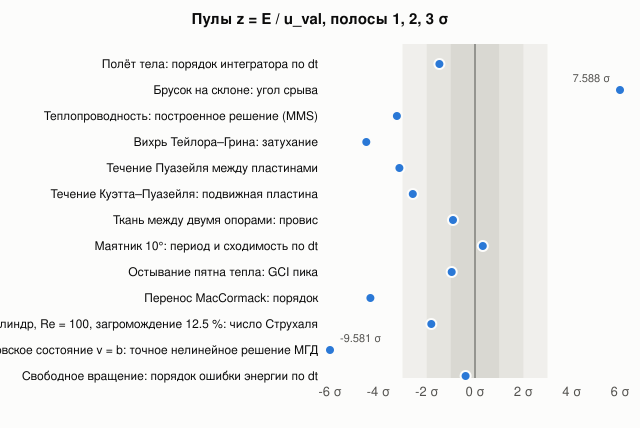
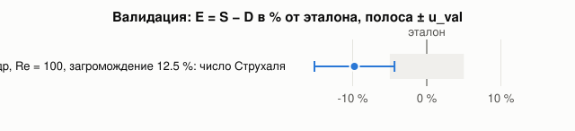

# 9. Табло: мы против мировых эталонов

[← ОТО](08-relativity.md) · [Оглавление](README.md) · [Верификация и валидация →](10-verification.md)

Одна страница, где каждая наша цифра стоит рядом с эталоном — из эксперимента, точного решения или
эталонного кода, с источником. Правило: строка попадает сюда только вместе с тестом, который её
печатает (`rf_tests`, имя в последнем столбце); цифры без теста не пишем. Статус: ✅ на уровне
эталона или лучше, 🟡 хуже эталона (расхождение указано), ⬜ эталон записан, нашей цифры ещё нет.
Верхнюю часть генерирует `rf_verify` из реестра случаев ([глава 10](10-verification.md)); ниже её —
строки, которые пока ведутся вручную.

<!-- rf_verify: начало (генерирует rf_verify; правки руками здесь пропадут) -->
## Реестр rf_verify (ASME V&V 20, слепой анализ)

Прогон `rf_verify --full`: 2026-09-27T20:32:16Z, коммит `95afca7+dirty`, 1193 с. Итог: 17 ✅ (из них 7 — «смещение разрешено»), 2 🟡, 0 ❌, 0 ⚠️, 1 🔒 слепых. Заменены более поздним прогоном: `cloth-elastic-catenary` — из прогона 2026-09-27T21:42:25Z (`--full`, коммит `1be1f22+dirty`); `cloth-elastic-catenary` — из прогона 2026-09-27T21:50:23Z (`--full`, коммит `1be1f22+dirty`); `cloth-elastic-catenary` — из прогона 2026-09-27T23:55:58Z (`--full`, коммит `a75f234+dirty`); `gr-symplectic-drift` — из прогона 2026-09-28T00:54:28Z (`--full`, коммит `cbb5834+dirty`); `mhd-alfvenic-state` — из прогона 2026-09-28T01:23:57Z (`--quick`, коммит `95afca7+dirty`); `gas-mms-heat` — из прогона 2026-09-28T01:43:14Z (`--full`, коммит `95afca7+dirty`); `gas-taylor-green` — из прогона 2026-09-28T01:44:34Z (`--full`, коммит `95afca7+dirty`); `gas-poiseuille` — из прогона 2026-09-28T01:45:19Z (`--full`, коммит `95afca7+dirty`); `gas-couette` — из прогона 2026-09-28T01:48:40Z (`--full`, коммит `95afca7+dirty`); `gas-heat-spot` — из прогона 2026-09-28T01:52:00Z (`--full`, коммит `95afca7+dirty`); `gas-advection` — из прогона 2026-09-28T01:52:44Z (`--full`, коммит `95afca7+dirty`); `gas-cylinder-strouhal` — из прогона 2026-09-28T01:52:59Z (`--full`, коммит `95afca7+dirty`); `gas-mms-heat` — из прогона 2026-09-28T02:59:09Z (`--full`, коммит `95afca7+dirty`); `gas-taylor-green` — из прогона 2026-09-28T02:59:56Z (`--full`, коммит `95afca7+dirty`); `gas-poiseuille` — из прогона 2026-09-28T03:00:24Z (`--full`, коммит `95afca7+dirty`); `gas-couette` — из прогона 2026-09-28T03:02:39Z (`--full`, коммит `95afca7+dirty`); `gas-heat-spot` — из прогона 2026-09-28T03:04:56Z (`--full`, коммит `95afca7+dirty`); `gas-advection` — из прогона 2026-09-28T03:05:30Z (`--full`, коммит `95afca7+dirty`); `gas-cylinder-strouhal` — из прогона 2026-09-28T03:05:39Z (`--full`, коммит `95afca7+dirty`); `rigid-free-rotor-order` — из прогона 2026-09-28T04:41:28Z (`--full`, коммит `95afca7+dirty`); `rigid-incline-slide` — из прогона 2026-09-28T04:41:29Z (`--full`, коммит `95afca7+dirty`); `rigid-incline-stick` — из прогона 2026-09-28T04:41:29Z (`--full`, коммит `95afca7+dirty`); `rigid-newton-cradle` — из прогона 2026-09-28T04:41:29Z (`--full`, коммит `95afca7+dirty`); `rigid-noether-angular` — из прогона 2026-09-28T04:41:29Z (`--full`, коммит `95afca7+dirty`); `rigid-noether-energy` — из прогона 2026-09-28T04:41:30Z (`--full`, коммит `95afca7+dirty`); `rigid-noether-momentum` — из прогона 2026-09-28T04:41:30Z (`--full`, коммит `95afca7+dirty`); `rigid-pendulum-dt` — из прогона 2026-09-28T04:41:30Z (`--full`, коммит `95afca7+dirty`); `rigid-projectile` — из прогона 2026-09-28T04:41:30Z (`--full`, коммит `95afca7+dirty`).

Как читать ([метод](10-verification.md)): S — наше число, D — эталон, E = S − D, u_val = √(u_num² + u_input² + u_D²), пул z = E / u_val в σ: |z| < 2 согласие, 2–3 напряжение, 3–5 свидетельство ошибки, ≥ 5 ошибка установлена. Статус — по допуску случая на |E|, а не на |E| − u_val: большая неопределённость не превращает плохой ответ в зачёт. Статус и пул отвечают на разные вопросы: допуск — «достаточно ли близко для нашей цели», z — «отличимо ли расхождение от нашей неопределённости». Поэтому «✅ смещение разрешено» — |E| в пределах допуска, но |z| ≥ 2: неопределённость (для проверки кода — численная u_num: GCI, стандартная ошибка порядка или ширина брекета) меньше самого смещения, то есть смещение измерено, а не шум, и при этом допустимо; сноска под таблицей даёт E в % от эталона. Для проверки кода число — наблюдаемый порядок схемы против теоретического. «История»: ↑/↓ — изменение больше 3σ разброса между прогонами, ≈ — в пределах.

### Проверка кода (code verification)

| Случай | Эталон и источник | D ± u_D | S ± u_num ± u_input | E = S − D | u_val | z, σ | порядок набл. / теор. | Статус | История | id, слепота, тест |
|---|---|---|---|---|---|---|---|---|---|---|
| Полёт тела: порядок интегратора по dt | [Полусимплектический Эйлер: ошибка g t dt / 2 (Hairer, Lubich, Wanner 2006)](https://doi.org/10.1007/3-540-30666-8) | 1 | 0.999 ± 0.0006894 | -0.001014 (-0.1014 %) | 0.0006894 | -1.5 | 0.999 / 1 | ✅ | 0.999 → 1 → **0.999** ↓ (детерм., Δ = -0.001134) | `rigid-projectile` open, tuning |
| Брусок скользит по склону 30° | Кулон: a = g (sin θ − μk cos θ) | 2.356 | 2.359 м/с² | 0.002535 (0.1076 %) | 0 | — | — | ✅ | 2.359 → 2.359 → **2.359** = (детерм.) | `rigid-incline-slide` open, tuning |
| Брусок на склоне: угол срыва | Кулон: tg θc = μs | 21.8 | 21.83 ± 0.004229 ° | 0.03209 (0.1472 %) | 0.004229 | +7.6 | — | ✅ смещение разрешено¹ | 21.83 → 21.86 → **21.83** ↓ (детерм., Δ = -0.02197) | `rigid-incline-stick` open, tuning |
| Энергия упругого мяча, 20 отскоков | [Нётер (1918): сохранение при симметрии](https://doi.org/10.1080/00411457108231446) | 0 | 0.003678 | 0.003678 | 0 | — | — | ✅ | 0.003678 → 0.003678 → **0.003678** = (детерм.) | `rigid-noether-energy` open, tuning `Noether` |
| Импульс в косом ударе | [Нётер (1918): сохранение при симметрии](https://doi.org/10.1080/00411457108231446) | 0 | 2.66e-07 | 2.66e-07 | 0 | — | — | ✅ | 1.191e-07 → 2.66e-07 → **2.66e-07** = (детерм.) | `rigid-noether-momentum` open, tuning `Noether` |
| \|L\| свободного тела (Джанибеков) | [Нётер (1918): сохранение при симметрии](https://doi.org/10.1080/00411457108231446) | 0 | 2.629e-06 | 2.629e-06 | 0 | — | — | ✅ | 0.0007358 → 2.629e-06 → **2.629e-06** = (детерм.) | `rigid-noether-angular` open, tuning `Noether` |
| Колыбель Ньютона на полу, e = 1 | Сохранение импульса и энергии: последний шар уходит с 2 м/с | 2 | 2 м/с | 2.38e-07 (1.19e-05 %) | 0 | — | — | ✅ | 2 → 2 → **2** = (детерм.) | `rigid-newton-cradle` open, tuning `Newton's cradle on the floor` |
| Теплопроводность: построенное решение (MMS) | [Roache 2002, MMS; ожидаемый порядок схемы 2](https://doi.org/10.1115/1.1436090) | 2 | 1.984 ± 0.004884 | -0.01579 (-0.7894 %) | 0.004884 | -3.2 | 1.984 / 2 | ✅ смещение разрешено² | 1.984 → 1.984 → **1.984** = (детерм.) | `gas-mms-heat` open, tuning |
| Вихрь Тейлора–Грина: затухание | [Taylor & Green 1937: A = e^{−2νk²t}; порядок 1 (проекция в конце шага + неявная вязкость, dt ~ dx)](https://doi.org/10.1098/rspa.1937.0036) | 1 | 0.9516 ± 0.01076 | -0.04839 (-4.839 %) | 0.01076 | -4.5 | 0.9516 / 1 | ✅ смещение разрешено³ | 1.068 → 0.9361 → **0.9516** ↑ (детерм., Δ = 0.01554) | `gas-taylor-green` open, tuning |
| Течение Пуазейля между пластинами | Пуазейль: u = 6U η(1−η); порядок MAC-схемы 2 | 2 | 1.974 ± 0.008159 | -0.02552 (-1.276 %) | 0.008159 | -3.1 | 1.974 / 2 | ✅ смещение разрешено⁴ | 0.9722 → 1.964 → **1.974** ↑ (детерм., Δ = 0.01044) | `gas-poiseuille` open, tuning |
| Течение Куэтта–Пуазейля: подвижная пластина | Куэтт–Пуазейль: u = U_w η + 6(U − U_w/2) η(1−η); порядок MAC-схемы 2 (White, Viscous Fluid Flow, §3-2) | 2 | 1.977 ± 0.00912 | -0.02346 (-1.173 %) | 0.00912 | -2.6 | 1.977 / 2 | ✅ смещение разрешено⁵ | 0.9458 → 1.964 → **1.977** ↑ (детерм., Δ = 0.0127) | `gas-couette` open, tuning |
| Ткань между двумя опорами: провис | [Irvine 1981, упругая цепная линия](https://mitpress.mit.edu/9780262090230/cable-structures/) | 0.07769 | 0.07751 ± 0.0001868 м | -0.0001704 (-0.2193 %) | 0.0001868 | -0.9 | 0.9208 / — | ✅ | 0.05818 → 0.07738 → **0.07751** ↑ (детерм., Δ = 0.0001346) | `cloth-elastic-catenary` open, tuning |
| Геодезические Керра: энергия без векового дрейфа (Тао-4) | [Hairer, Lubich, Wanner 2006: симплектический шаг — точный поток близкого гамильтониана, ошибка энергии ограничена](https://doi.org/10.1007/3-540-30666-8) | 0 | 1.907e-07 | 1.907e-07 | 0 | — | 4.018 / 4 | ✅ | 1.802e-05 → **1.907e-07** ↓ (детерм., Δ = -1.783e-05) | `gr-symplectic-drift` open, tuning `symplectic geodesics: energy bounded over thousands of orbits, RK4 drifts` |
| Альфвеновское состояние v = b: точное нелинейное решение МГД | [Elsasser 1950; Dobrowolny, Mangeney & Veltri 1980: при z⁻ = 0 нелинейные члены исчезают, A_k = A_k(0) e^{−νk²t}; порядок 1 (стабилизирующее сопротивление \|u\|²h в индукции)](https://doi.org/10.1103/PhysRevLett.45.144) | 1 | 0.9616 ± 0.004005 | -0.03837 (-3.837 %) | 0.004005 | -9.6 | 0.9616 / 1 | ✅ смещение разрешено⁶ | 0.9158 → **0.9616** ↑ (детерм., Δ = 0.0458) | `mhd-alfvenic-state` open, tuning `MHD: an Alfvénic state v = b is an exact nonlinear solution (Elsässer)` |
| Свободное вращение: порядок ошибки энергии по dt | [Симметричное расщепление на точные повороты (McLachlan 1993; Dullweber, Leimkuhler, McLachlan 1997)](https://doi.org/10.1063/1.474310) | 2 | 1.995 ± 0.01364 | -0.005328 (-0.2664 %) | 0.01364 | -0.4 | 1.995 / 2 | ✅ | 1.995 → **1.995** = (детерм.) | `rigid-free-rotor-order` open, tuning `action: a free spinning box` |

- ¹ `rigid-incline-stick`: E = 0.03209 ° (+0.15 % от эталона), в пределах допуска ±0.25 °. z = +7.6 σ, потому что численная неопределённость u_num = 0.004229 (из GCI, стандартной ошибки порядка или ширины брекета) меньше самого смещения |E|: смещение измерено уверенно и при этом допустимо.
- ² `gas-mms-heat`: E = -0.01579 (-0.79 % от эталона), в пределах допуска ±0.3. z = -3.2 σ, потому что численная неопределённость u_num = 0.004884 (из GCI, стандартной ошибки порядка или ширины брекета) меньше самого смещения |E|: смещение измерено уверенно и при этом допустимо.
- ³ `gas-taylor-green`: E = -0.04839 (-4.84 % от эталона), в пределах допуска ±0.3. z = -4.5 σ, потому что численная неопределённость u_num = 0.01076 (из GCI, стандартной ошибки порядка или ширины брекета) меньше самого смещения |E|: смещение измерено уверенно и при этом допустимо.
- ⁴ `gas-poiseuille`: E = -0.02552 (-1.28 % от эталона), в пределах допуска ±0.3. z = -3.1 σ, потому что численная неопределённость u_num = 0.008159 (из GCI, стандартной ошибки порядка или ширины брекета) меньше самого смещения |E|: смещение измерено уверенно и при этом допустимо.
- ⁵ `gas-couette`: E = -0.02346 (-1.17 % от эталона), в пределах допуска ±0.3. z = -2.6 σ, потому что численная неопределённость u_num = 0.00912 (из GCI, стандартной ошибки порядка или ширины брекета) меньше самого смещения |E|: смещение измерено уверенно и при этом допустимо.
- ⁶ `mhd-alfvenic-state`: E = -0.03837 (-3.84 % от эталона), в пределах допуска ±0.3. z = -9.6 σ, потому что численная неопределённость u_num = 0.004005 (из GCI, стандартной ошибки порядка или ширины брекета) меньше самого смещения |E|: смещение измерено уверенно и при этом допустимо.

### Проверка решения (solution verification)

| Случай | Эталон и источник | D ± u_D | S ± u_num ± u_input | E = S − D | u_val | z, σ | порядок набл. / теор. | Статус | История | id, слепота, тест |
|---|---|---|---|---|---|---|---|---|---|---|
| Маятник 10°: период и сходимость по dt | Физический маятник, эллиптический интеграл K | 2.011 | 2.011 ± 6.822e-05 с | 2.189e-05 (0.001089 %) | 6.822e-05 | +0.3 | 0.639 / — | ✅ | 2.011 → 2.011 → **2.011** ↑ (детерм., Δ = 2.615e-05) | `rigid-pendulum-dt` open, tuning `joints` |
| Остывание пятна тепла: GCI пика | Точное решение уравнения теплопроводности (ядро) | 0.05844 | 0.05773 ± 0.0007452 K | -0.0007176 (-1.228 %) | 0.0007452 | -1.0 | 1.968 / 2 | 🟡 | 0.05773 → 0.05773 → **0.05773** = (детерм.) | `gas-heat-spot` open, tuning `grid convergence` |
| Перенос MacCormack: порядок | [Selle et al. 2008, MacCormack: порядок 2](https://doi.org/10.1007/s10915-007-9166-4) | 2 | 1.777 ± 0.05166 | -0.2235 (-11.17 %) | 0.05166 | -4.3 | 1.777 / 2 | ✅ смещение разрешено⁷ | 1.777 → 1.777 → **1.777** = (детерм.) | `gas-advection` open, tuning `grid convergence` |

- ⁷ `gas-advection`: E = -0.2235 (-11.17 % от эталона), в пределах допуска ±0.3. z = -4.3 σ, потому что численная неопределённость u_num = 0.05166 (из GCI, стандартной ошибки порядка или ширины брекета) меньше самого смещения |E|: смещение измерено уверенно и при этом допустимо.

### Валидация (validation)

| Случай | Эталон и источник | D ± u_D | S ± u_num ± u_input | E = S − D | u_val | z, σ | порядок набл. / теор. | Статус | История | id, слепота, тест |
|---|---|---|---|---|---|---|---|---|---|---|
| Цилиндр, Re = 100, загромождение 12.5 %: число Струхаля | [Behr, Hastreiter, Mittal, Tezduyar 1995: равномерный приток, скользящие стенки, Re = 100 — продолжение их табл. 4 до загромождения 12.5 %](https://doi.org/10.1016/0045-7825(94)00736-7) | 0.175 ± 0.004 | 0.1579 ± 0.008563 | -0.01707 (-9.755 %) | 0.009451 | -1.8 | 1.361 / — | 🟡 | 0.1603 → 0.1603 → **0.1579** ↓ (детерм., Δ = -0.002415) | `gas-cylinder-strouhal` open, tuning `benchmark: cylinder vortex street` |
| Обрушение плотины: фронт Z при T = 2 | [Martin & Moyce 1952, эксперимент, n² = 2](https://doi.org/10.1098/rsta.1952.0006) | 🔒 запечатан, SHA-256 `d3ddb03c0e82…` | 2.6 ± 0.2021 ± 0.02411 (UQ) (5 зёрен, σ 0) | — | — | — | — | 🔒 | 2.6 → 2.6 → **2.6** = (детерм.) | `liquid-dam-break` blinded, holdout `benchmark: dam break front` |

### Значимость набора валидации

χ² = 3.26 при ndf = 1 (χ²/ndf = 3.26), p = 0.0709. Наибольший пул -1.8σ (`gas-cylinder-strouhal`); поправка Бонферрони на число случаев N = 1: глобальное p ≤ 0.0709. Ожидаемое число |z| > 2 среди N = 1 согласных случаев: 0.05, наблюдается 0. Слепых валидационных случаев вне суммы: 1.

### Слепой анализ

Эталоны этих случаев запечатаны ([процедура](10-verification.md)); здесь только SHA-256 обязательства. Журнал снятия слепоты: [verification/unblinding-log.md](../verification/unblinding-log.md).

| id | статус | выборка | SHA-256(value\|uncertainty\|salt) |
|---|---|---|---|
| `liquid-dam-break` | blinded | holdout | `d3ddb03c0e8242c84924f041d01fa6860b11973d265dcad5060ebac194c26fe5` |

### Числа за каждой строкой

- `rigid-projectile` ✅ z = -1.5 σ: согласие (|z| < 2). ошибка положения за 0.8 с: 6.54e-02 м при dt = 1/60, 4.10e-03 м при dt = 1.0e-03 с; ожидание g t dt / 2. Эталон: теоретический порядок схемы. [график](img/verification/rigid-projectile.svg)
- `rigid-incline-slide` ✅ z не определён (u_val = 0). склон 30°, μk = 0.3, μs = 0.4: a = 2.3588 м/с², путь за 1 с 1.413 м. Эталон: μk = 0.3.
- `rigid-incline-stick` ✅ смещение разрешено — z = +7.6 σ: численная ошибка сверх оценки установлена (|z| ≥ 5), но |E| в пределах допуска. граница покоя между 21.826° и 21.841° (μs = 0.4, μk = 0.3). Эталон: μs = 0.4.
- `rigid-noether-energy` ✅ z не определён (u_val = 0). худший дрейф энергии 0.37% за 20 отскоков (dt = 1/600). Эталон: точный закон сохранения; допуск — наш.
- `rigid-noether-momentum` ✅ z не определён (u_val = 0). худший |ΔP|/|P| = 2.7e-07 за 1 с, спин второго ящика 4.06 рад/с. Эталон: точный закон сохранения; допуск — наш.
- `rigid-noether-angular` ✅ z не определён (u_val = 0). |L| дрейф 2.6e-06 за 10 с, 6 переворотов (эффект Джанибекова). Эталон: точный закон сохранения; допуск — наш.
- `rigid-newton-cradle` ✅ z не определён (u_val = 0). последний шар 2.0000 м/с, остальные не быстрее 0.0000 м/с.
- `gas-mms-heat` ✅ смещение разрешено — z = -3.2 σ: свидетельство численной ошибки сверх оценки (3 ≤ |z| < 5), но |E| в пределах допуска. RMS ошибка T через одно время диффузии: 1.05e-03 K (16 ячеек) … 6.68e-05 K (64 ячеек), амплитуда 1 K, α(T) ~ T^1.75. Эталон: T = A (2 + cos πx cos πy (1 + sin ωt / 2)) с α(T) ~ T^1.75, источник — из уравнения (Mms.h). [график](img/verification/gas-mms-heat.svg)
- `gas-taylor-green` ✅ смещение разрешено — z = -4.5 σ: свидетельство численной ошибки сверх оценки (3 ≤ |z| < 5), но |E| в пределах допуска. схема: проекция в конце шага; A(1 с)/A(0): 0.7747 (16 ячеек) … 0.8145 (128 ячеек), точное exp(-2νπ²t) = 0.8209, ν = 0.01. Эталон: полупериод в ящике со скольжением — точное решение; перенос с отражением (advectionReflection, выключен по умолчанию): порядок 2.268 при ожидаемом 2. [график](img/verification/gas-taylor-green.svg)
- `gas-poiseuille` ✅ смещение разрешено — z = -3.1 σ: свидетельство численной ошибки сверх оценки (3 ≤ |z| < 5), но |E| в пределах допуска. RMS ошибка профиля / U: 1.52e-02 (8 ячеек на H) … 2.51e-04 (64 ячеек), Re = 2; шаг Куранта 0.5 против 0.1 (8 ячеек): профили различаются на 2.9e-05 U; против профиля со стенками на полъячейки дальше: 1.16e-01 … 2.01e-02, порядок 0.84. Эталон: Re = 2, стенки — ячейки сосуда; перенос с отражением (выключен по умолчанию): порядок 1.986. [график](img/verification/gas-poiseuille.svg)
- `gas-couette` ✅ смещение разрешено — z = -2.6 σ: напряжение (2 ≤ |z| < 3), но |E| в пределах допуска. RMS ошибка профиля / U: 7.59e-03 (8 ячеек на H) … 1.25e-04 (64 ячеек), Re = 2; шаг Куранта 0.5 против 0.1 (8 ячеек): профили различаются на 6.2e-07 U; против профиля со стенками на полъячейки дальше: 1.07e-01 … 1.62e-02, порядок 0.91; чистый Куэтт (крышка 2U, линейный профиль): ошибка 1.0e-05 U — точно, до допусков решателей. Эталон: верхняя пластина — движущееся тело со скоростью U; чистый Куэтт (линейный) схема передаёт точно; перенос с отражением (выключен по умолчанию): порядок 1.988. [график](img/verification/gas-couette.svg)
- `cloth-elastic-catenary` ✅ z = -0.9 σ: согласие (|z| < 2). провис 0.0771 / 0.0774 / 0.0775 м (шаг 0.020 … 0.005 м), Ирвин 0.0777 м, Ричардсон 0.0777 м; равновесие: остаточное качание ≤ 1.2e-03 м за последние 0.5 с; со сдвигом по умолчанию 100 Н/м: 0.0714 м; неразрываемая (тетеры без слабины): 0.0090 м. Эталон: полоса 1 м натянута без слабины, 300 Н/м, 0.3 кг/м². [график](img/verification/cloth-elastic-catenary.svg)
- `rigid-pendulum-dt` ✅ z = +0.3 σ: согласие (|z| < 2). T = 2.01088 / 2.01089 / 2.01092 с (подшагов 2..8), точное 2.01090 с; Ричардсон 2.01092, p = -0.71. Эталон: T = T0 (2/π) K(sin θ0/2), I = m (L² + 2r²/5). [график](img/verification/rigid-pendulum-dt.svg)
- `gas-heat-spot` 🟡 z = -1.0 σ: согласие (|z| < 2). пик 0.04792 / 0.05573 / 0.05773 K (16/32/64), Ричардсон 0.05841 K, точный 0.05844 K, p = 1.97, GCI 1.48%. Эталон: пик в центре через 1 с. [график](img/verification/gas-heat-spot.svg)
- `gas-advection` ✅ смещение разрешено — z = -4.3 σ: свидетельство численной ошибки сверх оценки (3 ≤ |z| < 5), но |E| в пределах допуска. RMS ошибка дыма: 8.45e-03 / 2.62e-03 / 7.20e-04 (32/64/128), шаги 1.69 и 1.87. [график](img/verification/gas-advection.svg)
- `gas-cylinder-strouhal` 🟡 z = -1.8 σ: согласие (|z| < 2). St = 0.1420 / 0.1521 / 0.1579 (сетки 48/72/108), Ричардсон 0.1658, p = 1.36. Эталон: их A = 9 и 12.5 радиуса: St 0.1711 / 0.1658 и 0.1739 / 0.1690, продолжено до A = 8; безграничный поток (эксперимент Williamson 1996, doi 10.1146/annurev.fl.28.010196.002401): 0.164; перенос с отражением (выключен по умолчанию): 0.1745. [график](img/verification/gas-cylinder-strouhal.svg)
- `liquid-dam-break` 🔒 слепой случай: эталон запечатан, E и вердикт скрыты до --unblind. Z(T=2) = 2.600 / 2.474 / 2.600 (r = 10/7.1/5 мм); UQ 8 прогонов: σ 0.024, 95% [2.57, 2.63]; 5 зёрен: среднее 2.6, разброс σ = 0. Эталон: u_D — наша оценка, не из статьи: чтение графика и момент старта, в квадратуре (в запечатанном файле). [график](img/verification/liquid-dam-break.svg)
- `gr-symplectic-drift` ✅ z не определён (u_val = 0). Тао-4 (h = M, ω = 0,1): max|ΔH| 6.95e-06, тренд/размах 0.000 за 3000 витков; RK4 с тем же шагом: max|ΔH| 4.11e-06, тренд/размах 1.00 — чистый уход. Эталон: значение — |тренд H за прогон| / наибольшее |H − H₀|: 0 — колебание, 1 — чистый уход (у RK4 1,00). [график](img/verification/gr-symplectic-drift.svg)
- `mhd-alfvenic-state` ✅ смещение разрешено — z = -9.6 σ: численная ошибка сверх оценки установлена (|z| ≥ 5), но |E| в пределах допуска. A(1 с)/A(0) ячеек (1,1) и (2,2): 0.8219 / 0.4358 на сетке 64, точно 0.8209 / 0.4540; худшая ошибка 0.069 (16) … 0.0183 (64); |v − b| / |v + b|: 4.6e-02 (16) … 1.4e-02 (64). Эталон: две ячейки (1,1) и (2,2) в квадрате со скользящими проводящими стенками, ν = η = 0,01, 1 с; без поля ячейки перемешивают друг друга (контроль в тесте). [график](img/verification/mhd-alfvenic-state.svg)
- `rigid-free-rotor-order` ✅ z = -0.4 σ: согласие (|z| < 2). наибольшая ошибка энергии за 5 с: 3.36e-04 при dt = 1/60, 2.12e-05 при dt = 4.2e-03 с (переворот ракетки). Эталон: теоретический порядок схемы. [график](img/verification/rigid-free-rotor-order.svg)

<!-- rf_verify: конец -->

## Строки, которые пока ведутся вручную

Эти цифры печатают тесты `rf_tests`; в реестр `rf_verify` они ещё не перенесены. Перенесённые
строки (энергия упругого мяча, маятник, колыбель Ньютона, обрушение плотины, число Струхаля,
порядки сходимости диффузии и переноса) отсюда убраны: их числа — в реестре выше.

## Твёрдые тела

| Величина | Эталон и источник | У нас | Статус | Тест |
|---|---|---|---|---|
| Стопка из 200 кубов, 40 м, сброс с 1 см | стоит без сползания; Box2D/Bullet демонстрируют стопки ~30–100 тел | верх 39.8995 м (ожид. 39.900), сползание 7 мм, все спят | ✅ | `stack of 200 boxes` |
| Импульс и момент импульса в косом ударе | сохраняются точно | $10^{-8}$ / $1.2\cdot10^{-3}$ | ✅ | `Noether` |
| Эффект Джанибекова | период $20.4/\sigma$, $\lvert\mathbf L\rvert$ и энергия постоянны | 6 переворотов за 10 с, период 3.40 с, дрейф $\lvert\mathbf L\rvert$ $7.5\cdot10^{-4}$ | ✅ | `Noether` |
| Пуля 300 м/с в плиту, $e = 0.5$ | разлёт $e\cdot300 = 150$ м/с, импульс сохраняется | 149.9 м/с; 80.42 → 80.37 кг·м/с | ✅ | `continuous collision` |
| Выделений памяти за кадр (100 чайников) | 0 в горячем пути (Box2D `b2StackAllocator`, Bullet `btAlignedAlloc`) | 83 (было 140 075) | ✅ | `memory` |
| Статичный меш как земля | `btBvhTriangleMeshShape`: время не растёт с числом треугольников | 51 200 треугольников, 150 тел, 12 мс/кадр, 0 провалов | ✅ | `terrain` |
| 30 000 частиц против 150 тел | дерево мира (btDbvt): запрос $O(\log n)$ на частицу | 220 → 69 мс/кадр, те же контакты | ✅ | `particles vs many bodies` |
| Разрушение (ячейки Вороного) | сумма объёмов ячеек = объём тела; ячейки выпуклы и замкнуты (Blender Cell Fracture, Müller et al. 2013) | — | ⬜ | `Voronoi fracture` (в работе) |
| Удар без отскока, $e = 0$: шар и ящик с 1 и 5 м (4.39 и 9.82 м/с) на пол, плиту, стопку | скорость после удара 0; контроль $e = 0.5$: $0.5\,v_n$ | отскок 0.0000 м/с, подъём 0.00 мм во всех 7 случаях; $e = 0.5$: 2.1972 при 2.1973 м/с. Было 0.1 $v_n$ от пола: у стен был зашит $e = 0.1$ (смешивание по максимуму), теперь `wallRestitution` = 0 | ✅ | `restitution 0` |
| Куб 0.2 м брошен плашмя с 1 и 5 м, $e = 0$ и 0.5, на пол, плиту редактора и в сцене редактора | по симметрии поворот 0 и сдвиг 0 | 0.00° и 0.00 мм во всех 8 случаях. Было: 90.01° и 99.6 мм на плите с 1 м. Причины две: SAT выбирал ось ребра на упреждающем зазоре (одна точка в метре от куба), и угловые импульсы тёплого старта не снимались у контакта без нагрузки | ✅ | `cube dropped flat` |
| Эффект Джанибекова (урок) | период $20.4/\sigma = 6.53$ с | 3 переворота за 12 с (ожидается ~4), дрейф $\lvert\mathbf L\rvert$ $9\cdot10^{-4}$ | ✅ | урок «Джанибеков» |
| Башня Галилея, вакуум | $t = \sqrt{2h/g} = 0.903$ с для всех масс | 0.917 с для всех трёх (разрешение — кадр) | ✅ | урок «Башня Галилея» |
| Побитовая воспроизводимость | одни и те же биты при любом числе потоков, процессоре и компиляторе (Box2D v3: детерминизм по платформам) | два прогона и 1 / 2 / 24 потока — побитово, 9 сцен (было: огонь 65 / 34 / 20 сгоревших нитей, теперь 65 на всех); строгая сборка — золотой хеш твёрдых тел `912fa823d3669448`; другие компиляторы и процессоры не проверены | ✅ | `determinism` |

## Частицы, мягкие тела, ткань

| Величина | Эталон и источник | У нас | Статус | Тест |
|---|---|---|---|---|
| Ошибка плотности жидкости в покое | < 1 % (Macklin & Müller 2013) | 0.06 % | ✅ | `particles rest` |
| Плавучесть | закон Архимеда: осадка по плотности | шар 300 кг/м³ плавает, 3000 тонет; осадка по формуле | ✅ | `floating`, `light body` |
| Прогиб консоли (мягкое тело) | Эйлер–Бернулли: $\delta = qL^4/(8EI)$ | — (shape matching без модуля Юнга; консоль обвисает) | ⬜ FEM-тетраэдры | план |
| Период колебаний балки | $\omega_1 = 3.516\sqrt{EI/(\rho A L^4)}$ | — | ⬜ | план |
| Разрыв ткани по нитям | статика: связи под штангой держат вес (закон Ньютона); нить рвётся при натяжении выше прочности | сумма сил 1424.5 Н против веса 1404.9 Н (+1.4 %); при 0.8 прочности 0 нитей, при 1.3 рвётся весь верхний ряд (41 из 41); шов, нагруженный весом в 1.5 раза выше своей прочности, расходится по всей длине; рывок рвёт поперёк. Жёсткость и прочность нити — по ширине, которую она представляет (как масса частицы) | ✅ | `cloth: threads carry…`, `soft` |
| Превращение «желе → вода» во время пуска | объём сохраняется: столько же частиц | 343 из 343 при каждом из трёх превращений (было 316: дрожание укладки опускало половину нижнего слоя ближе радиуса к полу, и правило «частица внутри твёрдого не создаётся» её отбрасывало; теперь слой кладётся на 0.1 радиуса выше) | ✅ | `meta: water <-> soft` |
| Смена роли без перезагрузки | остальная сцена не меняется | лежащий рядом ящик сдвинулся на 0 м за превращения (2.9e-13 м за прогон); сила магнита возвращается с точностью 3e-4 | ✅ | `meta: *` |
| Ложные разрывы ткани | нить не рвётся при натяжении ниже прочности; у закреплённого края — тяга маятника $\le 3Mg$ = 8.8 Н/м | 0 порванных нитей (было ~200 у полотна 0.6 м); хлопок (умолчания по KES-F): 4.8 Н/м у края, максимум 271 Н/м при оценке щелчка края $v\sqrt{k\mu}$ = 512 Н/м; «картон» (прежние умолчания): 0 порванных, максимум 0.46 прочности. Причина была в отставании решателя (3–8 % растяжения вместо 0.03 %): теперь каждая нить решается линией точно (прогонка), проходы контактов начинают с силы нитей. Стоимость — как у прежнего решателя, не больше 1.1× на каждом тесте ткани (замер A/B, глава 3) | ✅ | `cloth: a sheet swinging…`, `graph: cloth` |

## Газ и огонь

| Величина | Эталон и источник | У нас | Статус | Тест |
|---|---|---|---|---|
| $C_D$, $C_L$ цилиндра, Re = 100 | 1.3–1.4; амплитуда $C_L$ ≈ 0.33 (2D-эталоны) | 1.38; 0.31 | ✅ | тот же |
| Подъёмная сила крыла NACA 2412 | $C_L(\alpha)$ по Abbott & von Doenhoff | — (сила есть, эталонной кривой нет) | ⬜ | план |
| Каверна с движущейся крышкой, Re = 100/400 | профили скорости Ghia et al. 1982 | — | ⬜ | план |
| Сфера, $C_d(Re)$ | Clift, Grace & Weber 1978 | — | ⬜ | план |
| Теплопроводность | аналитическое остывание | совпадает (тест) | ✅ | `heat conduction` |
| Горение: предел по кислороду, пиролиз хлопка | Аррениус, параметры из литературы | штора загорается и прогорает; мощность в норме | 🟡 без эталонной цифры | `fire: burner ignites a curtain` |

## Плазма (МГД)

| Величина | Эталон и источник | У нас | Статус | Тест |
|---|---|---|---|---|
| Резистивный распад поля | $B/B_0 = e^{-\eta k^2 t}$ | совпадает | ✅ | `MHD` |
| Альфвеновская волна | период $2L/v_A$; энергия без роста | период совпадает; энергия 98.42 % за 2.2 периода в сборках с FMA и без (было 92.5 % / 79 %: округление `float` при фоне в 3.8 млн раз сильнее волны) | ✅ | `MHD` |
| $\nabla\cdot\mathbf B$ | 0 (constrained transport) | $10^{-4}$ и ниже | ✅ | `MHD`, `tokamak` |
| Магнитопауза | Чепмен–Ферраро: 0.29–0.37 м для нашей сцены | в интервале | ✅ | `plasma wind vs magnet` |
| Кинк $m = 1$ в токамаке | Крускал–Шафранов: растёт при $2a^2/(a^2+b^2) < q_a < 1$; инкремент по Freidberg | растёт в интервале, инкремент вдвое ниже теории | 🟡 | `tokamak` (выключен по умолчанию) |
| Орсаг–Танг, ударная труба Брио–Ву | эталонные картины МГД-кодов (Athena, PLUTO) | — | ⬜ | план |

## ОТО (`relativity/`)

| Величина | Эталон и источник | У нас | Статус | Тест |
|---|---|---|---|---|
| Отклонение луча, $b = 200M$ | $4M/b + 15\pi M^2/(4b^2) = 0.0202945$ | 0.0202999 ($2.7\cdot10^{-4}$) | ✅ | `light deflection` |
| Инварианты $E, L, Q$ вдоль орбиты в Керре, $a = 0.9$ | сохраняются; DNGR (James et al. 2015) ~$10^{-8}$ | $\delta E = \delta L = 0$, $\delta Q = 5.7\cdot10^{-10}$ | ✅ | `geodesics` |
| Фотонная сфера, ISCO | $3M$; $6M$ | 4.4 оборота на $3M$; $\lvert\delta r/r\rvert < 4.3\cdot10^{-11}$ на $6M$ | ✅ | `photon sphere` |
| Прецессия перигелия | точный интеграл 0.205974 рад/виток ($a = 100M$, $e = 0.2$) | 0.206085 (0.05 %) | ✅ | `perihelion precession` |
| Тень Шварцшильда | $3\sqrt3\,M/r_0 = 0.00520$ рад | 0.00519 (0.15 %) | ✅ | `shadow` |
| Плоское пространство в сферических координатах | $\Gamma^{r}{}_{\theta\theta} = -r$, Риман $= 0$ (MTW гл. 8) | $\Gamma$ точно; $\max\lvert R\rvert = 1.2\cdot10^{-10}$ | ✅ | `curvature: flat space` |
| Кречман Шварцшильда | $48M^2/r^6$ | $2\cdot10^{-10}$; 9 символов Кристоффеля до $1.6\cdot10^{-11}$; $R_{\mu\nu} = 0$ до $5\cdot10^{-11}$ | ✅ | `curvature: Schwarzschild` |
| Кречман Керра, $a = 0.9$ | Henry 2000 (ApJ 535, 350) | $2.9\cdot10^{-11}$; $R_{\mu\nu} = 0$ до $1.3\cdot10^{-10}$ | ✅ | `curvature: Schwarzschild` |
| Рейсснер–Нордстрём | $R = 0$, $G^{t}{}_{t} = -Q^2/r^4$, $K = 8(6M^2r^2 - 12MQ^2r + 7Q^4)/r^8$ | $R = 4\cdot10^{-13}$; $G$ и $K$ до девятого знака | ✅ | `curvature: Schwarzschild` |
| Де Ситтер; вселенная Фридмана | $R = 4\Lambda$, $G + \Lambda g = 0$; $G_{tt} = 3H^2$ | до $4\cdot10^{-11}$; до десятого знака | ✅ | `curvature: de Sitter` |
| Червоточина Эллиса: плотность на горловине | $-b_0^2/(8\pi r^4)$ (Morris & Thorne 1988) | $-0.0397887358$, до десятого знака | ✅ | `curvature: de Sitter` |
| Приливы у неподвижного наблюдателя | $+2M/r^3$ вдоль радиуса, $-M/r^3$ поперёк (MTW §31.4) | до $10^{-10}$ | ✅ | `curvature: tides` |
| Геодезическая с $\Gamma$ против гамильтоновой | одна орбита Керра, $50M$ | совпадают до $4\cdot10^{-11}$ | ✅ | `curvature: tides` |
| Стабильность на $10^6$ витков (симплектика) | инварианты без векового дрейфа | — | ⬜ | план |
| Аккреция Бонди, тор Фишбона–Монкрифа, трубы Комиссарова | GRMHD-коды (HARM, BHAC; Porth et al. 2019) | — | ⬜ | план |

## Код

| Величина | Эталон | У нас | Статус | Проверка |
|---|---|---|---|---|
| Функции длиннее 60 строк | 0 (Box2D: короткие именованные шаги) | 15 длиннее 80 (до правки) | 🟡 в работе | `tools/readability.py` |
| Зависимости SDK | только стандартная библиотека (Box2D) | только std C++17 | ✅ | CMake |
| Файл = одна тема, имя говорит за себя | Box2D | да | ✅ | обзор |
