# 17. Разрыв цепей: профиль и потеря контактов

[Оглавление](README.md) · [Установка и критерии](16-torus-chains.md)

## Результат исследования, 2026-09-30

**Подтверждён дефект отбора контактов невыпуклых тел. Полное исправление цепей
пока не получено.** Первая точка контактного участка определяет, будет ли отброшен
весь участок; при этом теряются точки, которые сами прошли бы проверку шва.
Две неподвижные пересечённые формы могут вообще не получить контактных ограничений.
Это воспроизводится без нагрузки, тяжести, движения, шарниров и пола.

Простая фильтрация каждой точки исправляет минимальный пример, но нарушает
устойчивость вложенных чашек. Экспериментальные изменения решателя оставлены
в отдельных бинарниках `/tmp`; основной `rfcore` и настройки сцены сохранены.

## Что именно исполнялось

Сцена 39: три цепи по 40 торов, 117 зацеплений, четыре неподвижных тела,
сон выключен, груз ×10, начальный толчок 1 м/с. Кадр 1/60 с,
10 подшагов, 6 итераций. GCC 11.4, Release, `RF_STRICT_FP=OFF`, четыре потока.
База Git: `3d9f69f0a058a96a7a7a056895d9a7c1cf2d7fe5`, с рабочими изменениями сцен и тестов.

[TorusProfile.cpp](../tools/TorusProfile.cpp) измеряет настоящий `Simulation::stepFrame()`.
Отдельный режим наблюдает каждый вызов `RigidWorld::step()`: у этой сцены нет
частиц и управляющих сил, а диагностика сцены не меняет тела.
После 120 кадров оба пути дали одинаковый хэш состояния `4c85a696346cfa88`.
Этот хэш профилировщика имеет другой порядок полей, чем хэш `StateHash` в тестах.

## Профиль

120 кадров, две секунды симуляции. Доли — сумма времени этапа / сумма времени кадров:

| Этап | Доля |
|---|---:|
| CCD | 54,61% |
| Решатель контактов | 24,12% |
| Поиск контактов | 20,93% |

Медиана кадра 79,42 мс, p95 227,44 мс. Фоновая нагрузка редактора не изолирована;
эти числа не подходят для сравнительного рейтинга движков.

Дополнительные счётчики в отдельном объектном файле `TimeOfImpact` зарегистрировали
45 556 проверок пар тел, **7 698 964 пар частей** и 7 785 773 вызова GJK.
87 443 проверки начали с пересечения, 69 091 — с расстояния меньше допуска CCD.
Исчерпания лимита итераций не было. Хэш остался `4c85a696346cfa88`.
Счётчики не устанавливались в рабочий SDK.

В [partsTimeOfImpact](../src/rigid/TimeOfImpact.cpp) каждая пара торов перебирает
13 × 13 частей без отсева по swept AABB самих частей. Уже пересекающаяся пара
отдаётся дискретному решателю. Следовательно, дорогой CCD не компенсирует
потерянные дискретные контакты; отсутствие CCD-срабатывания не означает отсутствия пересечения.



## Трасса первого разрыва

Первая потеря зацепления — горизонтальная цепь, тела **67/68**, подшаг **490**,
0,8167 с. За два кадра до разрыва детектор продолжает находить пересечения.

| Подшаг | Число зацепления | Пар частей с контактами | Отброшены фильтром | Наибольшее проникновение, мм |
|---|---:|---:|---:|---:|
| 489 | 1 | 14 | 13 | 14,032 |
| 490 | 0 | 14 | 13 | 13,787 |
| 492 | 0 | 10 | 10 | 14,101 |

Это контакты, заново вычисленные **после интеграции**. Поля `solver_*` в `pair.csv`
относятся к контакту **до интеграции того же подшага**; напрямую считать их одной
геометрической выборкой нельзя. На подшаге 492 одна точка проходит индивидуальный
предикат шва, но теряется вместе с участком. На следующем шаге решатель получает ноль точек.


## Наблюдение внутри подшага: что непосредственно разрывает пару

Дополнительный наблюдатель записывает состояния после поиска контактов, каждой
итерации, restitution, shock propagation, интеграции поз и CCD. Счётчики и
снимки собраны в отдельных объектных файлах, без изменения рабочего SDK.
За 60 кадров хэш `b1dad60a66da9e22` совпал с исходным запуском на каждом принятом
варианте наблюдателя. За подшаги 340–510 у пары проверено 9201 решение блоковой LCP:
**ноль отказов поиска активного набора**. Двусторонний блоковый решатель остальных
участков в этом окне также не зарегистрировал отказов LCP. Это не проверка
правильности геометрии нормалей и не счётчик отдельного решателя shock propagation.

На подшаге 490 решатель получает четыре точки единственного оставленного участка
из 14 пар частей. После решения наибольшее нарушение их целевой нормальной
скорости — 0,000279 м/с. Но зацепление всё ещё равно 1; оно становится 0 именно
при обновлении поз. CCD после этого не меняет положения обоих звеньев, хотя
оба проходят порог быстрого движения: 6,443 и 8,395 мм при пороге 6,003 мм.

Для проверки причины **копии** тел из состояния после решения проходят штатное
обновление поз с разными комбинациями split impulse. Физические скорости,
затухание и алгоритм свободного вращения одинаковы. Это четыре расчёта одного
подшага из одного состояния, не четыре независимые траектории сцены.

| Перемещение копий на подшаге 490 | Расстояние центров после шага | Зацепление |
|---|---:|---:|
| Только физические скорости | 99,501 мм | 1 |
| Также поступательная коррекция проникновения | 100,848 мм | 0 |
| Также вращательная коррекция, без поступательной | 99,501 мм | 1 |
| Обе коррекции, штатный вариант | 100,848 мм | 0 |

Начальное расстояние — 97,879 мм. Копии со всеми коррекциями воспроизвели
штатные позиции и кватернионы точно во всех записанных подшагах. Следовательно,
в этом состоянии поступательная коррекция добавляет около 1,35 мм расхождения
и доводит пару до потери зацепления. Отключение этой коррекции на один шаг
**не доказывает** устойчивость всей сцены при её постоянном отключении.

Суммирование конечных псевдоимпульсов показывает источник поступательного
раздвигания пары. Проекции приведены на направление между её центрами до движения:

| Контактная пара | Вклад в скорость расхождения 67/68 |
|---|---:|
| 66/67 | +0,62377 м/с |
| 67/68 | −0,05580 м/с |
| 68/69 | +0,23704 м/с |
| Сумма | +0,80501 м/с |

На подшагах 486 и 489 собственная пара имеет только спекулятивные ограничения
и нулевой псевдоимпульс, хотя полный поиск частей видит проникновение
9,976 и 13,717 мм соответственно **до движения**. Коррекции соседей продолжают
раздвигать звенья. Это уточняет механизм: геометрический отбор лишает пару
ограничений, которые должны согласовать её движение с коррекциями соседей.

CCD также не гарантирует уменьшение уже существующего проникновения.
В этой трассе первая глубина больше допуска 4 мм появляется на подшаге 372:
после интеграции 3,837 мм, после CCD 4,292 мм. На подшаге 461 — 7,931 → 10,367 мм;
звено 68 откатывается на 5,716 мм, звено 67 остаётся в интегрированной позе.
Трасса событий TOI устанавливает источник этого отката: на проходе 2 пара
68/69 получает `s = 0,15617023`; пара 67/68 при этом не останавливается вместе.
На подшаге 372 последовательно срабатывают 68/69, 67/68 и 66/67 с разными
долями продвижения. Это конкретный пример несогласованных конечных поз
в контактной цепочке при каскаде откатов.
Это наблюдаемое усиление проникновения при откате поз, а не доказательство
ошибки всех срабатываний CCD. Отдельные пары частей, пересекающиеся в начале
подшага, штатно исключены из поиска TOI и переданы дискретному решателю.


Практический приоритет: согласованный набор постоянных контактов и обновление
позиционной коррекции по геометрии обеих поверхностей; затем согласование
отката CCD с уже существующими контактами. Увеличение числа итераций или замена
регуляризации не восстанавливает отсутствующее ограничение.

## Минимальный физический контрпример

[testTorusContactStarvation](../tests/TorusChainTests.cpp) холодно запускает два тора
из сохранённых поз подшага 492. Кватернионы `(w,x,y,z)` задают ориентацию главных
осей тела; поэтому используется `addBody()`, без повторного преобразования `addCompound()`.
Все скорости и тяжесть нулевые. Счётчик зацепления здесь не является критерием:
эта пара уже пересекла топологическую границу в исходной сцене.

| Вариант | Контактов на первом шаге | Проникновение до / после 120 шагов |
|---|---:|---:|
| Исходный фильтр | 0 | 14,101 / 14,101 мм |
| Фильтрация каждой точки | 1 | 14,101 / 4,000 мм |

Шаг 1/600 с, штатный допуск 4 мм. Это подтверждает потерю действующего ограничения,
но не доказывает правильность всех сохранённых нормалей в движущейся цепи.
Тест намеренно остаётся **FAIL** в расширенном наборе до исправления дефекта;
его критерий не ослаблялся, в набор по умолчанию он не включён.

## Контрольные вмешательства

Тот же вход; меняется только указанное вмешательство. Результат после **120 кадров**:

| Вариант | Первый разрыв, кадр | Потерянные пары: вертикальная / отпущенная / подвес |
|---|---:|---:|
| Исходный | 49 | 1 / 2 / 2 |
| Без фильтра швов | 52 | 0 / 1 / 0 |
| 24 итерации, исходный фильтр | 33 | 0 / 1 / 0 |
| Без фильтра, 24 итерации | 41 | 0 / 1 / 0 |
| CCD выключен | 58 | 1 / 2 / 2 |
| Фильтрация каждой точки | 34 | 1 / 1 / 0 |
| Отдельный участок для каждой пары частей, без фильтра | 53 | 0 / 2 / 0 |

Последний вариант проверяет стабильные идентификаторы пар частей без объединения
по нормали. Он тоже не устраняет разрывы. Изменения CFM, slop, warm start и
вращательной блокировки в дополнительных контрольных запусках не дали принятого исправления.

За **600 кадров** исходный стресс-тест теряет максимум пять зацеплений,
фильтрация каждой точки — два, но первый разрыв сдвигается с 49 на 34 кадр.
Полный набор обычных тестов экспериментального бинарника завершился отказом
проверки шести вложенных чашек: все шесть бодрствуют, поздняя кинетическая энергия
до 0,00657 Дж вместо нулевой у исходного варианта. Поэтому этот патч отвергнут.
Допуски чашек, энергия, сон и критерий сохранения зацеплений не менялись.

## Проверка точек поверхностей и коррекции нормали

Следующая серия собрана из копии SDK в `/tmp/phys-contact-witness-lab`.
В ней `ContactPoint` хранит отдельные точки A/B: клиппинг, GJK/EPA, перестановка
тел и возмущённый контакт сохраняют обе точки. Это эксперимент, не изменение
публичного API рабочего SDK.

Два дополнительных варианта проверяют внешние грани выпуклых частей.
Они исключают точки, закрытые соседними частями, и пересоздают контактный участок
по кандидатам нормалей внешних граней. Первый делает это при потере всех точек;
второй — при отбрасывании первой точки исходного участка.

Тот же вход, 120 кадров:

| Вариант | Первый разрыв, кадр | Потерянные пары: вертикальная / отпущенная / подвес |
|---|---:|---:|
| Реальные точки A/B, исходный фильтр | 52 | 0 / 3 / 3 |
| Пересоздание после потери всех точек | 47 | 0 / 1 / 0 |
| Пересоздание при отбрасывании первой точки | 37 | 0 / 2 / 0 |

Оба варианта пересоздания проходят неподвижную пару: восемь контактов,
проникновение 14,101 → 4,000 мм. Однако проверка вложенных чашек провалена:
высота стопки 215,3 и 120,7 мм соответственно вместо минимальных 251,3 мм;
шесть и четыре чашки остаются бодрствующими. Вариант только с точками A/B
сохраняет исходный результат чашек: 254,3 мм, все спят.

**Внешняя грань отдельной выпуклой части сама по себе не гарантирует правильный
контакт объединения частей.** Эти варианты отклонены. Успех неподвижной пары
не является успехом цепей; вертикальная цепь и подвес без разрыва за две секунды
также не заменяют десятисекундный критерий для всех 117 зацеплений.

Отдельно проверена регуляризация приращения импульса вместо полного импульса
в блоковом решателе. Мотивация — различие численной регуляризации и физической
податливости в [Carpentier et al., RSS 2024, раздел II-D](https://www.roboticsproceedings.org/rss20/p108.pdf).
Это наша локальная проверка правой части LCP, не реализация ADMM из статьи.
Без фильтра швов первый разрыв наступает на кадре 35, итог 2 / 2 / 0;
с пересозданием нормалей — на кадре 50, итог 2 / 1 / 0.
С исходным фильтром первый разрыв — кадр 38, итог 1 / 1 / 3.
Одна эта замена тоже не исправляет цепи и не принимается в основной решатель.

## Что даёт сравнение с Bullet и Jolt

Проверены первичные реализации веток `master`, доступные 2026-09-30:

- Bullet [btAdjustInternalEdgeContacts](https://github.com/bulletphysics/bullet3/blob/master/src/BulletCollision/CollisionDispatch/btInternalEdgeUtility.cpp):
  ограничивает нормаль с учётом соседних граней и заново проецирует точку контакта.
  Этот путь применяется к треугольной форме и требует карты рёбер; его нельзя
  непосредственно включить для наших выпуклых частей.
- Bullet [btPersistentManifold::refreshContactPoints](https://github.com/bulletphysics/bullet3/blob/master/src/BulletCollision/NarrowPhaseCollision/btPersistentManifold.cpp):
  восстанавливает точки обеих поверхностей из локальных якорей, пересчитывает
  расстояние по нормали и удаляет точки при чрезмерном нормальном или касательном расхождении.
- Bullet [btCompoundCollisionAlgorithm](https://github.com/bulletphysics/bullet3/blob/master/src/BulletCollision/CollisionDispatch/btCompoundCollisionAlgorithm.cpp):
  обрабатывает дочерние формы и обновляет их постоянные контактные участки.
  Это отдельный путь от коррекции внутренних рёбер треугольной сетки.
- Jolt [Ghost Collisions](https://github.com/jrouwe/JoltPhysics/blob/master/Docs/Architecture.md#ghost-collisions):
  различает активные и внутренние рёбра; расширенная обработка требует общих
  рёбер внутри одной формы. Топология соседних поверхностей имеет значение.

Наш вывод: требуется согласованная работа с нормалью, **точками на обеих поверхностях**
и сохранением контактного участка, а не удаление участка по первой точке.
Следующая проверяемая гипотеза — постоянный контактный участок с локальными
якорями обеих поверхностей, пересчётом нормального расстояния и удалением при
касательном расхождении. Отдельно нужно проверять согласованность нормали
с границей объединения частей: простое пересоздание по внешним граням выше
не прошло регрессионные тесты. Реальные witness points необходимы для этой
проверки геометрии, но их добавление само по себе не показало улучшения цепей.
Достаточность такой реализации для всех трёх цепей пока не доказана.
Критерии принятия: минимальная пара, все 117 зацеплений за 10 с, вложенные чашки,
колонны, энергия и детерминизм. Оптимизация CCD должна отдельно сохранить результаты.

## Воспроизведение и артефакты

```sh
cmake --build build-core --parallel 4
RF_THREADS=4 RF_TEST="intersecting stationary pair" build-core/rf_tests
# Ожидаемый текущий результат: FAIL, 14,101 мм и ноль контактов.

c++ -std=c++17 -O3 -DNDEBUG -march=native -Isrc -I. tools/TorusProfile.cpp \
  build-core/librfsamples.a build-core/librfcore.a -pthread -o /tmp/rf_torus_profile
RF_THREADS=4 /tmp/rf_torus_profile --output /tmp/torus-frames-new --frames 120
RF_THREADS=4 /tmp/rf_torus_profile --output /tmp/torus-pair-new --mode substep --frames 60
python3 tools/plot_torus_profile.py /tmp/torus-frames-new /tmp/torus-pair-new /tmp/torus-plots-new
```

Профилировщик требует новую выходную папку. Его код выхода 0 означает успешный
сбор измерений, не прохождение физического испытания. Дополнительные поля `toi_*`
равны −1 без экспериментального объекта счётчиков; штатный SDK их не публикует.
Снимок выбранной пары записывается каждый подшаг, подробные пары частей — на шагах 400–510.

Локальные артефакты этого исследования:

- `/tmp/phys-torus-research-baseline/`: исходные библиотеки, бинарник тестов, исходники
  и отдельно собранные варианты `ContactSolver`, объект счётчиков CCD;
- `/tmp/phys-torus-profile-simulation/`: исходные времена 120 кадров;
- `/tmp/phys-torus-profile-substep-parity/`: проверка совпадения состояния за 120 кадров;
- `/tmp/phys-torus-profile-poses/`: `pair.csv`, 1246 подробных записей `raw-parts.csv`,
  `pair-poses.csv` с позами, линейными и угловыми скоростями;
- `/tmp/phys-torus-profile-counters/`: счётчики CCD, те же биты конечного состояния;
- `/tmp/phys-torus-contact-replay-report/`: минимальный отказ, log, JUnit и metadata;
- `/tmp/phys-torus-investigation-20260930/`: логи и JUnit обеих неподвижных пар
  и обеих проверок вложенных чашек; `manifest.json` с хэшами и конфигурациями;
- `/tmp/phys-torus-per-point-stress/`: CSV 600 кадров отвергнутой правки;
- `/tmp/phys-torus-profile-{no-seam,iterations24,no-seam-iterations24,ccd-off,per-point,per-child}/`:
  конфигурации и результаты контрольных запусков;
- `/tmp/phys-contact-witness-lab/`, `/tmp/phys-contact-witness-build/`: отдельные
  исходники и сборка с точками обеих поверхностей;
- `/tmp/phys-torus-profile-{witness,exterior-axis,exterior-normal,baseline-prox,no-seam-prox,exterior-prox}/`:
  результаты следующей серии, также без принятого исправления;
- `/tmp/phys-torus-stage-investigation-20260930/`: CSV состояний по этапам,
  геометрии исходных контактов, LCP, псевдоимпульсов, одношаговых расчётов и
  событий CCD; исходники наблюдателя, команда воспроизведения и контрольные хэши.

Графики наблюдения внутри подшага воспроизводятся отдельно:

```sh
python3 /tmp/phys-torus-stage-investigation-20260930/reproduce.py /home/wera_n/GIT/PHYSICS/phys_realflow /tmp/torus-stage-replay-new
python3 tools/plot_torus_stages.py /tmp/phys-torus-stage-investigation-20260930/trace docs/images/torus-contact
```

Воспроизведение проверяет хэши исходных библиотек, компилирует наблюдатель с
`-Wall -Wextra -Werror` в новой папке и отклоняет измерения при изменении
конечного состояния. Повторный запуск дал тот же `b1dad60a66da9e22`.
Наблюдатель, вставленный непосредственно внутрь горячего цикла split impulse,
изменил биты состояния и был исключён из причинных выводов; принятая версия
читает накопленные псевдоимпульсы после завершения решения.

SHA-256 исходного и текущего `librfcore.a` одинаков:
`c9af5d00aad4409da7148790d9bbd5239f93b9d68caf681183ff1a8320bb66ea`.
Сборка тестов и профилировщика прошла, проверка читаемости прошла.
Численные отказы сохранены как отказы; удачного исправления сцены 39 этот отчёт не заявляет.

Математическая постановка следующего этапа, независимый эталон импульсов и
требование непроникновения описаны в [модели контакта](18-rigid-contact-model.md).

## Внешние эталоны и разрешённое малое проникновение

Продолжение: [профиль Bullet, Jolt, Box3D и SDK](19-rigid-engine-references.md).
Независимый SAT-аудит подтвердил отсутствие начальных пересечений и глубину
14.101 мм у дефектной пары; исследование шага с slop 0.5 мм пока не обеспечило
допуск 0.5 мм даже при сохранении цепей в коротких запусках.
