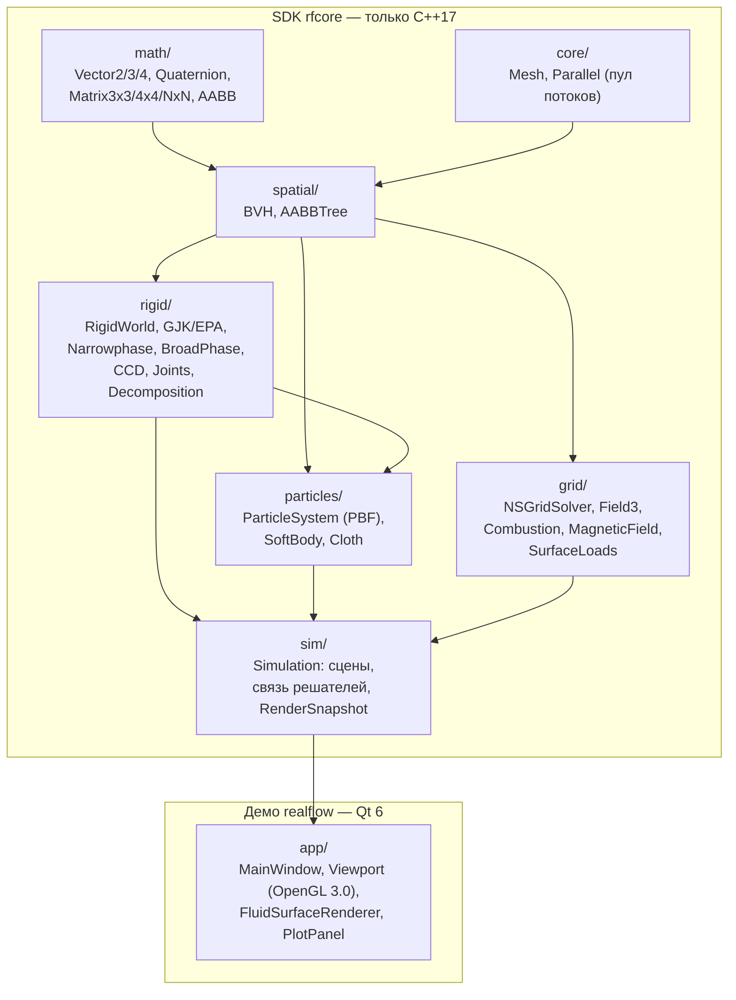

# PhysRealFlow — документация

**PhysRealFlow** — физический SDK на C++17 и демонстрационное приложение на Qt. В одном проекте живут:

- твёрдые тела (GJK/EPA, SAT, блочный LCP-решатель, CCD, сочленения, выпуклая декомпозиция);
- единый решатель частиц в духе NVIDIA FleX: жидкость (Position Based Fluids), мягкие тела, ткань с разрывом и горением;
- газ на MAC-сетке (Навье–Стокс, дым, аэротруба, двусторонняя связь с телами);
- огонь (горение топлива, излучение пламени, пиролиз ткани);
- магнитная гидродинамика проводящего газа (плазмы).

Документация объясняет **физику → численный метод → код** для каждого модуля. Формулы записаны в LaTeX, фрагменты кода взяты из репозитория, у каждого фрагмента есть ссылка на файл и строку.

> **Важно:** SDK (`src/`, CMake-цель `rfcore`) зависит **только от стандартной библиотеки C++17** (и системной библиотеки потоков). В нём нет Qt, Eigen, OpenMP и других библиотек. Его можно встроить в любой движок или запускать без окна. Qt нужен только демо-приложению (`app/`).
>
> Правило проверяется при сборке: [CMakeLists.txt:51](../CMakeLists.txt#L51) останавливает конфигурацию, если к `rfcore` подключено что-то кроме `Threads::Threads`.

---

## Оглавление

| # | Глава | О чём |
|---|---|---|
| 1 | [Математика и пространственные структуры](01-math.md) | векторы, кватернионы, `extractRotation`, Якоби, LU/Холецкий, AABB, BVH, динамическое AABB-дерево |
| 2 | [Твёрдые тела](02-rigid-bodies.md) | формы, GJK/EPA, SAT, многоточечные контакты, SAP, последовательные импульсы, блочный LCP, сон, shock propagation, CCD, сочленения, Quickhull, декомпозиция |
| 3 | [Частицы: жидкость, мягкие тела, ткань](03-particles.md) | PBF, стенки в плотности (Koschier & Bender), двусторонние XPBD-контакты, shape matching, XPBD-ткань, разрыв |
| 4 | [Газ: Навье–Стокс на MAC-сетке](04-gas-navier-stokes.md) | адвекция MacCormack, силы, проекция давления (PCG), движущиеся тела, пристенное трение, нагрузки на треугольники |
| 5 | [Огонь](05-fire.md) | модель Nguyen–Fedkiw–Jensen, кислородный предел, излучение, теплопроводность, пиролиз хлопка по Аррениусу |
| 6 | [МГД и плазма](06-mhd-plasma.md) | резистивная МГД в СИ, constrained transport, коррекция Бориса, число Рейнольдса |
| 7 | [Рендеринг](07-rendering.md) | OpenGL 3.0, импосторы сфер, объёмный ray marching, пламя (излучение чёрного тела), экранная вода |

---

## Архитектура

Модули зависят только «вниз»: математика ничего не знает о физике, решатели не знают о Qt.



Как решатели связаны внутри кадра (`Simulation::stepFrame`, [src/sim/Simulation.cpp:1002](../src/sim/Simulation.cpp#L1002)):

| Режим | Что шагает | Связь |
|---|---|---|
| `SimMode::Fluid` | подшаги твёрдых тел и частиц чередуются | частицы ↔ тела: XPBD-контакты с обобщёнными массами (гл. 3) |
| `SimMode::WindTunnel` | газ + тела + частицы | тела — движущиеся стенки газа, газ давит на тела; сопротивление ткани и жидкости в газе; огонь (гл. 4, 5) |
| `SimMode::Rigid` | только твёрдые тела (или с частицами) | — |

Все тяжёлые циклы распараллелены собственным пулом потоков [src/core/Parallel.h](../src/core/Parallel.h): `parallelFor`, `parallelSum`, `parallelMax`. OpenMP не используется: в MinGW на Windows каждая параллельная область OpenMP стоит ~150 мкс, а итерационный решатель давления открывает несколько областей на итерацию.

---

## Единицы и обозначения

Везде **СИ**: метры, секунды, килограммы, кельвины, тесла. Ось **y смотрит вверх**, гравитация $\mathbf g = (0, -9.81, 0)$ м/с².

| Символ | Смысл | Единицы |
|---|---|---|
| $\mathbf x, \mathbf v, \boldsymbol\omega$ | положение, скорость, угловая скорость | м, м/с, рад/с |
| $m,\ w = 1/m$ | масса, обратная масса | кг, 1/кг |
| $\mathbf I,\ \mathbf I^{-1}$ | тензор инерции и обратный | кг·м², 1/(кг·м²) |
| $h$ | радиус ядра SPH (глава 3) **или** шаг подшага (главы 2–3, по контексту) | м / с |
| $\Delta t$ | шаг по времени | с |
| $\Delta x$ | шаг сетки | м |
| $\rho$ | плотность | кг/м³ |
| $p$ | давление | Па |
| $T$ | температура; в газе огня — **перегрев над окружающим воздухом** | K |
| $\mathbf B, \mathbf E, \mathbf J$ | магнитное поле, электрическое поле, плотность тока | Тл, В/м, А/м² |

---

## Сборка

### Только SDK и тесты (любой компилятор C++17)

SDK не требует ничего, кроме компилятора и CMake ≥ 3.21:

```sh
cmake -S . -B build-core -G Ninja -DCMAKE_BUILD_TYPE=Release -DRF_BUILD_APP=OFF
cmake --build build-core -j
build-core/rf_tests            # код возврата = число провалившихся проверок
RF_TEST=MHD build-core/rf_tests   # только тесты, в имени которых есть подстрока "MHD"
```

Фильтр `RF_TEST=<подстрока>` сравнивает подстроку с именем теста ([tests/tests.cpp:37](../tests/tests.cpp#L37)). Имена — в `main()` файла [tests/tests.cpp](../tests/tests.cpp#L1946), например `"gjk / epa / sat"`, `"fire: burner ignites a curtain, it burns through"`, `"MHD: resistive decay, Alfven wave, div B = 0"`.

### Приложение (Qt 6.7.3, MinGW)

На Windows проект собирается Qt 6.7.3 с MinGW 11.2:

```sh
set PATH=C:\Qt\Tools\mingw1120_64\bin;C:\Qt\Tools\Ninja;%PATH%
cmake -S . -B build -G Ninja -DCMAKE_BUILD_TYPE=Release -DCMAKE_PREFIX_PATH=C:/Qt/6.7.3/mingw_64
cmake --build build -j 24
```

Нужны модули Qt: Core, Gui, Widgets, OpenGL, OpenGLWidgets, Charts. После сборки рядом с `realflow.exe` копируется `opengl32sw.dll` (Mesa llvmpipe), чтобы программа работала и без видеокарты ([CMakeLists.txt:81](../CMakeLists.txt#L81)).

| Опция CMake | По умолчанию | Смысл |
|---|---|---|
| `RF_BUILD_APP` | `ON` | собирать Qt-приложение `realflow` |
| `RF_BUILD_TESTS` | `ON` | собирать `rf_tests` |

### Командная строка приложения

Разбор аргументов — [app/main.cpp:67](../app/main.cpp#L67):

| Ключ | Смысл |
|---|---|
| `--preset N` | загрузить сцену с индексом `N` (таблица ниже) и сразу запустить |
| `--frames M` | сколько кадров посчитать перед снимком (по умолчанию 120) |
| `--screenshot file.png` | сохранить PNG окна просмотра и выйти |
| `--csv file` | сохранить временные ряды графиков в CSV и выйти |
| `--size WxH` | размер окна, по умолчанию `1600x950` |
| `--software-gl` | рендер на процессоре (Mesa llvmpipe); то же делает переменная `RF_SOFTWARE_GL=1` |

Пример — снимок сцены «Огонь» через 5 секунд модельного времени:

```sh
realflow.exe --preset 23 --frames 300 --screenshot fire.png --size 1280x720
```

---

## Сцены (пресеты)

Индекс совпадает с порядком `enum class Preset` ([src/sim/Simulation.h:21](../src/sim/Simulation.h#L21)), названия — из `presetName` ([src/sim/Simulation.cpp:12](../src/sim/Simulation.cpp#L12)).

| `--preset` | Название | Режим | Что показывает |
|---:|---|---|---|
| 0 | Жидкость: разрушение плотины | Fluid | PBF, классическая задача dam break |
| 1 | Жидкость: поток на препятствие | Fluid | жидкость и статический меш (BVH SDF) |
| 2 | Жидкость: плавающие тела | Fluid | плавучесть твёрдых тел разной плотности |
| 3 | Жидкость: струя на объект | Fluid | эмиттер частиц, крыло под углом 25° |
| 4 | Аэротруба: сфера | WindTunnel | $C_d$, давление по поверхности |
| 5 | Аэротруба: цилиндр | WindTunnel | вихревая дорожка, confinement |
| 6 | Аэротруба: крыло NACA | WindTunnel | подъёмная сила, $C_p$ |
| 7 | Аэротруба: обтекаемое тело | WindTunnel | малое сопротивление |
| 8 | Аэротруба: куб | WindTunnel | отрыв на кромках |
| 9 | Газ: тепловой шлейф дыма | WindTunnel | плавучесть Буссинеска |
| 10 | Дым: сферический источник (закрытый объём) | WindTunnel | несжимаемость в замкнутой области |
| 11 | Твёрдые тела: падение на меш | Rigid | контакты с треугольным мешем |
| 12 | Твёрдые частицы: сыпучая среда | Rigid | 2016 шаров на конусе |
| 13 | Твёрдые тела: пирамида и снаряд | Rigid | удар по стопке |
| 14 | Твёрдые тела: многогранники (SAT, GJK-EPA) | Rigid | выпуклые оболочки на склоне |
| 15 | Твёрдые тела: башня из 100 кубиков | Rigid | устойчивость высокого стека |
| 16 | Сочленения: 5 типов | Rigid | шар, шарнир с мотором, ползун, сварка, трос/пружина |
| 17 | CCD: пули и тонкая стена | Rigid | непрерывные столкновения |
| 18 | Невыпуклые: 100 чайников (выпуклая декомпозиция) | Rigid | составные тела |
| 19 | Дым + твёрдые тела (двусторонняя связь) | WindTunnel | тела падают сквозь шлейф |
| 20 | Мягкие тела и ткань (единый решатель частиц) | Fluid | батут, штора со швом, мягкие кубы в воде |
| 21 | Газ + мягкие тела + ткань + твёрдые тела | WindTunnel | платок держится в восходящем потоке |
| 22 | Гидродинамика: вода + воздух + тела | WindTunnel | ветер над водой, флаг, плавание |
| 23 | Огонь: горелка, горящая штора, тела | WindTunnel | воспламенение и прогорание хлопка |
| 24 | Вода: волна в бассейне, плавающие тела (шейдер) | Fluid | экранный рендер воды, лёгкий мяч |
| 25 | Плазма: магнит отклоняет поток (магнитосфера) | WindTunnel | МГД: солнечный ветер и магнитосфера Земли, магнитопауза Чепмена–Ферраро (гл. 6) |

---

## Проверка: тесты

`rf_tests` — это не юнит-тесты «на компиляцию». Это численные эксперименты с аналитическим ответом или жёстким физическим критерием. Несколько примеров (все проходят):

| Тест | Результат |
|---|---|
| маятник на шаровом шарнире | $T = 2.0083$ с при теории $2\pi\sqrt{L/g} = 2.0061$ с |
| стопка из 100 кубиков, брошенных с 1 см | смещение верха 2.75 см, стопка в покое |
| пуля 300 м/с в стену 2 см | с CCD останавливается на $x = -0.031$ м (без CCD пролетает до 5.27 м) |
| резистивное затухание МГД-моды | $B/B_0 = 0.85488$ при аналитике 0.85474 |
| торсионная альфвеновская волна | период 0.2246 с при теории 0.2242 с |
| теплопроводность газа | $d\langle r^2\rangle/dt = 6.006\cdot10^{-3}$ при $6\alpha = 6.000\cdot10^{-3}$ м²/с |
| радиационное остывание | 732.31 K за 1 шаг против 732.30 K за 5000 шагов |
| бак с водой | $\rho_{max}$ = 1091 кг/м³ (до исправления стенок было 10 279) |

Подробности и графики — в разделах «Проверка» каждой главы.

---

## Скриншоты

> Скриншоты сцен будут добавлены позже: сейчас Windows Defender (Controlled Folder Access) не даёт копировать PNG в папку репозитория из командной строки. Снимок любой сцены можно получить самостоятельно ключом `--screenshot` (см. выше).

---

## Основная литература

- M. Macklin, M. Müller, N. Chentanez, T.-Y. Kim. *Unified Particle Physics for Real-Time Applications.* SIGGRAPH 2014.
- M. Macklin, M. Müller. *Position Based Fluids.* SIGGRAPH 2013.
- M. Müller et al. *Detailed Rigid Body Simulation with Extended Position Based Dynamics.* SCA 2020.
- E. Catto. *Iterative Dynamics with Temporal Coherence* (GDC 2005); *Dynamic Bounding Volume Hierarchies* (GDC 2019).
- R. Bridson. *Fluid Simulation for Computer Graphics*, 2nd ed., CRC Press 2015.
- D. Nguyen, R. Fedkiw, H. W. Jensen. *Physically Based Modeling and Animation of Fire.* SIGGRAPH 2002.
- C. R. Evans, J. F. Hawley. *Simulation of magnetohydrodynamic flows: a constrained transport method.* ApJ 332, 1988.
- S. Green. *Screen Space Fluid Rendering for Games.* GDC 2010.
