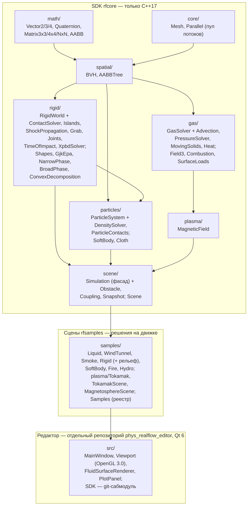
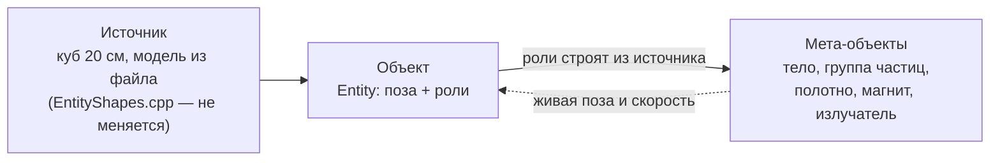
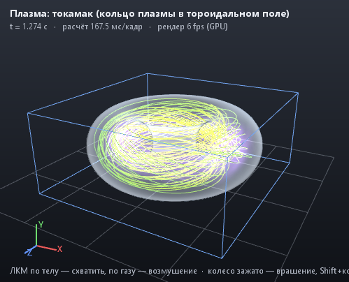
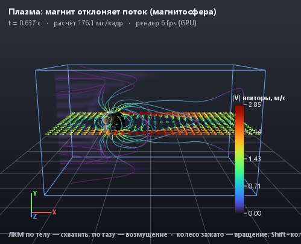
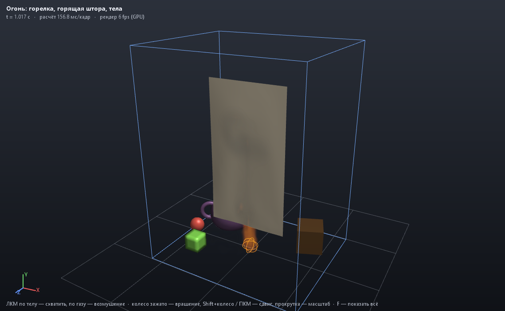
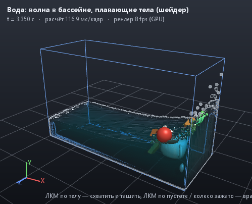

# PhysRealFlow — документация

**PhysRealFlow** — физический SDK на C++17; Qt-редактор находится в отдельном
репозитории `phys_realflow_editor`. В SDK живут:

- твёрдые тела (GJK/EPA, SAT, блочный LCP-решатель, CCD, сочленения, выпуклая декомпозиция);
- единый решатель частиц в духе NVIDIA FleX: жидкость (Position Based Fluids), мягкие тела, ткань с разрывом и горением;
- газ на MAC-сетке (Навье–Стокс, дым, аэротруба, двусторонняя связь с телами);
- огонь (горение топлива, излучение пламени, пиролиз ткани);
- магнитная гидродинамика проводящего газа (плазмы).

Документация объясняет **физику → численный метод → код** для каждого модуля. Формулы записаны в LaTeX, фрагменты кода взяты из репозитория, у каждого фрагмента есть ссылка на файл и строку.

> **Важно:** SDK (`src/`, CMake-цель `rfcore`) зависит **только от стандартной библиотеки C++17** (и системной библиотеки потоков). В нём нет Qt, Eigen, OpenMP и других библиотек. Его можно встроить в любой движок или запускать без окна. Qt нужен только редактору в отдельном репозитории.
>
> Правило проверяется при сборке: [CMakeLists.txt:144](../CMakeLists.txt#L144) останавливает конфигурацию, если к `rfcore` подключено что-то кроме `Threads::Threads`.

---

## Оглавление

Для последовательного изучения контактов начните с [книги о разработке rigid-решателя](book/README.md):
модель → геометрия → импульсы → энергия цепи → разбор PDF → проверка утверждений.
Главы 17–24 ниже сохраняют историю экспериментов; их ранние отказы не следует
считать результатами текущего среза без проверки даты и конфигурации.

| # | Глава | О чём |
|---|---|---|
| 0 | [Что мы строим и по какой мерке](00-vision.md) | для кого песочница, граница Крамера–Рао, управляемое смещение вместо шума, карта пути |
| 1 | [Математика и пространственные структуры](01-math.md) | векторы, кватернионы, `extractRotation`, Якоби, LU/Холецкий, QR, SVD, экспонента матрицы, тензоры и правило Эйнштейна, AABB, BVH, динамическое AABB-дерево |
| 2 | [Твёрдые тела](02-rigid-bodies.md) | формы, GJK/EPA, SAT, многоточечные контакты, SAP, последовательные импульсы, блочный LCP, сон, shock propagation, CCD, сочленения, Quickhull, декомпозиция |
| 3 | [Частицы: жидкость, мягкие тела, ткань](03-particles.md) | PBF, стенки в плотности (Koschier & Bender), двусторонние XPBD-контакты, shape matching, XPBD-ткань, разрыв |
| 4 | [Газ: Навье–Стокс на MAC-сетке](04-gas-navier-stokes.md) | адвекция MacCormack, силы, проекция давления (PCG), движущиеся тела, пристенное трение, нагрузки на треугольники |
| 5 | [Огонь](05-fire.md) | модель Nguyen–Fedkiw–Jensen, кислородный предел, излучение, теплопроводность, пиролиз хлопка по Аррениусу |
| 6 | [МГД и плазма](06-mhd-plasma.md) | резистивная МГД в СИ, constrained transport, коррекция Бориса, число Рейнольдса |
| 7 | [Рендеринг](https://github.com/werasaimon/phys_realflow_editor/blob/main/docs/rendering.md) — в репозитории редактора | OpenGL 3.0, импосторы сфер, объёмный ray marching, пламя (излучение чёрного тела), экранная вода |
| 8 | [Свет и движение у чёрной дыры: ОТО](08-relativity.md) | метрика Керра, геодезические как гамильтонова система (RK45, инварианты E, L, Q), тетрада ZAMO, трассировщик лучей на CPU: тень 3√3 M, отклонение 4M/b, прецессия перигелия, горизонт в координатах Эддингтона–Финкельштейна; кривизна из любой метрики: Кристоффель, Риман, Риччи, Эйнштейн, Кречман, приливы |
| 9 | [Табло эталонов](09-benchmarks.md) | каждая наша цифра против мирового эталона с источником и тестом; что впереди — пустые строки |
| 10 | [Верификация и валидация](10-verification.md) | ASME V&V 20: построенные решения (MMS) и порядок схемы, Ричардсон и GCI, метрика E = S − D и u_val, Монте-Карло для входов; `rf_verify` генерирует табло |
| 11 | [Действие: откуда берутся уравнения](11-action.md) | принцип Гамильтона, Нётер, множители Лагранжа, Лагранж–Даламбер и функция Рэлея, вариационные интеграторы; для каждой физики: действие, уравнения, дискретизация, код, графики балансов энергии из тестов, границы |
| 12 | [Сравнение с Jolt Physics](12-comparison.md) | одни и те же сцены в двух движках: колонны и пирамиды, отскок, трение на склоне, цепь, колыбель, вращение Джанибекова, детерминизм; где мы сильнее и где проигрываем |
| 13 | [Методы SIGGRAPH и не только: карта](13-methods.md) | по каждой области решателя — наш метод и лучшие работы SIGGRAPH, SIGGRAPH Asia, ACM TOG, SCA, Eurographics 2023–2026 и классика: DOI сверены с Crossref, какой наш дефект закрывает, цена, лицензия, случай `rf_verify`; пять методов для внедрения первыми; чего SIGGRAPH не даёт |
| 14 | [Что можно взять у лучших: карта заимствований](14-borrow-map.md) | лучший открытый код по каждой области, лицензия проверена по файлу `LICENSE`, вердикт «код / только идеи / нет», какой наш изъян закрывает; главное — мягкий шаг Box3D, CORE-MATH для детерминизма, эталоны KerrGeoPy, Athena++, PySPH; что отвергнуто и почему; порядок внедрения |
| 15 | [Стандартные испытания твёрдых тел](15-rigid-standard-tests.md) | колонны 100/200, невыпуклые цепи и песочница, кучи, CCD; один запуск, численные критерии, отчёты и исходные отказы |
| 16 | [Длинные цепи невыпуклых торов](16-torus-chains.md) | три цепи по 40 звеньев без шарниров, тяжёлые грузы, падение, подвес; контроль зацепления |
| 17 | [Почему разрываются цепи: исследование контактов](17-torus-contact-investigation.md) | профиль CCD и решателя, потеря контактов на швах, неподвижная пара торов, проверенные и отвергнутые варианты |
| 18 | [Математическая модель контакта](18-rigid-contact-model.md) | непроникновение по всей траектории, эталон связанных импульсов, физические балансы и критерии принятия шага |
| 19 | [Другие движки и новая модель контакта](19-rigid-engine-references.md) | реальные Bullet/Jolt/Box3D, профиль, независимый SAT-аудит, допуск 0.5 мм и проверка траектории |
| 20 | [Составные тела: опыт GJK → SAT → CCD](20-compound-sat-ccd.md) | контактные площадки, внешняя граница, аналитические проверки и изолированный прототип |
| 21 | [Экспериментальный Box3D backend](21-box3d-backend.md) | перенос rigid-сцен, масса/инерция в СИ, численный масштаб, проверенные результаты и ограничения |
| 22 | [Исправления контактов и ReactPhysics3D](22-contact-repair-reactphysics3d.md) | восстановление внешних контактов, дуга вращения CCD, SAT и согласование нормалей в ReactPhysics3D |
| 23 | [Регрессии сложных сцен: контакты и общая опора](23-rigid-regression-and-wall-contacts.md) | стеки, чашки, чаша, песочница; дрожание опоры, гонка потоков, сравнение вариантов и профиль |
| 24 | [Затухание цепи, трение и минимум энергии](24-chain-relaxation.md) | длительная раскачка, сравнение сопротивлений, уточнение решателя и независимый SAT |
| — | [Язык природы: книга о математике](math/00-introduction.md) | для школьников и всех любопытных: числа и точность, векторы, производная и интеграл, шаг по времени, матрицы, кватернионы, поля, тензоры, действие, статистика и сигмы; каждая глава — идея, картинка из движка, формула, код, тест, физика, опыт «Проверь сам» |

---

## Архитектура

Модули зависят только «вниз»: математика ничего не знает о физике, решатели не знают о Qt.



### Как устроен код

Как в Box2D: по имени файла понятно, что в нём.

- **Один класс — один файл с тем же именем**: `RigidWorld.h`, `ParticleSystem.h`, `GasSolver.h`, `MagneticField.h`, `Simulation.h`.
- **Большой класс разрезан на файлы по одной ответственности**, как `b2_world` / `b2_island` / `b2_contact_solver`: методы `RigidWorld` живут в `RigidWorld.cpp` (тела, шаг), `ContactSolver.cpp` (контакты), `Islands.cpp` (острова и сон), `ShockPropagation.cpp`, `Grab.cpp`; методы `GasSolver` — в `GasSolver.cpp`, `Advection.cpp`, `PressureSolver.cpp`, `MovingSolids.cpp`, `Heat.cpp`; `ParticleSystem` — в `ParticleSystem.cpp`, `DensitySolver.cpp`, `ParticleContacts.cpp`; `Simulation` — в `Simulation.cpp`, `Presets.cpp`, `Coupling.cpp`, `Snapshot.cpp`.
- **Каждый файл начинается с комментария**, что в нём лежит и где остальное; у каждой формулы в коде — комментарий со ссылкой на статью.
- Никакой шаблонной магии: обычные классы, `std::vector`, `std::function`.
- **Сцены — не часть движка.** Ядро (`rfcore`) не знает ни одной сцены: ни плотины, ни токамака. Сцена — класс, наследующий `Scene` ([src/scene/Scene.h](../src/scene/Scene.h)) и собирающий установку из решателей через фасад `Simulation`; готовые сцены лежат в `samples/` (как `samples/` у Box2D) и собираются в библиотеку `rfsamples`, которую линкуют приложение и тесты. Токамак — установка, а не решатель: `samples/plasma/Tokamak` (катушки, ток, сосуд, регулятор положения, диагностики) поверх `plasma/MagneticField` (МГД).

### Фасад и сцены

Фасад — класс `Simulation` ([src/scene/Simulation.h](../src/scene/Simulation.h)): в нём три решателя (`rigid`, `particles`, `grid`), препятствие-меш, шаг кадра со связками между решателями и снимок для отрисовки. Сцена (`Scene`) получает его в четырёх точках жизни:

| Метод сцены | Когда | Что делает |
|---|---|---|
| `configure(sim)` | один раз при загрузке, все параметры сброшены к умолчаниям | свои параметры, препятствие, вид; правки пользователя после этого переживают `reset()` |
| `build(sim)` | при каждом `reset()` | сначала коробка: `useLiquidTank(box)`, `useGasBox(originFraction)` или `useRigidArena(box)`; потом тела, частицы, ткань, поля |
| `afterStep(sim)` | раз в кадр после решателей | регуляторы, события по времени (регулятор положения кольца токамака) |
| `describe(sim, snapshot)`, `fieldLineSeeds`, `params()` / `setParam` | при снимке и из панели | свои показания и графики, затравки силовых линий, ручки сцены — панель приложения строит их одинаково для любой сцены |

### Граф сцены: сцена как данные

Сцену можно не писать кодом, а собрать из данных — так её собирает редактор: кнопка «куб», затем «ты твёрдое тело», «ты ещё и магнит». Граф ([src/scene/SceneGraph.h](../src/scene/SceneGraph.h)) — это мир (гравитация, размер коробки, газ, плазма) и список сущностей: форма (куб, шар, цилиндр, конус, плоскость), поза, цвет и набор **ролей**. `GraphScene` превращает граф в обычную сцену: она проходит через тот же фасад `Simulation`, что и сцены из `samples/`, поэтому собранное в редакторе ведёт себя так же, как написанное в коде. Граф сохраняется в текстовый файл — одна строка на факт, его можно читать глазами и сравнивать `diff`-ом; `save → load → save` даёт тот же текст до бита (тест `scene graph: save -> load -> save`):

```
# PhysRealFlow scene
world gravity 0 -9.81 0 size 4 3 4 gas 0 magneticGas 0
entity "Magnet A"
  object id 3 visible 1 locked 0
  shape box size 0.1 0.05 0.05 position 0 0.5 0 rotation 0 0 0 color 0.8 0.2 0.2
  rigid density 7800 friction 0.5 restitution 0.2 fixed 0 velocity 0 0 0 spin 0 0 0
  magnet moment 1 0 0
  emitter smoke 1 temperature 0 liquid 0 velocity 0 0.5 0
end
entity "Curtain"
  object id 4 visible 1 locked 0
  shape plane size 1 0.02 1.2 position 0 1.2 0 rotation 90 0 0 color 0.9 0.85 0.7
  cloth areaDensity 0.2 bendCompliance 0.001 tearable 1 pinned 16
  flammable
end
```

Строка `object` — не роль, а свойства объекта сцены: постоянный номер `id` (редактор выбирает по нему), `visible` (скрытый объект не участвует и в расчёте: ни тела, ни частиц, ни выбросов) и `locked` (редактор его не выделяет и не двигает — пол, фон; на физику не влияет).

**Три слоя: источник, объект, роли.** Источник — это геометрия: параметры примитива (`box`, `sphere`, `cylinder`, `cone`, `plane`) или файл модели (`mesh`); физика его не меняет и не разрушает. Объект — сущность графа: положение, поворот, ссылка на источник и роли. Роли создают в решателях физические воплощения — тело, группу частиц жидкости, мягкое тело, полотно, излучатель, магнит; каждое строится заново из источника отдельной функцией (`GraphScene::addRigid`, `addSoft`, `addLiquid`, `addCloth`, `addMagnet`, `addEmitter`). Превращение источника в сетку собрано в одном месте без обращений к решателям — [src/scene/EntityShapes.cpp](../src/scene/EntityShapes.cpp): той же сеткой редактор рисует сцену, а решатели строят тела, так что видно ровно то, что считается.

**Геометрия без ролей.** Созданная форма — только геометрия: пока у неё нет ни одной роли, она рисуется, но в расчёте не участвует — у неё нет тела, с ней ничего не сталкивается (тест `scene graph: a shape with no role is geometry only`: шар падает сквозь такой куб на пол). Поэтому из куба можно сначала сделать нужную форму и только потом решить, чем она будет.

**Модель из файла.** `shape mesh file "models/horse.obj" size 0.5 0.5 0.5 ...` — форма из OBJ или STL. Относительный путь ищется от папки файла сцены (`SceneGraph::baseDirectory`, в файл не пишется). Модель сохраняет пропорции: она масштабируется равномерно так, чтобы её наибольший размер был равен наибольшей компоненте `size`. Файл читается один раз, выпуклая декомпозиция для твёрдого тела (секунды) считается один раз на файл и размер — повторная сборка сцены берёт их из кэша. Роли модели: `rigid` — тело из выпуклых частей, как чайник; `soft` — мягкое тело по её поверхности; `liquid` — её бокс заполняется водой; `cloth` из модели пока не делается — сцена пишет об этом в показаниях и пропускает сущность. Нечитаемый файл тоже не создаёт ничего и называется в показаниях.

[src/scene/EntityShapes.cpp:81](../src/scene/EntityShapes.cpp#L81)
```cpp
TriMesh entityLocalMesh(const Entity& e, const std::string& baseDirectory, std::string* error) {
    if (e.shape != ShapeKind::Mesh) return primitiveMesh(e.shape, e.size);
    const ModelFile& file = modelFile(resolvePath(e.meshFile, baseDirectory));
    if (!file.mesh) {
        if (error) *error = e.meshFile + ": " + file.error;
        return TriMesh();
    }
    TriMesh m = *file.mesh;
    m.fitTo(Vector3(0.0f), maxComp(e.size)); // uniform scale: the model keeps its proportions
    return m;
}
```

**Правка и запуск.** Редактор правит граф — геометрию и роли. «Пуск» строит из графа симуляцию (`GraphScene`), «Стоп» её выбрасывает и снова показывает граф: расчёт никогда не меняет саму сцену.

**Мета-объекты: одна сущность — без перезагрузки сцены.** Всё, что роли сущности создали в решателях, записано как её мета-объекты ([src/scene/MetaObjects.cpp](../src/scene/MetaObjects.cpp)): тело (номер в `RigidWorld`), группа частиц (жидкость, мягкое тело, полотно), магнит, излучатель. Между кадрами одну сущность можно поменять, не трогая остальные: `rebuildEntity` убирает её мета-объекты и строит новые **из источника**, `addEntity` и `removeEntity` добавляют и убирают сущность целиком. Поэтому воду можно превратить в желе и обратно сколько угодно раз: новое строится не из того, во что превратилось старое, а из формы сущности.



Что делает `rebuildEntity` по шагам:

1. Читает, где сущность **сейчас** и как движется: у тела — его поза и скорости (ориентация сущности = поворот тела × `bodyToEntity`, у выпуклой оболочки своя главная система осей); у частиц — центр группы, средняя скорость и нижняя частица. Если редактор передал другую позу, чем записана в графе, значит объект подвинули руками — берётся поза редактора.
2. Форма из частиц встаёт на то, на чём лежали частицы: центр лужи — в сантиметре над полом, и куб, поставленный туда, наполовину ушёл бы в пол; он поднимается так, чтобы его низ оказался у нижней частицы.
3. Удаляет старые мета-объекты: `RigidWorld::destroyBody` (слот остаётся надгробием и достанется следующему телу, номера остальных тел не меняются), `ParticleSystem::removeGroup` (массивы уплотняются с сохранением порядка), магнит и излучатель — из своих списков.
4. Строит новые из источника в этой позе и отдаёт им скорость старых: телу — линейную и угловую, каждой новой частице — среднюю скорость группы.
5. Мир — гравитация, коробка, газ, источник тепла газа, модель горения, фоновое поле плазмы — задаётся при загрузке сцены; если новой роли нужен газ, которого нет, `rebuildEntity` возвращает `false`, и редактор перезагружает сцену целиком.

**Коробка мира — не стена для твёрдых тел.** Коробка сцены — это коробка мира, выросшая так, чтобы вместить каждую сущность: полметра по бокам, метр над самой высокой. Ни одна сущность не начинает внутри стены. Для жидкости и газа коробка — сосуд со стенками. У твёрдых тел в сцене без жидкости и газа из стенок остаётся только земля, дно коробки, как в Box2D, Jolt и PhysX, где стен мира нет вовсе. Шар, скатившийся со стола, падает, а не упирается в невидимую стену. Так найдено пользователем: колонну из 100 сфер высотой 28 м в комнате 3 м потолок проталкивал вниз, и сферы разлетались со скоростью до 403 м/с. Тест `scene graph: no invisible walls`: верхняя сфера колонны за 1 с падает на 4,880 м при свободном падении 4,905 м, шар укатывается с пола на 5,5 м ([GraphScene.cpp](../src/scene/GraphScene.cpp), `sceneBox`, `openAbove`).

Сущность правится не одна: вместе с ней пересобираются все её экземпляры (они берут роли у неё) и массивы, которые её копируют; каждая пересобираемая сущность проходит шаги выше в `rebuildOne`.

[src/scene/MetaObjects.cpp:108](../src/scene/MetaObjects.cpp#L108)
```cpp
bool GraphScene::rebuildEntity(Simulation& sim, const Entity& updated) {
    const int ai = authoredIndexOf(updated.id);
    if (ai < 0) return addEntity(sim, updated);
    const bool moved = !samePose(updated, graph_.entities[size_t(ai)]);
    graph_.entities[size_t(ai)] = updated;
    std::vector<uint32_t> ids;
    for (const Entity& e : graph_.entities)
        if (sharesRolesWith(graph_, e, updated.id)) ids.push_back(e.id);
    bool ok = true;
    for (uint32_t id : ids) ok = rebuildOne(sim, id, !(id == updated.id && moved)) && ok;
    for (const ArrayObject& a : std::vector<ArrayObject>(graph_.arrays))
        if (std::find(ids.begin(), ids.end(), a.templateId) != ids.end()) ok = rebuildArray(sim, a) && ok;
    return ok;
}
```

**Правило ролей — «из чего сделано» и «что ещё делает».** Из чего сделана форма — ровно одно: `rigid`, `soft`, `liquid` или `cloth`; если включено несколько, берётся первое в этом порядке, а остальные названы в показаниях сцены. Что она ещё делает — сколько угодно: `magnet`, `emitter`, `flammable`, `heat`. Твёрдое тело, которое тянется к магниту и оставляет дымный след, — это три роли на одной форме; решатели встречаются в кадре `Simulation`: газ толкает тела и ткань, тела — стенки для газа, магниты тянут друг друга, пламя греет ткань, которой касается.

| Роль | Какой решатель | Что значит физически |
|---|---|---|
| `rigid` | `RigidWorld` | недеформируемое тело: плотность, трение, упругость удара; `fixed` — неподвижное (стол, стена) |
| `collider` | `RigidWorld` | чем тело **сталкивается** — отдельно от того, как оно **выглядит**: авто (сама геометрия), бокс, сфера, капсула, выпуклая оболочка, выпуклые части; размер по геометрии или свой, сдвиг и поворот; без `rigid` — неподвижное препятствие |
| `soft` | `ParticleSystem` (shape matching) | мягкое тело из частиц, жёсткость 0..1 |
| `liquid` | `ParticleSystem` (PBF) | бокс сущности заполняется жидкостью |
| `magnet` | `Magnets` + `RigidWorld` | точечный диполь $\mathbf m$ в системе тела: магниты тянут и толкают друг друга и поворачиваются по полю; в плазме (`magneticGas`) их поле становится фоновым полем МГД |
| `heat` | `GasSolver` | горячая точка в газе: подъёмная сила, дым |
| `cloth` | `ParticleSystem` (XPBD, ткань) | плоскость становится полотном `size.x × size.z` (другая форма — полотном своей верхней грани): поверхностная плотность, податливость на изгиб, рвётся ли по нитям; `pinned` — закреплённые края: 1 край −x, 2 край +x, 4 край −z, 8 край +z, 16 «верхний ряд» — край, который выше всех после поворота (перекладина шторы; у горизонтального полотна — край −z) |
| `emitter` | `GasSolver`, сопло `ParticleSystem` | каждый кадр выпускает из формы, **где бы она ни была**: дым (1 = 10 л плотного дыма в секунду), горячий газ с температурой выше окружающей, жидкость; точка выпуска — сразу снаружи формы в сторону скорости выпуска (иначе — позади летящего тела: след; иначе — сверху). Сопло для жидкости в системе частиц одно: работает первый жидкий излучатель |
| `flammable` | `Combustion` + пиролиз ткани | форма горит: ткань греется от газа, разлагается по Аррениусу и отдаёт топливо в пламя, как штора в сцене «Огонь»; включает модель горения в мире. Горят пока только ткани — у других форм показания сцены так и пишут |

**Коллайдер отдельно от вида.** Как `Collider` рядом с `MeshRenderer` в Unity или простая коллизия в Unreal: конь рисуется конём, а сталкивается капсулой. Тело всегда **рисуется геометрией** сущности (`RigidBody::visualMesh` — меш в системе тела, его берёт снимок для отрисовки), а **сталкивается коллайдером** (`RigidBody::shape`; по нему же выбор мышью). Коллайдер — своя роль `collider`: один — неподвижное препятствие (стена, пол); с `rigid` — коллайдер движущегося тела; `rigid` без коллайдера получает «Авто» с пометкой (редактор добавляет коллайдер вместе с `rigid`). Масса тела — объём коллайдера × плотность, центр масс — его; позу сущности `rebuildEntity` читает через сдвиг тела в системе сущности (`MetaObject::bodyOffset`), поэтому коллайдер со смещением не сдвигает объект при пересборке.

| Вид коллайдера | Что это | Размер |
|---|---|---|
| `auto` | сама геометрия: бокс, сфера, тонкий бокс плоскости, выпуклые части модели, выпуклая оболочка остального | по форме; сдвиг и поворот не применяются |
| `box`, `sphere`, `capsule` | примитив в своей системе (`offset`, `rotation`; ось капсулы — её y) | `fit 1`: по протяжённости геометрии вдоль осей коллайдера (сфера — наибольшая, капсула — диаметр по x/z, высота по y); `fit 0`: `size` |
| `hull` | выпуклая оболочка геометрии (Quickhull, до 64 вершин) | по геометрии |
| `decomposition` | выпуклые части модели (как у чайников); примитив и так выпуклый — его оболочка | по геометрии |

[src/scene/EntityShapes.cpp:192](../src/scene/EntityShapes.cpp#L192)
```cpp
EntityCollider entityCollider(const Entity& e, const std::string& baseDirectory) {
    const TriMesh geometry = entityLocalMesh(e, baseDirectory);
    if (geometry.empty()) return {};
    const ColliderRole& c = e.collider;
    if (!c.enabled) return autoCollider(e, geometry, baseDirectory); // no collider: the geometry itself
    switch (c.kind) {
    case ColliderKind::Auto: return autoCollider(e, geometry, baseDirectory);
    case ColliderKind::Box:
    case ColliderKind::Sphere:
    case ColliderKind::Capsule: return primitiveCollider(c, geometry);
    case ColliderKind::Decomposition:
        if (e.shape == ShapeKind::Mesh) {
            auto compound = entityCompound(e, baseDirectory);
            if (!compound) return {};
            return placed(compound, c, compound->centerOfMass(), Quaternion::fromMatrix3x3(compound->principalRotation()));
        }
        [[fallthrough]]; // a primitive is convex: its hull is its decomposition
    case ColliderKind::ConvexHull: break;
    }
    return hullOf(buildConvexHull(geometry.positions, 64), c);
```

Проверка (`scene graph: the collider apart from the look`, `... a capsule fitted to a model`, `... a collider alone`): сфера на коллайдере-боксе, брошенная вдоль пола со скоростью 1.5 м/с, скользит **0.233 м** и останавливается (скольжение с трением: $v^2/2\mu g = 0.229$ м), а бокс на коллайдере-сфере катится **2.50 м**; снимок отдаёт для сферы её собственный меш (528 треугольников), а коллайдер для выбора — бокс. Модель 0.1 × 0.4 × 0.1 м на подогнанной капсуле лежит нижней точкой коллайдера ровно на полу (0.0100 м при верхе пола 0.0100). Тело с коллайдером, сдвинутым на 0.3 м и повёрнутым на 30°, после пересборки остаётся на месте до $10^{-4}$ м. Сущность только с коллайдером — неподвижное тело (обратная масса 0, сдвиг 0 м): мяч отскакивает от неё со скоростью 2.18 м/с и ложится на её верх (0.4500 м). Поля коллайдера переживают сохранение → загрузку → сохранение без изменений; сущность `rigid` из старого файла без строки `collider` загружается с коллайдером «Авто».

Магниты — диполи ([src/scene/Magnets.h](../src/scene/Magnets.h)). Поле диполя $\mathbf B = \dfrac{\mu_0}{4\pi r^3}\big(3\hat{\mathbf r}(\mathbf m\cdot\hat{\mathbf r}) - \mathbf m\big)$ (Jackson, ур. 5.56), сила на второй диполь от первого (Yung, Landecker & Villani 1998)

$$
\mathbf F = \frac{3\mu_0}{4\pi r^4}\Big[(\mathbf m_1\cdot\hat{\mathbf r})\,\mathbf m_2 + (\mathbf m_2\cdot\hat{\mathbf r})\,\mathbf m_1 + (\mathbf m_1\cdot\mathbf m_2)\,\hat{\mathbf r} - 5(\mathbf m_1\cdot\hat{\mathbf r})(\mathbf m_2\cdot\hat{\mathbf r})\,\hat{\mathbf r}\Big],
$$

момент $\boldsymbol\tau = \mathbf m_2\times\mathbf B_1$. Пара сил равна и противоположна — третий закон Ньютона выполняется точно. Откуда это: энергия диполя в поле $U = -\mathbf m_2\cdot\mathbf B_1$ входит в действие пары, сила и момент есть её градиенты, а импульс сохраняется, потому что $U$ зависит только от взаимного положения (глава [11.9](11-action.md#119-магниты)). Касающиеся магниты — не точки: расстояние между центрами не опускается ниже половины суммы их радиусов, иначе $1/r^4$ дал бы численный взрыв, а не физику.

[src/scene/Magnets.cpp:19](../src/scene/Magnets.cpp#L19)
```cpp
Vector3 dipoleForce(const Vector3& m1, const Vector3& m2, const Vector3& r) {
    const float d = length(r);
    if (d < 1e-9f) return Vector3(0.0f);
    const Vector3 n = r / d;
    const float a = dot(m1, n), b = dot(m2, n);
    const Vector3 bracket = m2 * a + m1 * b + n * dot(m1, m2) - n * (5.0f * a * b);
    return bracket * (3.0f * kMu0Over4Pi / (d * d * d * d));
}
```

| Тест | Результат |
|---|---|
| `magnets: dipole force and torque` — два диполя по 1 А·м² на расстоянии 10 см | соосно (голова к хвосту): $F = -0.006000$ Н при теории $3\mu_0 m^2/(2\pi d^4) = 0.006$ Н, притяжение; бок о бок: $+0.003000$ Н при $3\mu_0 m^2/(4\pi d^4)$, отталкивание; поле на оси $2.0000\cdot10^{-4}$ Тл; третий закон — точно |
| `magnets: two free magnets pull together` — два стальных кубика 2 см, моменты 0.5 А·м², 10 см, невесомость, 3 с | сближаются (наибольшая скорость 0.36 м/с), слипаются: расстояние между центрами 0.0200 м (размер кубика), за последние 0.5 с меняется на $7\cdot10^{-6}$ м; полный импульс $\lvert\mathbf P\rvert \le 9.3\cdot10^{-10}$ кг·м/с |
| `scene graph: a plane made cloth hangs from its pinned edge` — полотно 0.6 × 0.6 м | поставленное вертикально висит на перекладине на 0.601 м (длина 0.6), ни одной порванной нити; горизонтальное, закреплённое по краю, качается вниз и опускается не ниже своей длины (0.596 м). Найдено тестом: в нижней точке такого качания рвущаяся ткань теряет ~200 нитей разом — оценка натяжения в решателе ткани даёт всплеск, в ~400 раз выше настоящих ~10 Н/м (задача решателя ткани) |
| `scene graph: a smoke emitter on a thrown box leaves a trail` — ящик брошен на 2 м/с сквозь неподвижный воздух | центр дыма переходит с −0.92 м (0.17 с) на +0.21 м (1 с) вслед за ящиком (он у x = 0.95 м): след тянется за телом |
| `scene graph: a flammable curtain over a hot emitter catches fire` — штора 0.4 × 0.4 м над излучателем 600 K | загорается на 2.47 с (ткань нагрета до 351 K выше окружающей) |
| `scene graph: every role and shape builds and runs` | плоскость, магнит, конус, мягкий шар, бассейн, горючая штора, дымящий ящик и скрытый объект: 4 твёрдых тела (скрытый не создан), 1 мягкое, 1 ткань, 462 частицы жидкости, 60 кадров без NaN; `save → load → save` той же сцены (9 объектов, `id` выше $2^{24}$ включительно) даёт тот же текст |
| `scene graph: a model from a file as rigid, soft and (not) cloth` — куб 0.3 м из OBJ-файла над неподвижной плоскостью, 2 с | твёрдое тело ложится на плоскость: центр на 0.1604 м при ожидаемых 0.1600, скорость 0; мягкое — одно мягкое тело; ткань из модели не создаётся, в показаниях записка; нечитаемый файл — ни одного тела и записка; имя файла переживает сохранение и загрузку |
| `scene graph: a shape with no role is geometry only` — куб 0.4 м без ролей и шар над ним | тел одно (только шар), шар падает сквозь куб на пол (0.050 м); сетка куба — 12 треугольников точно на месте |
| `meta-objects: water -> jelly -> water -> jelly` — куб 0.2 м воды на полу, в стороне лежит ящик; через каждые 30 кадров вода ↔ желе | каждое превращение: частиц становится ровно на размер убранной и добавленной групп (343 → 343 → 316 → 343); ящик в момент превращений сдвигается на 0 м, за весь прогон на $3\cdot10^{-13}$ м; новое появляется там, где было старое (центр в пределах 0.1 м), без NaN. Из растёкшейся воды желе встаёт целым (343 частицы); вода из осевшего желе — 316 из 343: нижний слой уходит в контакт с полом |
| `meta-objects: a plane rigid -> cloth -> rigid` — неподвижная плоскость → полотно (верхний ряд закреплён) → снова твёрдое | как полотно: 2 тела, 1 полотно; новый шар занимает освободившийся слот 1, плоскость снова тело 3 (4 тела, 0 полотен); карта «тело → сущность» верна после переиспользования слота; поза, прочитанная из тела повёрнутого ящика, совпадает с записанной до $9\cdot10^{-6}$° |
| `meta-objects: a magnet role off and on without a reload` — два магнита 0.5 А·м² в невесомости | левый стал простым телом — скорость правого за кадр меняется на 0; магнит вернулся — на $6.120\cdot10^{-5}$ м/с при теории $F\,\Delta t/m = 6.118\cdot10^{-5}$ (соосные диполи, 0.160 м); номер кадра идёт дальше (5 → 7): сцена не перезагружалась |
| `meta-objects: fifty changes leave no trace in memory` — 50 раз вода ↔ желе и твёрдое ↔ желе | выделений памяти за кадр 77 → 93, слотов тел 2 → 2 |

Сила магнитов прикладывается раз в кадр как импульс в его конце (следующий кадр контактов её видит); поле магнитов в плазме задаётся по начальным позам — перерисовка фона за движущимся магнитом пока не сделана.

#### Много объектов сразу: иерархия, группы, экземпляры, массивы

Кроме сущностей граф хранит **группы** (`SceneGraph::groups`) и **массивы** (`SceneGraph::arrays`); всё это объекты сцены (`SceneObject`) с общим пространством номеров `id`. Код — [src/scene/SceneHierarchy.cpp](../src/scene/SceneHierarchy.cpp) (иерархия, экземпляры, раскладка массивов, без решателей) и [src/scene/GluedGroups.cpp](../src/scene/GluedGroups.cpp) (склеенная группа как одно тело).

- **Иерархия.** `parent` — номер группы, в которой лежит объект (0 — корень сцены). Поза объекта задана в системе родителя: мировая поза = поза родителя ∘ своя (`worldPose`), обратное — `setWorldPose`. Поворот — углы Эйлера в градусах, $R = R_y R_x R_z$. Родитель, которого нет, и цикл родителей считаются корнем. Скрытая группа прячет всё, что в ней (`effectivelyVisible`).
- **Склеенная группа** (`Group::glued`). Её твёрдые члены (и члены только с коллайдером) становятся **одним** телом: коллайдер каждого, перенесённый в систему группы, — часть составной формы (`CompoundShape`), масса — сумма масс подвижных членов, вид — все их сетки. Тело неподвижно, только если неподвижны все члены. Каждому члену остаётся мета-объект «тело» со своим `bodyToEntity` и `bodyOffset`, поэтому живая поза каждого читается через общее тело; правка одного члена пересобирает всю группу в её живой позе. Мягкие, жидкие и тканевые члены строятся сами по себе и за телом не следуют. Выбрано одно составное тело, а не `FixedJoint`-ы между телами: склейка жёсткая точно, без податливости суставов.
- **Экземпляр** (`Entity::instanceOf`). Сущность берёт у мастера форму, размер, цвет и все роли, а свои оставляет только номер, имя, позу, родителя, видимость и блокировку (`resolveInstance`; цепочка экземпляров идёт до первого не-экземпляра, цикл обрывается). Правка мастера `rebuildEntity` пересобирает все его экземпляры.
- **Массив** (`ArrayObject`). Копии сущности-шаблона `templateId`: `line` — $i\cdot$`step`; `grid` — `count[0] × count[1] × count[2]` с шагами `step.x`, `step.y`, `step.z`; `circle` — `count[0]` копий на окружности радиуса `radius` в плоскости xz. Копия $i$ повёрнута на $i\cdot$`rotationStepDeg`, сдвинута случайно не больше чем на `jitter` по каждой оси (генератор от `seed` и $i$ — тот же `seed` даёт те же копии), затем всё в системе массива (`expandArray`). Собственная позиция шаблона не используется, его поворот сохраняется. Шаблон считается и сам, если он видим; редактор обычно его прячет.
- **Номера копий.** Копии в файл не пишутся — они строятся при загрузке. Номер копии постоянный: `0x80000000 | (id массива & 0x7FFF) << 16 | номер копии` (`arrayCopyId`), поэтому `rebuildArray` во время расчёта оставляет уже существующие копии там, где они сейчас, с их скоростями, а новые ставит по узору. `nextId` — следующий свободный номер объекта графа.

`GraphScene` держит два списка: граф как его правит редактор (позы в системе родителя) и то, что считается (`simulatedEntities`: мировые позы, экземпляры раскрыты, копии массивов добавлены). Тело склеенной группы и копию массива `objectIdOfBody` отдаёт как номер группы и массива — редактор выбирает их целиком. Мир (газ, плазма) по-прежнему меняется только перезагрузкой.

В файле группа и массив — свои блоки; у сущности в строке `object` появляются `parent` и `instance`, только если они не 0, поэтому старые файлы читаются и пишутся без изменений. Строка `shape` экземпляра хранит его собственные значения, но расчёт берёт форму мастера:

```
entity "Child"
  object id 1 visible 1 locked 0 parent 10
  shape box size 0.1 0.1 0.1 position 1 0 0 rotation 0 0 0 color 0.8 0.8 0.8
  rigid density 500 friction 0.5 restitution 0.2 fixed 0 velocity 0 0 0 spin 0 0 0
  collider kind auto fit 1 size 0.2 0.2 0.2 offset 0 0 0 rotation 0 0 0
end
entity "B"
  object id 4 visible 1 locked 0 instance 3
  shape box size 0.2 0.2 0.2 position 0 3 0 rotation 0 0 0 color 0.8 0.8 0.8
end
group "Group"
  object id 10 visible 1 locked 0
  pose position 1 0 0 rotation 0 90 0 color 0.8 0.8 0.8
  glued
end
array "Row"
  object id 20 visible 1 locked 0
  pose position 0 0 0 rotation 0 0 0 color 0.8 0.8 0.8
  pattern line template 2 count 5 1 1 step 0.25 0 0 radius 1 rotationStep 0 0 0 jitter 0.01 seed 7
end
```

| Тест | Результат |
|---|---|
| `scene graph: groups, instances and arrays round trip; a child of a turned group` | файл с группой, массивом и цепочкой экземпляров: `save → load → save` тот же текст; ребёнок в (1, 0, 0) группы в (1, 0, 0), повёрнутой на 90° вокруг y, — в мире (1.0000, 0.0000, −1.0000), рыскание 90.00°; `setWorldPose` обращает `worldPose`; экземпляр B → A → мастер берёт форму и плотность мастера, свои поза и номер остаются |
| `array: line, grid and circle copies where the pattern puts them, seeded jitter` | линия: 5 копий, ошибка шага 0 м; сетка 3 × 2 × 2: 12 копий, последняя ровно в (0.40, 0.30, 0.40); окружность: 8 копий, ошибка радиуса $1.2\cdot10^{-7}$ м; разброс с тем же `seed` тот же, с другим — другой |
| `array: fifty cubes fall and sleep, the array grows to eighty during play` | массив 5 × 2 × 5 кубиков 10 см: 52 тела (пол, ящик, 50 копий), без NaN, через 5 с спят все 51 подвижное тело; массив вырос до 8 × 2 × 5 во время расчёта — 82 тела, лежащий в стороне ящик сдвинулся на 0 м |
| `array: ten instances of one master all get heavier with it` | 10 тел одного мастера по 0.500 кг; плотность мастера удвоена — все 10 по 1.000 кг |
| `array: a glued group of three boxes falls and tumbles as one body` | Г из трёх ящиков — одно тело, падает на 1.40 м, вращается до 8.91 рад/с; расстояния между ящиками меняются не больше чем на $1.2\cdot10^{-7}$ м |

#### Свет и камеры

Джентльменский набор любого 3D-пакета: **свет** (`SceneGraph::lights`, три вида `LightKind` — солнце, лампа, прожектор) и **камеры** (`SceneGraph::cameras`). Это такие же объекты сцены (`SceneObject`: имя, поза, родитель, видимость), но физика их не видит — они для просмотрщика. Солнце и прожектор светят вдоль своей оси $-y$, повёрнутой позой объекта (`lightDirection`); у лампы и прожектора есть дальность, у прожектора — угол конуса и мягкость края. Камера смотрит вдоль своей $-z$, верх — её $+y$ (`cameraFrame`); у неё угол обзора, ближняя и дальняя плоскости и признак «активная» — через неё редактор смотрит, снимает скриншоты и записи. В снимок `RenderSnapshot::lights` попадают видимые источники, уже в мировых координатах; пустой список значит «у сцены своего света нет» — просмотрщик оставляет свой. Тот же список без симуляции даёт `describeLights(graph, snapshot)` (так редактор освещает сцену в режиме правки), а `GraphScene::setLightsAndCameras` меняет свет и камеры между кадрами идущей сцены — тела этого не замечают. В файле сцены:

```
light "Прожектор"
  object id 2 visible 1 locked 0
  pose position 0 2 0 rotation 90 0 0 color 1 0.9 0.8
  kind spot intensity 1 range 5 cone 35 softness 7.5 shadows 0
end
camera "Камера 1"
  object id 4 visible 1 locked 0
  pose position 1 2 3 rotation -20 35 10 color 0.8 0.8 0.8
  lens fov 42 near 0.1 far 80 active 1
end
```

| Тест | Результат |
|---|---|
| `scene graph: lights and cameras round trip, a spot's direction, a camera's frame` | `save → load → save` тот же текст; прожектор, повёрнутый на 90° вокруг x, светит в (0, 0, −1); кадр камеры ортонормирован ($f\cdot u = 4\cdot10^{-10}$); в снимке два видимых источника из трёх, скрытый не попал; после `setLightsAndCameras` следующий снимок несёт новый свет |

### Отладчик: `Probe`

Один глобальный приёмник, в который любая часть движка сообщает что угодно одной строкой, а панель показаний, графики, тесты и `--csv` берут из него **любой канал по имени** — как `btIDebugDraw` и профилировщик в Bullet, `b2Profile`/`b2Counters` в Box2D, Visual Debugger в PhysX ([src/core/Probe.h](../src/core/Probe.h)):

| Вызов | Что это | Пример канала |
|---|---|---|
| `Probe::set("rigid/contacts", n)` | значение: последнее число канала | `rigid/contacts`, `gas/pressure iterations`, `tokamak/kink mm` |
| `Probe::add("rigid/ccd hits", 1)` | счётчик: сумма за кадр, ноль в `beginFrame()` | `rigid/ccd hits` |
| `Probe::Timer t("gas/pressure ms")` | таймер: миллисекунды за кадр по стадиям всех решателей | `rigid/solve ms`, `gas/pressure ms`, `particles/neighbors ms` |
| `Probe::line / arrow / point / box / label` | отладочная отрисовка по слоям (`DrawLayer`) из любого места; при выключенном слое — одна проверка | контактные точки и нормали, боксы тел (см. «Исследование: слои отладочной отрисовки») |
| `Probe::allocations` | счётчик выделений памяти, который ведёт подменённый `operator new` приложения или тестов; движок аллокатор не трогает | `memory/allocations per frame` |

Первый же вопрос, на который ответил отладчик, — нужен ли SDK свой аллокатор (как `b2StackAllocator` в Box2D, `btAlignedAlloc` в Bullet): перепись `memory/allocations per frame` показала 30 000–140 000 выделений за кадр у твёрдых тел (жидкость, газ, плазма — сотни), все в `collide()`. Вместо глобального аллокатора убран сам мусор: точки манифолда — массив на 4, рабочие буферы узкой фазы и EPA — на рабочий поток (`ThreadPool::workerIndex()`), кэш контактов правится на месте; итог 60–100 выделений за кадр (глава 2, тест `memory`). Аллокатор с callback-ами хозяина остаётся задачей этапа встраивания.

`Simulation::stepFrame` вызывает `beginFrame()` и кладёт `Probe::snapshot()` в `RenderSnapshot::probe`; панель графиков приложения строит любой набор каналов по выбору, группа «Датчики» показывает все, `--csv` пишет все столбцы. Правило: сообщать раз в шаг, а не на каждую частицу (за картой каналов стоит мьютекс); имена — `часть/величина` латиницей, чтобы каналы группировались.

Таймеры стадий идут друг за другом и никогда не вложены один в другой: профилировщик Лаборатории складывает их, и сумма должна быть шагом, а не больше и не меньше. Стадии, по частям:

| Часть | Таймеры `часть/стадия ms` |
|---|---|
| твёрдые тела | `integrate` (толчок сил, потом положения), `collide`, `solve` (контакты, суставы, кэш), `ccd`, `islands` (сон), `debug draw` |
| частицы | `emit`, `predict`, `cloth`, `neighbors`, `density`, `bodies` (стенки и тела после толчка плотности), `contacts`, `velocity` (скорость, вязкость, вихри), `heat` (горящая ткань), `debug draw` |
| газ | `solids`, `sources` (втекание, источники, угасание дыма), `advect`, `forces`, `diffuse`, `heat`, `pressure`, `mhd`, `diagnostics` (условие Куранта, max div u, числа отладчика), `surface loads` |
| сцена | `scene/coupling ms` (что решатели передают друг другу), `scene/controllers ms` (магниты, эмиттеры, события сцены) |

Тест `profiler` гоняет 11 сцен и проверяет обе стороны: таймеры покрывают больше 90 % шага и в сумме не больше шага. Сейчас они покрывают 95,8–99,8 %; серый остаток «Вне замеров» — учёт самого отладчика и граничные условия между стадиями газа.

Своя сцена в любом приложении — тот же класс без реестра: `sim.load(std::make_unique<MyScene>())`. Реестр `samples()` ([samples/Samples.h](../samples/Samples.h)) нужен только меню и командной строке: категория, имя, фабрика; номер сцены равен значению `enum class Preset` и не меняется, чтобы номера в этой документации оставались верны.

Как решатели связаны внутри кадра (`Simulation::stepFrame`, [src/scene/Simulation.cpp:108](../src/scene/Simulation.cpp#L108)):

| Режим | Что шагает | Связь |
|---|---|---|
| `SimMode::Fluid` | подшаги твёрдых тел и частиц чередуются | частицы ↔ тела: XPBD-контакты с обобщёнными массами (гл. 3) |
| `SimMode::WindTunnel` | газ + тела + частицы | тела — движущиеся стенки газа, газ давит на тела; сопротивление ткани и жидкости в газе; огонь (гл. 4, 5) |
| `SimMode::Rigid` | только твёрдые тела (или с частицами) | — |

Все тяжёлые циклы распараллелены собственным пулом потоков [src/core/Parallel.h](../src/core/Parallel.h): `parallelFor`, `parallelSum`, `parallelMax`. OpenMP не используется: в MinGW на Windows каждая параллельная область OpenMP стоит ~150 мкс, а итерационный решатель давления открывает несколько областей на итерацию. Правило пула, как у Box2D v3: результат не зависит от числа потоков. Суммы режутся на блоки, зависящие только от длины массива, и складываются в порядке блоков, поэтому 1, 2 и 24 потока дают одни и те же биты (глава 10, «Детерминизм»).

### Исследование: слои отладочной отрисовки

Исследовательская панель редактора показывает в рендере то, что решатели посчитали на последнем шаге: точки и нормали контактов, дерево AABB, симплекс GJK, сетку Навье–Стокса, градиент давления, силовые линии поля. Так делают все профессиональные движки: PhysX включает это параметрами `PxVisualizationParameter`, Bullet — флагами `btIDebugDraw::DebugDrawModes`, Box2D — флагами `b2Draw`, Houdini — визуализаторами полей. У нас это `enum class DrawLayer` в [src/core/Probe.h](../src/core/Probe.h), по биту на слой:

```cpp
Probe::setLayers(Probe::bit(DrawLayer::ContactPoints) | Probe::bit(DrawLayer::ContactNormals));
Probe::watchPair(3, 7);                 // GJK / EPA этой пары тел
Probe::setProbePoint(mouseWorldPoint);  // соседи частицы под мышью
sim.stepFrame();
sim.fillSnapshot(snapshot);             // snapshot.probe.lines / points / labels, snapshot.contacts
```

| Слой | Что показывает | Решатель | Аналог |
|---|---|---|---|
| `ContactPoints` | точки контакта; `RenderSnapshot::contacts` — их список: точка, нормаль, глубина, импульсы, тела | твёрдые тела | PhysX `eCONTACT_POINT`, Bullet `DBG_DrawContactPoints`, Box2D `drawContacts` |
| `ContactNormals` | нормали контактов, 0.1 м | твёрдые тела | PhysX `eCONTACT_NORMAL`, Box2D `drawContactNormals` |
| `ContactImpulses` | нормальная сила точки: импульс / dt, 1 м стрелки = 100 Н | твёрдые тела | PhysX `eCONTACT_FORCE`, Box2D `drawContactImpulses` |
| `PenetrationDepth` | глубина проникновения — красный отрезок вдоль нормали | твёрдые тела | PhysX `eCONTACT_ERROR` |
| `BodyAabbs` | мировые AABB бодрствующих тел | твёрдые тела | PhysX `eCOLLISION_AABBS`, Bullet `DBG_DrawAabb`, Box2D `drawBounds` |
| `WorldTree` | все узлы динамического AABB-дерева мира, цвет по глубине | широкая фаза | PhysX `eCOLLISION_DYNAMIC` (дерево отсечения) |
| `MeshBvh` | узлы BVH статической сетки до глубины 8 | статическая сетка | PhysX `eCOLLISION_STATIC` (статическое дерево) |
| `CentreOfMass`, `InertiaAxes` | центр масс; главные оси длиной $\sqrt{I/m}$ (радиус инерции) | твёрдые тела | PhysX `eBODY_MASS_AXES`, Bullet `DBG_DrawFrames`, Box2D `drawMass` |
| `Velocities` | линейная (за 0.1 с) и угловая скорость | твёрдые тела | PhysX `eBODY_LIN_VELOCITY`, `eBODY_ANG_VELOCITY` |
| `Islands`, `Sleeping` | острова контактов своим цветом; спящие тела тусклым | сон | Box2D `drawIslands`; Bullet красит каркас по состоянию активации |
| `JointFrames` | якоря сочленения, связь между ними, ось | сочленения | PhysX `eJOINT_LOCAL_FRAMES`, Bullet `DBG_DrawConstraints`, Box2D `drawJoints` |
| `GjkSimplex` | симплекс каждой итерации GJK во вставке пространства Минковского A − B над парой, от синего к красному; опорные точки в мире | GJK наблюдаемой пары | пример Box2D «Shape Distance» |
| `EpaPolytope` | итоговый многогранник EPA в той же вставке | EPA наблюдаемой пары | — |
| `WitnessPoints` | ближайшие точки и зазор, или точки глубины и вектор проникновения, с подписью | GJK / EPA | пример Box2D «Shape Distance» |
| `ParticleNeighbours` | частица у точки мыши и линии к её соседям, подпись с ρ | PBF | — |
| `DensityError` | частицы жидкости цветом $\rho/\rho_0 - 1$: синий −10 %, зелёный 0, красный +10 % | PBF | Houdini: раскраска частиц по атрибуту |
| `SoftClusters` | центры кластеров мягких тел и линии к их частицам | shape matching | — |
| `ClothTension` | нити ткани (уток, основа) цветом натяжение / прочность | XPBD-ткань | Houdini Vellum: раскраска ограничений по `stress` |
| `GasGrid` | линии сетки в плоскости среза | газ | Houdini: визуализатор поля в режиме сетки |
| `GasVelocity` | стрелки скорости на срезе | газ | Houdini: `vel` векторами на срезе |
| `PressureGradient` | стрелки $-\nabla p/\rho$: ускорение, которое даёт давление | газ, проекция | Houdini: визуализатор поля |
| `Divergence` | $\nabla\cdot u$ ячейки цветом: синий сток, зелёный 0, красный исток | газ, проекция | Houdini: визуализатор поля |
| `Vorticity` | стрелки $\nabla\times u$ | газ | Houdini: визуализатор поля |
| `FieldLinesB` | силовые линии $B$, цвет по $\lvert B\rvert$ | МГД | Houdini: линии тока векторного поля |
| `CurrentDensity` | стрелки $J = \nabla\times B/\mu_0$ на срезе | МГД | Houdini: визуализатор поля |
| `Misc` | всё, что нарисовано старыми вызовами без слоя | любой | Bullet `drawLine` |

**Выключенный слой ничего не стоит.** Решатель рисует только после проверки `Probe::drawEnabled()` — одно атомарное чтение за шаг; каждая группа слоёв проверяет свои биты раньше, чем что-либо считает: острова, прогон GJK/EPA наблюдаемой пары, производные давления и вихрь на срезе при выключенных слоях не вычисляются. Тест `debug layers: all off` проверяет это на башне из 100 ящиков: 0 примитивов и столько же выделений памяти за 10 кадров, сколько у башни, где слои не включались ни разу.

Правила слоёв:

- **Кадр — это последний шаг.** Решатель с подшагами вызывает `Probe::clearLayers` для своих слоёв перед отрисовкой, поэтому точки контактов не удваиваются.
- **У слоя есть предел.** Каждый слой хранит не больше 20 000 примитивов за кадр (`Probe::kLayerCap`). Лишнее отбрасывается, и один раз появляется подпись «(обрезано)».
- **Газ рисуется на срезе.** Газ и поле рисуются в `Simulation::fillSnapshot` на плоскости `VisSettings::sliceAxis`, с шагом по ячейкам не больше ~2500 ячеек. Это делается один раз за кадр `Probe::frameIndex()`, сколько бы снимков ни взял просмотрщик.
- **Наблюдаемая пара прогоняется ещё раз.** Для картинки пара идёт через GJK и EPA с записью `GjkTrace`, даже если узкая фаза решила её по SAT, как ящик с ящиком. Тест `debug layers: watched pair` сверяет глубину EPA с глубиной контакта SAT: обе 0.10000 м.

---

## Единицы и обозначения

Везде **СИ**: метры, секунды, килограммы, кельвины, тесла. Ось **y смотрит вверх**, гравитация $\mathbf g = (0, -9.81, 0)$ м/с².

Гравитация в сцене **одна**. `Simulation::setGravity` передаёт один и тот же $\mathbf g$ всем трём решателям. Газу огня нужен только модуль $|\mathbf g|$: горячий газ поднимается против $\mathbf g$ с плавучестью $|\mathbf g|\,\Delta T/(T_0 + \Delta T)$ (глава 5). Загрузка сцены возвращает $\mathbf g = (0, -9.81, 0)$ везде.

[src/scene/Simulation.cpp:18](../src/scene/Simulation.cpp#L18)
```cpp
void Simulation::setGravity(const Vector3& g) {
    rigid.params.gravity = g;
    particles.params.gravity = g;
    grid.combustion.gravity = length(g); // the hot gas rises against it (along +y)
}
```

| Символ | Смысл | Единицы |
|---|---|---|
| $\mathbf x, \mathbf v, \boldsymbol\omega$ | положение, скорость, угловая скорость | м, м/с, рад/с |
| $m,\ w = 1/m$ | масса, обратная масса | кг, 1/кг |
| $\mathbf I,\ \mathbf I^{-1}$ | тензор инерции и обратный | кг·м², 1/(кг·м²) |
| $h$ | радиус ядра SPH (глава 3) **или** шаг подшага (главы 2–3, по контексту) | м / с |
| $\Delta t$ | шаг по времени | с |
| $\Delta x$ | шаг сетки | м |
| $\rho$ | плотность | кг/м³ |
| $p$ | давление | Па |
| $T$ | температура; в газе огня — **перегрев над окружающим воздухом** | K |
| $\mathbf B, \mathbf E, \mathbf J$ | магнитное поле, электрическое поле, плотность тока | Тл, В/м, А/м² |

---

## Сборка

### Только SDK и тесты (любой компилятор C++17)

SDK не требует ничего, кроме компилятора и CMake ≥ 3.21:

```sh
cmake -S . -B build-core -G Ninja -DCMAKE_BUILD_TYPE=Release
cmake --build build-core -j
build-core/rf_tests            # код возврата = число провалившихся проверок
RF_TEST=MHD build-core/rf_tests   # только тесты, в имени которых есть подстрока "MHD"
```

Фильтр `RF_TEST=<подстрока>` сравнивает подстроку с именем теста ([tests/TestRunner.h:41](../tests/TestRunner.h#L41)). Имена — в `main()` файла [tests/main.cpp](../tests/main.cpp), например `"gjk / epa / sat"`, `"fire: burner ignites a curtain, it burns through"`, `"MHD: resistive decay, Alfven wave, div B = 0"`. `RF_JUNIT=<файл>` пишет отчёт JUnit XML (по тесту на `<testcase>`, время и число провалившихся проверок) — его читают CI и панели.

Опции CMake для проверки качества:

| Опция | Что делает |
|---|---|
| `RF_WERROR=ON` | предупреждения — ошибки (`-Wall -Wextra -Werror`, MSVC `/W4 /WX`) |
| `RF_SANITIZE=ON` | AddressSanitizer + UndefinedBehaviorSanitizer (GCC/Clang): выход за границы, неопределённое поведение, которых тесты с числами не увидят |
| `RF_STRICT_FP=ON` | побитово воспроизводимые числа между сборками: без слияния умножения-сложения (`-ffp-contract=off`) и без `-march=native`. Без неё разные решения компилятора об инлайнинге меняют округление, и хаотичные сцены (стопка 100 кубов, огонь по шторе) расходятся в последних знаках |
| `RF_LTO=ON` | межмодульная оптимизация SDK: после разреза на файлы по одной ответственности компилятор снова инлайнит через границы файлов (100 чайников: 22 → 16 мс/кадр) |

### Непрерывная интеграция

[.github/workflows/ci.yml](../.github/workflows/ci.yml): на каждый push и pull request SDK и тесты собираются и прогоняются на GCC и Clang (Linux), MSVC (Windows) и Clang (macOS) с `RF_WERROR` и `RF_STRICT_FP`, плюс сборка с санитайзерами на Linux. Отчёты JUnit прикладываются к прогону. Приложение на Qt в CI не собирается (на раннерах нет Qt).

### Редактор (Qt 6) — отдельный репозиторий

Просмотрщик с панелями, графиками и OpenGL-рендером живёт в [phys_realflow_editor](https://github.com/werasaimon/phys_realflow_editor): этот SDK подключён там git-сабмодулем `extern/phys_realflow`, и ничего в SDK не зависит от Qt. Сборка редактора описана в его README (Qt 6.7.3 MinGW: Core, Gui, Widgets, OpenGL, OpenGLWidgets, Charts).

| Опция CMake | По умолчанию | Смысл |
|---|---|---|
| `RF_BUILD_TESTS` | `ON` | собирать `rf_tests` |

### Командная строка редактора

Разбор аргументов — `src/main.cpp` редактора:

| Ключ | Смысл |
|---|---|
| `--preset N` | загрузить сцену с индексом `N` (таблица ниже) и сразу запустить |
| `--frames M` | сколько кадров посчитать перед снимком (по умолчанию 120) |
| `--screenshot file.png` | сохранить PNG окна просмотра и выйти |
| `--csv file` | сохранить временные ряды графиков в CSV и выйти |
| `--size WxH` | размер окна, по умолчанию `1600x950` |
| `--software-gl` | рендер на процессоре (Mesa llvmpipe); то же делает переменная `RF_SOFTWARE_GL=1` |

Пример — снимок сцены «Огонь» через 5 секунд модельного времени:

```sh
realflow.exe --preset 23 --frames 300 --screenshot fire.png --size 1280x720
```

---

## Сцены (пресеты)

Индекс совпадает со значением `enum class Preset` ([samples/Samples.h](../samples/Samples.h)); имя и категория — в реестре `samples()`, который каждая группа сцен пополняет своей функцией `add*Samples` (например [samples/RigidScenes.cpp](../samples/RigidScenes.cpp)).

| `--preset` | Название | Режим | Что показывает |
|---:|---|---|---|
| 0 | Жидкость: разрушение плотины | Fluid | PBF, классическая задача dam break |
| 1 | Жидкость: поток на препятствие | Fluid | жидкость и статический меш (BVH SDF) |
| 2 | Жидкость: плавающие тела | Fluid | плавучесть твёрдых тел разной плотности |
| 3 | Жидкость: струя на объект | Fluid | эмиттер частиц, крыло под углом 25° |
| 4 | Аэротруба: сфера | WindTunnel | $C_d$, давление по поверхности |
| 5 | Аэротруба: цилиндр | WindTunnel | вихревая дорожка, confinement |
| 6 | Аэротруба: крыло NACA | WindTunnel | подъёмная сила, $C_p$ |
| 7 | Аэротруба: обтекаемое тело | WindTunnel | малое сопротивление |
| 8 | Аэротруба: куб | WindTunnel | отрыв на кромках |
| 9 | Газ: тепловой шлейф дыма | WindTunnel | плавучесть Буссинеска |
| 10 | Дым: сферический источник (закрытый объём) | WindTunnel | несжимаемость в замкнутой области |
| 11 | Твёрдые тела: падение на меш | Rigid | контакты с треугольным мешем |
| 12 | Твёрдые частицы: сыпучая среда | Rigid | 2016 шаров на конусе |
| 13 | Твёрдые тела: пирамида и снаряд | Rigid | удар по стопке |
| 14 | Твёрдые тела: многогранники (SAT, GJK-EPA) | Rigid | выпуклые оболочки на склоне |
| 15 | Твёрдые тела: башня из 100 кубиков | Rigid | устойчивость высокого стека |
| 16 | Сочленения: 5 типов | Rigid | шар, шарнир с мотором, ползун, сварка, трос/пружина |
| 17 | CCD: пули и тонкая стена | Rigid | непрерывные столкновения |
| 18 | Невыпуклые: 100 чайников (выпуклая декомпозиция) | Rigid | составные тела |
| 31 | Невыпуклые: цепи из стальных колец, кольца на штыре | Rigid | 34 кольца по 13 выпуклых частей: висящая цепь, цепь, падающая из горизонтали, кольца, брошенные на штырь |
| 32 | Скатывание: шар, цилиндр и колесо из 55 ящиков | Rigid | склон 15°: шар катится по $a = g(\sin\theta - c\cos\theta)/(1+k)$, 48-гранный цилиндр и колесо теряют энергию на каждом угле; приходят в порядке $k$ |
| 33 | Невыпуклые: чаша и 60 тел | Rigid | чаша 1.2 м из 48 выпуклых частей, в неё сыплются ящики, шары и капсулы; все остаются внутри и засыпают |
| 34 | Невыпуклые: стопка из 8 столов | Rigid | столы из 5 брусков падают друг на друга; стопка 3.52 м стоит и засыпает |
| 35 | Невыпуклые: чашки вкладываются одна в другую | Rigid | 6 конических чашек со стенкой 4 мм; стопка ложится на высоту, которую дают выпуклые части |
| 36 | Невыпуклые: чайники, кролики и кольца на рельефе | Rigid | 45 моделей на статичном меше из 51 200 треугольников; все засыпают за 10 с |
| 37 | Стандартные тесты: башня из 200 кубиков | Rigid | колонна высотой 40 м; падение из зазоров 1 см, высота, увод и сон |
| 38 | Стандартные тесты: песочница из 24 невыпуклых тел | Rigid | столы, чайники, кольца и чашки: сон и остаточное движение без сна |
| 39 | Стресс-тест: 120 торов — груз, падение, подвес | Rigid | контактные цепи; 8–100 звеньев в каждой, масса груза 1–50 звеньев, поперечный толчок |
| 19 | Дым + твёрдые тела (двусторонняя связь) | WindTunnel | тела падают сквозь шлейф |
| 20 | Мягкие тела и ткань (единый решатель частиц) | Fluid | батут, штора со швом, мягкие кубы в воде |
| 21 | Газ + мягкие тела + ткань + твёрдые тела | WindTunnel | платок держится в восходящем потоке |
| 22 | Гидродинамика: вода + воздух + тела | WindTunnel | ветер над водой, флаг, плавание |
| 23 | Огонь: горелка, горящая штора, тела | WindTunnel | воспламенение и прогорание хлопка |
| 24 | Вода: волна в бассейне, плавающие тела (шейдер) | Fluid | экранный рендер воды, лёгкий мяч |
| 27 | Твёрдые тела: рельеф из 50 000 треугольников (статичный меш + BVH) | Rigid | большой статичный меш как земля (как `btBvhTriangleMeshShape` в Bullet): высотное поле 12 × 12 м, 51 200 треугольников, 150 тел скатываются по холмам; каждое тело запрашивает BVH меша — 17 мс/кадр |
| 28 | Урок: эффект Джанибекова — гайка кувыркается в невесомости | Rigid | Т-образная ручка спит о среднюю ось инерции и переворачивается с периодом ≈ 20.4/σ; панель: моменты инерции, σ, число переворотов, дрейф |L| и энергии (инварианты Нётер) |
| 29 | Урок: колыбель Ньютона — импульс и энергия | Rigid | пять стальных шаров на нитях, e = 1: панель показывает импульс, сумму кинетической и потенциальной энергии против начальной и сколько шаров вылетает (теория: 1) |
| 30 | Урок: башня Галилея — массы падают одинаково | Rigid | дерево, сталь и «пёрышко» с 4 м: время падения против sqrt(2h/g) = 0.903 с; ручка «Воздух» включает сопротивление F = ½ρC_dAv², и пластина выходит на предельную скорость |
| 25 | Плазма: магнит отклоняет поток (магнитосфера) | WindTunnel | МГД: солнечный ветер и магнитосфера Земли, магнитопауза Чепмена–Ферраро (гл. 6) |

---

## Проверка: тесты

`rf_tests` — это не юнит-тесты «на компиляцию». Это численные эксперименты с аналитическим ответом или жёстким физическим критерием. Несколько примеров (все проходят):

| Тест | Результат |
|---|---|
| детерминизм: два прогона одной сцены | отпечатки состояния (тела, частицы, поле скорости газа) совпадают побитово — с пулом потоков, для пирамиды со снарядом, обрушения плотины и дыма в закрытом ящике |
| детерминизм: 1, 2 и 24 потока | 9 сцен всех решателей дают одни и те же биты; огонь сжигает 65 нитей на любом числе потоков (было 65 / 34 / 20) |
| маятник на шаровом шарнире | $T = 2.0083$ с при теории $2\pi\sqrt{L/g} = 2.0061$ с |
| стопка из 100 кубиков, брошенных с 1 см | смещение верха 2.75 см, стопка в покое |
| пуля 300 м/с в стену 2 см | с CCD останавливается на $x = -0.031$ м (без CCD пролетает до 5.27 м) |
| резистивное затухание МГД-моды | $B/B_0 = 0.85488$ при аналитике 0.85474 |
| торсионная альфвеновская волна | период 0.2246 с при теории 0.2242 с |
| теплопроводность газа | $d\langle r^2\rangle/dt = 6.006\cdot10^{-3}$ при $6\alpha = 6.000\cdot10^{-3}$ м²/с |
| радиационное остывание | 732.31 K за 1 шаг против 732.30 K за 5000 шагов |
| бак с водой | $\rho_{max}$ = 1091 кг/м³ (до исправления стенок было 10 279) |

Подробности и графики — в разделах «Проверка» каждой главы.

---

## Производительность

Время физики на кадр (без рендера), среднее по 180 кадрам после 60 кадров разгона, один и тот же ПК; сцены — по номерам пресетов. «До» — до разреза файлов по одной ответственности, «после» — текущий код.

| # | Сцена | Тела | Частицы | Ячейки | мс/кадр до | мс/кадр после |
|--:|---|--:|--:|--:|--:|--:|
| 0 | Жидкость: разрушение плотины | 0 | 11960 | 0
 | 15.5 | 19.1 |
| 1 | Жидкость: поток на препятствие | 0 | 11960 | 0
 | 19.5 | 19.2 |
| 2 | Жидкость: плавающие тела | 4 | 15500 | 0
 | 28.1 | 29.2 |
| 3 | Жидкость: струя на объект | 0 | 13548 | 0
 | 16.7 | 16.6 |
| 4 | Аэротруба: сфера | 0 | 0 | 221184
 | 136.7 | 141.7 |
| 5 | Аэротруба: цилиндр | 0 | 0 | 221184
 | 171.9 | 178.6 |
| 6 | Аэротруба: крыло NACA | 0 | 0 | 221184
 | 146.2 | 146.2 |
| 7 | Аэротруба: обтекаемое тело | 0 | 0 | 221184
 | 144.5 | 144.3 |
| 8 | Аэротруба: куб | 0 | 0 | 221184
 | 145.8 | 199.6 |
| 9 | Газ: тепловой шлейф дыма | 0 | 0 | 165888
 | 120.0 | 136.3 |
| 10 | Дым: сферический источник (закрытый объём) | 0 | 0 | 49152
 | 32.6 | 33.7 |
| 11 | Твёрдые тела: падение на меш | 60 | 0 | 0
 | 6.8 | 5.8 |
| 12 | Твёрдые частицы: сыпучая среда | 2016 | 0 | 0
 | 61.6 | 74.1 |
| 13 | Твёрдые тела: пирамида и снаряд | 29 | 0 | 0
 | 1.4 | 2.2 |
| 14 | Твёрдые тела: многогранники (SAT, GJK-EPA) | 45 | 0 | 0
 | 4.6 | 4.2 |
| 15 | Твёрдые тела: башня из 100 кубиков | 100 | 0 | 0
 | 1.6 | 1.1 |
| 16 | Сочленения: 5 типов | 23 | 0 | 0
 | 1.1 | 1.2 |
| 17 | CCD: пули и тонкая стена | 33 | 0 | 0
 | 2.0 | 2.0 |
| 18 | Невыпуклые: 100 чайников (выпуклая декомпозиция) | 100 | 0 | 0
 | 24.6 | 33.2 |
| 19 | Дым + твёрдые тела (двусторонняя связь) | 8 | 0 | 49152
 | 49.6 | 52.4 |
| 20 | Мягкие тела и ткань (единый решатель частиц) | 0 | 9121 | 0
 | 67.1 | 71.5 |
| 21 | Газ + мягкие тела + ткань + твёрдые тела | 3 | 1270 | 49152
 | 76.4 | 80.8 |
| 22 | Гидродинамика: вода + воздух + тела | 4 | 7713 | 26448
 | 76.7 | 77.3 |
| 23 | Огонь: горелка, горящая штора, тела | 3 | 862 | 69960
 | 159.5 | 170.3 |
| 24 | Вода: волна в бассейне, плавающие тела (шейдер) | 5 | 36458 | 0
 | 90.9 | 96.7 |
| 25 | Плазма: магнит отклоняет поток (магнитосфера) | 0 | 0 | 73500
 | 183.8 | 189.9 |
| 26 | Плазма: токамак (кольцо плазмы в тороидальном поле) | 0 | 0 | 75264 | 125.2 | 123.6 |

Пять сцен с твёрдыми телами выглядят медленнее на 15–80 %, и это **не замедление кода**: с `RF_STRICT_FP` (без слияния умножения-сложения) старая и новая версии дают побитово одинаковые траектории и одинаковое время; без него разные решения компилятора об инлайнинге меняют округление, траектории хаотичных сцен расходятся, тела засыпают на десятки кадров позже, и решатель делает больше работы при той же цене за контакт:

| Сцена | Контактов в среднем, до → после (обычная сборка) | мкс на контакт, до → после | Со строгой FP: контактов до / после |
|---|--:|--:|--:|
| 13 пирамида и снаряд | 28.3 → 60.5 | 2.8 → 2.3 | 47.2 / 47.2 |
| 18 100 чайников | 464 → 648 | 2.7 → 2.5 | 460.7 / 460.7 |
| 12 сыпучая среда | 4440 → 5364 | 2.05 → 1.99 | 5281.7 / 5281.7 |

Отсюда правило для замеров: сравнивать цену единицы работы (`RigidWorld::timings()` на контакт) или собирать обе стороны с `RF_STRICT_FP`; одна цифра «мс/кадр» на хаотичной сцене ничего не доказывает. Опция `RF_LTO` возвращает межфайловый инлайнинг после разреза: 100 чайников 22 → 16 мс/кадр.

## Скриншоты

Снимки сцен из приложения (`--screenshot`, 1280×720): токамак, магнитосфера, огонь, вода.









---

## Основная литература

- M. Macklin, M. Müller, N. Chentanez, T.-Y. Kim. *Unified Particle Physics for Real-Time Applications.* SIGGRAPH 2014.
- M. Macklin, M. Müller. *Position Based Fluids.* SIGGRAPH 2013.
- M. Müller et al. *Detailed Rigid Body Simulation with Extended Position Based Dynamics.* SCA 2020.
- E. Catto. *Iterative Dynamics with Temporal Coherence* (GDC 2005); *Dynamic Bounding Volume Hierarchies* (GDC 2019).
- R. Bridson. *Fluid Simulation for Computer Graphics*, 2nd ed., CRC Press 2015.
- D. Nguyen, R. Fedkiw, H. W. Jensen. *Physically Based Modeling and Animation of Fire.* SIGGRAPH 2002.
- C. R. Evans, J. F. Hawley. *Simulation of magnetohydrodynamic flows: a constrained transport method.* ApJ 332, 1988.
- S. Green. *Screen Space Fluid Rendering for Games.* GDC 2010.
