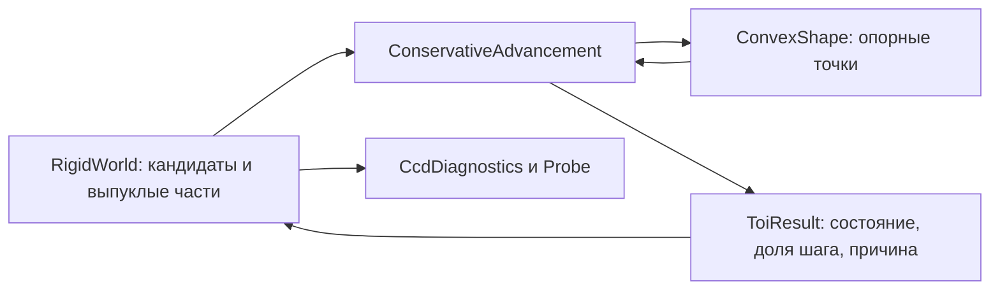

# 9. Консервативный CCD: реализация и честный компромисс

[Оглавление](README.md) · [Сравнение с Rigid IPC](08-rigid-ipc-benchmark.md)

Развиваем CCD для прикладной робототехники: сначала корректность, затем скорость.
Этот этап усиливает геометрическую проверку, но **не реализует Rigid IPC и не
обещает 100% непроникновения всего мира**. Ниже явно разделены доказуемая идея,
реализованный алгоритм и оставшиеся ограничения.

## Какую задачу решает отдельный объект

Класс [ConservativeAdvancement](../../src/rigid/ConservativeAdvancement.h)
проверяет заданные движения двух выпуклых тел либо тела и плоскости.
Он хранит параметр движения, последнюю проверенную позу и долю движения, покрытую оценкой зазора,
оценку скорости сближения и результат. Он не меняет тела и их скорости.

[RigidWorld](../../src/rigid/TimeOfImpact.cpp) перебирает кандидатов,
раскрывает составные тела в выпуклые части и собирает диагностику.
[Атомарный шаг](11-atomic-rigid-step.md) отклоняет опасную пробу и повторяет
интегрирование после восстановления состояния. Старые функции `timeOfImpact` и `timeOfImpactPlane` сохранены как
обёртки нового класса. Формы по-прежнему предоставляют виртуальный `support`.



Объект запроса можно использовать повторно: каждый вызов полностью сбрасывает
его состояние. Один экземпляр не предназначен для одновременных вызовов из
нескольких потоков.

## Почему нужна опорная плоскость

Пусть \(n\) — единичная нормаль от B к A. Тогда

\[
g_n=\min_{a\in A} n\cdot a-\max_{b\in B} n\cdot b
=n\cdot\bigl(\operatorname{support}_A(-n)-\operatorname{support}_B(n)\bigr).
\]

При \(g_n>0\) плоскость разделяет тела, а \(g_n\le\operatorname{dist}(A,B)\).
Последний симплекс GJK обычно даёт верхнюю оценку расстояния: напрямую брать
её для безопасного продвижения нельзя. Теперь GJK выбирает направление,
а отдельные опорные запросы вычисляют нижнюю оценку зазора.

Для параметра \(s\in[0,1]\) общая оценка сближения:

\[
V=\|\Delta x_A-\Delta x_B\|+r_A\|\Delta\theta_A\|+r_B\|\Delta\theta_B\|.
\]

Радиусы включают смещение части относительно центра тела. В реализации
используется более точная оценка для выбранной неподвижной плоскости:

\[
V_n=\max(0,-n\cdot(\Delta x_A-\Delta x_B))
+r_A\|\Delta\theta_A\|+r_B\|\Delta\theta_B\|.
\]

Перенос вдоль плоскости не закрывает зазор. Если верхняя оценка расстояния
GJK ещё больше контактного допуска, при \(g_n>\tau/2\) продвигаемся не дальше

\[
\Delta s=\frac{g_n-\tau/2}{V_n}.
\]

\(\tau\) — `ccdTolerance`; половину оставляем запасом перед следующим
образцом. При \(V_n=0\) найденная плоскость сохраняет разделение на оставшемся пути.
После продвижения заново ищем направление и опорные точки. При вращении
одна фиксированная плоскость не обязана разделять тела весь шаг.

Для треугольников дополнительно проверяются оба направления нормали грани —
кандидата SAT. На больших гранях это устраняет усиление ошибки при вычитании
почти совпадающих GJK-точек. Маленькая **нижняя** оценка не доказывает близость:
контакт требует соответствующей верхней оценки; иначе запрос уточняется либо
возвращает неопределённость.

Для пары коробок при слабой оценке GJK дополнительно перебираются 15 осей SAT:
по три нормали граней каждой коробки и девять векторных произведений рёбер.
Оба знака оси проверяются через опорные точки. Используется наибольший найденный
зазор, а не условное признание контакта. Основание — раздел 5
[OBBTree, Gottschalk, Lin, Manocha, SIGGRAPH 1996](https://www.cs.cornell.edu/courses/cs667/2005sp/readings/gottschalk96.pdf).

Для сферы и коробки слабое направление уточняется аналитически. Центр сферы
переводится в систему коробки: \(u=R^T(c_s-c_b)\), ближайшая точка коробки —
\(v=\operatorname{clamp}(u,-h,h)\). Если центр снаружи, направление
\(n=R(u-v)/\|u-v\|\) идёт от коробки к сфере. Оно также проверяется опорными
запросами; знак зависит от порядка тел. Это важно у ребра коробки, где одной
нормали грани недостаточно. Центр внутри коробки этим уточнением не обрабатывается.

Это **GJK + опорная плоскость + консервативное продвижение**. Полный SAT
проверяет необходимые оси многогранников; SAT CCD при чистом переносе может
пересекать интервалы времени по этим осям. Наш алгоритм не называется точным
SAT CCD. Основы: Mirtich, *Impulse-based Dynamic Simulation of Rigid Body
Systems* (1996), и раздел 2.2 [Rigid IPC](https://ipc-sim.github.io/rigid-ipc/assets/rigid_ipc_paper_350ppi.pdf).

## Результат и исчерпание бюджета

| `ToiStatus` | Значение | Действие текущего мира |
|---|---|---|
| `Separated` | Алгоритм прошёл весь запрос без найденного контакта | Не ограничивать эту пару |
| `Impact` | На пути достигнут контактный допуск | Отклонить пробу и пересчитать два полушага |
| `InitialContact` | Уже в начале тела попали в контактный допуск либо перекрываются | Передать дискретному решателю |
| `Unresolved` | Лимит, отсутствие продвижения/разделяющей плоскости или неверные численные входы | Отклонить пробу; при исчерпании бюджета вернуть явный отказ всего запрошенного шага |

`hit` сохранён для совместимости и равен `true` только для `Impact`.
Код, использующий один `!hit`, **не отличает неопределённость от разделения**:
нужно читать `status` либо `needsClamping()`. `s` у неопределённого запроса
не является доказанным временем удара.

Минимальное принудительное продвижение `1e-6` удалено. Параметр округляется
к предыдущему образцу через `nextafter`; невозможность сдвинуть его означает
`Unresolved/NoProgress`. Конец бюджета даёт `Unresolved/IterationLimit`.
Каждое допустимое продвижение сохраняет покрытую им долю: если новая опорная
плоскость плохо определяется, уже пройденный допустимый отрезок не отбрасывается.
При явно пересекающемся образце возвращаемся к последней проверенной разделённой
позе. Это всё ещё оценки алгоритма на `float`, а не интервальные сертификаты.

`CcdDiagnostics` считает запросы выпуклых частей и плоскостей, неопределённые
результаты и исходные контакты. Старый `passLimitReached` оставлен для
совместимости; бюджет повторов отражается в `RigidStepResult`. Счётчики относятся
ко всем пробам последнего вызова `tryStep`; `Probe` суммирует их за кадр. Ноль неопределённых запросов
не доказывает отсутствие пропущенных кандидатов или проникновений.

## Настройки

```cpp
world.params.ccd = true;
world.params.ccdMaxIterations = 64; // бюджет одной выпуклой пары или плоскости
world.params.ccdMaxSubdivisions = 16; // максимальная глубина деления шага
world.params.ccdAllMoving = true;  // дополнительно проверять медленные активные тела
const auto& diagnostics = world.ccdDiagnostics();
```

По умолчанию `ccdAllMoving=false`: большинство стандартных регрессий относятся к этому
режиму, кроме сцены `RigidCcd`, где теперь включена проверка всех движений.
Дополнительный режим снимает порог скорости у активных тел, увеличивает
работу и может чаще требовать повторного расчёта. Это не переключатель сертификации.
Параметры доступны через SDK; отдельный элемент редактора и сохранение этих
новых полей в файл сцены здесь не добавлены.

## Что остаётся компромиссом

1. Опорные точки и вращения вычисляются на `float`. Скалярные операции зазора
   выполняются на `double`, из зазора вычитается запас
   \(8\epsilon_f(\|p_A\|_\infty+\|p_B\|_\infty)\). Этот инженерный запас
   **не является доказанной интервальной границей**. Большие координаты могут
   привести к преждевременному контакту или неопределённости.
2. Допустимые формы и жёсткие преобразования являются предусловием API.
   Начальные перекрытия не исправляются CCD. Составное тело нужно раскрывать
   в части; прямой выпуклый запрос к `Compound` отвергается.
3. Проверяется интерполяция `SweptPose` между позами. Свободное вращение решателя
   и дальнейшие позиционные поправки суставов не получают сертификат этой
   проверкой. Мир восстанавливает кратчайший поворот из двух ориентаций:
   дополнительные полные обороты из них не восстанавливаются. XPBD не использует
   данный этап CCD.
4. Шаг последовательных импульсов с включённым CCD теперь использует
   [полное восстановление и повторный расчёт](11-atomic-rigid-step.md).
   Лимит деления означает отказ без принятого времени. Это исправляет
   несогласованное ограничение позы, но не доказывает точность контактной модели.
5. В начальном контакте работают прежние многообразия, трение, slop и сон.
   Небольшое проникновение остаётся допустимым приближением. Значение slop
   само по себе не задаёт верхнюю границу фактического проникновения.

Ранее наивная замена CCD ухудшала удар по стопке и цепь; экспериментальная
общая остановка тел внесла энергию. Эти результаты сохранены в
[исследовании контактов](../22-contact-repair-reactphysics3d.md). Поэтому
изолированные геометрические тесты дополняются регрессиями полной динамики.

Этот этап реализован в [атомарном шаге](11-atomic-rigid-step.md):
восстанавливаются не только позы, но и скорости, силы, состояние суставов,
сон и контактные кэши; учитывается принятое модельное время. Уже касающиеся тела требуют
согласованного контактного решения. Простое уменьшение шага не гарантирует
прогресса в тесном контакте; переход к неявному барьерному решателю остаётся
отдельной работой, а не свойством этого класса.

Различие между возвратом позы и восстановлением динамического состояния
разобрано у Миртича в разделах 2.1–2.2
[Timewarp Rigid Body Simulation, 2000](https://graphics.stanford.edu/courses/cs448-01-spring/papers/mirtich.pdf).
Полный алгоритм Timewarp и асинхронное продвижение тел здесь не реализованы.

## Почему зависала длинная балка

Общий набор обнаружил дефект, пропущенный отдельным набором `standard rigid:`:
балка длиной 2 м со скоростями 25 м/с и 40 рад/с останавливалась над кубами,
затем её энергия расходилась до `NaN`. Теперь эта сцена входит и в стандартный
набор; тест дополнительно требует конечности энергии на каждом подшаге,
роста не более 5% относительно начальной энергии и затухания движения.

Трасса разделила две причины:

1. У одной пары GJK давал верхнее расстояние **3.027158 мм**, но его направление
   обеспечивало опорный зазор лишь **0.008010 мм**. Запрос не мог подтвердить
   движение и снова останавливал тела. Ось SAT «ребро–ребро» для тех же поз
   даёт **3.027150 мм**. Начальный зазор здесь больше допуска 2 мм: это
   разделённая пара, а не контакт, требующий замораживания.
2. Ограничение позы оставляет угловую скорость после полного свободного поворота.
   У вытянутого тела тензор инерции зависит от ориентации. При неизменной мировой
   скорости \(\omega\) возврат от \(q_1\) к \(q_c\) меняет энергию на

   \[
   \Delta T=\tfrac12\omega^T\bigl(I(q_c)-I(q_1)\bigr)\omega.
   \]

   Знак не ограничен: такая операция сама по себе не является физическим
   контактным импульсом. Это вывод из формулы энергии, а не гарантия сохранения
   энергии нашим текущим CCD.

Дополнительные оси устранили зависание именно этой сцены. В диагностическом
повторе балка опустилась до высоты центра 0.030 м и успокоилась; измеренное
перекрытие составило около 0.5 мм. Универсальное согласование позы и скорости
при ограничении движения остаётся следующим этапом.

Следующий общий прогон обнаружил похожую остановку в демонстрации пуль:
сфера находилась в 2.783 мм от вращающейся коробки-пластины, но направление
GJK не подтверждало этот зазор. За три кадра сцена давала `NaN`. Направление
от ближайшей точки коробки к центру сферы устранило этот отказ. Сохранённая
пара проверяется независимо, а смешанная сцена теперь входит в быстрый набор
CCD с проверкой конечности поз и обеих скоростей на протяжении шести кадров.
Оба обнаруживших ошибку общих прогона были остановлены; их частичные результаты
не выдаются за успешные полные проверки.

Методы для этого класса задач существуют. Консервативное продвижение Миртича
используется и в [CCD Bullet](https://pybullet.org/Bullet/BulletFull/classbtContinuousConvexCollision.html).
[Rigid IPC](https://ipc-sim.github.io/rigid-ipc/assets/rigid_ipc_paper_350ppi.pdf),
разделы 2.1, 3 и 4, рассматривает откаты явного интегрирования и предлагает
неявный барьерный шаг с проверкой траекторий. При этом раздел 7 прямо указывает,
что метод не сохраняет энергию. Нельзя приписывать одной проверке SAT или CCD
все свойства полного интегратора.

## Проверки

```sh
cmake --build build-core --parallel 2
RF_THREADS=2 RF_TEST="CCD" build-core/rf_tests
RF_THREADS=2 RF_TEST="continuous collision" build-core/rf_tests
RF_THREADS=2 RF_TEST="standard rigid:" build-core/rf_tests
```

Фильтр учитывает регистр: один `RF_TEST="CCD"` не включает старый тест
`continuous collision`. Ограничения CPU, памяти и времени — в [главе 6](06-validation.md).

[CcdQueryTests.cpp](../../tests/CcdQueryTests.cpp) сравнивает момент удара сфер
и плоскости с аналитическим ответом, проверяет удар при доле шага меньше
`1e-6`, нулевой/малый бюджет, неверные входы, исходный контакт и передачу
неопределённости через тело, составную форму, статический меш и границу мира.
Отдельно проверяются включение медленного тела в CCD и скольжение с постоянным
зазором 11 мм вдоль большой треугольной грани при трёх ориентациях и бюджете
всего двух итераций.
Зафиксированная пара «балка–куб» отдельно проверяется неподвижной и расходящейся:
известная опорная плоскость должна позволять полный шаг в обоих порядках тел.

Тест удара куба о меш уточнён: пластина перекрывает ширину области, высота
проверяется на каждом подшаге, требуется достижение контактной зоны;
нельзя застывать с ненулевой скоростью на целый кадр. Неопределённые запросы
считаются отдельно и не скрываются даже при успешном исходе. Старый тест с пластиной шириной
2 м ошибочно считал падение за её краем проникновением. Проверка также выявила
и помогла устранить преждевременное зависание при потере допустимой доли
движения и неустойчивой нормали большой грани.

Результаты 01.10.2026: CCD **9/9**, прежний `continuous collision` **1/1**,
демонстрации **1/1**, расширенный набор твёрдых тел **42/42**. Общий набор —
**176/177**: тест частиц превысил порог времени 140 мс, измерено 144.2 мс.
Отдельный повтор без изменения кода и порога прошёл с 125.8 мс; исходный провал
сохранён. Это не полностью успешный общий прогон и не проверка strict-FP/ASAN.
Исторические 35/35 из главы 7 относятся к предыдущему коммиту.

Цепи из 120 торов выдержали 600 кадров (10 с модельного времени): разрывов нет,
наибольшее измеренное перекрытие в поздних выборках 0.368 мм. Повторы на 1/2/2
потоках дали одинаковый хэш `c9531e8adfaf4bc3`. Это результаты конкретной сцены
и процедуры измерения, а не гарантия любой геометрии.

## Контрпример до атомарного повторного расчёта

Отдельный диагностический прогон сравнивает два случая по 2 с при шагах
1/600, 1/1200 и 1/2400 с. Балка завершила все три прогона без переполнения
энергии; конечные энергии различаются: 25.24, 27.58 и 36.32 Дж. По этим трём
числам нельзя утверждать сходимость контактной траектории.

В смешанной сцене `RigidCcd` при **1/1200 с энергия становится бесконечной на
22-м подшаге**. При 1/600 и 1/2400 с двухсекундные прогоны завершились с конечной
энергией. В первом из них пик энергии превышает начальную на 3.60%, а максимальная
глубина контактного многообразия достигает 14.61 мм. Это дефект исходной реализации,
которого успешный тест демонстрации с обычным шагом не обнаруживал.
Исправление и новые прогоны описаны в [главе 11](11-atomic-rigid-step.md).

Инструментирование только `clampToTimesOfImpact`, без изменения вычислений,
локализует один источник нагрева: на 7-м подшаге у тела 32 доля движения
ограничивается до 0.264102519, и энергия вращения непосредственно при изменении
позы растёт с **1706.265 до 4135.717 Дж**. Контактный импульс внутри этой операции
не применяется. Последующие ограничения усиливают нагрев. Отключение CCD
сохраняет конечность состояния в контрольных 60 подшагах, но такой контроль
не доказывает отсутствие прохождения сквозь тела и не предлагается как исправление.

На этом историческом срезе геометрический этап закончен лишь в указанном объёме; цель
«устойчивость при разных шагах» **не была достигнута**. Нельзя закрыть дефект выбором
удачного шага или произвольным ограничением скорости. Приоритет следующего этапа —
согласованное восстановление состояния и времени, описанное выше.

Команды воспроизведения, исходник диагностического прогона, JUnit, хэши и трасса
опубликованы в [пакете доказательств](evidence/ccd-20261001/README.md) и
[машинном отчёте](evidence/ccd-20261001/verification.json).
