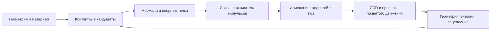

# Разработка физического движка: контакты твёрдых тел

Этот раздел книги объясняет нашу модель от уравнений до работающего кода.
Он объединяет материалы о столкновениях, невыпуклых телах, цепях, трении и CCD.
Дата среза: **2026-09-30**. Это авторский разбор с собственными выводами формул,
а не дословный перевод чужих PDF. Ссылки на оригиналы и границы их применения
собраны в [библиографии](05-sources.md).

Приоритет разработки: **сначала физическая достоверность, затем оптимизация**.
Допустимое небольшое проникновение задаём явно; проверяем реакции, зацепления,
энергию и чувствительность к шагу. Ускорение не должно маскировать ошибку сном
или ухудшать эти критерии. Ограничение CPU при проверках нужно для отзывчивости
компьютера, а не для изменения физической модели.

## Порядок чтения

| Глава | Что станет понятно |
|---|---|
| [1. Модель и физические балансы](01-model-and-invariants.md) | Что означает твёрдое тело, откуда берутся импульсы и что именно сохраняется |
| [2. Геометрия и непрерывные столкновения](02-geometry-and-ccd.md) | GJK, SAT, внешняя поверхность объединения, нормали, точки и ограничения CCD |
| [3. Решатель контактов](03-contact-solver.md) | Якобиан, эффективная масса, LCP, накопленные импульсы, трение и стабилизация |
| [4. Цепь, энергия и сон](04-energy-sleep-and-chain.md) | Почему перекос возможен физически, как отличить его от ошибки и что уже измерено |
| [5. Разбор PDF и первоисточников](05-sources.md) | Какую задачу решает каждая работа и какие методы у нас действительно реализованы |
| [6. Проверка утверждений](06-validation.md) | Какие опыты нужны, что измерять и как запускать проверки с небольшой нагрузкой |
| [7. Проверенный срез](07-checkpoint.md) | Результат повторной проверки перед коммитом, настройки и доступные артефакты |
| [8. Набор Rigid IPC](08-rigid-ipc-benchmark.md) | Авторские сцены SIGGRAPH 2021 и протокол будущего сравнения |

Для основ математики есть [отдельная вводная книга](../math/00-introduction.md).
Подробный каталог классов и параметров — в [главе о твёрдых телах](../02-rigid-bodies.md),
принцип действия — в [главе 11](../11-action.md).

## Как читать утверждения

- **Реализовано:** есть указанный путь в текущем коде. Это не доказательство точности.
- **Проверено:** указан опыт, параметры и критерий. Результат относится к этому опыту.
- **Эталон:** независимая упрощённая задача, с которой можно сравнить вычисления.
- **Кандидат:** метод из литературы или прототип; в основном решателе его нет.
- **Ограничение:** известное приближение, отказ либо пока не проверенная область.

Это схема ответственности, а не точный порядок вызовов: реальный шаг описан
в [главе 3](03-contact-solver.md). Хороший контактный решатель не компенсирует
потерянную геометрическую пару, а хороший CCD сам по себе не вычисляет реакции опор.

## Единые обозначения

| Символ | Значение | Единицы |
|---|---|---|
| \(x,R\) | Центр масс и матрица ориентации | м; безразмерная |
| \(v,\omega\) | Линейная и угловая скорость | м/с; рад/с |
| \(m,I\) | Масса и тензор инерции | кг; кг·м² |
| \(h\) | Шаг решателя, а не обязательно интервал кадра | с |
| \(g,d=-g\) | Зазор и глубина; положительный \(d\) означает проникновение | м |
| \(n\) | Единичная нормаль от тела B к телу A | безразмерная |
| \(J,\lambda\) | Якобиан контактов и нормальные импульсы | смешанные; Н·с |
| \(W=JM^{-1}J^T\) | Матрица обратных эффективных масс | кг⁻¹ для нормальных строк |
| \(T,U,E=T+U\) | Кинетическая, потенциальная и полная энергия | Дж |

В исходниках матрица \(W\) называется `K`; в отчётах `K` означает кинетическую
энергию. В книге используем \(T\), чтобы не смешивать эти величины.

Утверждение «для любой геометрии без ошибок» этим срезом **не подтверждено**.
Рабочие цепи и стеки — важные регрессии; непрерывная допустимость всех траекторий,
точность материальных параметров и отсутствие остаточного численного нагрева
требуют отдельных доказательств и экспериментов.
