# 8. Тензоры

[← Поля: градиент, дивергенция, ротор](07-fields.md) · [Действие →](09-action.md)

Эта глава — мостик. Сами тензоры и правило Эйнштейна подробно объяснены в главе SDK [1.9 «Тензоры и правило Эйнштейна»](../01-math.md#19-тензоры-и-правило-эйнштейна), а кривизна пространства-времени — в [8.5 «Кривизна из метрики»](../08-relativity.md#85-кривизна-из-метрики). Здесь только главное и связь с остальной книгой.

## Идея

Вектор — стрелка. Градиент — стопка линий уровня, как на карте высот. **Тензор — машина с несколькими входами**: в каждый вставляют направление, на выходе одно число. Верхний индекс — стрелка, нижний — линейка. Стрелку измеряют линейкой, и получается число, которое не зависит от того, как нарисованы оси.

Главный тензор физики — **метрика** $g_{ab}$. Она говорит, какой длины стрелка, то есть задаёт саму геометрию. В плоском пространстве метрика простая. У чёрной дыры метрика другая, и из одной этой таблицы чисел движок выводит всё: как падает свет, где последняя устойчивая орбита, как сильно растягивают приливы.

## Картинка из движка



Кривизна — это вторые производные метрики, и движок берёт их конечными разностями, как в [главе 3](03-derivative-integral.md). График показывает ошибку символов Кристоффеля и инварианта Кречмана чёрной дыры в зависимости от шага разности. Справа ошибка падает как $h^4$: чем меньше шаг, тем точнее формула. Слева ошибка растёт: чем меньше шаг, тем ближе друг к другу вычитаемые числа, и округление раздувается ([глава 1](01-numbers.md)). Лучший шаг — дно «галочки», $10^{-3}$.

## Формула

Правило Эйнштейна: повторённая буква, один раз сверху и один раз снизу, означает сумму.

$$
\Gamma^{\lambda}{}_{\mu\nu} = \tfrac12\, g^{\lambda\sigma}\big(\partial_\mu g_{\sigma\nu} + \partial_\nu g_{\sigma\mu} - \partial_\sigma g_{\mu\nu}\big),
\qquad
K = R_{abcd}\,R^{abcd} = \frac{48M^2}{r^6}\ \ \text{(Шварцшильд)} .
$$

## Код

Символы Кристоффеля записаны в коде так же, как на доске:

[src/relativity/Curvature.cpp:96](../../src/relativity/Curvature.cpp#L96)
```cpp
return einstein("^ls _smn -> ^l_mn", ginv, B) * 0.5;
```

Если написать индекс дважды сверху, `einstein` откажется и объяснит почему: «опустите индекс метрикой».

## Тест

`RF_TEST="curvature:"` сверяет всё с точными формулами. Несколько чисел:

| Проверка | Результат |
|---|---|
| плоское пространство в сферических координатах | $\Gamma \ne 0$, а тензор Римана $1.2\cdot10^{-10}$: координаты — это не кривизна |
| инвариант Кречмана Шварцшильда | совпадает с $48M^2/r^6$ до $2\cdot10^{-10}$ |
| приливы на $r = 10M$ | растяжение $+2M/r^3$ и сжатие $-M/r^3$ до десятого знака |
| червоточина Эллиса | плотность на горловине отрицательная: нужна экзотическая материя |

## Физика

- **Гравитация как геометрия.** Масса искривляет пространство-время, а тела движутся по самым прямым линиям в нём ([глава 8 документации](../08-relativity.md)).
- **Сплошные среды.** Напряжения в металле и ткани — тоже тензор $\sigma_{ij}$: две стрелки на входе, сила на выходе.

## Проверь сам

Нарисуйте на мяче «треугольник»: от полюса по меридиану вниз до экватора, по экватору четверть окружности, и обратно к полюсу. Все три угла прямые, и их сумма 270°, а не 180°. Разница в 90° — это кривизна поверхности, которую измеряет тензор Римана.
